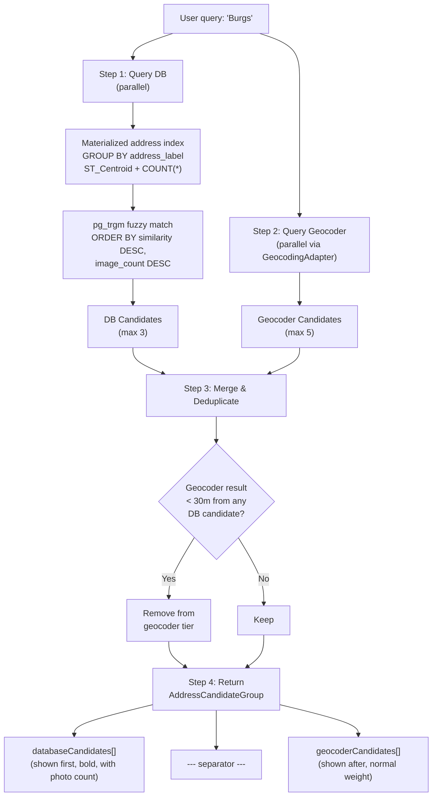
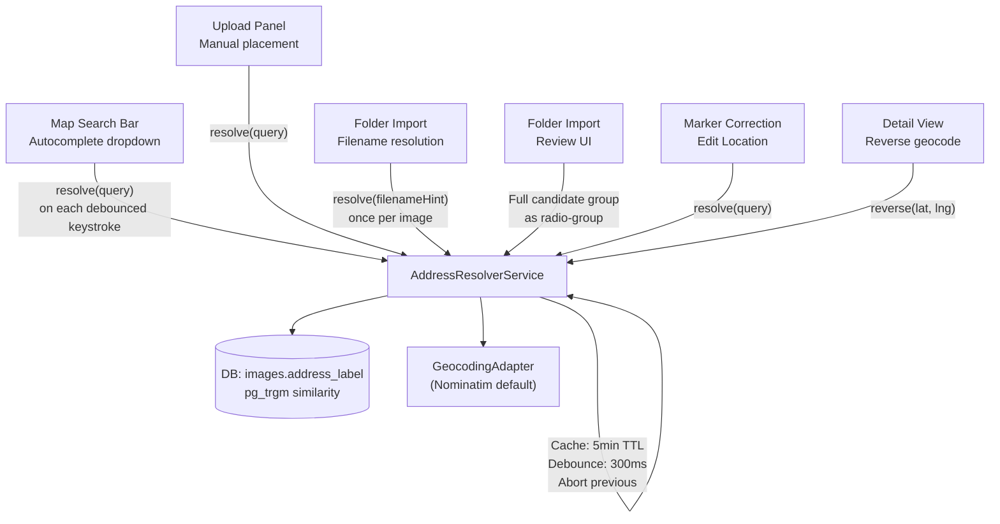
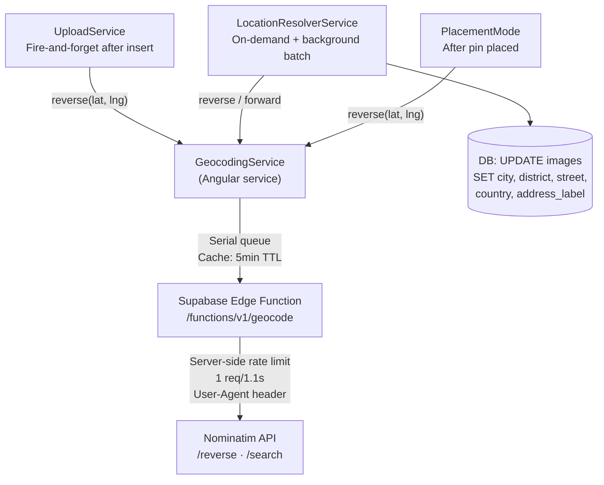
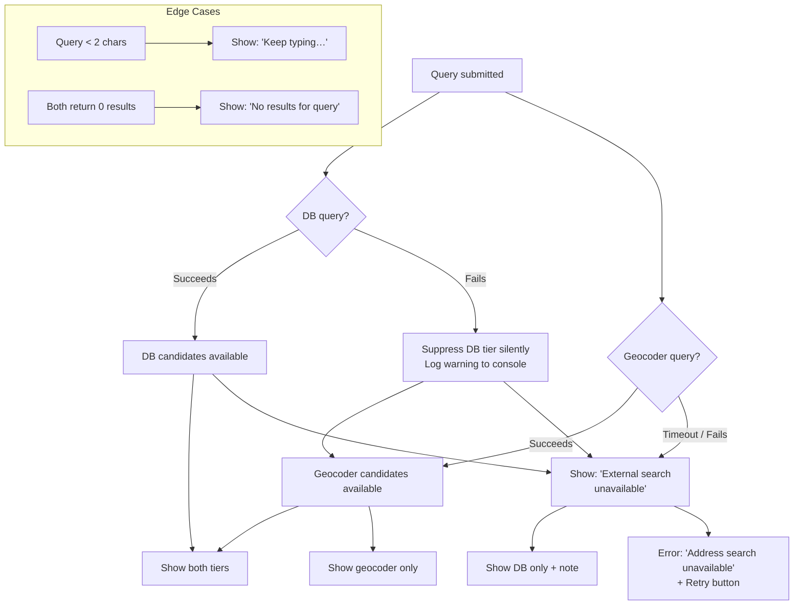

# Smart Address Resolver

**Who this is for:** engineers implementing or integrating the address resolver, and product owners validating autocomplete and resolution behaviour.  
**What you'll get:** the interface contract, ranking algorithm, UI presentation spec, and integration points for the `AddressResolverService`.

See also: `architecture.md` §3, `folder-import.md` §4.

---

## 1. Purpose

The `AddressResolverService` is a **reusable, application-wide service** that translates an address string or partial address into a ranked list of geographic coordinate candidates.

It is used in:

- The **main map search bar** (autocomplete as the user types).
- The **upload panel** when a user manually enters an address for an image without GPS.
- The **folder import review phase** when a filename hint is resolved to coordinates.
- The **marker-correction workflow** when a user re-enters an address for a misplaced image.

Because the same resolver is used everywhere, the ranking behaviour and UI presentation are consistent across the entire application.

---

## 2. Core Principle: DB-First Ranking

Addresses already present in the Feldpost database represent **confirmed project locations** — real places where the organization has documented work. When a user types "Burgs", they are almost certainly looking for "Burgstraße 7" rather than some random street in another city.

The resolver therefore queries the Feldpost database **first** and promotes those matches to the top of the result list, before falling back to the external geocoding provider.

This is analogous to a search engine's "featured results" panel: the most likely correct answers — drawn from the user's own data — appear prominently, followed by broader external results when needed.

---

## 3. Interface Contract

```typescript
@Injectable({ providedIn: "root" })
export class AddressResolverService {
  /**
   * Resolve an address query to a ranked list of candidates.
   * DB results appear first, separated from geocoder results.
   */
  resolve(
    query: string,
    options?: ResolverOptions,
  ): Observable<AddressCandidateGroup>;

  /**
   * Reverse-geocode a coordinate to a human-readable address.
   * DB candidates near the point are checked first.
   */
  reverse(lat: number, lng: number): Observable<AddressCandidate | null>;
}

interface ResolverOptions {
  /** Maximum DB candidates to include. Default: 3. */
  maxDbResults?: number;

  /** Maximum external geocoder candidates to include. Default: 5. */
  maxGeocoderResults?: number;

  /**
   * If provided, DB search is restricted to this bounding box
   * (e.g., current map viewport) to keep results contextually relevant.
   */
  spatialBias?: LatLngBounds;

  /**
   * Minimum character count before a DB query is fired.
   * Prevents noisy queries on single-character input. Default: 2.
   */
  minQueryLength?: number;
}

/**
 * The structured response groups DB and geocoder results separately,
 * so the UI can render a visual separator between the two tiers.
 */
interface AddressCandidateGroup {
  /** Candidates sourced from the Feldpost database. Shown first. */
  databaseCandidates: AddressCandidate[];

  /** Candidates sourced from the external geocoding provider. Shown after separator. */
  geocoderCandidates: AddressCandidate[];
}

interface AddressCandidate {
  /** Human-readable address label for display. */
  label: string;

  lat: number;
  lng: number;

  /** How well this candidate matches the query. */
  confidence: "exact" | "closest" | "approximate";

  /** Where this candidate came from. */
  source: "database" | "geocoder";

  /**
   * DB candidates only: how many images in the database are
   * at or near this address. Used for ranking and for the UI
   * badge ("12 photos here").
   */
  imageCount?: number;

  /**
   * DB candidates only: the string distance score (0–1) between
   * the query and the stored address label. Higher is better.
   */
  matchScore?: number;

  /** Optional bounding box for map fit-to-bounds. */
  boundingBox?: LatLngBounds;
}
```

---

## 4. Ranking Algorithm

### Ranking Pipeline



### Step 1 — Query the Database

The resolver queries a **materialized address index** derived from the `images` table. This index contains:

- The unique human-readable address labels for images already in the organization's database.
- The associated coordinates (centroid of images at each address).
- The image count at each address.

```sql
-- Materialized view (or function) for address index
SELECT
  address_label,          -- human-readable, stored on insert
  ST_Centroid(ST_Collect(geog::geometry))::geography AS centroid,
  COUNT(*) AS image_count
FROM images
WHERE organization_id = :org_id
  AND location_unresolved IS NOT TRUE
GROUP BY address_label;
```

Fuzzy matching uses PostgreSQL's `pg_trgm` extension (trigram similarity) or a `LIKE '%query%'` fallback when `pg_trgm` is not available. Trigram matching tolerates typos and partial matches — for example, "Burgs" matches "Burgstraße 7" with a score of ~0.55.

Results are ordered by:

1. Trigram similarity score (descending — best match first).
2. Image count (descending — more-documented addresses rank higher for equally similar labels).

Up to `maxDbResults` candidates are included (default: 3).

### Step 2 — Query the External Geocoder

In parallel with the DB query, the resolver calls the `GeocodingAdapter` (see `architecture.md` §3) with the same query string. The same debounce (300ms) and caching (5-minute TTL per query string) rules apply.

Up to `maxGeocoderResults` candidates are included (default: 5).

### Step 3 — Merge and Deduplicate

Before returning:

- External geocoder results that are geographically very close (<30m) to a DB candidate are removed from the geocoder tier (deduplication). The DB candidate already represents that location.
- If the DB query returns zero results, the response still uses the two-tier structure, but `databaseCandidates` is an empty array and the separator is not rendered.

### Step 4 — Return `AddressCandidateGroup`

The final response is an `AddressCandidateGroup` with `databaseCandidates` first and `geocoderCandidates` second. The UI renders them in order.

---

## 5. UI Presentation

### 5.1 Autocomplete Dropdown

The address input renders an autocomplete dropdown with this structure:

```
┌─────────────────────────────────────────────┐
│ 🔍 Burgs                                    │  ← input field
├─────────────────────────────────────────────│
│ 📍 Burgstraße 7, 8001 Zürich          12 📷 │  ← DB result #1
│ 📍 Burgstraße 3, 8001 Zürich           4 📷 │  ← DB result #2
│ 📍 Burgstraße 19, 8400 Winterthur      1 📷 │  ← DB result #3
│ ─ ─ ─ ─ Other locations ─ ─ ─ ─ ─ ─ ─ ─ ─ │  ← separator
│ 🌐 Burgstrasse, 3011 Bern                   │  ← geocoder result #1
│ 🌐 Burgstraße, 10115 Berlin                 │  ← geocoder result #2
└─────────────────────────────────────────────┘
```

**Visual details:**

- DB candidates: pin icon (📍), address label, image count badge (e.g., "12 📷"). Bold font.
- Separator: a horizontal rule with a muted label ("Other locations" or "External results"). Not a selectable item.
- Geocoder candidates: globe icon (🌐), address label. Normal font weight.
- If zero DB results: the separator and its label are not rendered; the list shows only geocoder results.
- If both DB and geocoder return zero results: show "No results for '[query]'" as a non-selectable item.

### 5.2 Accessibility

- The dropdown is a `role="listbox"` with `role="option"` items. The separator has `role="presentation"`.
- Keyboard navigation: `↑`/`↓` to move between candidates (the separator row is skipped). `Enter` to select. `Escape` to dismiss.
- Screen reader announcement on open: "Address suggestions, [N] results". DB candidates are announced with their image count: "Burgstraße 7, 12 photos at this location".

### 5.3 Folder Import Review

In the folder import review phase, the same `AddressCandidateGroup` is rendered slightly differently — as a radio-group instead of a floating dropdown, because the user must make an explicit choice from a fixed set of candidates:

```
Best location matches for "Burgstraße_7":

◉ Burgstraße 7, 8001 Zürich          (12 photos already here)
○ Burgstraße 7, 8400 Winterthur       (1 photo already here)
○ Burgstraße 7, 4051 Basel            (from external search)
○ Enter a different address…
○ Place on map manually…
```

No separator line is needed in this view; instead DB results carry a "(N photos already here)" annotation and external results have no annotation.

---

## 6. `AddressResolverService` State and Caching

`AddressResolverService` does not own any persistent state. It is a stateless, injectable service.

Debounce and caching are implemented internally:

| Concern                | Implementation                                                                                                                                                                                                  |
| ---------------------- | --------------------------------------------------------------------------------------------------------------------------------------------------------------------------------------------------------------- |
| Debounce               | 300ms idle timer after the last character typed (for autocomplete calls). Folder import resolution calls are not debounced (they are batch operations).                                                         |
| In-memory cache        | Query string → `AddressCandidateGroup`, TTL 5 minutes. Keyed by `query + orgId`. Evicted on LRU after 200 entries.                                                                                              |
| DB query abort         | Each in-flight DB query is cancelled if a new input arrives before the debounce fires.                                                                                                                          |
| Geocoder abort         | Same — abort-previous-request pattern using `AbortController` or RxJS `switchMap`.                                                                                                                              |
| Geocoder rate limiting | Nominatim (default provider): 1 req/sec. Rate limiting is enforced server-side in the `geocode` Edge Function. The `GeocodingService` also serialises requests via a promise queue to prevent concurrent calls. |

---

## 7. Address Label Storage

For DB-first ranking to work, images must have a human-readable `address_label` stored alongside their coordinates. This label is:

- Set during upload (from resolved address, filename hint, or user-entered value).
- Updated when the user corrects an image's location later.
- Used in the materialized address index query (§4 Step 1).

The `images` table gains a new column:

```sql
ALTER TABLE images
  ADD COLUMN address_label text;   -- nullable; populated on insert when known
```

If `address_label` is NULL (e.g., images imported before this feature shipped, or images resolved only via raw coordinates), those images are excluded from the DB candidate pool.

Reverse geocoding (`AddressResolverService.reverse()`) can be used to back-fill `address_label` for images where it is NULL — either on a background job or when the user opens the image detail view ("Address: Resolving…").

### On-Load Background Resolution (Implemented)

The `WorkspaceViewService` proactively resolves addresses when images are loaded into the workspace. After every `loadClusterImages()` or `setActiveSelectionImages()` call, it:

1. Filters images where GPS coordinates exist but `city`/`district`/`street` are NULL.
2. Groups by **exact** GPS coordinates (lat,lng) — only identical coordinates share a single geocode call.
3. Calls `GeocodingService.reverse(lat, lng)` per unique coordinate.
4. Updates the DB (`images` table) and patches the local signal so grouping headers reflect the resolved address immediately.

This pattern incrementally back-fills address data for all existing images as users browse clusters, without requiring a one-time bulk migration.

### Upload-Time Resolution (Implemented)

The `UploadService` sets `location_unresolved: true` on insert when GPS coordinates are present. After the DB insert succeeds, it fires a background `GeocodingService.reverse()` call that populates `city`, `district`, `street`, `country`, `address_label` and sets `location_unresolved: false`.

---

## 8. Integration Points

### Integration Map



#### Implemented: GeocodingService Integration

The lightweight `GeocodingService` (`core/geocoding.service.ts`) handles reverse- and forward-geocoding via a **Supabase Edge Function proxy** (`geocode`), which forwards requests to Nominatim server-side. This eliminates browser CORS issues and centralises rate limiting.



**Why a proxy?** Direct browser→Nominatim calls fail with CORS errors when Nominatim rate-limits (HTTP 429 responses lack CORS headers). The edge function:

- Adds a proper `User-Agent` header (required by Nominatim usage policy).
- Enforces server-side rate limiting (1 req/1.1s).
- Returns CORS-safe responses to the browser.
- Requires a valid Supabase JWT — no unauthenticated geocoding.

| Integration point                       | How `AddressResolverService` is used                                                                                                                                             |
| --------------------------------------- | -------------------------------------------------------------------------------------------------------------------------------------------------------------------------------- |
| **Map search bar**                      | `resolve(query)` on each debounced keystroke. Result group rendered as autocomplete dropdown. Selecting a candidate pans/zooms the map.                                          |
| **Upload panel — manual placement**     | `resolve(query)` when user types in the address field before placing a marker. Same dropdown UI.                                                                                 |
| **Folder import — filename resolution** | `resolve(filenameHint)` called once per image during the resolution phase. Top-ranked candidate used for auto-import; low-confidence results go to the needs-confirmation queue. |
| **Folder import — review UI**           | Full candidate group rendered as a radio-group for user selection.                                                                                                               |
| **Marker correction (UC10)**            | `resolve(query)` in the "Edit Location" address input.                                                                                                                           |
| **Reverse geocode on detail view**      | `reverse(lat, lng)` to display a human-readable address when `address_label` is NULL.                                                                                            |

---

## 9. Error States

### Error State Flow



All error states follow the Feldpost UI state contract (`architecture.md` §13):

| Scenario                    | Behaviour                                                                                                        |
| --------------------------- | ---------------------------------------------------------------------------------------------------------------- |
| DB query fails              | Show geocoder results only. Suppress DB tier silently (no error banner in the dropdown). Log warning to console. |
| Geocoder times out or fails | Show DB results only. Display muted note: "External search unavailable."                                         |
| Both sources fail           | Show error: "Address search unavailable. Try again or navigate manually." Retry button available.                |
| Query too short (<2 chars)  | No query fired. Show hint: "Keep typing…"                                                                        |
| Zero results from both      | Show: "No results for '[query]'. Try a different address."                                                       |

---

## 10. Angular Service Structure

```typescript
@Injectable({ providedIn: "root" })
export class AddressResolverService {
  private readonly cache = new Map<
    string,
    { data: AddressCandidateGroup; expires: number }
  >();

  constructor(
    private readonly supabase: SupabaseService,
    private readonly geocoding: GeocodingAdapter,
  ) {}

  resolve(
    query: string,
    options?: ResolverOptions,
  ): Observable<AddressCandidateGroup> {
    if (!query || query.length < (options?.minQueryLength ?? 2)) {
      return of({ databaseCandidates: [], geocoderCandidates: [] });
    }

    const cacheKey = `${query}:${this.supabase.currentOrgId()}`;
    const cached = this.cache.get(cacheKey);
    if (cached && cached.expires > Date.now()) {
      return of(cached.data);
    }

    return forkJoin({
      db: this.queryDatabase(query, options),
      geo: from(this.geocoding.search(query)),
    }).pipe(
      map(({ db, geo }) => this.mergeAndDeduplicate(db, geo, options)),
      tap((result) =>
        this.cache.set(cacheKey, {
          data: result,
          expires: Date.now() + 5 * 60_000,
        }),
      ),
    );
  }

  // ... private queryDatabase(), mergeAndDeduplicate(), reverse() methods
}
```

---

## 11. Cross-References

| Topic                              | Document              |
| ---------------------------------- | --------------------- |
| `GeocodingAdapter` interface       | `architecture.md` §3  |
| Folder import — address resolution | `folder-import.md` §4 |
| Map search bar UX contract         | `architecture.md` §3  |
| Angular service table              | `architecture.md` §14 |
