# Architecture Documentation

**Who this is for:** engineers working on system design, data flows, and performance.  
**What you’ll get:** a high‑level view of how Sitesnap is put together and where responsibilities and invariants sit.

See also: `database-schema.md`, `security-boundaries.md`.

---

## 1. System Overview

Sitesnap is a map‑first, geo‑based image management system.

Users can:

- Register and log in.
- Upload images.
- Store geographic coordinates.
- View images on a map.
- Move map markers to update coordinates.

The main screen is **map‑first**:

- A prominent address search bar with autocomplete.
- A filter panel (time, project, metadata, max distance) next to the map.
- An upload button in the map pane.
- A left sidebar for navigation (e.g., Map / Projects / Admin / …).
- A right-hand detail pane that opens when clicking markers or clusters.

The system uses a **Client–BaaS** architecture:

- **Frontend:** Angular SPA.
- **Backend/BaaS:** Supabase (Auth + PostgreSQL + Storage).
- **Map rendering:** Leaflet with OpenStreetMap tiles.

All critical invariants (ownership, access control, data integrity) are enforced in the database and Supabase configuration.

### System Architecture Diagram

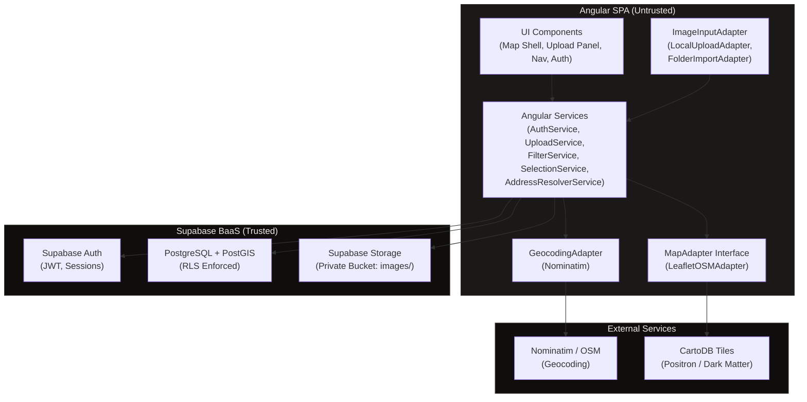

### Architectural Layer Stack

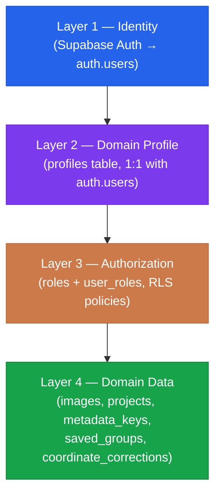

### Adapter Pattern Overview

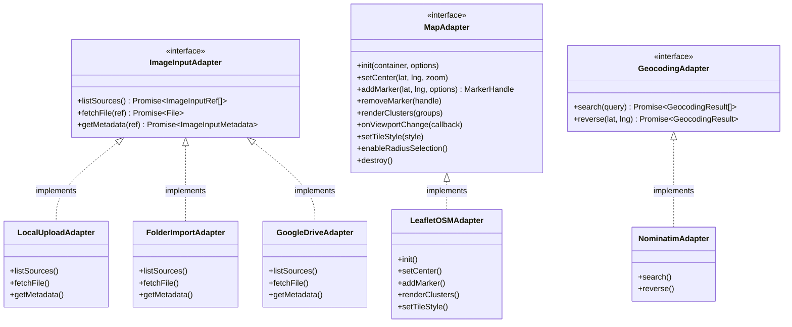

---

## 2. Architectural Layers

### Layer 1 — Identity (Authentication)

Handled entirely by Supabase Auth.

Responsibilities:

- User registration.
- Password hashing.
- JWT issuance.
- Session management.

Table involved:

- `auth.users` (managed by Supabase; not modified manually).

---

### Layer 2 — Domain Profile (Application User Data)

Custom table: `profiles`

Purpose:

- Store application-specific user data.
- Keep `auth.users` minimal.

This creates a 1:1 extension of `auth.users`.

---

### Layer 3 — Authorization (Roles System)

Custom tables:

- `roles`
- `user_roles`

Purpose:

- Define access control.
- Support multiple roles per user.
- Enable a scalable permission model.

Authorization is enforced at the database level using Row-Level Security (RLS).  
See `security-boundaries.md` for policy details.

---

### Layer 4 — Domain Data

Primary table:

- `images`

Contains:

- Image metadata.
- Geographic coordinates (EXIF and corrected).
- Ownership reference to the user.
- Links to project and metadata structures (see `glossary.md`).

All domain data is protected via RLS policies.

---

## 3. Geocoding Boundary

Sitesnap uses a **geocoding service** to translate addresses into coordinates for the main map search bar.

- At the architecture level, geocoding is treated as a **provider‑agnostic service**:
  - Exposed via an internal API or adapter.
  - Replaceable without changing the domain model.
- Default implementation assumption:
  - An OpenStreetMap/Nominatim‑style provider.

Address search behaviour:

- On exact or high-confidence match:
  - Center the map on the resolved coordinates.
- If no exact match is found:
  - Center on the closest available match.
  - Display an explicit notice (e.g., “Using closest match to …”); never fail silently.

The geocoding layer must not introduce provider‑specific concepts into the core schema; it only returns coordinates and basic address metadata.

### Interface Contract

```typescript
interface GeocodingAdapter {
  /** Search for address candidates matching the input string. */
  search(query: string): Promise<GeocodingResult[]>;

  /** Reverse-geocode a coordinate to an address. */
  reverse(lat: number, lng: number): Promise<GeocodingResult | null>;
}

interface GeocodingResult {
  label: string; // Human-readable address string
  lat: number;
  lng: number;
  confidence: "exact" | "closest" | "approximate";
  boundingBox?: { north: number; south: number; east: number; west: number };
}
```

### Rate Limiting and Caching

- All autocomplete calls are **debounced** (300ms after last keystroke) before invoking `search()`.
- Results are cached in-memory by query string with a 5-minute TTL.
- The default Nominatim provider enforces a 1 request/second limit. The adapter must queue requests and respect this limit.
- If geocoding fails or times out (3s), the UI shows an explicit error: "Address search unavailable. Try again or navigate manually." No silent failures.

### Zoom Level on Search

- If the result has a `boundingBox`, the map fits to that bounding box.
- If not: `confidence: 'exact'` → zoom 17 (street level). `confidence: 'closest'` → zoom 14 (neighborhood). `confidence: 'approximate'` → zoom 12 (city level).
- Existing filters are preserved after a search-initiated map move.

### Smart Address Resolver (AddressResolverService)

`GeocodingAdapter` is a low-level provider boundary. Application code never calls `GeocodingAdapter` directly; it calls `AddressResolverService`, which layers **database-first ranking** on top of the geocoder.

`AddressResolverService` is a reusable Angular service used at every address-input point in the application: the main map search bar, the upload panel, the folder import review phase, and the marker correction workflow.

**Ranking model:**

1. Query the Sitesnap `images` database (org-scoped) for known address labels using fuzzy trigram similarity (`pg_trgm`). Matches are weighted by image count at each address — confirmed project locations appear first.
2. In parallel, call `GeocodingAdapter.search()` for external candidates.
3. Merge results: DB candidates first (up to 3), followed by a visual separator, then geocoder candidates (up to 5). Geocoder results within 30m of a DB candidate are deduplicated.

**Response structure:**

```typescript
interface AddressCandidateGroup {
  databaseCandidates: AddressCandidate[]; // Shown before separator
  geocoderCandidates: AddressCandidate[]; // Shown after separator
}

interface AddressCandidate {
  label: string;
  lat: number;
  lng: number;
  confidence: "exact" | "closest" | "approximate";
  source: "database" | "geocoder";
  imageCount?: number; // DB candidates: photos at this location
  matchScore?: number; // DB candidates: trigram similarity score (0–1)
  boundingBox?: LatLngBounds;
}
```

See `address-resolver.md` for the full interface contract, UI presentation spec, and error states.

---

## 4. Responsibility Boundaries

**Angular (Frontend):**

- UI rendering.
- Form validation.
- Calling Supabase.
- Rendering the map via Leaflet.
- **No security enforcement** (treated as untrusted).

**Supabase Auth:**

- Identity (registration, login, JWT).

**Database (PostgreSQL with RLS):**

- Authorization.
- Data integrity.
- Row-Level Security enforcement for `images`, roles, and other domain tables.

**Storage (Supabase Storage):**

- Secure file storage.
- Access policy enforcement for image files.

**Leaflet:**

- Visualization of spatial data only (via `LeafletOSMAdapter`; see section 6).

---

## 5. Image Input Layer

Sitesnap treats image ingestion as a **provider-agnostic pipeline**. The core ingestion flow — EXIF parsing, Supabase Storage upload, and database record write — never imports a concrete input source directly. All input sources implement a common `ImageInputAdapter` interface.

This mirrors the same adapter-boundary pattern used for geocoding (section 3) and map rendering (section 6).

### Upload Pipeline Flow

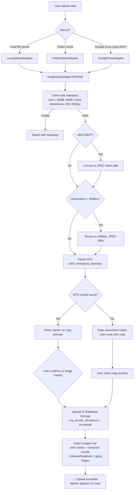

### Interface Contract

```typescript
interface ImageInputAdapter {
  /** Return selectable file references available from this source. */
  listSources(): Promise<ImageInputRef[]>;

  /** Fetch the raw File object for a given reference. */
  fetchFile(ref: ImageInputRef): Promise<File>;

  /** Return any source-level metadata the adapter can supply. */
  getMetadata(ref: ImageInputRef): Promise<ImageInputMetadata>;
}

interface ImageInputRef {
  id: string; // Opaque identifier within the adapter's namespace
  label: string; // Human-readable label (filename, Drive title, etc.)
  mimeType: string;
}

interface ImageInputMetadata {
  originalName?: string;
  sourceCreatedAt?: string; // ISO 8601
  [key: string]: unknown; // Adapter-specific extras; core ignores unknown keys
}
```

### Concrete Adapters

| Adapter               | Status   | Description                                                                                                                                                                                                                   |
| --------------------- | -------- | ----------------------------------------------------------------------------------------------------------------------------------------------------------------------------------------------------------------------------- |
| `LocalUploadAdapter`  | MVP      | Wraps the browser `<input type="file">` API. Ships first.                                                                                                                                                                     |
| `FolderImportAdapter` | Planned  | Wraps the File System Access API (`showDirectoryPicker()`). Recursively scans a local folder; includes `FilenameLocationParser` for address extraction from paths. Requires a Chromium-based browser. See `folder-import.md`. |
| `GoogleDriveAdapter`  | Post-MVP | Fetches files via the Google Drive Picker API.                                                                                                                                                                                |
| _(future)_            | Post-MVP | Any source (Dropbox, FTP, camera API) that implements `ImageInputAdapter`.                                                                                                                                                    |

### Invariants

- The ingestion pipeline depends only on `ImageInputAdapter`, never on `LocalUploadAdapter` or `GoogleDriveAdapter` directly.
- Adding a new source requires only: (a) implementing `ImageInputAdapter` and (b) registering it in Angular's DI container. No changes to core ingestion logic.
- `LocalUploadAdapter` is the MVP default. All other adapters are post-MVP drop-ins.

### Upload Validation

Before entering the ingestion pipeline, all files are validated client-side (for fast UX feedback) and server-side (for security enforcement via Supabase Storage policies).

| Rule                                                                                     | Client-Side                                     | Server-Side                     |
| ---------------------------------------------------------------------------------------- | ----------------------------------------------- | ------------------------------- |
| Max file size: 25 MB                                                                     | Reject with message before upload               | Supabase Storage policy rejects |
| Accepted MIME types: `image/jpeg`, `image/png`, `image/webp`, `image/heic`, `image/heif` | Reject with message                             | Storage policy MIME whitelist   |
| Max dimensions: 8192×8192 pixels                                                         | Warn but allow (resize client-side if feasible) | Not enforced server-side        |
| Min dimensions: 100×100 pixels                                                           | Reject (likely not a photo)                     | Not enforced server-side        |

### Upload Concurrency

- Maximum **3 parallel uploads** at a time. Additional files are queued.
- Each upload shows individual progress (bytes uploaded / total bytes).
- **Partial failure handling:** If 3 of 10 uploads fail, the 7 successful uploads are committed. Failed uploads are shown with a retry button.
- **Abort:** The user can cancel the entire batch. Already-committed uploads remain (they are already in storage and the database).

### Image Compression

- Before upload, JPEG/PNG images larger than 4096px on their longest side are resized client-side to 4096px (maintaining aspect ratio) using `OffscreenCanvas` or `<canvas>`.
- HEIC/HEIF files are converted to JPEG client-side before upload (using a library like `heic2any`) for browser compatibility.
- Compression quality: JPEG 85%.
- Original EXIF is parsed **before** compression (compression may strip EXIF).

### Missing EXIF Fallback

When EXIF extraction produces no GPS coordinates:

1. The upload UI shows: "No location found in this photo."
2. The user **must** manually place a marker on the map to set coordinates. The upload cannot be saved without coordinates (enforces Invariant I2).
3. Default map center for manual placement: the user's current GPS location (if available) or the current map viewport center.
4. `exif_latitude` and `exif_longitude` remain `NULL`. `latitude` and `longitude` (effective display coordinates) are set to the user-placed values. The `coordinate_corrections` table logs the change.

---

## 6. Map Rendering Layer

Map rendering is abstracted behind a `MapAdapter` interface. Angular components that display markers, clusters, and the base map depend on this interface — not on Leaflet directly. This prevents accidental lock-in to a specific map library without requiring any active plan to swap.

### Interface Contract

```typescript
interface MapAdapter {
  /** Initialize the map inside the given DOM container. */
  init(container: HTMLElement, options: MapInitOptions): void;

  /** Pan or fly the map to a coordinate. */
  setCenter(lat: number, lng: number, zoom?: number): void;

  /** Fit the map to a bounding box. */
  fitBounds(bounds: LatLngBounds): void;

  /** Get the current viewport bounding box. */
  getBounds(): LatLngBounds;

  /** Get the current zoom level. */
  getZoom(): number;

  /** Add a marker and return an opaque handle for later reference. */
  addMarker(lat: number, lng: number, options?: MarkerOptions): MarkerHandle;

  /** Remove a previously added marker by its handle. */
  removeMarker(handle: MarkerHandle): void;

  /** Remove all markers and clusters from the map. */
  clearMarkers(): void;

  /** Register a click callback on a specific marker. */
  onMarkerClick(
    handle: MarkerHandle,
    callback: (handle: MarkerHandle) => void,
  ): void;

  /** Replace the current point set with clustered groups. */
  renderClusters(groups: ClusterGroup[]): void;

  /** Register a callback for cluster clicks. */
  onClusterClick(callback: (cluster: ClusterGroup) => void): void;

  /** Register a callback that fires when the viewport changes (pan, zoom). */
  onViewportChange(
    callback: (bounds: LatLngBounds, zoom: number) => void,
  ): void;

  /** Switch tile style for dark/light mode. */
  setTileStyle(style: "light" | "dark"): void;

  /** Enable right-click-drag radius selection. */
  enableRadiusSelection(options?: RadiusSelectionOptions): void;

  /** Disable radius selection and clear any active circle overlay. */
  disableRadiusSelection(): void;

  /** Fires when the user completes a radius selection. */
  onRadiusSelect(
    callback: (center: LatLng, radiusMeters: number) => void,
  ): void;

  /** Fires when the user modifies an existing selection circle. */
  onRadiusChange(
    callback: (center: LatLng, radiusMeters: number) => void,
  ): void;

  /** Fires when the user dismisses the selection circle. */
  onRadiusClear(callback: () => void): void;

  /** Tear down the map instance and release all resources. */
  destroy(): void;
}

/** Latitude/longitude pair. No library-specific types (e.g., L.LatLng). */
interface LatLng {
  lat: number;
  lng: number;
}

interface LatLngBounds {
  north: number;
  south: number;
  east: number;
  west: number;
}

interface MapInitOptions {
  center: LatLng;
  zoom: number;
  minZoom?: number; // Default: 3
  maxZoom?: number; // Default: 19
}

interface MarkerOptions {
  imageId?: string; // Domain identifier for the image
  thumbnailUrl?: string; // Thumbnail URL for popup preview
  draggable?: boolean; // For marker correction (UC3)
  highlighted?: boolean; // Visual emphasis for selection
}

/** Opaque marker handle. Implementation may wrap a library-specific object. */
type MarkerHandle = { readonly __brand: "MarkerHandle"; id: string };

interface ClusterGroup {
  center: LatLng;
  pointCount: number;
  bounds: LatLngBounds;
  imageIds: string[]; // IDs of images in this cluster (for expand/detail)
}

interface RadiusSelectionOptions {
  maxRadiusMeters?: number; // Default: 5000
  circleStyle?: { color: string; fillOpacity: number };
  showRadiusLabel?: boolean; // Default: true
}
```

### Lifecycle

- `init()` is called once when the map Angular component is created.
- `destroy()` is called in `ngOnDestroy`. It must: (1) remove all event listeners, (2) cancel in-flight tile loads, (3) release the map DOM container. Failure to call `destroy()` causes memory leaks.
- `onViewportChange()` listeners are cleaned up automatically on `destroy()`.
- If the component route is deactivated but not destroyed (e.g., route reuse), the map is preserved. `destroy()` is only called on actual component destruction.

### Concrete Adapters

| Adapter             | Status   | Description                                                          |
| ------------------- | -------- | -------------------------------------------------------------------- |
| `LeafletOSMAdapter` | MVP      | Leaflet with OpenStreetMap tiles. Default.                           |
| _(future)_          | Post-MVP | Google Maps, Mapbox, or any tile provider implementing `MapAdapter`. |

### Invariants

- Angular components import `MapAdapter` via Angular's DI injection token. They never import `LeafletOSMAdapter` or the Leaflet library directly.
- Tile-provider configuration (tile URL, attribution, API keys) lives entirely inside the adapter.
- Swapping map providers requires only replacing the adapter and updating the DI registration. No component changes.
- Leaflet remains the current default; the adapter boundary exists to prevent lock-in, not to encourage churn.
- The `LeafletOSMAdapter` exposes a `setTileStyle(style: 'light' | 'dark')` method so the theme service can switch tile sets when dark mode is active.

---

## 7. UI Theming Layer

Sitesnap uses **Tailwind CSS** as its styling foundation. Dark mode and theming are **first-class build targets**, not post-MVP toggles. Any component that only supports light mode is considered incomplete.

### Configuration

- Tailwind is configured with `darkMode: 'class'` so that dark mode is activated by a CSS class on `<html>` (e.g., `<html class="dark">`), not exclusively by the OS media query.
- A `ThemeService` in Angular manages the active theme class and persists the user's choice to `localStorage`.
- Design tokens (brand colors, spacing scale, border radius) are defined in both `theme.extend` in `tailwind.config.js` and as CSS custom properties (`--color-primary`, `--color-surface`, etc.), enabling runtime overrides without a rebuild.

### Theme Token Contract

```css
/* Defined in styles.scss or a dedicated tokens file */
:root {
  --color-primary: theme("colors.blue.600");
  --color-surface: theme("colors.white");
  --color-surface-alt: theme("colors.gray.100");
  --color-text: theme("colors.gray.900");
  --color-text-muted: theme("colors.gray.500");
}

.dark {
  --color-primary: theme("colors.blue.400");
  --color-surface: theme("colors.gray.900");
  --color-surface-alt: theme("colors.gray.800");
  --color-text: theme("colors.gray.100");
  --color-text-muted: theme("colors.gray.400");
}
```

### Rules

- Every new UI component must carry both light and `dark:` Tailwind variants. A component shipped without dark mode support is a defect, not a deferral.
- Avoid hardcoded hex or RGB values in component templates. Use Tailwind utility classes or the CSS custom properties above.
- Map tile layers should visually adapt to dark mode where the provider supports a dark tile URL. The `MapAdapter` interface exposes `setTileStyle('light' | 'dark')` for this purpose; adapters that don't support dark tiles may no-op the call.

---

## 8. Viewport Query Lifecycle

Viewport-bounded loading (Feature 12) requires careful orchestration to avoid flooding the database on rapid pan/zoom.

### Viewport Query Flow Diagram

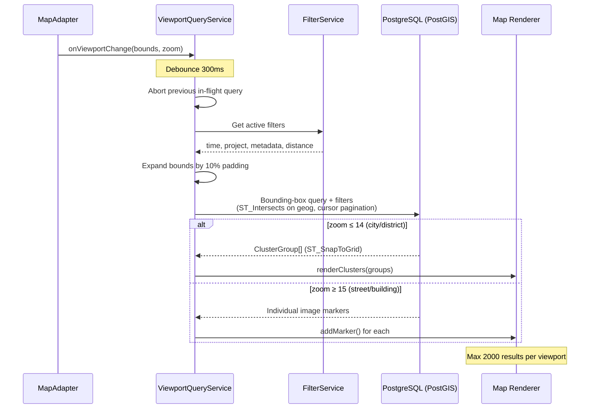

### Query Flow

1. `MapAdapter.onViewportChange()` fires on every pan or zoom event.
2. The `ViewportQueryService` **debounces** the event: 300ms idle timer after the last viewport change.
3. Any in-flight query from a previous viewport change is **aborted** (`AbortController`).
4. The service constructs a bounding-box query with the current viewport + active filters.
5. Request is sent to Supabase (RPC or query).
6. On response: markers/clusters are rendered via `MapAdapter.renderClusters()` or `addMarker()`.

### Pagination Contract

- **Page size:** 200 images per page (server-side).
- **Cursor:** Keyset pagination using `(distance_from_center, id)` for spatial queries or `(created_at, id)` for time-ordered queries. No `OFFSET` (avoids performance degradation on deep pages).
- **Max results per viewport:** 2000 images. Beyond this, the server returns clusters instead of individual markers. The zoom level determines whether to return clusters or points.
- **Viewport padding:** The query viewport is expanded by 10% on each side to pre-fetch markers just outside the visible area, reducing flicker on small pans.

### Zoom-Level Behaviour

| Zoom Level            | Server Returns                          | Client Renders                                |
| --------------------- | --------------------------------------- | --------------------------------------------- |
| 1–10 (country/region) | Clusters only (grid-based, large cells) | Cluster markers with count badges             |
| 11–14 (city/district) | Clusters (smaller cells)                | Cluster markers; dense areas remain clustered |
| 15–17 (street)        | Individual markers + small clusters     | Individual pins; nearby pins clustered        |
| 18–19 (building)      | Individual markers only                 | Individual pins                               |

---

## 9. Progressive Image Loading

Images are loaded in three tiers to minimize bandwidth and maximize perceived speed. This applies everywhere images are displayed: map popups, workspace pane, detail views.

### Progressive Loading Tiers

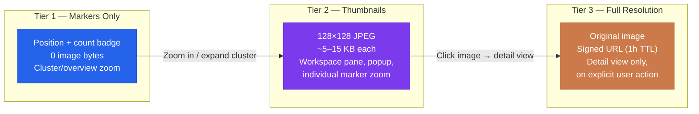

### Tier 1 — Marker Only (Zero Image Bytes)

At cluster/overview zoom levels, markers show only counts and positions. No image data is fetched.

### Tier 2 — Thumbnails (128×128)

Fetched when:

- A cluster is expanded or the user zooms to individual-marker level.
- Images appear in the workspace pane (Active Selection or group tab).
- An image appears in a map popup on marker click.

Thumbnails are generated on upload:

- The ingestion pipeline produces a 128×128 JPEG thumbnail and stores it in Supabase Storage alongside the original.
- The `images` table stores `thumbnail_url` (the storage path to the thumbnail).
- If Supabase Storage image transformations are available, `thumbnail_url` may alternatively be a transformation URL (`?width=128&height=128`). The choice is an implementation detail; the contract is that `thumbnail_url` resolves to a small image.

Thumbnails use `loading="lazy"` and `IntersectionObserver` for lists/grids.

### Tier 3 — Full Resolution (On Demand)

Fetched only when:

- The user clicks an image to open the detail view.
- The user explicitly requests download/export.

Full-resolution images use Supabase Storage signed URLs (1-hour TTL, refreshed on demand if expired).

### Network Priority

On constrained connections (Technician persona on LTE):

1. Map tiles load first (navigation context).
2. Thumbnails load second (content preview).
3. Full-res loads last (explicit user action).

Thumbnails and full-res images use `` and are fetched with lower priority (`fetch priority: low`) where the browser supports it.

---

## 10. Responsive Layout

Sitesnap must function across desktop (Clerk) and mobile (Technician) form factors. Responsive behaviour is a first-class requirement, not a post-MVP polish item.

### Breakpoints

| Breakpoint | Label   | Layout                                                                                                   |
| ---------- | ------- | -------------------------------------------------------------------------------------------------------- |
| ≥1024px    | Desktop | Map + workspace pane side-by-side. Left sidebar visible. Full toolbar.                                   |
| 768–1023px | Tablet  | Map full-width. Workspace as slide-over panel from right. Sidebar collapsed to icons.                    |
| <768px     | Mobile  | Map full-width. Workspace as bottom sheet. Sidebar hidden (hamburger menu). Filters in a dropdown/modal. |

### Desktop Layout

- **Left sidebar** (56px collapsed / 240px expanded): Navigation links (Map, Projects, Groups, Admin).
- **Top toolbar**: Search bar, filter toggles, upload button, theme toggle.
- **Map pane**: Takes remaining width minus workspace pane.
- **Workspace pane** (right, collapsible): 300–600px. Contains group tabs (Active Selection + named groups), thumbnail grid, image detail. Drag-to-resize divider. Toggle button to collapse/expand.

### Mobile Layout

- **Top bar**: Compact search, filter dropdown trigger, hamburger menu.
- **Map**: Full viewport.
- **Bottom sheet**: Slides up from bottom with three snap points (minimized 48px, half screen, full screen). Contains chip bar for group tabs + thumbnail grid.
- **Image detail**: Full-screen overlay with back button.

### Map Initial State

- **First load (no state):** Start at fallback center. A background geolocation attempt may update internal `userPosition`, but must not add a user marker or force a recenter after the user has started interacting with the map.
- **Returning user:** Restore last viewport (center + zoom) from `localStorage`.
- **After address search:** Center and zoom as specified in the geocoding section (section 3).

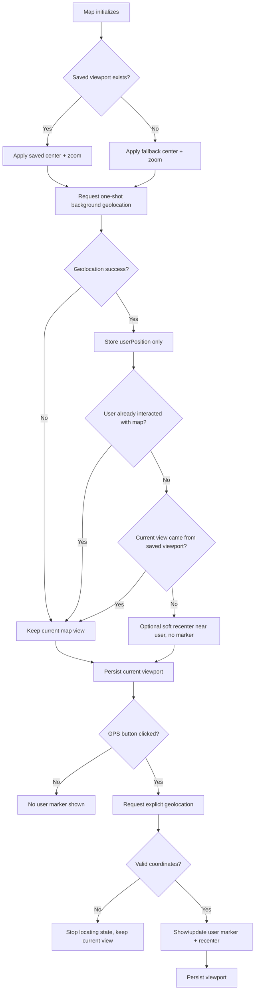

---

## 11. Group Workspace Architecture

The workspace pane uses a **group-based tabbed model**. Each tab represents a named collection of images, not a single image.

### Group Workspace Data Flow

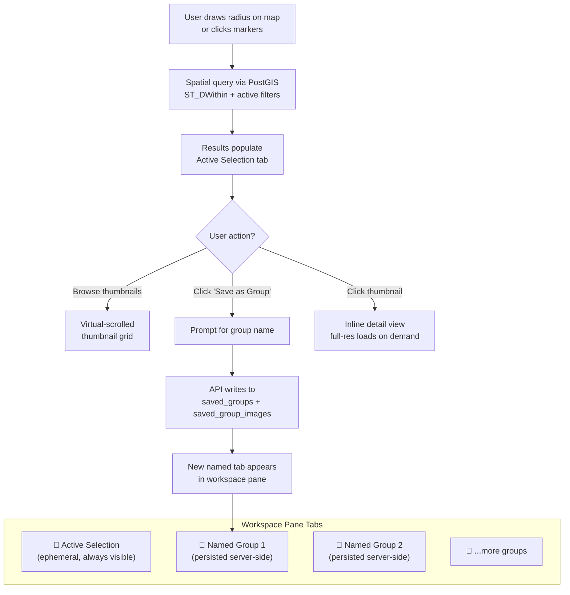

### Spatial Selection Interaction

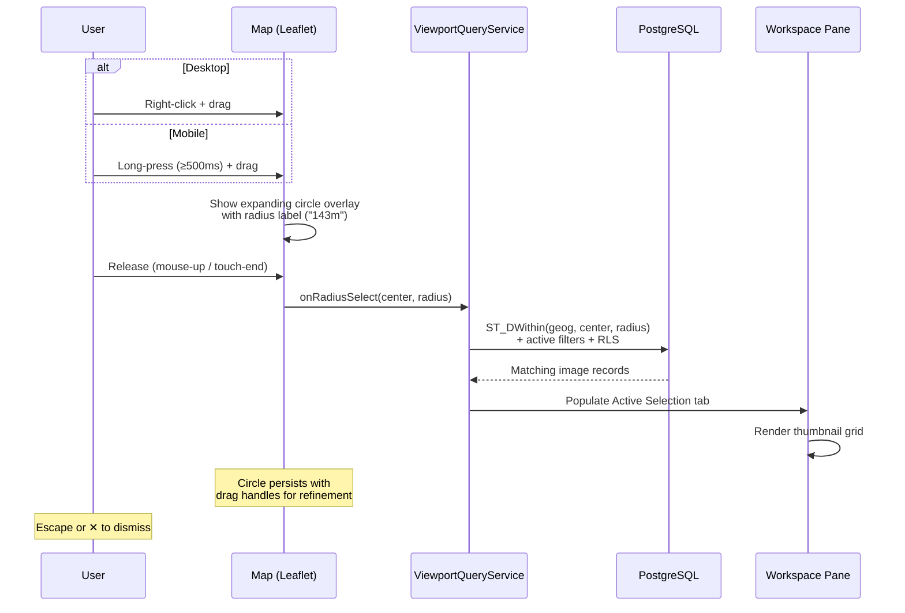

### Tab Types

| Tab                  | Persistent                                                                                | Source                                                                                                |
| -------------------- | ----------------------------------------------------------------------------------------- | ----------------------------------------------------------------------------------------------------- |
| **Active Selection** | Always visible (cannot be closed). Ephemeral — not saved to database.                     | Populated by radius selection, filter results, or marker clicks. Auto-updates when selection changes. |
| **Named Group**      | Saved to database (`saved_groups` / `saved_group_images`). Survives refresh and sessions. | Created by the user via "Save as Group" from Active Selection, or via sidebar → "New Group."          |

### Data Flow

1. **Selection → Active Selection tab:** User draws a radius (right-click drag) → query returns matching images → Active Selection tab populates.
2. **Active Selection → Named Group:** User clicks "Save as Group" → prompted for name → API writes to `saved_groups` + `saved_group_images` → new tab appears.
3. **Named Group lifecycle:** Groups are loaded on login from `saved_groups WHERE user_id = auth.uid()`. Tabs are rendered in `tab_order`. Closing a tab hides it but does not delete the group. Groups can be re-opened from sidebar → "My Groups."

### Memory and Rendering

- Only the **active tab's** thumbnail grid is rendered in the DOM (`@if` on active state).
- Thumbnail grids use **virtual scrolling** (`@angular/cdk/scrolling`): only visible rows are in the DOM.
- Inactive tab data is held as lightweight metadata arrays in memory (~100 bytes per image).

### Workspace State Persistence

- **Active tab index** and **tab order** are persisted to `localStorage`.
- **Group membership** is persisted server-side.
- **Active Selection contents** are ephemeral and not persisted.

---

## 12. Spatial Selection

Spatial selection allows users to select all images within a user-defined radius on the map. The primary interaction is **right-click + drag**.

### Desktop Interaction

1. User right-clicks on the map and holds.
2. Browser `contextmenu` event is suppressed (`preventDefault()`).
3. As the user drags, a circle overlay grows from the click origin. A label shows the radius in meters.
4. On mouse-up, the circle is finalized. The frontend queries for all images within the radius.
5. Results populate the **Active Selection** tab in the workspace pane.
6. The circle persists on the map with drag handles (center and edge) for refinement.
7. `Escape` or the ✕ button on the circle dismisses the selection.

### Mobile Interaction

Long-press (≥500ms) + drag. Haptic feedback signals activation. Otherwise identical to desktop.

### Fallback: Toolbar Button

A toolbar button (crosshair icon, keyboard shortcut `S`) enters selection mode where **left-click + drag** draws the circle. This serves as a secondary path for discoverability and accessibility.

### Query Integration

Selection triggers a spatial query:

```sql
SELECT id, latitude, longitude, thumbnail_url, captured_at, project_id
FROM images
WHERE ST_DWithin(geog, ST_MakePoint(:lng, :lat)::geography, :radius_meters)
  AND [active filters applied]
ORDER BY geog <-> ST_MakePoint(:lng, :lat)::geography
LIMIT 2000;
```

Active filters (time range, project, metadata) are AND-combined with the spatial selection. Organization-scoped RLS is applied automatically.

---

## 13. UI State Contract

Every asynchronous operation in Sitesnap must handle four states. Components that skip any state are considered defects.

| State       | Visual Treatment                                                 | Example                                                                                                                                    |
| ----------- | ---------------------------------------------------------------- | ------------------------------------------------------------------------------------------------------------------------------------------ |
| **Loading** | Skeleton / shimmer placeholder or spinner. Never a blank screen. | Map: tile placeholders. Workspace: skeleton thumbnail grid. Search: spinner in input.                                                      |
| **Success** | Content rendered normally.                                       | Markers on map. Thumbnails in grid. Search results in dropdown.                                                                            |
| **Empty**   | Explicit empty-state message with guidance. Never a blank area.  | "No images found in this area. Try zooming out or adjusting filters." / "This group is empty. Select images on the map and add them here." |
| **Error**   | Error message with retry action. User-friendly language.         | "Failed to load images. [Retry]" / "Address search unavailable. Try again or navigate manually."                                           |

### Operations and Their States

| Operation              | Loading                               | Empty                      | Error                             |
| ---------------------- | ------------------------------------- | -------------------------- | --------------------------------- |
| Map initialization     | Tile skeleton, gray rectangle         | N/A                        | "Map failed to load. [Retry]"     |
| Viewport query         | Previous markers remain while loading | "No images in this area"   | "Failed to load images. [Retry]"  |
| Geocoding search       | Spinner in search input               | "No results for '[query]'" | "Search unavailable"              |
| Image detail           | Thumbnail shown while full-res loads  | N/A                        | "Image failed to load. [Retry]"   |
| Upload                 | Per-file progress bar (bytes / total) | N/A                        | Per-file error with retry button  |
| Radius selection query | Spinner in Active Selection tab       | "No images within [X]m"    | "Selection query failed. [Retry]" |
| Group load             | Skeleton grid in tab                  | "Group is empty"           | "Failed to load group. [Retry]"   |

---

## 14. Angular State Management

Sitesnap uses **Angular Signals** as the primary state management approach. No external state library (NgRx, Akita) is used for MVP.

### Service Dependency Graph

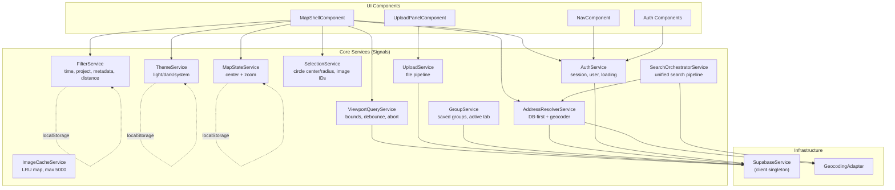

### UI State Machine (Async Operations)

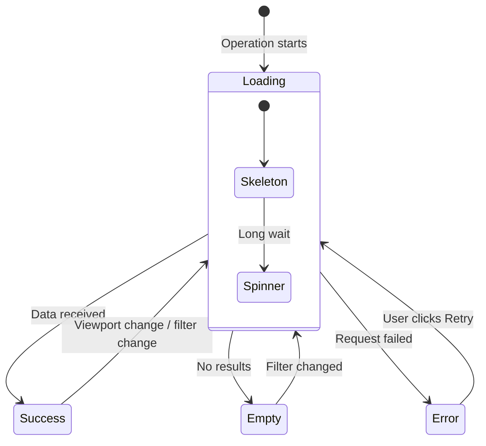

### Service Responsibilities

| Service                  | State Managed                                                          | Persistence                                          |
| ------------------------ | ---------------------------------------------------------------------- | ---------------------------------------------------- |
| `AuthService`            | Current user, JWT, roles                                               | Supabase session (auto-managed)                      |
| `ViewportQueryService`   | Current viewport bounds, debounce timer, abort controller              | In-memory only                                       |
| `FilterService`          | Active filters (time, project, metadata, distance)                     | `localStorage`                                       |
| `SelectionService`       | Active selection circle (center, radius), selected image IDs           | In-memory (ephemeral)                                |
| `GroupService`           | Saved groups, group membership, active tab                             | Server (`saved_groups`) + `localStorage` (tab order) |
| `ImageCacheService`      | Fetched image metadata, thumbnail URLs                                 | In-memory `Map` with LRU eviction (max 5000 entries) |
| `ThemeService`           | Light/dark mode                                                        | `localStorage` key: `sitesnap-theme`                 |
| `MapStateService`        | Last viewport center + zoom                                            | `localStorage` key: `sitesnap-map-state`             |
| `AddressResolverService` | Result cache (query → `AddressCandidateGroup`, 5-min TTL, LRU max 200) | In-memory only; stateless across sessions            |

### Signal Pattern

Services expose `Signal<T>` (read-only) and mutate via methods:

```typescript
@Injectable({ providedIn: 'root' })
export class FilterService {
  private readonly _filters = signal<ActiveFilters>(DEFAULT_FILTERS);
  readonly filters = this._filters.asReadonly();

  setTimeRange(start: Date, end: Date): void { ... }
  setProjects(ids: string[]): void { ... }
  clearAll(): void { ... }
}
```

Components use `computed()` and `effect()` to react to state changes. No manual subscription management.
