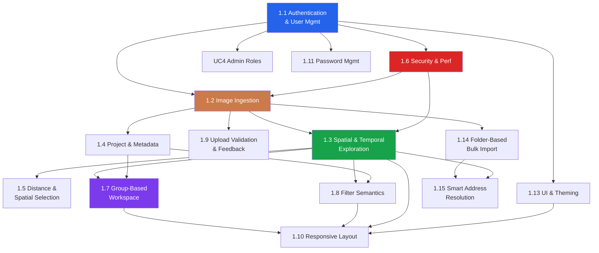
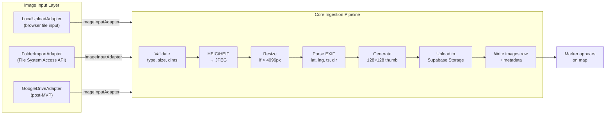
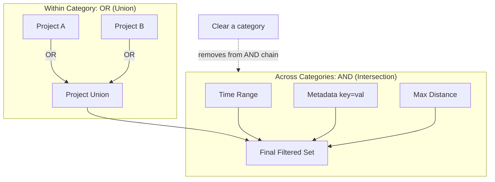

# Features (MVP and Beyond)

**Who this is for:** engineers and product owners deciding what to implement.  
**What you'll get:** a numbered list of capabilities and constraints for SiteSnap.

See `search-experience-spec.md` for the detailed search UX, ranking, use-case expansion, and requirements breakdown.  
See **`implementation-readiness.md`** for current implementation scores, gap analysis, and prioritized work items per feature group.

### Feature Dependency Map

### Image Ingestion Pipeline

---

## 1. MVP Features

These features define the first shippable version of Sitesnap and map to `use-cases/README.md`.

### 1.1 Authentication and User Management

1. **User registration and login**
   - Implemented via Supabase Auth (email/password).
   - New users automatically receive a default role (for example, `user`) via trigger.
2. **Session handling**
   - Angular stores the active session/JWT and forwards it with Supabase calls.
3. **Account deletion**
   - Deleting a user from `auth.users` cascades to `profiles`, `user_roles`, and owned `images`.

See `user-lifecycle.md` for lifecycle details.

---

### 1.2 Image Ingestion

4. **Provider-agnostic image input layer**
   - All image sources implement the `ImageInputAdapter` interface (`listSources`, `fetchFile`, `getMetadata`).
   - The core ingestion pipeline (EXIF parse → Storage upload → DB write) depends only on `ImageInputAdapter`, never on a concrete adapter.
   - Swapping or adding an input source requires implementing the interface and registering in Angular DI. No changes to ingestion logic.
   - See `architecture.md` section 5 and `decisions.md` (D10).
5. **Local upload (MVP default — `LocalUploadAdapter`)**
   - Wraps the browser `<input type="file">` API.
   - User selects one or more photos from their device.
   - Files are uploaded to Supabase Storage with UUID-based paths/names.
6. **Automatic EXIF extraction**
   - Extract latitude, longitude, timestamp, and direction/bearing when available.
   - Direction is extracted from GPSImgDirection EXIF tag and stored in the `direction` column.
   - Direction is visualized as a 30° cone on marker hover and is editable via drag interaction.
   - Store EXIF coordinates separately from corrected coordinates.
7. **Map preview before save**
   - Image appears as a map marker after EXIF parse.
   - User can confirm or adjust location before final save.
8. **Marker correction**
   - User may drag marker to correct positional error.
   - Corrected coordinates are stored in separate fields.

---

### 1.3 Spatial and Temporal Exploration

9. **Map-first main screen layout**
   - Map as primary canvas.
   - Address search bar with autocomplete.
   - Adjacent filter panel (time, project, metadata, max distance).
   - Upload entry point in map pane.
10. **Address search via geocoding service**
    - Uses a provider-agnostic geocoding boundary.
    - Behavior contract is defined in `architecture.md` and `decisions.md` (D6).
11. **Interactive map navigation via `MapAdapter`**
    - Map rendering is abstracted behind the `MapAdapter` interface; Angular components never import Leaflet directly.
    - Default implementation: `LeafletOSMAdapter` (Leaflet + OpenStreetMap tiles).
    - Swapping map providers requires only replacing the adapter and updating DI registration. No component changes.
    - See `architecture.md` section 6 and `decisions.md` (D3, D8).
    - Markers update based on viewport.
12. **Viewport-bounded loading**
    - Fetch only images in the visible map region using PostGIS bounding-box queries (`&&` operator on `geog` column).
    - Server-side cursor-based pagination (keyset by `(distance, id)` or `(created_at, id)`). Default page size: 200. Max results per viewport: 2000.
    - Viewport queries are debounced (300ms) and abort previous in-flight requests.
    - Viewport is padded by 10% on each side to pre-fetch nearby markers.
    - See `architecture.md` §8 and `decisions.md` (D11).
13. **Marker clustering**
    - Cluster dense regions to preserve readability and performance.
    - Server-side clustering via `ST_SnapToGrid` on the PostGIS `geog` column. Grid cell size varies by zoom level.
    - Clusters show a count badge. Cluster click zooms in or expands to show individual markers.
14. **Timeline filtering**
    - Time range filter limits displayed images.
    - Uses `captured_at` when available, falls back to `created_at` when `captured_at` is NULL.
    - Date precision: day granularity in the UI (date picker), stored at timestamptz precision.
15. **Detail view**
    - Full image (loaded on demand from signed URL), capture time, project, metadata, owner, and coordinates.
    - Thumbnail shown as placeholder while full-res loads.
    - Includes "Reset to EXIF" button for corrected images and correction history display.

---

### 1.4 Project and Metadata

16. **Project assignment**
    - Each image can be associated with one project.
    - Images can be re-assigned to a different project or have the project association removed.
17. **Project filtering**
    - Users can filter images by one or more projects (multi-select: union within projects, intersection with other filter types).
18. **Flexible metadata system**
    - User-defined metadata keys scoped to the organization. Keys are unique per organization (enforced).
    - Values per image are free text. Autocomplete suggests existing values for a given key.
    - Filter by metadata key/value.
    - **Batch metadata assignment:** Apply metadata key/value to multiple selected images at once.

---

### 1.5 Distance and Spatial Selection

19. **Distance-based filtering**
    - Restrict results by max distance from a reference point.
    - Reference point sources: (1) user GPS location (default on mobile), (2) map center, (3) searched address coordinates, (4) user-clicked point.
    - Presets (for example, 25m/50m/100m) and optional custom value.
    - Distance uses PostGIS `ST_DWithin` on effective display coordinates.
20. **Radius selection (right-click drag)**
    - Desktop: right-click + drag on the map draws a selection circle. Circle radius displayed in meters.
    - Mobile: long-press (≥500ms) + drag.
    - Fallback: toolbar button (crosshair icon, shortcut `S`) enters selection mode for left-click drag.
    - Selected images populate the Active Selection tab in the workspace pane.
    - Circle persists with drag handles for refinement. Escape or ✕ to dismiss.
    - See `architecture.md` §12 and `decisions.md` (D13).

---

### 1.6 Security and Performance

21. **RLS-enforced organization-scoped visibility**
    - All access enforcement in PostgreSQL RLS, not in Angular.
    - Data visibility is scoped by organization: users see all images, projects, and metadata within their organization.
    - Role-based permissions: `admin` (full access + user management), `user` (read/write own images, read all within org), `viewer` (read-only within org, no uploads, no corrections).
    - See `security-boundaries.md` and `decisions.md` (D2, D12).
22. **Storage security**
    - Organization-and-user-scoped upload paths: `{org_id}/{user_id}/{uuid}.jpg`.
    - Thumbnails stored alongside originals: `{org_id}/{user_id}/{uuid}_thumb.jpg`.
    - Full-resolution images served via signed URLs (1-hour TTL, refreshed on demand).
    - Thumbnails may be public or use short-lived signed URLs (implementation decision; low-res minimizes risk).
23. **Performance guardrails**
    - All spatial and temporal filtering is server-side via PostGIS and indexed queries.
    - Three-tier progressive image loading: markers only → thumbnails (128×128) → full-res on demand.
    - Viewport query debounce (300ms), abort-previous-request, cursor-based pagination.
    - See `architecture.md` §8–§9 and `decisions.md` (D11, D15).

See `architecture.md`, `database-schema.md`, and `security-boundaries.md`.

---

### 1.7 Group-Based Workspace

24. **Split-screen layout with group tabs**
    - Map occupies the left pane (always visible). Workspace pane on the right (collapsible, resizable).
    - Workspace pane contains group-based tabs. Each tab is a named collection of images.
    - **Active Selection tab** (persistent, ephemeral): shows images from the current radius selection or marker interaction.
    - **Named group tabs** (user-created, persistent): created via "Save as Group" from Active Selection. Stored server-side.
    - See `architecture.md` §11 and `decisions.md` (D14).
25. **Image gallery within groups**
    - Each group tab displays a scrollable thumbnail grid with capture date, project badge, and metadata preview.
    - Click a thumbnail to expand to inline detail view (full-res loads on demand).
    - Swipe/arrow navigation between images in a group.
    - Sort by date (newest/oldest), distance from map center, or name.
26. **Group management**
    - Create group from selection ("Save as Group" button, `Ctrl+G` / `Cmd+G`).
    - Add/remove images via context menu.
    - Rename, reorder, or delete groups.
    - Groups persist across sessions (server-side storage).
    - Soft limit: 20 groups per user. Hard limit: 50.
27. **Image deletion**
    - Users can delete their own images. Admins can delete any image within the organization.
    - Confirmation dialog required.
    - Deleting an image: removes the database record (cascades to `image_metadata`, `coordinate_corrections`, `saved_group_images`), and deletes the storage file + thumbnail.
    - No soft-delete for MVP (post-MVP consideration for legal retention).

---

### 1.8 Filter Semantics

#### Filter Combination Diagram

28. **Filter combination rules**
    - All filter categories are **AND-combined** (intersection): time AND project AND metadata AND distance.
    - Within a single category (e.g., multiple projects), selections are **OR-combined** (union): project A OR project B.
    - Clearing a filter category removes it from the AND chain (shows all for that dimension).
29. **Filter state persistence**
    - Active filters are persisted to `localStorage` and restored on page load.
    - Viewport position and zoom are also persisted.
    - Filter state survives image detail navigation and workspace interactions.

---

### 1.9 Upload Validation and Feedback

30. **Upload input validation**
    - Max file size: 25 MB. Accepted types: JPEG, PNG, WebP, HEIC, HEIF. Min dimensions: 100×100. Max dimensions: 8192×8192.
    - Client-side validation for fast feedback. Server-side Supabase Storage policy for enforcement.
31. **Upload concurrency and progress**
    - Max 3 parallel uploads. Additional files queued.
    - Per-file progress indicator (bytes uploaded / total).
    - Partial failure: successful uploads committed, failed ones shown with retry button.
32. **HEIC/HEIF conversion**
    - HEIC/HEIF images are converted to JPEG client-side before upload for browser compatibility.
    - EXIF is parsed before conversion (conversion may strip EXIF).
33. **Client-side image compression**
    - Images larger than 4096px on longest side are resized client-side before upload. JPEG quality: 85%.

---

### 1.10 Responsive Layout

34. **Desktop layout (≥1024px)**
    - Left sidebar (navigation), top toolbar (search + filters + upload), map pane, workspace pane (right, collapsible).
35. **Tablet layout (768–1023px)**
    - Full-width map, workspace as slide-over panel, sidebar collapsed to icons.
36. **Mobile layout (<768px)**
    - Full-width map, workspace as bottom sheet (three snap points: minimized, half, full), sidebar as hamburger menu, filters in dropdown/modal.
    - Image detail as full-screen overlay with back button.

---

### 1.11 Password Management

37. **Password reset (forgot password)**
    - Implemented via Supabase Auth password reset flow.
    - User enters email → receives reset link → sets new password.

### 1.12 MVP Feature-to-Use-Case Mapping

| MVP Feature Group                  | Feature IDs | Primary Use Cases   |
| ---------------------------------- | ----------- | ------------------- |
| Authentication and User Management | 1-3, 37     | UC1, UC2, UC3, UC4  |
| Image Ingestion                    | 4-8, 30-33  | UC3                 |
| Spatial and Temporal Exploration   | 9-15        | UC1, UC2            |
| Project and Metadata               | 16-18       | UC2, UC3            |
| Distance and Spatial Selection     | 19-20       | UC1, UC2            |
| Security and Performance           | 21-23       | UC1, UC2, UC3, UC4  |
| Group-Based Workspace              | 24-27       | UC1, UC2            |
| Filter Semantics                   | 28-29       | UC1, UC2            |
| Upload Validation                  | 30-33       | UC3                 |
| Responsive Layout                  | 34-36       | UC1, UC2, UC3, UC4  |
| UI and Theming                     | 38-40       | UC1, UC2, UC3, UC4  |
| Folder-Based Bulk Import           | 41-43       | UC13                |
| Smart Address Resolution           | 44          | UC1, UC2, UC3, UC13 |

MVP use cases are UC1-UC4. UC5 is post-MVP and does not gate MVP release. UC13 (folder import) is a planned extension; see `folder-import.md`.

---

### 1.13 UI and Theming

38. **Tailwind CSS as styling foundation**
    - All component styles use Tailwind utility classes.
    - No CSS-in-JS or separate theming library.
    - Brand colors, surface colors, and text tokens are defined as CSS custom properties (`--color-primary`, `--color-surface`, etc.) and mirrored in `tailwind.config.js` as `theme.extend` values.
    - See `architecture.md` section 7 and `decisions.md` (D9).
39. **First-class dark mode**
    - Tailwind configured with `darkMode: 'class'`; the `dark` class is applied on `<html>` by a `ThemeService`.
    - Every component ships with both light and `dark:` Tailwind variants. Shipping without dark mode is a defect, not a deferral.
    - User preference is persisted to `localStorage` key `sitesnap-theme`.
    - Default dark tile provider for map: CartoDB Dark Matter or Stadia Alidade Smooth Dark (configured in `LeafletOSMAdapter`).
40. **Theme token system**
    - Design tokens are CSS custom properties, enabling runtime theme switching without a rebuild.
    - Map tile layers adapt to dark mode via `MapAdapter.setTileStyle('light' | 'dark')`; adapters that lack a dark tile URL may no-op this call.

---

### 1.14 Folder-Based Bulk Import

41. **`FolderImportAdapter` — folder as an image source**
    - User selects a local folder from a native OS picker (File System Access API, `showDirectoryPicker()`).
    - `FolderImportAdapter` implements `ImageInputAdapter` and plugs into the core ingestion pipeline without changes to pipeline logic.
    - Supported in Chromium-based browsers (Chrome, Edge). Unsupported browsers receive a graceful fallback message and fall back to standard multi-file select.
    - See `architecture.md` §5, `folder-import.md`, and `decisions.md` (D10, D16).
42. **Recursive scan and location resolution**
    - Sitesnap recursively scans the selected folder for all supported image types (JPEG, PNG, WebP, HEIC, HEIF), without depth limit.
    - Each image goes through the **location resolution algorithm**: (1) filename and folder-path parsing (`FilenameLocationParser`) to extract an address hint; (2) EXIF GPS extraction; (3) comparison and decision (concordant, conflict, filename-only, EXIF-only, or unresolved).
    - Filename data is preferred over EXIF as the primary source — it is human-entered, intentional data. EXIF complements and can confirm the filename-derived location.
    - When filename and EXIF coordinates differ by more than 50m, the **conflict is surfaced to the user** — Sitesnap never resolves a conflict silently.
    - Address hints extracted from filenames are resolved via `AddressResolverService` (Feature 44).
    - See `folder-import.md` §4 for the full decision matrix and `decisions.md` (D16) for the rationale.
43. **Manual review queue for unresolved imports**
    - Images that cannot be auto-resolved (no filename hint, no EXIF GPS) are placed in a **manual review queue** before any data is written to the database.
    - In the review queue the user can: enter an address (with AddressResolverService autocomplete), drag-to-map for placement, batch-assign a shared location to multiple images, or skip (import without coordinates, flagged with `location_unresolved = TRUE`).
    - Skipped images are stored but excluded from all map viewport queries. They appear in a dedicated "Needs Location" filter view.
    - Batch assignment: select multiple images in any review group and apply a shared location, project, or metadata value in one action.
    - An import summary is shown before the batch upload begins: `✅ Ready: N  ⚠️ Conflicts: N  ❓ Needs confirmation: N  ❌ Unresolved: N`.
    - See `folder-import.md` §5–§6.

---

### 1.15 Smart Address Resolution

44. **`AddressResolverService` — application-wide, DB-first address resolver**
    - A single, reusable Angular service used everywhere an address is searched or entered: the main map search bar, the upload panel (manual placement), the folder import review, and the marker correction workflow.
    - **DB-first ranking:** the resolver queries Sitesnap's own `images` database first for addresses already documented by the organization, and presents those results prominently before falling back to the external geocoding provider.
    - Results are returned as an `AddressCandidateGroup`: `databaseCandidates` (up to 3 by default) followed by `geocoderCandidates` (up to 5), separated by a visual divider in the UI.
    - DB candidates are ranked by fuzzy trigram similarity to the query and weighted by image count ("12 photos here").
    - Geocoder candidates that are within 30m of an existing DB candidate are deduplicated (removed from the geocoder tier).
    - Autocomplete uses a 300ms debounce. Results are cached in-memory per query string with a 5-minute TTL.
    - The external geocoder remains the `GeocodingAdapter` from `architecture.md` §3 (default: Nominatim). `AddressResolverService` sits on top of it and does not replace it.
    - The `images` table gains an `address_label` column to enable the DB search index.
    - See `address-resolver.md` for the full interface contract, ranking algorithm, and UI presentation spec, and `decisions.md` (D17) for the rationale.

---

## 2. Non-Goals (MVP) and Post-MVP Considerations

The following items are out of scope for MVP and may be considered post-MVP:

1. Advanced image editing (crop, annotate, measure).
2. Public/social sharing.
3. Complex hierarchical permission models (per-project access control; MVP uses organization-scoped visibility).
4. Before/after overlays.
5. Heatmaps and analytics.
6. Offline mode (graceful degradation for intermittent connectivity IS in scope; full offline is not).
7. Directional relevance (bearing data is stored and exposed via direction cone on markers — see `archive/audit-upload-map-interaction.md` Pattern 2).
8. Right-click map actions for upload/create marker here — UC5.
9. `GoogleDriveAdapter` and other `ImageInputAdapter` implementations beyond local upload and folder import. `FolderImportAdapter` (Feature 41–43) is planned. `GoogleDriveAdapter` and further remote sources are post-MVP.
10. Alternative `MapAdapter` implementations (Google Maps, Mapbox, etc.); `LeafletOSMAdapter` is the MVP default.
11. Lasso/polygon selection (right-click drag radius is MVP; freeform polygon is post-MVP).
12. Image export (PDF reports, CSV, ZIP downloads).
13. Compare mode (side-by-side image comparison).
14. Internationalization (i18n). The UI language is English for MVP. German metadata values are user-entered, not system-translated.
15. Real-time updates (Supabase realtime subscriptions for live data sync between concurrent users).
16. Soft-delete and legal retention policies for images.
17. Full-text search across metadata values and project names.
