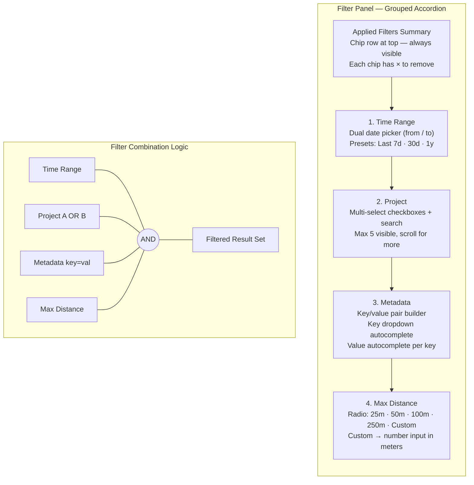

# Feldpost – Component: Filter Panel

## 5.2 Filter Panel

### Filter Panel Accordion Structure

The filter panel is a grouped accordion. Each group has a header with a collapse chevron and a live "active count" badge that shows how many values are currently selected.

Groups (in order):

1. **Time range** — dual date picker (from / to). "Last 7 days", "Last 30 days", "Last year" quick presets.
2. **Project** — multi-select checkboxes with search input. Max 5 visible; scroll for more.
3. **Metadata** — key/value pair builder. Select a key from a dropdown (autocompletes from org keys), enter a value (autocompletes from existing values for that key).
4. **Max distance** — radio buttons: 25m / 50m / 100m / 250m / Custom. Custom shows a number input in meters.
5. **Applied filters summary** — a compact chip row at the top of the filter panel showing all active constraints. Each chip has a ✕ to remove it inline. This row also appears as a strip above the map search bar (always visible, even when the filter panel is closed).

Filter panel animation: slides in from the top-right (desktop) or bottom (mobile) using `transform: translateY(-100%)` → `translateY(0)` with `transition: transform 220ms cubic-bezier(0.4, 0, 0.2, 1)`.
