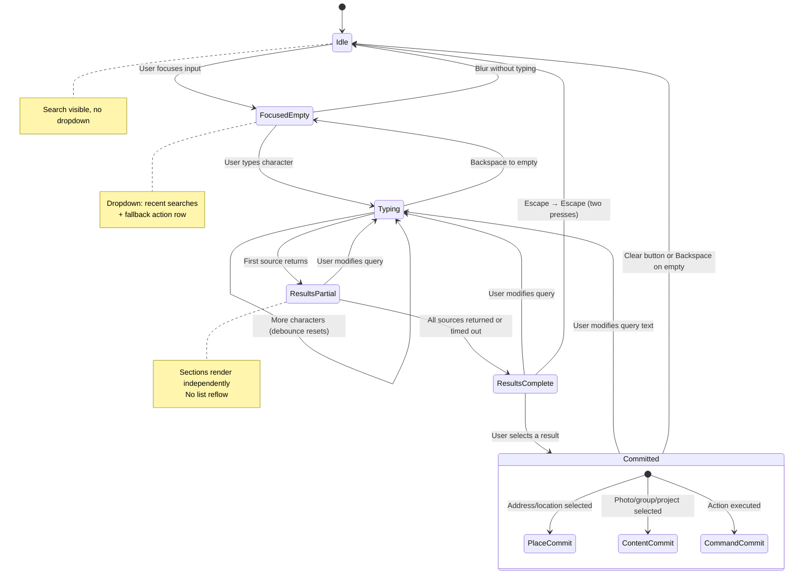
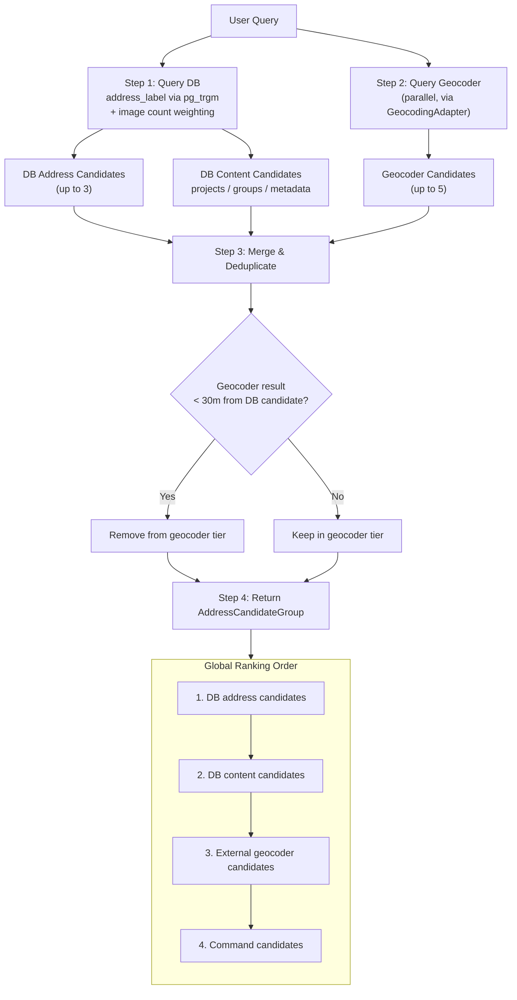
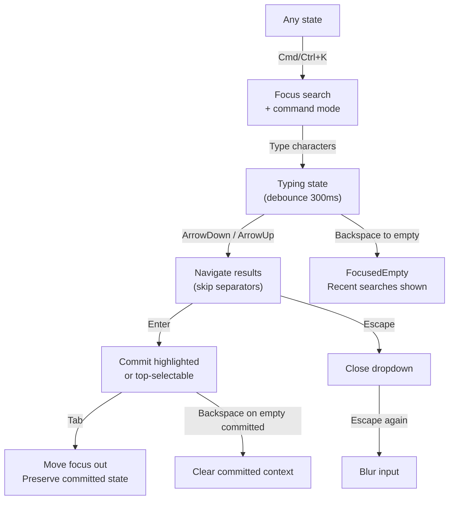
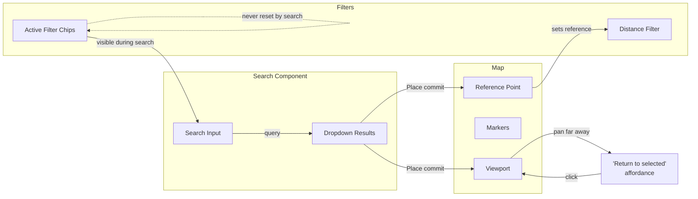

# Search Experience Specification

**Who this is for:** product, design, and frontend/backend engineers implementing the GeoSite search UX end-to-end.  
**What you'll get:** a unified, expanded specification for map search behavior, ranking, interaction states, use cases, requirements, and feature scope.

See also: `design.md` (always-load design context), `design/layout.md` (layout system), `element-specs/filter-panel.md` (filter behavior), `features.md` (feature inventory), `use-cases/README.md` (persona flows), `address-resolver.md` (DB-first address resolution), `decisions.md` (D6, D7, D17).

---

## 1. Why this spec exists

Search behavior currently exists across multiple docs and implementation notes:

- Layout expectations (search pinned at top, mobile behavior) in `design/layout.md`.
- Product-level feature intent in `features.md`.
- User intent and flow context in `use-cases/README.md`.
- Detailed address ranking and dropdown behavior in `address-resolver.md`.
- Additional interaction ideas (idle/focused/typing/committed, live marker feedback, command behavior) in `archive/audit-ui-design-interactions.md`.

This document consolidates those ideas and extends them into one implementation-ready contract.

---

## 2. Product intent for Search

GeoSite search is not a single geocoder input. It is a **multi-intent retrieval surface** that must support:

1. **Place intent** — “Take me to this address/place.”
2. **Evidence intent** — “Find photos/groups/projects matching this term.”
3. **Action intent** — “Run a quick command (upload, clear filters, go to location, open group).”

The user should not need to decide mode first. The UI infers intent from ranking and result type while staying explicit about result source.

---

## 3. Search scope and data sources

### 3.1 Sources

- **Source A: Organization data (DB-first)**
  - Address labels from existing images (prioritized)
  - Project names
  - Group names
  - Metadata keys/values
  - Optional file-name matches (when indexed)
- **Source B: External geocoder**
  - Provider-agnostic through `GeocodingAdapter` (default: Nominatim)
- **Source C: Local interaction context**
  - Recent searches (localStorage)
  - Recent groups viewed
  - Current viewport and active filters for contextual ranking
- **Source D: Command actions**
  - Upload photos
  - Clear filters
  - Go to my location
  - Open group: {name}

### 3.2 Search result families

- **Database address candidates** (top priority)
- **Database content candidates** (photo/group/project/metadata)
- **Geocoder address candidates**
- **Command candidates** (only in command mode or when confidence is high)

---

## 4. Interaction model

### Search State Machine

### 4.1 Core states

Search operates as a single component with these states:

`Idle → FocusedEmpty → Typing → ResultsPartial/ResultsComplete → Committed`

### 4.2 State behavior contract

1. **Idle**
   - Search input visible and pinned to top of map area (mobile + desktop map context).
   - No dropdown visible.

2. **FocusedEmpty**
   - Dropdown opens immediately.
   - Shows recent searches first (most-recent-first).
   - Shows one fallback action row (for example “Search your photos” / command hint).

3. **Typing**
   - Debounced query execution.
   - Sections are rendered independently as they return (no list reflow jump).
   - Result sections can include:
     - DB content matches (photos/groups/projects/metadata)
     - DB address matches (with image count)
     - External geocoder matches

4. **ResultsPartial / ResultsComplete**
   - Partial = one source has returned, others still loading.
   - Complete = all active sources returned or timed out.
   - Each section has stable ordering and section labels.

5. **Committed**
   - Place commit: map centers/fits candidate geometry and marks focused location.
   - Content commit: opens relevant tab/detail or highlights matching set.
   - Command commit: executes action and closes/updates dropdown.
   - Query remains in input for refinement.
   - Clear button appears.

---

## 5. Ranking and merge rules

### Ranking & Merge Pipeline

### 5.1 Global ranking order

1. DB address candidates (organization-known places)
2. DB content candidates (photos/groups/projects/metadata)
3. External geocoder candidates
4. Command candidates (or promoted in command mode)

### 5.2 Within-family ranking

- **DB address:** trigram similarity desc, then image count desc.
- **DB content:** exact/phrase/prefix > fuzzy; then recency and interaction frequency.
- **Geocoder:** provider confidence/order, then viewport proximity bias.
- **Commands:** context relevance (for example “Clear filters” only if filters active).

### 5.3 Merge and dedupe

- Geocoder results within 30m of a DB address candidate are removed from geocoder tier.
- Duplicate labels across families keep the higher-priority family.
- Section dividers are shown only when both adjacent sections are non-empty.

---

## 6. Keyboard, pointer, and accessibility contract

### Keyboard Interaction Flow

### 6.1 Keyboard

- `Cmd/Ctrl + K`: focus search and enter command-enabled mode.
- `ArrowDown` / `ArrowUp`: move highlighted option (skip non-selectable separators).
- `Enter`: commit highlighted option; if none highlighted, commit top selectable option.
- `Escape`: close dropdown; second `Escape` blurs input.
- `Tab`: move focus out while preserving committed state.
- `Backspace` on empty committed input: clear committed search context.

### 6.2 Pointer/touch

- Click/tap on input opens dropdown.
- Click/tap outside closes dropdown unless a commit is in progress.
- Touch targets meet minimum size constraints from design tokens.

### 6.3 Accessibility

- Dropdown uses `role="listbox"`; options use `role="option"`.
- Section headers/dividers use `role="presentation"`.
- Screen reader announces result count and highlighted option details.
- Source and type are announced for options (for example “Database address, 12 photos”).

---

## 7. Search + map + filters integration

### Search ↔ Map ↔ Filters Integration

1. Search commits can set the **distance reference point** used by distance filters.
2. Applied filter chips remain visible while search is active.
3. Search must not reset active filters unless user explicitly runs “Clear filters.”
4. Search context persists through image-detail navigation and tab changes.
5. If user pans far from committed target, provide a “Return to selected” affordance in search area.

---

## 8. Use cases (consolidated + expanded)

### 8.1 Existing use-case alignment

- **UC1 Technician on Site:** use current GPS or searched address to retrieve nearby history quickly.
- **UC2 Clerk Preparing a Quote:** combine address search with project/time/metadata filters to gather evidence.

### 8.2 New search-focused use cases

**UC-S1 — Fast revisit via recent searches**

- Actor: Technician
- Flow: Focus empty input → select recent entry → map jumps + results hydrate.
- Success: revisit location in ≤2 interactions.

**UC-S2 — Ambiguous address disambiguation**

- Actor: Technician/Clerk
- Flow: Type partial query (e.g., “Burgs”) → DB addresses shown first with photo counts → select correct location.
- Success: user chooses high-confidence candidate without leaving map context.

**UC-S3 — Mixed intent query**

- Actor: Clerk
- Flow: Type term matching both project and address → sections show both families clearly.
- Success: user can choose either “open project evidence” or “fly to place” without confusion.

**UC-S4 — Command-mode quick action**

- Actor: Technician power user
- Flow: `Cmd/Ctrl+K` → “Go to my location” / “Upload photos” / “Clear filters”.
- Success: action executed in ≤1 commit.

**UC-S5 — No-result recovery**

- Actor: Any
- Flow: Query returns nothing → empty state suggests alternatives (different term, drop pin manually).
- Success: user has clear next step; no dead-end state.

**UC-S6 — Offline/slow geocoder fallback behavior**

- Actor: Technician with weak network
- Flow: DB results return; external geocoder delayed/fails.
- Success: UI remains usable with DB/local sections; failure is non-blocking.

**UC-S7 — Keyboard-only operation**

- Actor: Accessibility/power user
- Flow: Focus via shortcut, navigate list, commit item, close with Escape.
- Success: full search lifecycle possible without mouse.

**UC-S8 — Context retention during exploration**

- Actor: Clerk
- Flow: Commit search, pan around, inspect images, then return to search target.
- Success: prior committed target is recoverable from search area.

**UC-S9 — Missing-letter street typo recovery**

- Actor: Technician
- Flow: Type `Denisgase 46` (missing `s`) → strict miss → fallback normalization resolves to `Denisgasse 46`.
- Success: user sees location candidates or a clear suggestion row without hitting a dead end.

**UC-S10 — Street-suffix abbreviation recovery**

- Actor: Clerk
- Flow: Type `Hauptstr 12` or `Hauptstr. 12` → normalization expands suffix to `Hauptstrasse 12`.
- Success: address appears in top results with no manual retry needed.

**UC-S11 — House-number recovery path**

- Actor: Technician
- Flow: Type mistyped number variant or unknown house number (`Denisgasse 64`) → strict miss → street-only fallback (`Denisgasse`) still returns nearby candidates.
- Success: user can still commit to correct street context in ≤2 interactions.

---

## 9. Requirements list

### 9.1 Functional requirements (FR)

- **FR-1** The search bar shall be visible and pinned in map context across breakpoints where map is primary.
- **FR-2** The component shall support recent searches (persisted, deduped, max capacity configurable).
- **FR-3** The component shall query DB-backed candidates and external geocoder candidates in parallel.
- **FR-4** The resolver shall rank DB address candidates before external geocoder candidates.
- **FR-5** The UI shall present result families with explicit section headers and optional dividers.
- **FR-6** Selecting an address candidate shall center/fit the map to the selected location.
- **FR-7** Selecting a content candidate shall open/focus corresponding app context (group/photo/project).
- **FR-8** Search shall integrate with filter system without implicit filter reset.
- **FR-9** Search commits may define/refresh distance reference point for distance filtering.
- **FR-10** Keyboard shortcut `Cmd/Ctrl+K` shall focus search and support command-style actions.
- **FR-11** The dropdown shall support full keyboard navigation and Enter/Escape semantics.
- **FR-12** Empty/no-result states shall provide at least one recovery action.

### 9.2 Search quality requirements (SR)

- **SR-1** DB address ranking uses fuzzy similarity and image-count weighting.
- **SR-2** External results near DB candidates are deduplicated.
- **SR-3** Result ordering remains stable after partial async updates.
- **SR-4** Search state (query + committed target) persists during map/detail navigation.

### 9.3 Non-functional requirements (NFR)

- **NFR-1** Debounce: 200–300ms configurable (default 300ms to align existing retrieval debounce).
- **NFR-2** Abort previous in-flight requests on new query.
- **NFR-3** Cache recent query responses with TTL (default 5 minutes).
- **NFR-4** Keep interaction responsive under intermittent network; DB/local results degrade gracefully.
- **NFR-5** Accessibility roles and announcements meet the app’s WCAG-focused standards.

### 9.4 Analytics/observability requirements (AR)

- **AR-1** Track query submitted, result family selected, and commit type.
- **AR-2** Track zero-result rate and recovery action chosen.
- **AR-3** Track latency by source (DB vs geocoder) to tune ranking/debounce.

---

## 10. Feature breakdown

### 10.1 MVP-required features

1. Unified top search component with open/close states.
2. DB-first address suggestions + external geocoder fallback.
3. Recent searches in focused-empty state.
4. Keyboard navigation and accessible listbox semantics.
5. Map recenter on place commit.
6. Basic content matching (projects/groups/metadata labels).
7. No-result empty state with manual-location guidance.

### 10.2 Should-have (next milestone)

1. Command palette mode integrated into same input (`Cmd/Ctrl+K`).
2. Mixed-intent ranking improvements with stronger context bias.
3. “Return to selected” affordance after map drift.
4. Async section skeletons with stable layout.
5. Search-driven marker highlight previews while typing.

### 10.3 Post-MVP enhancements

1. Full-text indexed search across metadata values and file names at scale.
2. Saved searches and team-shared search presets.
3. Natural-language query parsing (“concrete photos near station from 2024”).
4. Offline-first local cache for recent geo/content candidates.

---

## 11. Acceptance criteria (implementation-ready)

1. Typing a query returns sectioned DB/geocoder results with deterministic ordering.
2. Selecting a DB/geocoder result updates map view correctly and preserves query text.
3. `Cmd/Ctrl+K`, arrows, Enter, Escape behave as specified.
4. Empty and failure states are non-blocking and provide recovery actions.
5. Search works with active filters and preserves those filters unless explicitly cleared.
6. Screen reader users can navigate results and understand result source/type.

---

## 12. Open decisions

1. Final debounce value for search UX (`200ms` speed bias vs `300ms` stability bias).
2. Whether command results are always visible or only in explicit command mode.
3. Exact scope of DB content search in MVP (projects/groups only vs metadata/file names included).
4. Whether live marker highlight on typing ships in MVP or next milestone.

---

## 13. Forgiving address matching options (for typo/variant resilience)

Problem example observed in implementation testing:

- User searches a near-miss variant of a valid address (for example `Denisgass 46` while the real address is `Denisgasse 46`) and gets no useful candidate.

### Option A — Query normalization + street-token expansion (lowest risk)

Apply normalization before DB and geocoder lookup:

- lowercase + trim + collapse repeated spaces
- transliteration/diacritic normalization for matching (`straße` ↔ `strasse`)
- street suffix expansion/compression dictionary (`g.` ↔ `gasse`, `str.` ↔ `straße`, etc.)
- punctuation-insensitive comparison (`denisgasse,46` matches `denisgasse 46`)

Pros:

- Predictable behavior, easy to test
- Minimal ranking disruption
- Works for common Austrian/German street variants

Cons:

- Does not recover all real typos (missing letters/transpositions)

### Option B — Two-pass fallback query strategy (balanced)

If first pass returns zero or very low-confidence results, run fallback passes in order:

1. street + house number (`denisgasse 46`)
2. street only (`denisgasse`)
3. nearest token-corrected variant (`denisgass` → `denisgasse`)

Then merge with confidence tiers:

- exact > normalized > corrected > street-only

Pros:

- High practical recovery for real-world typing mistakes
- Keeps strict matches prioritized

Cons:

- Slightly more compute/requests
- Needs clear confidence labels in UI

### Option C — Edit-distance fuzzy candidate generation (highest recall, highest complexity)

Generate typo-candidates using bounded edit distance (for example Levenshtein ≤ 1 or 2), then query DB/geocoder with top-k candidates.

Pros:

- Best typo tolerance
- Strong recovery for short-miss queries

Cons:

- More complex ranking and noise control
- Higher risk of irrelevant matches in dense city data

### Recommended rollout

For MVP/next milestone, implement **Option A + Option B** together:

1. Always normalize input (Option A).
2. Trigger fallback pass only when strict pass is empty or below confidence threshold (Option B).
3. Show an explicit **suggestion row** when fallback produced the best candidate: _"Did you mean Denisgasse 46?"_

- The typed text stays unchanged until user clicks/commits the suggestion.
- Selecting the row replaces the query with the suggested text and reruns search once.
- If strict matches exist, do not show the suggestion row.

Keep Option C as post-MVP optimization after telemetry validates need.

### Acceptance addendum for forgiving matching

- Query variant `Denisgass 46` must surface `Denisgasse 46` within top 3 suggestions when available from DB or geocoder.
- Fallback/corrected matches must be visually labeled (for example `Approximate match`).
- Strict exact matches remain ranked above corrected/fallback matches.
