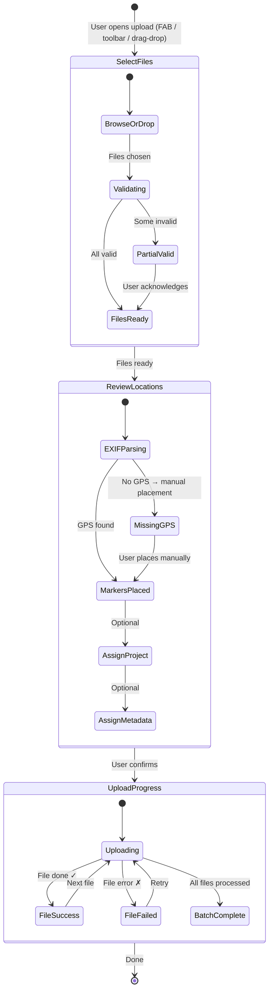

# Feldpost – Component: Upload Flow

## 5.5 Upload Flow

### Upload Pipeline State Machine



Upload entry: a FAB on mobile (3.5rem / 56px circle, upload icon), a button in the top toolbar on desktop, or via drag-and-drop onto the map pane.

Upload sheet / modal:

```
Step 1: SELECT FILES
  ┌──────────────────────────────────────┐
  │   Drag & drop photos here            │
  │   or [Browse files]                  │
  │   JPEG, PNG, WebP, HEIC · max 25 MB  │
  └──────────────────────────────────────┘
    Selected: 14 files (3 exceed 4096px and will be resized; px intentional — image resolution threshold, not UI size)

Step 2: REVIEW LOCATIONS
  [Map with pending markers]
  2 images missing GPS location — place manually or skip
  [Assign project to all: dropdown]
  [Add metadata to all: key / value]

Step 3: UPLOAD PROGRESS
  ████████████████░░░░░░░░ 8 / 14 uploading
  file_001.jpg ✓
  file_002.jpg ✓
  file_003.jpg ▲ Uploading 62%
  file_004.jpg ✗ Failed [Retry]
```

Each step is a distinct scrollable screen within the upload sheet. Progress persists if the user dismisses the sheet (collapses to a mini-progress bar in the toolbar).
