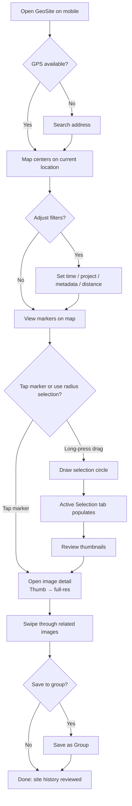
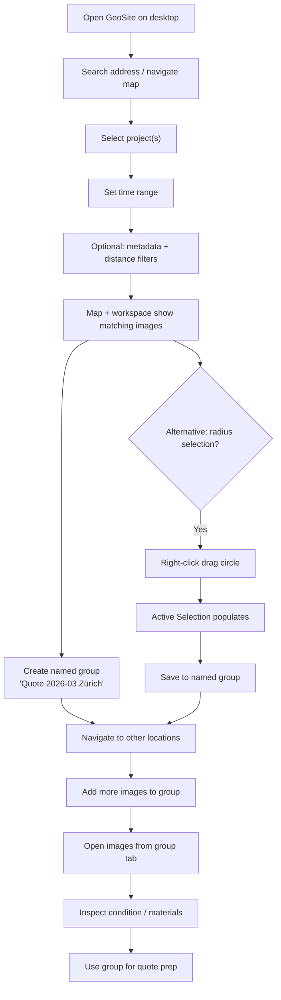
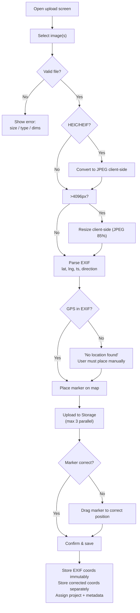
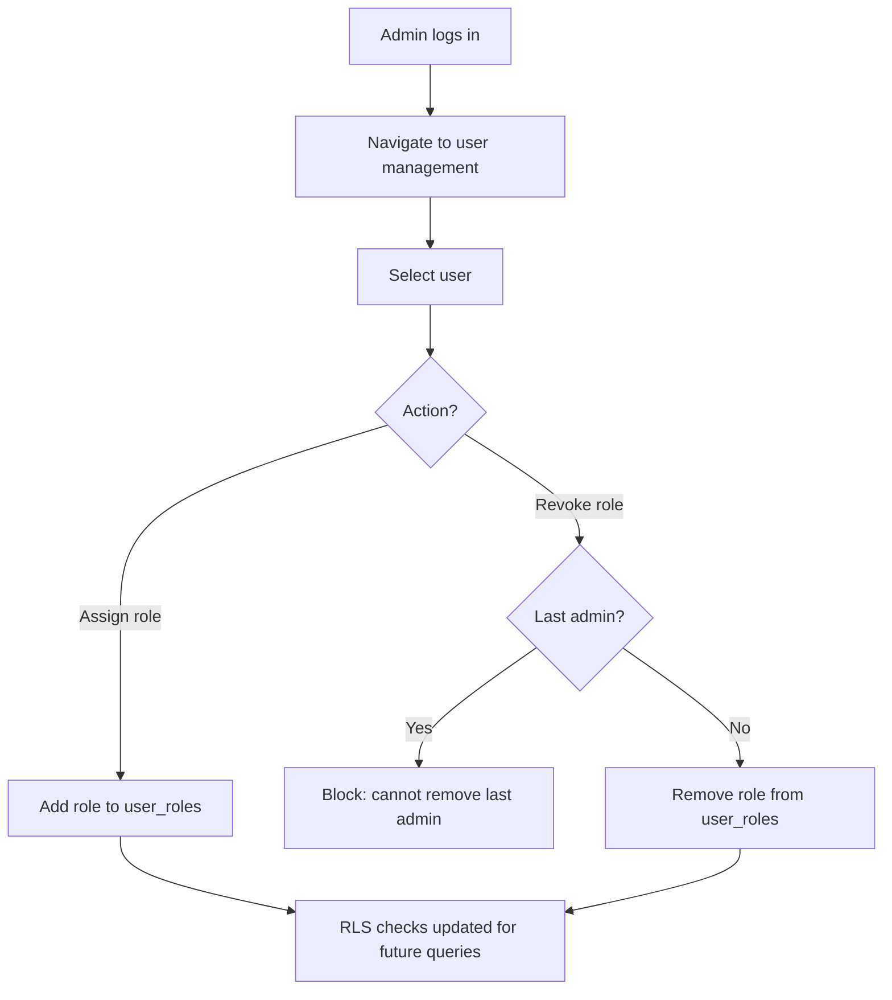
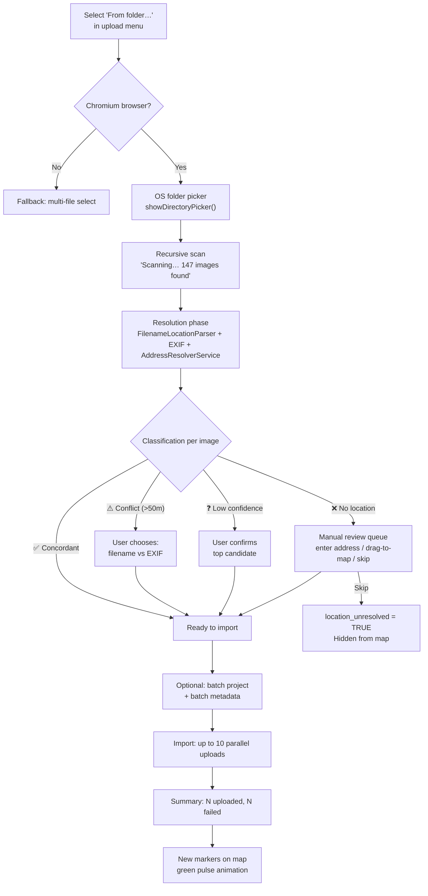

# Use Cases

**Who this is for:** engineers and product people implementing and validating flows.  
**What you’ll get:** concise narratives describing how technicians and clerks actually use GeoSite.

See `../project-description.md` for the high-level vision, `../features.md` for the full capability list, and `../search-experience-spec.md` for search-focused behavior and expanded search use cases.  
See **`../implementation-readiness.md`** §2 for per-use-case readiness scores and blocking gaps.

---

## Personas

These personas describe the primary human actors in GeoSite. Each use case references one or more of them. Personas provide realistic context for why actors behave as they do — they are not user stories.

---

### Persona: Technician

**Real-world context:** A field worker employed by a construction or maintenance company. Works on-site, often without reliable internet. Uses a smartphone in varying conditions — direct sunlight, wet gloves, awkward angles. Their primary question when arriving at a location is: _"What has been done here before?"_ They are not interested in folder navigation or system administration.

**Device:** Smartphone (iOS or Android). Occasionally a ruggedized tablet.  
**Connectivity:** Intermittent. May have weak LTE, a Wi-Fi hotspot, or nothing at all in basements or remote sites.  
**Technical literacy:** Moderate. Comfortable with mobile apps; not comfortable with SQL, admin UIs, or file systems.

**Primary goals:**

- Find historical photos of the site they are currently standing on, ordered by proximity and recency.
- Upload new photos from the field and confirm correct map placement.
- Correct GPS drift without losing the original EXIF reading.

**Frustrations:**

- Folder-navigation systems that require knowing the exact file path or project code.
- Apps that fail silently when GPS is off or imprecise.
- Upload flows that lose metadata, give no feedback, or require desktop follow-up.

**Primary use cases:** UC1, UC3.

---

### Persona: Clerk

**Real-world context:** An office-based employee responsible for preparing quotes, material estimates, and project reports. Works at a desktop browser with stable connectivity. Has read access to multiple projects and needs to cross-reference historical site imagery when pricing or planning new work. Does not normally upload images.

**Device:** Desktop or laptop, modern browser.  
**Connectivity:** Reliable office or home Wi-Fi.  
**Technical literacy:** Moderate. Fluent in web apps and spreadsheets; not a developer.

**Primary goals:**

- Search historical images by address, project, time range, and material/metadata values.
- Review image detail and site condition without navigating complex folder trees.
- Build enough visual context to produce a confident, documented quote.

**Frustrations:**

- Retrieval systems that require knowing exact folder paths or project codes from memory.
- Slow image loads when reviewing many sites in sequence.
- Losing context (filter state, viewport position) when switching between images.

**Primary use cases:** UC2.

---

### Persona: Admin

**Real-world context:** A lead engineer, IT contact, or team lead responsible for access management. Understands team structure and project boundaries but is not necessarily a database administrator. Manages who can access what, sets up new team members, and troubleshoots permission issues. May use both the GeoSite admin UI and the Supabase dashboard depending on the task.

**Device:** Desktop browser; may also use Supabase dashboard directly.  
**Connectivity:** Reliable.  
**Technical literacy:** High. Comfortable with admin UIs, role models, and — when necessary — SQL consoles.

**Primary goals:**

- Grant or revoke elevated roles for team members without direct DB intervention.
- Understand at a glance who has access to which projects and images.
- Ensure new team members are correctly provisioned and existing ones are cleanly offboarded.

**Frustrations:**

- Permission systems that require a developer for every role change.
- Role models that are undocumented or opaque to non-developers.
- No audit trail or history of access changes.

**Primary use cases:** UC4.

---

## MVP Boundary

- In scope for MVP: UC1, UC2, UC3, UC4.
- Out of scope for MVP: UC5 (post-MVP, experimental).
- Planned extension (not MVP gate): UC13 (Folder Import) — requires `FolderImportAdapter` and `AddressResolverService` (Features 41–44).

---

## UC1 – Technician on Site (View History)



**Goal**  
See relevant historical images for the exact spot the technician is currently standing on, without guessing folder names.

**Actors**

- Technician (role: `user`) — see [Persona: Technician](#persona-technician)

**Preconditions**

- Technician has a valid account and is logged in.
- Their mobile device can acquire a reasonable GPS fix.

**Main Flow**

1. Technician opens GeoSite on a mobile device.
2. App centers the map on the technician’s current location (from GPS) or on a searched address.
3. Technician optionally adjusts filters (time range, project, metadata, max distance) to narrow results.
4. GeoSite queries the backend for images within the selected distance of the reference point.
5. Map displays markers (and/or clusters) for all relevant images.
6. Technician taps a marker to open the image detail:
   - Thumbnail (then full-resolution on demand).
   - Timestamp.
   - Project.
   - Metadata (e.g., “Material: Beton”).
7. Technician swipes or clicks through related images in the Active Selection tab.

**Alternative Flow: Radius Selection**

3a. Instead of using distance filter presets, the technician long-presses on the map and drags outward to draw a selection circle.
4a. All images within the circle are fetched and displayed in the Active Selection tab (bottom sheet on mobile).
5a. Technician reviews thumbnails in the Active Selection tab, taps one to see full detail.
6a. Technician optionally saves interesting images to a named group ("Save as Group" button) for later reference.

**Postconditions**

- Technician has a clear visual history of the site from prior visits.

**Key Invariants**

- RLS ensures the technician only sees images they are allowed to see.
- Queries are bounding-box based; no attempt is made to fetch all images globally.

---

## UC2 – Clerk Preparing a Quote



**Goal**  
Use historical images to estimate work and materials for a new quote.

**Actors**

- Clerk (role: `user` or `viewer`) — see [Persona: Clerk](#persona-clerk)

**Preconditions**

- Clerk has a valid account and is logged in.
- Relevant projects and images already exist in the system.

**Main Flow**

1. Clerk opens GeoSite in a desktop browser.
2. Clerk searches for an address or navigates the map to the area of interest.
3. Clerk selects one or more **projects** relevant to the new quote.
4. Clerk narrows down the **time range** (e.g., last 2 years).
5. Clerk optionally filters by **metadata** (e.g., `Material = Beton`) and **max distance**.
6. Map and workspace pane show matching images:
   - Clustered on the map.
   - Thumbnails in the Active Selection tab of the workspace.
7. Clerk creates a named group for this quote ("Save as Group" → "Quote 2026-03 Zürich").
8. Clerk navigates to other map locations, makes additional selections, and adds relevant images to the group.
9. Clerk opens individual images from the group tab to inspect:
   - Condition of work.
   - Existing materials.
   - Complexity of site.
10. Clerk uses the group for reference when preparing the quote. (Export is a post-MVP feature.)

**Alternative Flow: Radius Selection for Area Review**

6a. Clerk right-click drags on the map to select a circular area around the job site.
7a. Active Selection populates with all images in the radius.
8a. Clerk reviews, then saves to a named group.

**Postconditions**

- Clerk has enough visual context to produce a confident, justified quote.
- Relevant images are organized in a named group for reference.

**Key Invariants**

- Filters are all applied server-side.
- Only thumbnails are initially loaded for overview; full images only on demand.
- Filter state and viewport are preserved when switching between workspace tabs and the map.

---

## UC3 – Upload and Correct a New Image



**Goal**  
Upload a new photo from the field and correct its position if EXIF coordinates are off.

**Actors**

- Technician (role: `user`) — see [Persona: Technician](#persona-technician)

**Preconditions**

- Technician has a valid account and is logged in.
- Technician has taken one or more photos on a device with a camera.

**Main Flow**

1. Technician opens the upload screen (from the main UI or, in future, via a context action on the map).
2. Technician selects one or more images from the device.
3. For each image:
   - GeoSite validates: file size ≤25MB, accepted type (JPEG, PNG, WebP, HEIC, HEIF), dimensions within bounds.
   - HEIC/HEIF files are converted to JPEG client-side.
   - Images >4096px are resized client-side (JPEG 85%).
   - EXIF metadata is parsed for coordinates, timestamp, and direction (if available).
   - File + thumbnail are uploaded to Supabase Storage (max 3 parallel uploads, individual progress indicators).
4. GeoSite places a marker for the image on the map using EXIF coordinates.
5. **If EXIF coordinates are missing:** The UI shows "No location found in this photo." The user must manually place a marker (the upload cannot be saved without coordinates).
6. Technician reviews the marker:
   - If correct, they confirm and save.
   - If slightly off, they drag the marker to the correct place.
7. On save:
   - The original EXIF coordinates are stored as immutable reference.
   - The corrected coordinates are stored in dedicated fields.
   - The image record is assigned to a project and optional metadata.

**Postconditions**

- New image exists in the system with accurate map placement and preserved EXIF.

**Key Invariants**

- EXIF coordinates are never overwritten; corrections are additive.
- Ownership and access to the image are enforced via RLS.

---

## UC4 – Admin Managing Roles



**Goal**  
Grant or revoke elevated access for certain users (e.g., to act as admins).

**Actors**

- Admin (role: `admin`) — see [Persona: Admin](#persona-admin)

**Preconditions**

- Admin user exists and is logged in.

**Main Flow**

1. Admin navigates to a user management view (or uses SQL/console in early phases).
2. Admin selects a user.
3. Admin assigns or revokes roles (e.g., toggling `admin`).
4. Changes are persisted in `user_roles`.

**Postconditions**

- Future queries and RLS checks use the updated role assignments.

**Key Invariants**

- Only admins can grant the `admin` role.
- RLS checks use `user_roles` and `roles` as described in `security-boundaries.md`.

---

## UC5 – Right-Click Marker Creation (Post‑MVP, Experimental)

**Goal**  
Quickly anchor a new upload or marker at an arbitrary point on the map, even if there is no existing address match or EXIF data.

**Actors**

- Technician or clerk (role: `user` / `viewer`), post‑MVP — see [Persona: Technician](#persona-technician) and [Persona: Clerk](#persona-clerk).

**Preconditions**

- User has a valid account and is logged in.
- Map is loaded and visible at the desired area.

**Main Flow**

1. User right-clicks on the map at the desired location.
2. A context menu appears offering actions such as “Upload here” / “Create marker here”.
3. User selects an action (e.g., “Upload here”).
4. GeoSite opens the upload UI with coordinates pre-populated from the clicked map position.
5. User selects one or more files to upload and completes the normal upload flow.
6. On save, the image record is created with those coordinates as its initial position (to be corrected later if needed).

**Postconditions**

- New images (or markers) are anchored to the right-clicked location even without EXIF data.

**Notes**

- This flow is **post‑MVP / experimental** and does not replace the standard EXIF-based upload flow; it complements it.

---

---

## UC6 – Technician Resuming Work After Connectivity Loss

**Goal**
Continue using the app productively after returning from an area with no network, and ensure images uploaded in degraded conditions are still correctly placed.

**Actors**

- Technician (role: `user`) — see [Persona: Technician](#persona-technician)

**Preconditions**

- Technician was earlier working with images on-site.
- The device lost mobile data in a basement, tunnel, or remote location.

**Main Flow**

1. Technician opens GeoSite after connectivity returns.
2. The app detects a restored network connection and resumes any interrupted uploads automatically.
3. For each previously interrupted upload, the app displays a per-file retry indicator.
4. Technician can trigger manual retry for individual failed uploads or use "Retry All".
5. Successfully resumed uploads are placed on the map with their EXIF coordinates.
6. Technician reviews the newly uploaded markers to confirm correct placement.
7. Any image lacking EXIF coordinates (e.g., taken in airplane mode without GPS) is flagged with a "Missing location" warning and must be manually placed before saving.

**Postconditions**

- All previously interrupted uploads are either successfully committed or clearly flagged for the technician to resolve.

**Key Invariants**

- Upload state (progress, retry count) is tracked client-side; the backend does not receive partial uploads.
- EXIF coordinates, once parsed, are stored as the immutable reference regardless of when the save completes.

---

## UC7 – Technician Batch-Uploading After a Full Site Visit

**Goal**
Upload a full day's photo set (20–80 images) in one go at the end of the workday, without needing to review each image individually.

**Actors**

- Technician (role: `user`) — see [Persona: Technician](#persona-technician)

**Preconditions**

- Technician has a valid account and is logged in.
- Device has a stable connection (end-of-day, back at the office or on Wi-Fi).

**Main Flow**

1. Technician opens the upload screen and selects all photos from the day (multi-file select).
2. GeoSite validates each file (size, type, dimensions) and shows a summary: `42 of 44 files valid – 2 exceeded 25 MB limit`.
3. EXIF data is extracted for all valid files in the background before upload begins.
4. GeoSite shows a pre-upload map view with all pending markers rendered at their EXIF locations. Images missing EXIF coordinates are listed separately and shown with a "No location" badge.
5. Technician assigns a **project** to all images at once (bulk project assignment dropdown before save).
6. Technician optionally assigns shared **metadata** values (e.g., `Material: Beton`) to all selected images in one action.
7. For images missing location, the technician either manually places them or dismisses them (they will be uploaded without coordinates and flagged for later correction).
8. Technician confirms and upload begins (max 3 parallel uploads). A consolidated progress bar shows overall batch progress alongside per-file indicators.
9. On completion, GeoSite shows: `44 uploaded, 0 failed` or a per-file error summary.

**Postconditions**

- All valid images are committed to the system with accurate placement and shared metadata.
- Technician does not need desktop follow-up for correctly geo-tagged images.

**Alternative Flow: Mid-Batch Failure**

8a. One or more uploads fail mid-batch (network drop).
8b. Remaining uploads continue (partial failure is not a full abort).
8c. Failed files are shown in a "Failed – Retry" list. Technician can retry individually or all at once.

**Key Invariants**

- Bulk project assignment does not overwrite previously saved images — it applies only to the current upload batch.
- Validation is client-side first; Supabase Storage enforces server-side limits.

---

## UC8 – Viewer Reviewing Site for a Project Meeting

**Goal**
A read-only team member (e.g., project owner, external auditor) reviews documented site conditions before a project review meeting, without the ability to modify anything.

**Actors**

- Viewer (role: `viewer`) — read-only variant of the Clerk persona

**Preconditions**

- Viewer has been granted `viewer` access by an admin.
- Relevant images are already in the system.

**Main Flow**

1. Viewer opens GeoSite in a desktop browser and logs in.
2. Viewer navigates to the address of interest.
3. Viewer uses time range and project filters to scope results to the relevant phase.
4. Viewer browses image markers on the map. Upload buttons and correction actions are hidden.
5. Viewer opens individual images for full-resolution review.
6. Viewer creates a named group ("Project review – Site A – March 2026") for the set of images relevant to the meeting.
7. Viewer opens the group tab and reviews images sequentially (arrow / swipe navigation).

**Postconditions**

- Viewer has a curated, referenceable set of images for the meeting.
- No data has been modified.

**Key Invariants**

- RLS prevents the viewer from uploading, editing, or deleting any images.
- Group creation is the only write operation permitted for `viewer` accounts.
- Upload and correction UI elements are not rendered for `viewer` role.

---

## UC9 – Clerk Building a Multi-Site Quote

**Goal**
Compare conditions across several geographically dispersed sites to produce a single consolidated quote covering multiple locations.

**Actors**

- Clerk (role: `user` or `viewer`) — see [Persona: Clerk](#persona-clerk)

**Preconditions**

- Clerk has a valid account and is logged in.
- Image history exists for all relevant locations.

**Main Flow**

1. Clerk opens GeoSite and navigates to the first site (address search).
2. Clerk draws a radius selection around the site and adds relevant images to a named group: "Quote 2026-03 Multi-Site".
3. Clerk navigates to the second and third sites, repeating the radius-select-and-add pattern for each.
4. After covering all locations, Clerk opens the group tab.
5. Clerk reviews all collected images in one scrollable gallery, sorted by site (proximity to each address) or by date.
6. Clerk identifies the work complexity per site from material metadata and image condition.
7. Clerk uses this visual evidence directly when composing the quote in an external tool (export is post-MVP).

**Postconditions**

- One named group contains representative images from all relevant sites, enabling side-by-side review in the workspace pane.

**Key Invariants**

- A single group may contain images from any number of geographic locations.
- Adding images from multiple map viewports to one group does not change the group's scope; it accumulates.

---

## UC10 – Technician Correcting a Misplaced Marker After Save

**Goal**
Fix an incorrectly placed image after it has already been saved, without destroying the original EXIF reference.

**Actors**

- Technician (role: `user`) — see [Persona: Technician](#persona-technician)

**Preconditions**

- An image has been saved with incorrect map placement (EXIF drift, wrong address, or manual error during upload).
- The technician has since visited the site and confirmed the correct location.

**Main Flow**

1. Technician searches for the address or navigates the map to find the incorrectly placed marker.
2. Technician opens the image detail view.
3. Detail view shows: current (corrected) coordinates, or the EXIF coordinates if never corrected.
4. Technician taps "Edit Location".
5. The map zooms to the marker's current position. The marker becomes draggable.
6. Technician drags the marker to the correct position. Distance from original is shown as a live label ("Moving 43 m from EXIF position").
7. Technician taps "Save correction".
8. Corrected coordinates are stored. `coordinate_corrections` table receives a new entry (user, timestamp, original, corrected).
9. A "Reset to EXIF" link is visible in the detail view.

**Alternative Flow: Undo Correction**

9a. Technician opens detail view and taps "Reset to EXIF".
9b. Corrected coordinates are cleared; the image reverts to EXIF-source position.
9c. A confirmation dialog is shown before the reset is applied.

**Postconditions**

- Image is now visible at the correct map location.
- Original EXIF coordinates are preserved and auditable.

**Key Invariants**

- `coordinate_corrections` records are append-only; old corrections are not deleted when a new one is saved.
- Marker correction is only available to the image owner or an `admin`.

---

## UC11 – Admin Offboarding a Departed Team Member

**Goal**
Cleanly remove access for a team member who has left the company, without losing their uploaded images.

**Actors**

- Admin (role: `admin`) — see [Persona: Admin](#persona-admin)

**Preconditions**

- Admin is logged in.
- The departing user has an active account and owns images in the system.

**Main Flow**

1. Admin opens the user management view.
2. Admin searches for the departing user by name or email.
3. Admin reviews the user's current roles.
4. Admin revokes all elevated roles (e.g., removes `admin` if applicable).
5. Admin deactivates or deletes the user account via the admin UI (or Supabase dashboard for early phases).
6. Images previously uploaded by the user remain in the system, now associated with `user_id` of the deleted account.

**Alternative Flow: Transfer Ownership**

6a. Admin optionally re-assigns the departed user's images to a different user or to a shared "archive" project before account deletion.
6b. Admin confirms the reassignment and then deletes the account.

**Postconditions**

- Departed user can no longer authenticate.
- All uploaded images remain intact and are still searchable by the remaining team.
- No lingering permissions exist for the removed account.

**Key Invariants**

- Only admins can delete accounts or reassign images.
- Deleting a user cascades to `profiles`, `user_roles`. Owned images are NOT deleted automatically — this is intentional, to preserve site history.
- RLS re-evaluation for the deleted user's `user_id` naturally prevents any further access.

---

## UC12 – Clerk Investigating a Disputed Job (Audit Trail)

**Goal**
Reconstruct the documented sequence of events at a site to resolve a contractual dispute or insurance claim by tracing what was photographed, when, and by whom.

**Actors**

- Clerk (role: `user`) — see [Persona: Clerk](#persona-clerk)
- Admin (may assist in role: `admin`)

**Preconditions**

- Images related to the disputed site exist in the system.
- Clerk or admin has appropriate access to the relevant project.

**Main Flow**

1. Clerk navigates to the disputed address on the map.
2. Clerk sets the time range filter to bracket the disputed period (e.g., "June 2025 – September 2025").
3. All images taken at the site during that period appear on the map and in the Active Selection tab.
4. Clerk opens each image in sequence, reviewing:
   - Capture timestamp (`captured_at` from EXIF; `created_at` as fallback).
   - Uploader identity (visible in detail view).
   - GPS coordinates (EXIF vs. corrected, with correction history).
   - Any attached metadata (e.g., "Work stage: Pre-treatment").
5. Clerk assembles a named group: "Dispute Documentation – Site X – Q3 2025".
6. Clerk passes the group reference and image list to the legal or management team.

**Postconditions**

- A timestamped, spatially accurate documentary record has been assembled.
- Original EXIF data and correction history are available as supporting evidence.

**Key Invariants**

- Images are immutable after save (no overwrite of content).
- Coordinate correction history is preserved (`coordinate_corrections` table).
- Metadata values are timestamped at creation.

---

## UC13 – Bulk Import from a Local Folder



**Goal**  
Import an entire folder of field photos in one operation, resolving their locations automatically from folder names and filenames, with a structured review step for any images that cannot be resolved automatically.

**Actors**

- Technician (role: `user`) — see [Persona: Technician](#persona-technician)
- Admin (role: `admin`) — for organization-wide archive migrations

**Preconditions**

- User has a valid account and is logged in.
- User is running Chrome or Edge (File System Access API required; see `folder-import.md` §2).
- A folder of images exists on the local device, ideally organized with street addresses or location names in folder names (e.g., `Burgstraße_7/`, `Hauptstraße_12/`).

**Main Flow**

1. User opens the upload menu and selects "From folder…".
2. The OS folder picker opens. User selects the root folder.
3. GeoSite scans the folder recursively. A live counter shows: _"Scanning… 147 images found."_
4. The **resolution phase** runs client-side:
   - For each image, `FilenameLocationParser` extracts any address hint from the folder path and filename.
   - EXIF GPS data is read from each file.
   - `AddressResolverService` resolves each address hint against the organization's database and the external geocoder.
   - Each image is classified: ✅ Ready / ⚠️ Conflict / ❓ Needs confirmation / ❌ Unresolved.
5. An **import summary** is displayed:
   ```
   ✅  Ready to import:    108 images
   ⚠️  Conflicts:           12 images   [Review →]
   ❓  Needs confirmation:  18 images   [Review →]
   ❌  Unresolved:           9 images   [Review →]
   ```
6. User reviews each non-ready group:
   - **Conflicts:** Two candidates shown side-by-side (filename vs. EXIF). User chooses one, enters an address, or skips.
   - **Needs confirmation:** Top-ranked `AddressResolverService` candidate shown with map preview. User confirms, selects an alternative from the DB-first dropdown, or corrects manually.
   - **Unresolved:** User enters an address, drags to map, assigns a batch location, or skips (image stored without coordinates, flagged `location_unresolved = TRUE`).
7. User optionally applies **batch assignment** (shared project, shared metadata key/value) to all images or a selected subset.
8. User confirms the import. The batch upload begins (up to 10 parallel uploads).
9. A consolidated progress bar and per-file status are shown.
10. On completion: `108 uploaded, 0 failed`. Newly imported markers appear on the map with a green pulse animation.

**Alternative Flow: Browser Unsupported**

1a. User is on Firefox or Safari. The "From folder…" button is replaced by:  
 _"Folder import requires Chrome or Edge. Select multiple files instead."_  
1b. User uses the standard multi-file picker to select files manually.

**Alternative Flow: All Images Already Geo-Tagged**

4a. All 147 images have EXIF GPS and no conflicts.  
5a. Summary shows `✅ Ready: 147`. User confirms directly without any review steps.

**Postconditions**

- All confirmed images are committed to the database with accurate coordinates and thumbnails.
- Images with `location_unresolved = TRUE` are stored but hidden from the map until resolved.
- A named group is optionally created from the batch (if the user chose "Save as Group" before confirming).

**Key Invariants**

- `FolderImportAdapter` implements `ImageInputAdapter`; the core ingestion pipeline is unchanged.
- Filename-derived locations always go through `AddressResolverService`; raw text is never written to the database as coordinates.
- EXIF coordinates are stored as immutable reference data, identical to single-file upload (see `decisions.md` D4).
- Conflicts are never resolved automatically; the user always decides.
- All images, including skipped ones, are subject to RLS.

---

## Notes

- Additional use cases (e.g., exporting data, advanced filtering) can be added here as the product evolves.
- Any new use case should link back to relevant features and, if needed, trigger new decisions in `decisions.md`.
- UC6–UC12 are not gated on MVP. UC6, UC7, UC10, UC11 are natural MVP extensions. UC8, UC9, UC12 are MVP-compatible but depend on group functionality (Feature 24–26) being complete.
- UC13 (Folder Import) depends on `FolderImportAdapter` (Feature 41–43) and `AddressResolverService` (Feature 44). It requires a Chromium-based browser.

---

# Per-Element Interaction Scenarios

**What this folder is:** Interaction-level use cases organized per element spec. Each file maps concrete user flows (click → what happens → what state changes) to the element spec's Actions table and the product-level use cases in the product use cases above.

**Why it exists:** The existing doc layers are:

| Layer                     | Scope                                          | Location                            |
| ------------------------- | ---------------------------------------------- | ----------------------------------- |
| Product use cases         | End-to-end user stories                        | `docs/use-cases/README.md`          |
| Element specs             | Component contract (Actions, State, Hierarchy) | `docs/element-specs/`               |
| Implementation blueprints | Code-level details (service sigs, queries)     | `docs/implementation-blueprints/`   |
| **Interaction scenarios** | **Click-by-click flows per element**           | **`docs/use-cases/` (this folder)** |

Interaction scenarios bridge the gap: they are specific enough to drive implementation and test cases, but written in terms of user intent rather than code.

**Do we need more layers?** No. These four layers cover the full stack from "what the user wants" to "what the code does":

```
Product Use Cases (UC1–UC13)      ← Why the user is here
    ↓
Interaction Scenarios (this)      ← What they click, in what order, what happens
    ↓
Element Specs                     ← Component contracts (Actions, State, Hierarchy)
    ↓
Implementation Blueprints         ← Service signatures, queries, type defs
```

## File naming

`{element-spec-name}.md` — matches the filename in `docs/element-specs/`.

## Cross-linking rules

Each interaction scenario file must link to:

- The element spec it covers
- The implementation blueprint (if one exists)
- The product use cases it satisfies
- Related element specs that participate in the flow

## Index

| File                         | Element Spec                               | Blueprint                                              | Status |
| ---------------------------- | ------------------------------------------ | ------------------------------------------------------ | ------ |
| [map-shell.md](map-shell.md) | [map-shell](../element-specs/map-shell.md) | [map-shell](../implementation-blueprints/map-shell.md) | Active |

## Files needed (priority order)

Interaction scenario files should be created for these specs as they are implemented. Ordered by delivery wave from `element-spec-priority-ranking.md`.

- [ ] photo-marker.md — Wave 1
- [ ] image-detail-view.md — Wave 1
- [ ] filter-panel.md — Wave 1
- [ ] workspace-pane.md — Wave 2
- [ ] radius-selection.md — Wave 2
- [ ] search-bar.md — Wave 3
- [ ] upload-panel.md — Wave 3
