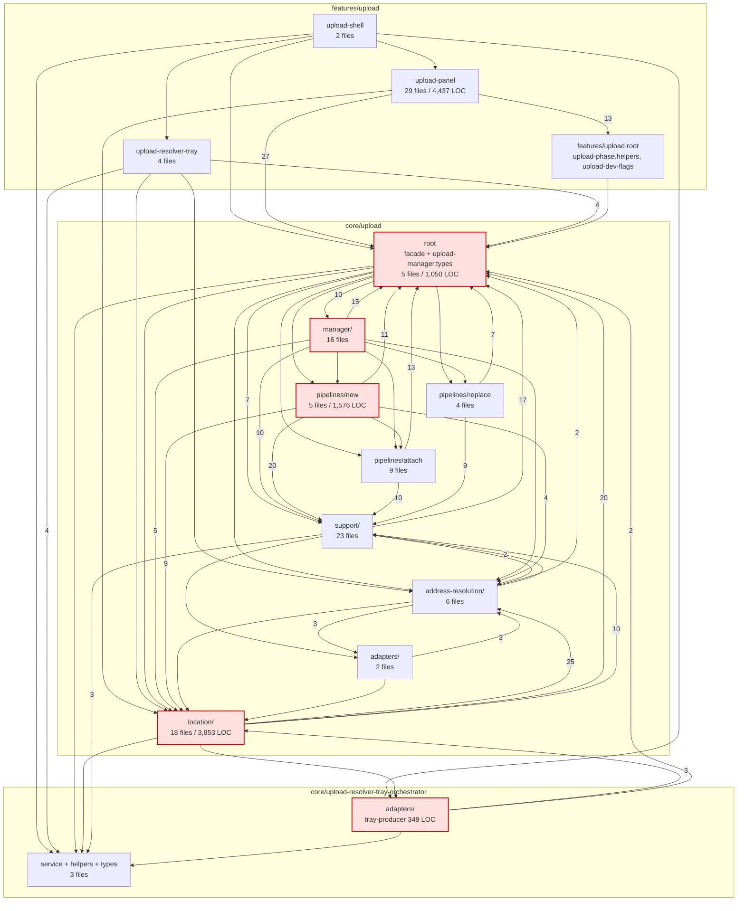

# 01 — Static structure map (Phase 1)

**Commit:** `8e4b1e09` · **Measured:** 2026-09-08 · **Scope:** `apps/web/src/app/core/upload/**`, `apps/web/src/app/core/upload-resolver-tray-orchestrator/**`, `apps/web/src/app/features/upload/**`

Method: an import edge list was generated from the TypeScript source with a throwaway script kept in the scratchpad (plan § 1.1 / § 10 — not committed to `scripts/`). Two graphs were built: an **all-import** graph (172 files incl. tests, 605 internal edges) and a **value-import** graph over the 129 non-test files, which drops `import type` / `export type` statements because those are erased at build time and cannot form a runtime cycle. Cycle claims below use the **value-import** graph; it is the conservative one.

Shorthand used in tables: `core/…` = `apps/web/src/app/core/…`, `features/…` = `apps/web/src/app/features/…`. Every finding row writes at least one path in full.

---

## 1. Layer classification

Every non-test file is assigned to exactly one layer. Totals: **129 files / 19,049 LOC**.

| Layer | Location | Files | LOC | Spec-facing contract |
| --- | --- | --- | --- | --- |
| Facade + module types | `apps/web/src/app/core/upload/*.ts` | 5 | 1,050 | `docs/specs/service/media-upload-service/upload-manager.md` |
| Manager helper | `apps/web/src/app/core/upload/manager/` | 16 | 1,401 | same |
| Pipeline — new | `apps/web/src/app/core/upload/pipelines/new/` | 5 | 1,576 | `…/upload-manager-pipeline.md` |
| Pipeline — attach | `apps/web/src/app/core/upload/pipelines/attach/` | 9 | 761 | `…/upload-manager-pipeline.md` |
| Pipeline — replace | `apps/web/src/app/core/upload/pipelines/replace/` | 4 | 351 | `…/upload-manager-pipeline.md` |
| Support | `apps/web/src/app/core/upload/support/` | 23 | 2,028 | scattered / none |
| Location | `apps/web/src/app/core/upload/location/` | 18 | 3,853 | `…/upload-location-config.md`, `…/upload-location-resolution.md`, `…/upload-manager-pipeline.location-routing.supplement.md` |
| Address resolution | `apps/web/src/app/core/upload/address-resolution/` | 6 | 1,107 | `…/address-resolution-model.md` + 5 siblings |
| Adapter (upload) | `apps/web/src/app/core/upload/adapters/` | 2 | 127 | `…/adapters/upload-project-gps-reference.adapter.md` |
| Tray orchestrator | `apps/web/src/app/core/upload-resolver-tray-orchestrator/` | 3 | 743 | `…/upload-resolver-tray-orchestrator.md` |
| Tray orchestrator adapter | `…/upload-resolver-tray-orchestrator/adapters/` | 1 | 349 | none |
| UI — shared | `apps/web/src/app/features/upload/*.ts` | 2 | 119 | `docs/specs/ui/upload/upload-panel-system.md` |
| UI — panel | `apps/web/src/app/features/upload/upload-panel/` | 29 | 4,437 | `docs/specs/component/upload/upload-panel.md` + 5 slices |
| UI — tray | `apps/web/src/app/features/upload/upload-resolver-tray/` | 4 | 948 | `docs/specs/component/upload/upload-resolver-tray.md` + 2 slices |
| UI — shell | `apps/web/src/app/features/upload/upload-shell/` | 2 | 199 | `docs/specs/component/upload/upload-shell.md` |

Only 4 files carry `@Component`: `upload-panel.component.ts`, `upload-panel-item.component.ts`, `upload-resolver-tray.component.ts`, `upload-shell.component.ts`. **38 files** declare `providedIn: 'root'` — i.e. the subsystem contributes 38 application-lifetime singletons.

### Drift against the plan's § 2.2 inventory

| Plan § 2.2 claim | Reality | Verdict |
| --- | --- | --- |
| `core/upload/location/` — 23 non-test | **18** | plan overstates |
| `core/upload/support/` — 24 non-test | **23** | plan overstates by 1 |
| `features/upload/upload-panel/` — ~30 non-test | **29** | ≈ correct |
| `core/upload/manager/` — 16 files | **16** | correct |
| `core/upload/pipelines/{new,replace,attach}` — 5 / 4 / 9 | **5 / 4 / 9** | correct |
| `core/upload/address-resolution/` — 6 non-test | **6** | correct |
| **`features/upload/upload-button-zone`** listed as a code location | **does not exist** — `find . -iname "*button-zone*"` in `apps/web/src` returns nothing, while `docs/specs/component/upload/upload-button-zone.md` (128 lines) exists and passes `lint:specs` | **plan and spec both point at code that is not in the tree** → carried to Phase 5 as a drift row |
| `upload-manager.service.ts` — 443 LOC | **443** | correct |

---

## 2. Entry points

| # | Entry point | Site | Reached from |
| --- | --- | --- | --- |
| E1 | `UploadShellComponent` | `apps/web/src/app/features/upload/upload-shell/upload-shell.component.ts` | `apps/web/src/app/layout/authenticated-app-layout.component.ts:35` — the only wiring of the subsystem into the app shell |
| E2 | `UploadNotificationService` | `apps/web/src/app/core/upload/support/upload-notification.service.ts` | `apps/web/src/app/app.component.ts:15` — a second, independent root-level entry |
| E3 | `UploadManagerService` public API | `apps/web/src/app/core/upload/upload-manager.service.ts` | 28 in-scope importers; the subsystem's service-side front door |

Everything else in scope is reached transitively from E1–E3, or is dead (§ 5).

---

## 3. Cycles

### 3.1 The 11-file runtime cycle (value imports only)

Tarjan over the value-import graph yields exactly **one** strongly connected component of size > 1, with **11 members**:

```
core/upload/upload-manager.service.ts
core/upload/manager/upload-manager-pipeline-host.service.ts
core/upload/pipelines/new/upload-new-pipeline.service.ts
core/upload/location/upload-location-resolution.service.ts
core/upload/location/upload-location-candidate-apply.service.ts
core/upload/location/upload-location-disambiguation-registration.service.ts
core/upload/location/upload-location-placement.service.ts
core/upload/location/upload-location-pre-resolve-orchestrator.service.ts
core/upload/location/upload-location-source-conflict.service.ts
core/upload/location/upload-location-tray-flow.service.ts
core/upload-resolver-tray-orchestrator/adapters/upload-location-tray-producer.adapter.ts
```

This SCC crosses **four** nominal layers (facade, manager helper, pipeline, location) plus the tray-orchestrator adapter. Within it, `apps/web/src/app/core/upload/location/upload-location-resolution.service.ts` is the hub: it participates in **all six** 2-cycles found in the graph.

Including type-only imports the SCC grows to 14 (adding `manager/upload-manager-facade-deps.util.ts`, `manager/upload-manager-select-address.util.ts`, `pipelines/new/upload-new-pre-resolve.util.ts`); two smaller SCCs appear in the UI layer (§ 3.3).

### 3.2 How the cycle is worked around — six lazy injector look-ups

`UploadLocationResolutionService` eagerly imports and injects six siblings (`apps/web/src/app/core/upload/location/upload-location-resolution.service.ts:11-18`). Each of those six imports it back and breaks the DI cycle by resolving it lazily through the injector rather than by field injection:

| Back-edge file | Lazy accessor |
| --- | --- |
| `apps/web/src/app/core/upload/location/upload-location-source-conflict.service.ts` | `:48-49` `private resolution() { return this.injector.get(UploadLocationResolutionService); }` |
| `apps/web/src/app/core/upload/location/upload-location-placement.service.ts` | `:50-51` (same shape) |
| `apps/web/src/app/core/upload/location/upload-location-tray-flow.service.ts` | `:59-60` |
| `apps/web/src/app/core/upload/location/upload-location-candidate-apply.service.ts` | `:31-32` |
| `apps/web/src/app/core/upload/location/upload-location-pre-resolve-orchestrator.service.ts` | `:37-38` |
| `apps/web/src/app/core/upload/location/upload-location-disambiguation-registration.service.ts` | `:27-28` |

Six identical work-arounds around one hub is the structural signature of a god-service, and it is the direct answer to plan § 3 question 4 (ownership boundary): inside `core/upload/location/` **there is no boundary** — the seven services form one mutually recursive unit that happens to be spread over seven files.

The traffic on those back-edges is not incidental. `registerDisambiguationGroup(...)` is invoked from **five different services at eight call sites**:

`upload-location-source-conflict.service.ts:233,306` · `upload-location-placement.service.ts:129` · `upload-location-tray-flow.service.ts:123,138,197,215` · `upload-location-candidate-apply.service.ts:130` · `upload-location-pre-resolve-orchestrator.service.ts:205,224`

so a single piece of state (an open disambiguation group) has five writers. Carried to Phase 4 as a multi-owner transition and to Phase 6 as a duplication candidate.

### 3.3 UI-layer cycles (all-import graph)

| Cycle | Evidence |
| --- | --- |
| `features/upload/upload-panel/upload-panel-item.component.ts` ⇄ `features/upload/upload-panel/upload-panel-item-helpers.ts` | 2-node SCC |
| `features/upload/upload-panel/upload-panel.component.ts` ⇄ `features/upload/upload-panel/upload-panel-lifecycle.service.ts` ⇄ `features/upload/upload-panel/upload-panel-setup.service.ts` | 3-node SCC |

Both disappear from the value-import graph, i.e. they are **type-only** cycles: real coupling for a reader, no runtime hazard. Low severity.

### 3.4 Folder-level cycles

Eleven folder pairs are mutually dependent. Most are explained by `core/upload (root)` holding both the facade **and** `upload-manager.types.ts` (fan-in 60), so "child imports root" is usually just a type import. The two that survive as genuine bidirectional *value* coupling are:

- `core/upload/location` ⇄ `core/upload-resolver-tray-orchestrator/adapters` (3 edges out, 1 back) — the tray producer adapter reaches into location services and location reaches back into the adapter.
- `core/upload (root)` ⇄ `core/upload/manager` — the facade/helper split is bidirectional by construction.

---

## 4. Fan-in / fan-out

| Rank | Highest fan-in (in-scope importers) | | Highest fan-out (in-scope imports) | |
| --- | --- | --- | --- | --- |
| 1 | `core/upload/upload-manager.types.ts` | 60 | `features/upload/upload-panel/upload-panel.component.ts` | 25 |
| 2 | `core/upload/upload-manager.service.ts` | 28 | `core/upload/upload-manager.service.ts` | 23 |
| 3 | `core/upload/upload.service.ts` | 25 | `core/upload/pipelines/new/upload-new-pipeline.service.ts` | 16 |
| 4 | `core/upload/support/upload-job-state.service.ts` | 22 | `core/upload/location/upload-location-resolution.service.ts` | 13 |
| 5 | `core/upload/location/upload-location-resolution.helpers.ts` | 16 | `core/upload/manager/upload-manager-pipeline-host.service.ts` | 13 |
| 6 | `core/upload/location/upload-location-resolution.service.ts` | 15 | `core/upload/pipelines/new/upload-new-pre-resolve.util.ts` | 13 |
| 7 | `features/upload/upload-phase.helpers.ts` | 14 | `core/upload/pipelines/new/upload-new-run-upload-phase.util.ts` | 12 |
| 8 | `core/upload/address-resolution/upload-address-resolution.debug.ts` | 13 | `core/upload/manager/upload-manager-facade-deps.util.ts` | 11 |

Reading: `upload-manager.types.ts` is the module's true centre of gravity — 60 of 129 files depend on it. A change to the `UploadPhase` union or `UploadJob` shape touches 47 % of the subsystem, which is the mechanical reason the phase count is hard to reduce.

`upload-address-resolution.debug.ts` at fan-in 13 is worth flagging: a *debug* helper is the 8th most depended-upon file in the subsystem. Followed up in Phase 6.

---

## 5. Orphans and test-only files

Eight non-test files have no importer among the 129. Verified against the whole of `apps/web/src` (`grep -rn` for each basename), not only against the audit scope:

| File | Importer outside scope | Verdict |
| --- | --- | --- |
| `apps/web/src/app/features/upload/upload-shell/upload-shell.component.ts` | `apps/web/src/app/layout/authenticated-app-layout.component.ts:35` | **live** — subsystem entry point E1 |
| `apps/web/src/app/core/upload/support/upload-notification.service.ts` | `apps/web/src/app/app.component.ts:15` | **live** — entry point E2 |
| `apps/web/src/app/core/upload/support/upload-batch-project-tray.helpers.ts` | none; imported only by its own `.spec.ts` | **test-only** |
| `apps/web/src/app/core/upload/pipelines/attach/upload-attach-hash.util.ts` | none | **dead** |
| `apps/web/src/app/core/upload/support/upload-timeout.util.ts` | none | **dead** — note that plan § 4 Phase 7 assumes this file implements live timeout handling; it does not run |
| `apps/web/src/app/core/upload/upload.helpers.ts` | none | **dead** — and it is the file root `AGENTS.md` § Code Conventions requires as part of the `core/upload` module's symmetry set, so the module satisfies the rule with an unused file |
| `apps/web/src/app/features/upload/upload-panel/upload-panel-dialog-handlers.service.ts` | none | **dead — 316 LOC**, and it injects `SupabaseService` (`:53`) and issues writes (`:234`) |
| `apps/web/src/app/features/upload/upload-resolver-tray/upload-resolver-tray.mock.ts` | none — the tray component imports only `upload-resolver-tray.mock-orchestrator` (`upload-resolver-tray.component.ts:53`) | **dead — 109 LOC**, despite its own header claiming it is gated by `upload-dev-flags.ts` `mockResolverTray` (`upload-resolver-tray.mock.ts:1-3`) |

**Dead total: 5 files, ≈ 500 LOC**, plus 1 test-only file. Exact per-file LOC and the `@deprecated`/`TODO` sweep are Phase 6's job; this is the reachability half of the answer to plan § 3 question 11.

---

## 6. Content ↔ folder mismatches

Plan § 4 Phase 1.3 asks for files whose content does not match their folder.

### 6.1 Database access is not in `adapters/`

Root `AGENTS.md` § Code Conventions requires "Keep facade slim and delegate heavy logic to local `adapters/`". The upload module has an `adapters/` folder with **2 files / 127 LOC**, while `SupabaseService` is injected or threaded through in **17 files across 7 folders**:

| Folder | Files reaching the database |
| --- | --- |
| facade | `core/upload/upload-manager.service.ts:132` |
| manager helper | `core/upload/manager/upload-manager-pipeline-host.service.ts:32`, `core/upload/manager/upload-manager-missing-data.service.ts:21`, `core/upload/manager/upload-manager-dedup.util.ts`, `core/upload/manager/upload-manager-facade-deps.util.ts` |
| pipeline | `core/upload/pipelines/new/upload-new-pipeline.service.ts:79`, `core/upload/pipelines/new/upload-new-run-upload-phase.util.ts:36,194,257`, `core/upload/pipelines/attach/upload-attach-pipeline.service.ts:53`, `core/upload/pipelines/attach/upload-attach-record-update-runner.util.ts:15`, `core/upload/pipelines/replace/upload-replace-pipeline.service.ts:34` |
| support | `core/upload/support/upload-storage.service.ts:27`, `core/upload/support/upload-conflict.service.ts:29`, `core/upload/support/upload-enrichment.service.ts:35`, `core/upload/support/upload-file-persist.util.ts` |
| address resolution | `core/upload/address-resolution/upload-address-resolve.util.ts:9,56` |
| adapters (correct) | `core/upload/adapters/upload-location-lookup.adapter.ts`, `core/upload/adapters/upload-project-locations.adapter.ts:27` |
| **UI feature** | `features/upload/upload-panel/upload-panel-job-file-actions.service.ts:33,123,269`, `features/upload/upload-panel/upload-panel-dialog-actions.service.ts:64,360`, `features/upload/upload-panel/upload-panel-dialog-handlers.service.ts:53,234` (dead) |

The sharpest instance is a raw table read issued from the **UI feature layer**:

```ts
// apps/web/src/app/features/upload/upload-panel/upload-panel-job-file-actions.service.ts:269-274
const { data, error } = await this.supabase.client
  .from('media_items')
  .select('id')
  .eq('storage_path', job.storagePath)
  .limit(1)
  .maybeSingle();
```

Precision matters here: `AGENTS.md` § Universal Invariants forbids calling **Supabase directly** and mandates going through `SupabaseService` — which this code does. So this is **not** a literal adapter-pattern violation. It *is* a violation of the module-symmetry intent (`features/` querying `media_items` without passing through `core/`), and it means the media-item lookup contract has an owner outside the service module. Severity `medium`, Phase 6 carries it.

### 6.2 Browser/DOM concerns inside `core/`

Three `core/` files touch `document`/`window`/DOM types:

- `apps/web/src/app/core/upload/support/upload.service.util.ts` — HEIC conversion via `heic2any`; unavoidable browser work, correctly placed in a util. **OK.**
- `apps/web/src/app/core/upload/support/upload-file-types.ts` — file/MIME classification. **OK.**
- `apps/web/src/app/core/upload/upload-manager.service.ts` — the facade itself reaches for browser globals. Flagged for Phase 7 (`beforeunload` / lifecycle ownership), not judged here.

No `@Component` exists under `core/`, so there is no UI-in-core violation of the hard kind.

### 6.3 Type-file fragmentation

Root `AGENTS.md` § Code Conventions: "Keep one central `types.ts` per module; do not split into nested sub-service type files." The subsystem has **six**:

`core/upload/upload-manager.types.ts` (396 LOC) · `core/upload/upload.types.ts` · `core/upload/address-resolution/upload-address-resolution.types.ts` · `core/upload/address-resolution/upload-area-evidence.types.ts` · `core/upload-resolver-tray-orchestrator/upload-resolver-tray-orchestrator.types.ts` · `features/upload/upload-panel/upload-panel.types.ts`

Two of these (`upload-manager.types.ts`, `upload.types.ts`) sit in the same module folder and both are nested-into by the address-resolution pair. `upload-panel.types.ts` is a feature-local type file and is outside the service-module rule. **Net: a 4-way split inside one service module where the rule allows one.** Severity `medium`.

### 6.4 README coverage

Three READMEs exist for fifteen folders: `core/upload/README.md`, `core/upload-resolver-tray-orchestrator/README.md`, `features/upload/README.md`. The service-module rule requires one per module, which is satisfied for the two `core/` modules. `core/upload/pipelines/`, `…/location/`, `…/support/`, `…/manager/`, `…/address-resolution/` are sub-folders, not modules, so no README is owed — but with 3,853 LOC in `location/` alone and no local README, the ownership boundary that plan § 3 question 4 asks about **is not written down anywhere**. Recorded as an answer to that question: **no, the boundary is not stated.**

---

## 7. Folder-level dependency graph

Edge labels are the number of distinct import edges between non-test files. `core/upload (root)` is split conceptually into facade and `*.types.ts`, but they live in the same folder, so type traffic dominates its in-edges.



Red-tinted nodes contain at least one member of the 11-file runtime SCC of § 3.1.

---

## 8. Answers this phase can already give

| Plan § 3 question | Answer at Phase 1 |
| --- | --- |
| **Q4 — is the ownership boundary between `manager/`, `pipelines/`, `support/`, `location/` and the panel stated anywhere, and does the code follow it?** | **Not stated** (§ 6.4) and **not followed** — an 11-file runtime cycle crosses four of those layers (§ 3.1), database access appears in six of them plus the UI (§ 6.1), and one state-mutating method has five callers across the location layer (§ 3.2). |
| **Q11 — which upload code is unreachable or test-only?** (reachability half) | 5 dead files ≈ 500 LOC, 1 test-only file (§ 5). Semantic duplication and dev-flag reachability remain for Phase 6. |

## 9. Not verified in this phase

| Claim not made | Check that would be needed |
| --- | --- |
| That the 11-file SCC actually causes a runtime failure (partial-initialisation, TDZ) | Would need the app to boot against a live backend — Phase 10, which cannot run (`00-baseline.md` § 9). The lazy `injector.get` accessors of § 3.2 are consistent with the cycle having *already* caused one. |
| That the 5 dead files are unreachable via dynamic `import()` or template-only references | Sweep was `grep -rn <basename>` over `apps/web/src/**/*.ts` and `*.html`; a string-built dynamic specifier would evade it. No dynamic `import()` of an in-scope path was found, but the absence is `unverified` for string-concatenated specifiers. |
| Per-file exported-symbol usage (dead *exports* inside live files) | Requires a TS-API reference count, not an import graph. Deferred to Phase 6. |
