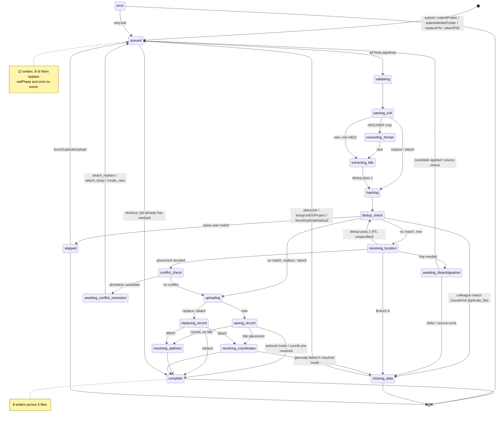

# 04 — State machine audit (Phase 4)

**Commit:** `8e4b1e09` · **Method:** every phase-write site was extracted by grep and read in context. Source→target edges are derived from program order within each pipeline function, not from execution. Path shorthand as in earlier phases.

---

## 1. How a phase can be written — three mechanisms, two of them unguarded

| # | Mechanism | Sites | Emits `jobPhaseChanged$`? | Terminal-state guard? |
| --- | --- | --- | --- | --- |
| A | `UploadJobStateService.setPhase(jobId, phase)` — `apps/web/src/app/core/upload/support/upload-job-state.service.ts:156-171` | **48** | **yes** (`:164-170`) | **yes** — `if (TERMINAL_PHASES.has(job.phase)) return;` (`:159`) |
| B | `UploadJobStateService.failJob(jobId, failedAt, error)` — `…/upload-job-state.service.ts:173-187` | 1 definition, reached from 16 `ctx.failJob` call sites via `core/upload/manager/upload-manager-fail.util.ts:12-26` | no `jobPhaseChanged$`; emits `uploadFailed$` instead (`:181-186`) | **no** |
| C | Direct `updateJob(jobId, { phase: … })` | **12** | **no event at all** | **no** |

The three mechanisms are not interchangeable, and nothing in the code or the specs says which to use when. This is the mechanical root of most findings below.

### Mechanism C sites (the ones that bypass everything)

| Site | Phase written | Trigger |
| --- | --- | --- |
| `apps/web/src/app/core/upload/manager/upload-manager-actions.util.ts:56` | `queued` | retry a failed job |
| `…/upload-manager-actions.util.ts:91` | `error` | cancel a job |
| `…/upload-manager-actions.util.ts:123` | `queued` | place a `missing_data` job |
| `…/upload-manager-actions.util.ts:140` | `queued` | assign a `missing_data` job to a project |
| `…/upload-manager-actions.util.ts:172` | `queued` | replace-mode job creation |
| `…/upload-manager-actions.util.ts:217` | `queued` | attach-mode job creation |
| `…/upload-manager-actions.util.ts:264` | `queued` | resolve a photoless conflict |
| `…/upload-manager-actions.util.ts:292` | `queued` | force duplicate upload |
| `apps/web/src/app/core/upload/manager/upload-manager-pipeline-host.service.ts:154` | `error` | cancel-all on sign-out |
| `apps/web/src/app/core/upload/manager/upload-manager-missing-data.service.ts:44` | `error` | persisted `missing_data` location resolve failed |
| `…/upload-manager-missing-data.service.ts:53` | `complete` | persisted `missing_data` location resolved |
| `…/upload-manager-missing-data.service.ts:75` / `:84` | `error` / `complete` | persisted `missing_data` project assignment |

Two of these (`…/upload-manager-submit.util.ts:276` writing `phase: 'queued' as UploadPhase` at job creation, and the two job-creation sites above) are legitimate — there is no prior state to transition from. The other **nine are genuine transitions on a live job** performed without an event and without a guard.

---

## 2. Reachability verdict for all 20 `UploadPhase` members

Plan § 8 requires each of the 20 to be named reachable or dead. **Result: all 20 are reachable.** No member of `UploadPhase` (`apps/web/src/app/core/upload/upload-manager.types.ts:14-34`) is dead.

| # | Phase | Writers | Modes | Verdict |
| --- | --- | --- | --- | --- |
| 1 | `queued` | `core/upload/manager/upload-manager-submit.util.ts:276`; `…/upload-manager-actions.util.ts:56,123,140,172,217,264,292`; `core/upload/location/upload-location-source-conflict.service.ts:105`; `core/upload/location/upload-location-candidate-apply.service.ts:98,193,199` | all | **reachable** — 12 writers, the most of any phase |
| 2 | `validating` | `core/upload/pipelines/new/upload-new-prepare-route.util.ts:120`; `core/upload/pipelines/attach/upload-attach-pipeline.service.ts:136`; `core/upload/pipelines/replace/upload-replace-pipeline-run.util.ts:47` | all | reachable |
| 3 | `parsing_exif` | `…/upload-new-prepare-route.util.ts:232`; `…/upload-attach-pipeline.service.ts:144`; `…/upload-replace-pipeline-run.util.ts:86` | all | reachable |
| 4 | `converting_format` | `…/upload-new-prepare-route.util.ts:52,243`; `…/upload-attach-pipeline.service.ts:156`; `…/upload-replace-pipeline-run.util.ts:98` | all | reachable — HEIC/HEIF only |
| 5 | `hashing` | `core/upload/support/upload-dedup-check.util.ts:37` | all | reachable — single writer |
| 6 | `dedup_check` | `…/upload-dedup-check.util.ts:44` | all | reachable — single writer, but **entered twice per job** on the new path (Phase 2 F5) |
| 7 | `skipped` | `core/upload/support/upload-dedup-skip.util.ts:17` | all | reachable — single writer, terminal |
| 8 | `extracting_title` | `core/upload/pipelines/new/upload-new-pre-resolve.util.ts:327` | **new only** | reachable |
| 9 | `resolving_location` | `core/upload/location/upload-location-placement.service.ts:109`; `core/upload/location/upload-location-tray-flow.service.ts:448,502` | new only | reachable |
| 10 | `awaiting_disambiguation` | `core/upload/location/upload-location-disambiguation-registration.service.ts:93` | new only | reachable — **the only paused phase with a single writer** |
| 11 | `conflict_check` | `…/upload-new-prepare-route.util.ts:334` | **new only** | reachable |
| 12 | `awaiting_conflict_resolution` | `…/upload-new-prepare-route.util.ts:340` | **new only** | reachable |
| 13 | `uploading` | `core/upload/pipelines/new/upload-new-run-upload-phase.util.ts:168`; `…/upload-attach-pipeline.service.ts:201`; `core/upload/pipelines/replace/upload-replace-pipeline-finish.util.ts:32` | all | reachable |
| 14 | `saving_record` | `…/upload-new-run-upload-phase.util.ts:217` | **new only** | reachable |
| 15 | `replacing_record` | `core/upload/pipelines/attach/upload-attach-record-update-runner.util.ts:54`; `…/upload-replace-pipeline-finish.util.ts:52` | **replace + attach only** | reachable |
| 16 | `resolving_address` | `core/upload/pipelines/new/upload-new-post-save.util.ts:144`; `core/upload/pipelines/attach/upload-attach-enrichment.util.ts:34` | new + attach | reachable |
| 17 | `resolving_coordinates` | `…/upload-new-post-save.util.ts:109,147,215`; `…/upload-attach-enrichment.util.ts:40` | new + attach | reachable |
| 18 | `missing_data` | `…/upload-new-prepare-route.util.ts:201`; `…/upload-new-post-save.util.ts:262`; `core/upload/support/upload-dedup-match.util.ts:47`; `core/upload/location/upload-location-source-conflict.service.ts:114`; `core/upload/location/upload-location-candidate-apply.service.ts:172` | new only | **reachable — 5 writers in 5 files**, terminal |
| 19 | `complete` | `…/upload-new-post-save.util.ts:74,95,168`; `core/upload/pipelines/attach/upload-attach-post-update.util.ts:69`; `…/upload-replace-pipeline-finish.util.ts:101`; `core/upload/manager/upload-manager-pipeline-host.service.ts:72`; `core/upload/manager/upload-manager-missing-data.service.ts:53,84` (mechanism C) | all | **reachable — 8 writers in 5 files**, terminal |
| 20 | `error` | `core/upload/support/upload-job-state.service.ts:176` (via `failJob`, reached from 16 sites); plus mechanism C at `…/upload-manager-actions.util.ts:91`, `…/upload-manager-pipeline-host.service.ts:154`, `…/upload-manager-missing-data.service.ts:44,75` | all | reachable, terminal |

**Consequence for plan § 6 lead 5.** The playbook proposes collapsing 20 phases to 5. This audit shows there is nothing to delete for free: every phase is written from live code. A collapse is a **behaviour change**, not a cleanup — and it must first contend with the 12 writers of `queued`, the 8 of `complete` and the 5 of `missing_data`.

---

## 3. Multi-owner phases (the duplication smell plan § 4 Phase 4.3 asks for)

| Phase | Writers | Files | Why it matters |
| --- | --- | --- | --- |
| `queued` | 12 | 3 | Every re-queue path re-invents the patch; 8 of them use mechanism C and emit nothing |
| `complete` | 8 | 5 | Three different completion routines (`finalizeNewUploadPhase`, `upload-attach-post-update`, `upload-replace-pipeline-finish`) plus two mechanism-C writes and one shortcut (§ 4, T3) |
| `missing_data` | 5 | 5 | Five services can push a job into the Issues lane, and **two of them classify "document" differently** (Phase 2 F6 / Phase 3 M7) |
| `error` | 5 | 4 | One guarded path (`failJob`) and four unguarded ones |
| `resolving_coordinates` | 4 | 2 | — |
| `converting_format` | 4 | 4 | — |
| `resolving_location` | 3 | 2 | — |
| `awaiting_disambiguation` | **1** | 1 | The one paused phase with clear ownership — the counter-example that shows single ownership is achievable here |

---

## 4. The actual transition graph

Edges below are the ones a reader can derive from program order. Diagram groups the pipelines because all three share the intake and terminal segments.

### Transitions in code that no spec contains

| ID | Transition | Site | Note |
| --- | --- | --- | --- |
| T1 | `resolving_location → dedup_check` (second pass) | `core/upload/pipelines/new/upload-new-pre-resolve.util.ts:364`/`:378`/`:389` → `core/upload/support/upload-dedup-check.util.ts:44` | The spec's OD-4 ordering puts dedup **once**, before geocode. The second pass is undocumented (Phase 2 F5). |
| T2 | `awaiting_disambiguation → queued` | `core/upload/location/upload-location-source-conflict.service.ts:105`; `core/upload/location/upload-location-candidate-apply.service.ts:98,193,199` | A **backward** edge into the queue. `routing.md` § Gate describes jobs leaving `awaiting_disambiguation` but never names the target phase. |
| T3 | `queued → complete` with no upload | `core/upload/manager/upload-manager-pipeline-host.service.ts:70-74` — `if (job.mediaId) { if (job.phase === 'queued') setPhase('complete'); return; }` | Undocumented shortcut. It is the safety net that makes Action 8f work, but no spec mentions it. |
| T4 | `complete → error` | `core/upload/support/upload-job-state.service.ts:173-187` (`failJob` has no terminal guard) reached from `core/upload/manager/upload-manager-error.util.ts:36`, which passes `current?.phase ?? 'queued'` | A job that already completed **can be flipped to `error`** by a late rejection in the same pipeline run — e.g. the post-save enrichment path (Phase 2, step 29) throwing after `setPhase('complete')` at `…/upload-new-post-save.util.ts:168`. Directly contradicts root `AGENTS.md` § State-machine invariants: "an action on a job already in a terminal state is a no-op". |
| T5 | `error → queued` for a *cancelled* job | `core/upload/manager/upload-manager-actions.util.ts:50-62` guards only on `phase === 'error'`, and cancel writes `phase: 'error'` at `:91` | The UI offers Retry on a cancelled job because cancellation has no phase of its own. |
| T6 | `skipped → queued` | `…/upload-manager-actions.util.ts:275-299` | Documented in `dedup.md` as `upload_anyway`, but the phase edge itself is not in any FSM table. |

### Transitions in the spec that no code performs

| Spec statement | Reality |
| --- | --- |
| `manager.md:139` types `job.issueKind` as `'duplicate_photo' \| 'missing_gps' \| 'conflict_review' \| 'upload_error' \| null` | The code union has **8** members (`core/upload/upload-manager.types.ts:103-111`). The spec lists 4, and the first one it names — `duplicate_photo` — **has no write site anywhere** (Phase 3 C4). Spec is both incomplete and stale. |
| `upload-resolver-tray.stepper-fsm.supplement.md` § Tray steps defines steps `1a`, `1b`, `3` | `UploadTrayStep` (`core/upload/upload-manager.types.ts:123`) is `'1a' \| '1b' \| '2' \| '3'`. **`'2'` has no write site** — 8 `trayStep:` writes exist, all `1a`, `1b` or `3`. Dead union member; the spec is right and the type is stale. |
| `routing.md` § Phase 5 — `registerContextDistanceGroup` "only after adapter ships" | `UploadDisambiguationKind` includes `'context_distance'` (`upload-manager.types.ts:116`) with **no write site**. Deliberate placeholder, correctly matching the spec's deferral — recorded, not a defect. |
| `routing.md` § Phase 3 replay — "at most one open group per `(batchId, queryKey)`" | Enforced by the choice store and in-flight map in `core/upload/location/upload-location-source-conflict.service.ts:43,45`, but `registerDisambiguationGroup` has **5 caller services / 8 call sites** (`01-structure.md` § 3.2), so the invariant depends on every caller reaching the store correctly rather than on a single writer. |

### `.cursor/rules/ui-state-machine.mdc` compliance

The rule (always-applied, same authority as root `AGENTS.md`) requires for any component where JS tracks a condition:

> "State transitions validated by a guard function backed by an explicit transition map (`Record<State, State[]>`)."

**No transition map exists anywhere in the upload subsystem.** `grep -rn "Record<UploadPhase" apps/web/src/app/core/upload apps/web/src/app/features/upload` returns exactly one hit, `features/upload/upload-phase.helpers.ts:21` — `PHASE_TO_STATUS_CLASS`, a presentation lookup, not a transition map. `setPhase` accepts **any** target from **any** non-terminal source. Combined with root `AGENTS.md` § State-machine invariants ("any stateful service … MUST declare in its spec its states, its terminal states, and its idempotency rules"), this is a **Hard Blocker rule violated by the subsystem the rule was written for** — `AGENTS.md` names "the upload queue" as its example. Severity candidate `high`, effort `M`.

---

## 5. Secondary state machines

### 5.1 `duplicateState` — does not exist

Plan § 4 Phase 4.4 asks for the same treatment for `duplicateState`. `grep -rn "duplicateState" apps/web/src` returns **0 hits**. The concept is carried by `job.issueKind === 'duplicate_file'` plus `job.existingMediaId` / `job.duplicateOfMediaId` / `job.forceDuplicateUpload`. **Plan artefact — refuted.**

### 5.2 `UploadBatch.status`

Union `'scanning' | 'uploading' | 'complete' | 'cancelled'` (`core/upload/upload-manager.types.ts:367`).

| Value | Writers | Verdict |
| --- | --- | --- |
| `scanning` | `core/upload/manager/upload-manager-submit.util.ts:96` | reachable — **`submitFolder` only**; `submit()` (`:46`) and `submitWebkitFolder` (`:173`) start at `uploading`, so a webkit folder scan never shows a scanning state even though it also scans |
| `uploading` | `…/upload-manager-submit.util.ts:46,115,173`; `…/upload-manager-actions.util.ts:164,209` | reachable |
| `complete` | `…/upload-manager-submit.util.ts:115,173` (empty selection); `core/upload/support/upload-batch.service.ts:157` | reachable |
| `cancelled` | `…/upload-manager-actions.util.ts:111` | reachable |

All four reachable. No transition guard; `updateBatch` merges a partial patch.

### 5.3 `UploadResolutionStatus`

Union `'pending' | 'resolved' | 'failed' | 'not_required'` (`core/upload/upload-manager.types.ts:37`). All four written:

- `pending` — `core/upload/location/upload-location-disambiguation-registration.service.ts:96`, `core/upload/location/upload-location-disambiguation-store.service.ts:97`, `core/upload/location/upload-location-placement.service.ts:112`, `core/upload/location/upload-location-layer-package-choice.util.ts:62`
- `resolved` — `core/upload/location/upload-location-source-conflict.service.ts:125`, `core/upload/location/upload-location-tray-flow.service.ts:166,434,488`, `core/upload/location/upload-location-candidate-apply.service.ts:78`, `core/upload/location/upload-location-precedence.helpers.ts:107,125`
- `failed` — `…/upload-location-placement.service.ts:144`, `…/upload-location-source-conflict.service.ts:111`, `core/upload/location/upload-location-pre-resolve-orchestrator.service.ts:242`, `…/upload-location-tray-flow.service.ts:158`, `…/upload-location-candidate-apply.service.ts:164,169`
- `not_required` — `core/upload/pipelines/new/upload-new-pre-resolve.util.ts:323`

**All four reachable, but with 7 writers for `resolved` and 6 for `failed` across 6 files** — the same diffuse-ownership pattern as `job.phase`, one level down.

### 5.4 `UploadGroupResolutionStatus` — a third FSM the plan does not name

Union of **7** (`core/upload/address-resolution/upload-address-resolution.types.ts:55-62`): `resolved | partial | needsGeocode | needsLayerResolution | needsAreaResolution | needsTray | ambiguous`. Written from `core/upload/address-resolution/upload-address-resolution.orchestrator.ts` (17 sites, `:233-592`), `core/upload/location/upload-location-geocode-group.service.ts:113,269,285`, `core/upload/location/upload-location-geocode-outcome.util.ts:39,59,75,94`, `core/upload/location/upload-location-tray-flow.service.ts:372,386`. All 7 reachable. **No spec file defines this union's transitions** — the closest is `…/upload-address-resolution.phases.md` (936 bytes). Recorded as an undocumented FSM; carried to Phase 5.

### 5.5 Tray orchestrator states

| Union | Definition | Verdict |
| --- | --- | --- |
| `PresentationBundleStatus` = `collecting \| presenting \| flushed` | `core/upload-resolver-tray-orchestrator/upload-resolver-tray-orchestrator.types.ts:16` | all three written (`upload-resolver-tray-orchestrator.service.ts:308,372,407,412,435,470,517,550`) — **reachable** |
| `TrayItemStatus` = `blocked \| ready \| resolved \| skipped` | `…/upload-resolver-tray-orchestrator.types.ts:14` | **no literal of this union is written anywhere.** It is only used as a type annotation (`…-orchestrator.service.ts:76,80`) and as the return type of a helper (`…-orchestrator.helpers.ts:12`). The values are produced inside that helper — Phase 6 should confirm which of the four it can actually return. Recorded as **unverified**: the check is to read `upload-resolver-tray-orchestrator.helpers.ts` and enumerate its return values. |
| `TrayAnswerKind` = `single_choice \| text` | `…-orchestrator.types.ts:12` | both used; `text` is the city step the tray-gate exception applies to (Phase 3 L20) |

### 5.6 `UploadDisambiguationKind`

8 members (`core/upload/upload-manager.types.ts:113-121`); **7 written in production code**:

| Member | Writer |
| --- | --- |
| `geocode` | `core/upload/location/upload-location-placement.service.ts:137`, `core/upload/location/upload-location-pre-resolve-orchestrator.service.ts:232` |
| `source` | `core/upload/location/upload-location-source-conflict.service.ts:241,314` |
| `city_step` | `…/upload-location-pre-resolve-orchestrator.service.ts:213` |
| `house_step` | `core/upload/location/upload-location-tray-flow.service.ts:287` |
| `admin_level_conflict` | `…/upload-location-tray-flow.service.ts:130` |
| `containment_check` | `…/upload-location-tray-flow.service.ts:145` |
| `layer_package` | `…/upload-location-tray-flow.service.ts:204` |
| **`context_distance`** | **none** — deferred by `routing.md` § Phase 5 |

The stepper spec's `disambiguationKind` column names only `city_step`, `house_step`, `geocode` — it does not mention the other five. Spec incomplete; carried to Phase 5.

### 5.7 Three overlapping "branch" unions for one concept

| Union | Members | Where |
| --- | --- | --- |
| `UploadGeocodeBranch` | `branch_a \| branch_b \| branch_c \| metadata_only` (4) | `core/upload/address-resolution/upload-address-resolution.types.ts:64` |
| `GeocodeCompletenessBranch` | the same 4 + `incomplete` (5) | `apps/web/src/app/core/location-path-parser/upload-search-object.completeness.helpers.ts:8-13` |
| `LocalResolutionGate` | the same 4 + `incomplete` + `postcode_blocked` (6) | `core/upload/location/upload-location-resolution.helpers.ts:118-124` |

Three names, three files, nested supersets, one domain concept. Plus `UploadTrayStep` declared **twice, identically**, at `core/upload/upload-manager.types.ts:123` and `core/upload/address-resolution/upload-address-resolution.types.ts:66`. Carried to Phase 6.

---

## 6. Idempotency and terminal-state findings

Root `AGENTS.md` § State-machine invariants (Hard Blocker): *"any stateful service … MUST declare in its spec its states, its terminal states, and its idempotency rules (an action on a job already in a terminal state is a no-op). Acceptance criteria MUST assert those invariants."*

| # | Finding | Evidence | Verdict |
| --- | --- | --- | --- |
| S1 | Terminal states **are** declared in code | `TERMINAL_PHASES = {complete, error, missing_data, skipped}` at `core/upload/support/upload-job-state.service.ts:33-38` | satisfied |
| S2 | `setPhase` is idempotent on terminal jobs | `:159` | satisfied |
| S3 | **`failJob` is not** | `:173-187` has no terminal check → `complete → error` is possible (T4) | **violated** |
| S4 | **Nine mechanism-C writes are not** | § 1 table | **violated** |
| S5 | No transition map, no guard function | § 4, `.cursor/rules/ui-state-machine.mdc` § Hard rules | **violated** |
| S6 | Acceptance criteria asserting the invariants | `manager.md:250-258` has 5 ticked ACs about phases; **none** asserts terminal idempotency, and `manager.md:280` asserts something that is false (Phase 2 F2) | **violated** |
| S7 | Two different definitions of "active" in one service | `activeJobs` = all non-terminal (`:109-111`) drives `isBusy`; `activeCount` = the 13-member `ACTIVE_PHASES` set (`:40-54,115-117`) which **excludes** `queued`, `awaiting_disambiguation`, `awaiting_conflict_resolution` | A job paused at a tray keeps `isBusy() === true` (so the `beforeunload` listener stays attached, doing nothing — Phase 2 F2) while `activeCount()` reports 0. Two public signals of the same service disagree about the same job. |

---

## 7. Answers this phase settles

| Plan § 3 question | Answer |
| --- | --- |
| **Q2 — which of the 20 `UploadPhase` values are reachable, from which sites, and which are dead?** | **All 20 are reachable** (§ 2), from 48 `setPhase` sites, 16 `failJob` sites and 12 direct writes. None is dead. Four phases are mode-restricted: `extracting_title`, `conflict_check`, `awaiting_conflict_resolution`, `saving_record` are new-pipeline-only; `replacing_record` is replace/attach-only. |
| **Q3 (partial) — which stores hold overlapping copies of the same truth?** | Within `UploadJobStateService` alone, `isBusy` and `activeCount` disagree (S7). The cross-service half of Q3 is Phase 6. |
| **Q11 (partial) — unreachable code** | Dead union members: `issueKind: 'duplicate_photo'` (read in 10 places, written nowhere), `UploadTrayStep '2'`, `UploadDisambiguationKind 'context_distance'` (deferred by spec). |

## 8. Not verified in this phase

| Claim not made | Check needed |
| --- | --- |
| That `complete → error` (T4) actually fires in production | Requires a post-save enrichment rejection against a live backend, or a unit test stubbing `enrichWithReverseGeocode` to throw and asserting the final phase. No such test exists and none can run (`00-baseline.md` § 4). |
| The full edge set for the tray stepper (`1a → 1b → 3`) | Needs the Branch C pass deferred in `03-branch-matrix.md` § 9 (L12). |
| Which of `TrayItemStatus`'s four values `upload-resolver-tray-orchestrator.helpers.ts` can return | Read that file's `computeTrayItemStatus` return paths (§ 5.5). |
| That no *other* transition map exists outside the grep patterns used | The sweep covered `Record<UploadPhase`, `transitionMap`, `canTransition`, `ALLOWED_TRANSITIONS`. A map under a different name would be missed. |
