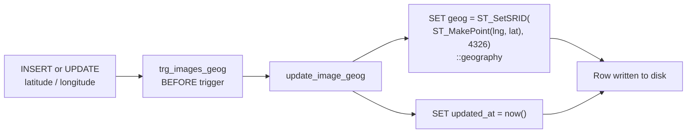
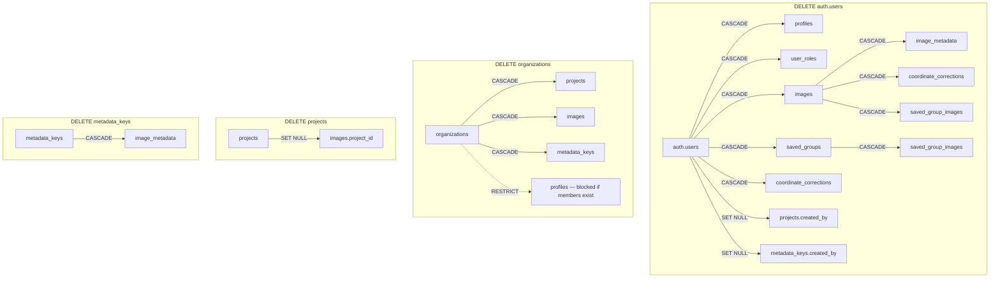

# Database Schema Documentation

**Who this is for:** engineers and DBAs working on data modeling, queries, and RLS policies.  
**What you'll get:** the core tables, relationships, and constraints that support Feldpost invariants.

See also: `architecture.md`, `security-boundaries.md`, `glossary.md`.

Database: PostgreSQL (Supabase) with **PostGIS extension** enabled.

### Entity-Relationship Diagram

```mermaid
erDiagram
    auth_users ||--|| profiles : "1:1"
    auth_users ||--o{ user_roles : "has roles"
    auth_users ||--o{ images : "uploads"
    auth_users ||--o{ saved_groups : "creates"
    auth_users ||--o{ coordinate_corrections : "corrects"
    auth_users ||--o{ projects : "created_by (SET NULL)"
    auth_users ||--o{ metadata_keys : "created_by (SET NULL)"

    organizations ||--o{ profiles : "has members"
    organizations ||--o{ projects : "scopes"
    organizations ||--o{ images : "scopes"
    organizations ||--o{ metadata_keys : "scopes"

    roles ||--o{ user_roles : "assigned via"

    projects ||--o{ images : "groups (SET NULL)"

    images ||--o{ image_metadata : "has metadata"
    images ||--o{ coordinate_corrections : "has corrections"
    images ||--o{ saved_group_images : "in groups"

    saved_groups ||--o{ saved_group_images : "contains"

    metadata_keys ||--o{ image_metadata : "defines key"

    auth_users {
        uuid id PK
        text email
        text encrypted_password
        timestamptz created_at
    }
    organizations {
        uuid id PK
        text name
        timestamptz created_at
        timestamptz updated_at
    }
    profiles {
        uuid id PK_FK
        text full_name
        uuid organization_id FK
        timestamptz created_at
        timestamptz updated_at
    }
    roles {
        uuid id PK
        text name UK
    }
    user_roles {
        uuid user_id PK_FK
        uuid role_id PK_FK
    }
    projects {
        uuid id PK
        uuid organization_id FK
        text name
        uuid created_by FK
        timestamptz created_at
        timestamptz updated_at
    }
    images {
        uuid id PK
        uuid user_id FK
        uuid organization_id FK
        uuid project_id FK
        text storage_path
        text thumbnail_path
        numeric exif_latitude
        numeric exif_longitude
        numeric latitude
        numeric longitude
        geography geog
        numeric direction
        timestamptz captured_at
        timestamptz created_at
        text address_label
        text city
        text district
        text street
        text country
        boolean location_unresolved
    }
    metadata_keys {
        uuid id PK
        text key_name
        uuid organization_id FK
        uuid created_by FK
    }
    image_metadata {
        uuid image_id PK_FK
        uuid metadata_key_id PK_FK
        text value_text
    }
    saved_groups {
        uuid id PK
        uuid user_id FK
        text name
        int tab_order
    }
    saved_group_images {
        uuid group_id PK_FK
        uuid image_id PK_FK
        timestamptz added_at
    }
    coordinate_corrections {
        uuid id PK
        uuid image_id FK
        uuid corrected_by FK
        numeric previous_latitude
        numeric previous_longitude
        numeric new_latitude
        numeric new_longitude
        timestamptz corrected_at
    }
```

Required extensions:

```sql
CREATE EXTENSION IF NOT EXISTS postgis;
CREATE EXTENSION IF NOT EXISTS pg_trgm;  -- Trigram similarity for AddressResolverService DB-first search
```

---

## 1. Identity Layer

Table: `auth.users` (managed by Supabase)

Fields (simplified):

- `id` (uuid)
- `email`
- `encrypted_password`
- `created_at`

**Rules**

- Application code must **not** modify this table directly.
- All changes go through Supabase Auth APIs.

---

## 2. Organizations Table

Table: `organizations`

Purpose:

- Scope data visibility. All users within the same organization can see each other's images and projects.

Columns:

- `id` (uuid, primary key, default `gen_random_uuid()`)
- `name` (text, not null)
- `created_at` (timestamptz, not null, default `now()`)
- `updated_at` (timestamptz, not null, default `now()`)

---

## 3. Profiles Table

Table: `profiles`

Purpose:

- Extend the user with application-specific data.

Columns:

- `id` (uuid, primary key, references `auth.users(id)` ON DELETE CASCADE)
- `full_name` (text)
- `organization_id` (uuid, not null, references `organizations(id)` ON DELETE RESTRICT)
- `created_at` (timestamptz, not null, default `now()`)
- `updated_at` (timestamptz, not null, default `now()`)

Relationship:

- 1:1 with `auth.users`.
- Many:1 with `organizations`.

**Invariant**

- Every `auth.users` row must have exactly one `profiles` row (see `user-lifecycle.md`).
- Every profile must belong to an organization. The registration trigger assigns the organization (provided during signup or defaulted by admin invite).

Note: The `company` column has been replaced by `organization_id` for proper relational scoping. Organization name is stored in `organizations.name`.

---

## 4. Roles Table

Table: `roles`

Columns:

- `id` (uuid, primary key)
- `name` (text, unique, not null)

Example values:

- `admin`
- `user`
- `viewer`

---

## 5. User Roles Table

Table: `user_roles`

Columns:

- `user_id` (uuid, references `auth.users(id)` ON DELETE CASCADE)
- `role_id` (uuid, references `roles(id)` ON DELETE CASCADE)

Primary Key:

- (`user_id`, `role_id`)

Supports a many-to-many relationship:

- One user can have multiple roles.
- One role can belong to many users.

RLS policies (see `security-boundaries.md`) use `user_roles` to determine permissions.

---

## 6. Projects Table

Table: `projects`

Columns:

- `id` (uuid, primary key, default `gen_random_uuid()`)
- `organization_id` (uuid, not null, references `organizations(id)` ON DELETE CASCADE)
- `name` (text, not null)
- `created_by` (uuid, references `auth.users(id)` ON DELETE SET NULL)
- `created_at` (timestamptz, not null, default `now()`)
- `updated_at` (timestamptz, not null, default `now()`)

Notes:

- Projects are grouping entities referenced by `images.project_id`.
- Projects are scoped to an organization. Users can only see projects in their own organization.
- `created_by` uses ON DELETE SET NULL (not RESTRICT) so that user deletion is not blocked by project ownership. The project survives; authorship becomes unknown.
- Access to projects is controlled by RLS (see `security-boundaries.md`).

---

## 7. Images Table

Table: `images`

Columns:

- `id` (uuid, primary key, default `gen_random_uuid()`)
- `user_id` (uuid, not null, references `auth.users(id)` ON DELETE CASCADE)
- `organization_id` (uuid, not null, references `organizations(id)` ON DELETE CASCADE)
- `project_id` (uuid, nullable, references `projects(id)` ON DELETE SET NULL)
- `storage_path` (text, nullable) — relative path in Supabase Storage (e.g., `{org_id}/{user_id}/{uuid}.jpg`). NULL for photoless datapoints (rows created via folder import or manual address entry that have no photo yet). Not a full URL. URLs are generated at runtime (signed or public).
- `thumbnail_path` (text, not null) — relative path to the 128×128 JPEG thumbnail in Supabase Storage.
- `exif_latitude` (numeric(10,7), nullable)
- `exif_longitude` (numeric(11,7), nullable)
- `latitude` (numeric(10,7), not null) — effective display coordinate (updated on correction, initially set from EXIF)
- `longitude` (numeric(11,7), not null) — effective display coordinate
- `geog` (geography(Point, 4326), not null) — PostGIS geography column, computed from `latitude`/`longitude`. Used for all spatial queries and indexing.
- `direction` (numeric(5,2), nullable) — camera bearing in degrees (0–360) from EXIF
- `captured_at` (timestamptz, nullable) — capture time from EXIF when available
- `created_at` (timestamptz, not null, default `now()`) — upload/record creation time
- `updated_at` (timestamptz, not null, default `now()`)
- `address_label` (text, nullable) — human-readable address string for this image (e.g., "Burgstraße 7, 8001 Zürich"). Populated on upload from user input, filename resolution, or reverse geocoding. Used by `AddressResolverService` for DB-first autocomplete ranking. NULL for images imported before this column was introduced.
- `city` (text, nullable) — structured city name from reverse geocoding (e.g., "Wien"). Used for grouping by city.
- `district` (text, nullable) — structured district/suburb name from reverse geocoding (e.g., "Donaustadt"). Used for grouping by district.
- `street` (text, nullable) — structured street name from reverse geocoding (e.g., "Seestadt-Straße"). Used for grouping by street.
- `country` (text, nullable) — structured country name from reverse geocoding (e.g., "Austria"). Used for grouping by country.
- `location_unresolved` (boolean, nullable, default FALSE) — TRUE for images imported via `FolderImportAdapter` that were skipped during the review phase without a resolved location. Images with `location_unresolved = TRUE` are excluded from all viewport queries and do not appear on the map. See `folder-import.md` §6.

**CHECK Constraints**

```sql
CHECK (latitude BETWEEN -90 AND 90)
CHECK (longitude BETWEEN -180 AND 180)
CHECK (exif_latitude IS NULL OR exif_latitude BETWEEN -90 AND 90)
CHECK (exif_longitude IS NULL OR exif_longitude BETWEEN -180 AND 180)
CHECK (direction IS NULL OR direction BETWEEN 0 AND 360)
```

**Computed Column / Trigger**



The `geog` column is maintained by a trigger that fires on INSERT and UPDATE of `latitude` or `longitude`:

```sql
CREATE OR REPLACE FUNCTION update_image_geog() RETURNS trigger AS $$
BEGIN
  NEW.geog := ST_SetSRID(ST_MakePoint(NEW.longitude, NEW.latitude), 4326)::geography;
  NEW.updated_at := now();
  RETURN NEW;
END;
$$ LANGUAGE plpgsql;

CREATE TRIGGER trg_images_geog
  BEFORE INSERT OR UPDATE OF latitude, longitude ON images
  FOR EACH ROW EXECUTE FUNCTION update_image_geog();
```

**Invariants**

- Every image has valid spatial (lat/lng) and temporal context (`captured_at` or `created_at`).
- Ownership is enforced via `user_id` and organization-scoped RLS.
- EXIF and corrected coordinates are never conflated; if both exist, corrected coordinates are used for spatial queries.
- `organization_id` is denormalized from the user's profile for efficient RLS checks (avoids a join on every query).

---

## 8. Metadata Tables

Table: `metadata_keys`

Columns:

- `id` (uuid, primary key, default `gen_random_uuid()`)
- `key_name` (text, not null)
- `organization_id` (uuid, not null, references `organizations(id)` ON DELETE CASCADE)
- `created_by` (uuid, references `auth.users(id)` ON DELETE SET NULL)
- `created_at` (timestamptz, not null, default `now()`)

Uniqueness (enforced, not optional):

- `UNIQUE (organization_id, key_name)` — prevents duplicate key names within the same organization.

Note: `created_by` uses ON DELETE SET NULL (not RESTRICT) so user deletion is not blocked.

Table: `image_metadata`

Columns:

- `image_id` (uuid, references `images(id)` ON DELETE CASCADE)
- `metadata_key_id` (uuid, references `metadata_keys(id)` ON DELETE CASCADE)
- `value_text` (text, not null)
- `created_at` (timestamptz default `now()`)

Primary Key:

- (`image_id`, `metadata_key_id`)

---

## 9. Indexing Strategy (MVP)

Feldpost uses **PostGIS** with GiST indexes as the MVP default for spatial queries.

### Required Indexes

**Spatial (PostGIS):**

- `CREATE INDEX idx_images_geog ON images USING GIST (geog);` — enables efficient bounding-box (`&&`) and distance (`ST_DWithin`, `<->`) queries. Replaces the btree on `(latitude, longitude)`.

**Temporal:**

- `CREATE INDEX idx_images_created_at ON images (created_at DESC);` — timeline filtering and sorting.
- `CREATE INDEX idx_images_captured_at ON images (captured_at DESC NULLS LAST);` — EXIF timestamp filtering. `NULLS LAST` ensures images without `captured_at` don't dominate the index.

**Ownership and Organization:**

- `CREATE INDEX idx_images_user_id ON images (user_id);` — RLS policy checks (`user_id = auth.uid()`).
- `CREATE INDEX idx_images_org_id ON images (organization_id);` — organization-scoped queries.

**Project + Time:**

- `CREATE INDEX idx_images_project_time ON images (project_id, created_at DESC);` — project + time filter combination.

**Metadata:**

- `CREATE INDEX idx_image_metadata_key_value ON image_metadata (metadata_key_id, value_text);` — key/value filtering.

**Roles (RLS):**

- `CREATE INDEX idx_user_roles_user ON user_roles (user_id);`
- `CREATE INDEX idx_roles_name ON roles (name);`

**Groups:**

- `CREATE INDEX idx_saved_groups_user ON saved_groups (user_id, tab_order);`
- `CREATE INDEX idx_saved_group_images_image ON saved_group_images (image_id);`

### Why PostGIS Over Btree for Spatial Queries

A composite btree on `(latitude, longitude)` is a 1D index applied to a 2D problem. It range-scans latitude effectively but filters longitude via sequential scan. At scale (tens of thousands of images in a city), this degrades to near-full-table scans for viewport queries.

The PostGIS GiST index on `geography(Point, 4326)` is a true 2D spatial index that supports:

- Bounding-box intersection (`&&` operator) for viewport queries.
- Distance queries (`ST_DWithin`, `<->` nearest-neighbor operator).
- Server-side spatial clustering via `ST_SnapToGrid` or `ST_ClusterDBSCAN`.

Subabase supports PostGIS out of the box via `CREATE EXTENSION postgis`.

---

## 10. Saved Groups Tables

Table: `saved_groups`

Purpose: User-created named collections of images for workflow organization (see `architecture.md` §11).

Columns:

- `id` (uuid, primary key, default `gen_random_uuid()`)
- `user_id` (uuid, not null, references `auth.users(id)` ON DELETE CASCADE)
- `name` (text, not null)
- `tab_order` (int, not null, default 0)
- `created_at` (timestamptz, not null, default `now()`)
- `updated_at` (timestamptz, not null, default `now()`)

Table: `saved_group_images`

Columns:

- `group_id` (uuid, not null, references `saved_groups(id)` ON DELETE CASCADE)
- `image_id` (uuid, not null, references `images(id)` ON DELETE CASCADE)
- `added_at` (timestamptz, not null, default `now()`)

Primary Key: (`group_id`, `image_id`)

Constraints:

- Soft limit: 20 groups per user (enforced application-side). Hard limit: 50 (enforced via RPC check on insert).
- No hard limit on images per group (virtual scrolling handles rendering).

RLS: Users can only access their own groups (see `security-boundaries.md`).

---

## 11. Coordinate Correction History

Table: `coordinate_corrections`

Purpose: Audit trail for marker corrections. Tracks who moved a marker, when, and from where.

Columns:

- `id` (uuid, primary key, default `gen_random_uuid()`)
- `image_id` (uuid, not null, references `images(id)` ON DELETE CASCADE)
- `corrected_by` (uuid, not null, references `auth.users(id)` ON DELETE CASCADE)
- `previous_latitude` (numeric(9,6), not null)
- `previous_longitude` (numeric(9,6), not null)
- `new_latitude` (numeric(9,6), not null)
- `new_longitude` (numeric(9,6), not null)
- `corrected_at` (timestamptz, not null, default `now()`)

This table is append-only. A trigger on `images` captures the previous effective coordinates before an update to `latitude`/`longitude`.

---

## 12. Foreign Key Cascade Summary

### Cascade Flow Diagram



| Parent Table    | Child Table              | FK Column         | On Delete | Rationale                                     |
| --------------- | ------------------------ | ----------------- | --------- | --------------------------------------------- |
| `auth.users`    | `profiles`               | `id`              | CASCADE   | Profile is meaningless without user           |
| `auth.users`    | `user_roles`             | `user_id`         | CASCADE   | Roles are user-scoped                         |
| `auth.users`    | `images`                 | `user_id`         | CASCADE   | User's images are removed on account deletion |
| `auth.users`    | `saved_groups`           | `user_id`         | CASCADE   | Groups are personal                           |
| `auth.users`    | `coordinate_corrections` | `corrected_by`    | CASCADE   | Audit trail tied to user                      |
| `auth.users`    | `projects`               | `created_by`      | SET NULL  | Project survives; authorship becomes unknown  |
| `auth.users`    | `metadata_keys`          | `created_by`      | SET NULL  | Key survives; creator becomes unknown         |
| `organizations` | `profiles`               | `organization_id` | RESTRICT  | Cannot delete org with active users           |
| `organizations` | `projects`               | `organization_id` | CASCADE   | Org deletion removes all projects             |
| `organizations` | `images`                 | `organization_id` | CASCADE   | Org deletion removes all images               |
| `organizations` | `metadata_keys`          | `organization_id` | CASCADE   | Org deletion removes all metadata keys        |
| `roles`         | `user_roles`             | `role_id`         | CASCADE   | Removing a role unassigns it                  |
| `projects`      | `images`                 | `project_id`      | SET NULL  | Image survives without project                |
| `images`        | `image_metadata`         | `image_id`        | CASCADE   | Metadata is image-scoped                      |
| `images`        | `coordinate_corrections` | `image_id`        | CASCADE   | History is image-scoped                       |
| `images`        | `saved_group_images`     | `image_id`        | CASCADE   | Deleting image removes it from groups         |
| `saved_groups`  | `saved_group_images`     | `group_id`        | CASCADE   | Deleting group removes memberships            |
| `metadata_keys` | `image_metadata`         | `metadata_key_id` | CASCADE   | Removing a key removes all values             |

**Key design decisions:**

- `projects.created_by` and `metadata_keys.created_by` use **SET NULL** (not RESTRICT) to ensure user deletion is never blocked by project or metadata key ownership.
- `organizations` → `profiles` uses **RESTRICT** to prevent accidental organization deletion while users exist.
