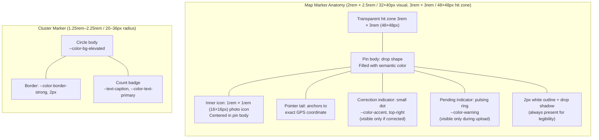

# GeoSite – Component: Map Marker

## Marker State Diagram

```mermaid
stateDiagram-v2
    [*] --> PendingUpload : Image selected for upload
    PendingUpload --> Default : Upload succeeds (EXIF placed)
    PendingUpload --> Error : Upload fails
    Error --> PendingUpload : Retry
    Default --> Selected : User taps/clicks marker
    Default --> Corrected : User drags marker to new position
    Selected --> Default : User deselects / clicks elsewhere
    Selected --> Corrected : User edits location
    Corrected --> Selected : User taps corrected marker
    Corrected --> Default : User resets to EXIF

    state Default {
        [*] --> Idle
        Idle --> Hovered : Mouse enter (desktop)
        Hovered --> Idle : Mouse leave
    }

    note right of PendingUpload
        Color: --color-clay
        Pulsing ring animation
    end note
    note right of Default
        Color: --color-primary
        Photo icon centered
    end note
    note right of Corrected
        Color: --color-accent
        Correction dot visible
    end note
    note right of Selected
        Color: #FFFFFF + primary ring
    end note
    note right of Error
        Color: --color-danger
    end note
```

## 5.1 Map Marker

### Marker Anatomy



A custom SVG pin, not a default Leaflet marker. Anatomy:

- **Pin body:** drop-shaped, filled with the semantic marker color (`--color-primary` by default).
- **Inner icon:** a small photo icon (16×16) centered in the pin body. Acts as a visual affordance that this is a photo, not a generic map pin.
- **Correction indicator:** a small dot in `--color-accent` at the top-right corner, visible only for corrected markers.
- **Pending indicator:** a pulsing ring in `--color-warning` for images in the upload queue.

Marker tap/click area is extended to 3rem × 3rem (48×48px) via a transparent hit zone, regardless of the visual pin size (2rem × 2.5rem / 32×40px). On desktop, a hover state elevates the marker (scale 1.15, `transition: transform 120ms ease-out`).

**Cluster:**

- A circle of radius 1.25rem–2.25rem (20–36px) (scales logarithmically with cluster size).
- Background: `--color-bg-elevated`, border: `--color-border-strong`, 2px.
- Count badge: `--text-caption`, `--color-text-primary`.
- Cluster hover: scale 1.1, cursor pointer.
- Triggered by proximity density, not by hard-coded zoom-level tiers.
