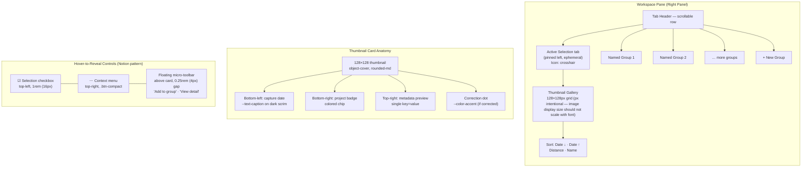

# GeoSite – Component: Workspace Pane

## 5.3 Workspace Pane — Group Tabs

### Workspace Pane Architecture

The workspace pane header is a scrollable tab row. Tab types:

- **Active Selection** (pinned left, ephemeral): shows images from the current radius selection or marker interaction. Icon: crosshair. Cannot be renamed or closed.
- **Named group tabs** (scrollable): user-created groups. Each tab shows a group name. Long-press → rename/delete context menu.

Tab overflow: if more than 5 named groups exist, tabs become horizontally scrollable. A "+" button at the right end of the tab row creates a new group.

Within each tab, the gallery is a responsive masonry or fixed-grid of thumbnail cards:

**Thumbnail card:**

- 128×128px thumbnail (px intentional — image display size should not scale with font), `rounded-md` corners.
- Bottom-left: capture date in `--text-caption` on a semi-transparent dark scrim.
- Bottom-right: project badge (short name, colored chip in `--color-accent` or project-assigned color).
- Top-right: metadata preview (single key=value shorthand, e.g., "Beton") — visible at rest.
- Correction dot: top-right edge, `--color-accent`, visible at rest. This is an honest state indicator (Principle 1.7) and is never hidden.

**Hover-to-reveal controls (Notion pattern — Principle 1.8):** The following appear via `opacity: 0 → 1` at 80ms on mouse-enter. No layout shift — space is always reserved.

- **Selection checkbox** (top-left corner, 1rem / 16px). Always visible in bulk-select mode.
- **Context menu `⋯` button** (top-right, replaces the metadata preview on hover). A `.btn-compact` (1.75rem / 28px) ghost button. Opens a popup with: "Add to group", "Edit metadata", "Delete", "Copy coordinates".
- **Floating micro-toolbar** — appears centered directly above the card (0.25rem / 4px gap): compact ghost buttons for "Add to group" and "View detail". Dismisses when cursor leaves the card.

On mobile, hover states are replaced with a long-press (500ms haptic) that activates bulk-select mode and reveals the selection checkbox.

Sorting controls (above the gallery): "Date ↓", "Date ↑", "Distance from map center", "Name". Compact segmented control, `.btn-compact` height.
