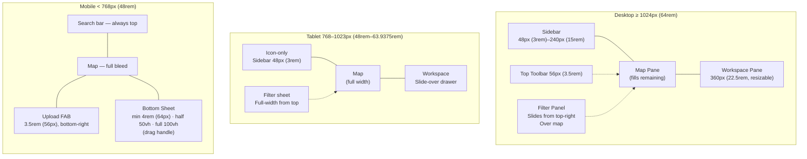

# GeoSite – Layout System

Load this file for any task involving breakpoints, panel dimensions, or responsive behavior.

## 4. Layout System

### Layout Overview — All Breakpoints



### 4.1 Desktop Layout (≥ 1024px / 64rem)

```
┌──────────────────────────────────────────┬──┬───────────────────────┐
│         ┌─────────────────────┐          │  │                       │
│         │      Search Bar     │          │  │   Workspace Pane      │
│         └─────────────────────┘          │  │   22.5rem default     │
│  [Side]                                  │◀▶│                       │
│  [bar ]        Map Pane                  │  │   [Group Tabs]        │
│  [left]        (flex: 1)                 │  │   [Thumbnail Gallery] │
│  [mid ]                                  │  │   [Detail View]       │
│                                          │  │                       │
└──────────────────────────────────────────┴──┴───────────────────────┘
```

- Desktop layout is a horizontal split container with two structural siblings: **Map Pane** and **Workspace Pane**.
- A draggable vertical divider sits between the panes and controls workspace resizing.
- Workspace pane default width is 22.5rem (360px); minimum width is 17.5rem (280px).
- There is no fixed maximum workspace width. Instead, divider movement is constrained by a minimum map-width rule: the divider cannot move further left once the map pane would shrink below a safe interaction width of approximately 20rem (320px).
- The map pane uses `flex: 1` and absorbs all remaining horizontal space after workspace width and divider position are resolved.
- The **Sidebar** and **Search Bar** are positioned inside the map pane as floating component-level elements, not as separate layout columns. Their behavior and dimensions are defined in [docs/element-specs/sidebar.md](docs/element-specs/sidebar.md) and [docs/element-specs/search-bar.md](docs/element-specs/search-bar.md).
- This layout section defines pane structure and resizing only; component behavior belongs in the component specifications.

### 4.2 Tablet Layout (768–1023px / 48rem–63.9375rem)

- Sidebar collapses to icon-only (48px / 3rem). Long-press or swipe-right reveals a temporary overlay sidebar.
- Workspace pane becomes a slide-over drawer (right edge), triggered by a FAB or tab at the right edge of the screen.
- Filter panel opens as a full-width sheet from the top.
- Map occupies full width when workspace is dismissed.

### 4.3 Mobile Layout (< 768px / 48rem)

```
┌────────────────────────────────┐
│  Search bar (top, always)      │
├────────────────────────────────┤
│                                │
│         Map (full bleed)       │
│                                │
│                                │
│   [Upload FAB — bottom right]  │
├────────────────────────────────┤
│  Bottom Sheet                  │
│  ─────────── (drag handle)     │
│  Snap: minimized / half / full │
└────────────────────────────────┘
```

- Bottom sheet contains the Active Selection tab and named groups.
- Filter access: tapping the filter icon in the search bar opens a modal bottom sheet (does not compete with the workspace bottom sheet).
- Image detail: tapping a marker expands the bottom sheet to half-height, showing thumbnail + core metadata. Tapping again or swiping up goes full-screen detail.
- The Upload FAB is a 3.5rem (56px) circle, fixed to the bottom-right, above the bottom sheet handle.
