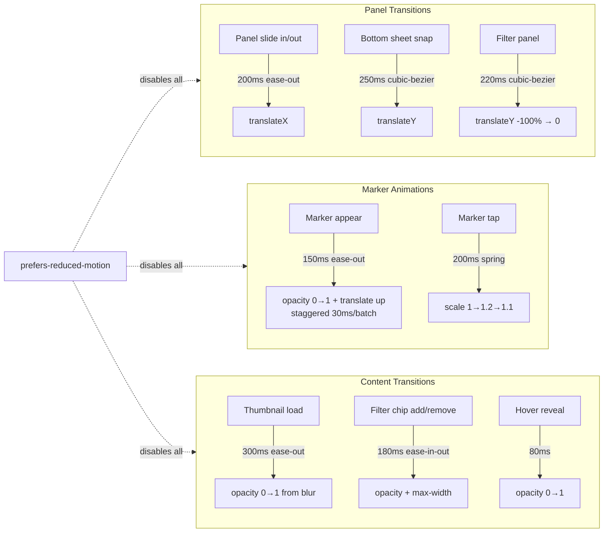

# GeoSite – Motion & Transitions

Load this file for any task involving animation, timing, or transitions.

## 6. Motion and Transitions

### Motion Overview

All motion serves clarity or orientation — no decorative animation.

| Interaction                  | Effect                                           | Duration | Easing                                   |
| ---------------------------- | ------------------------------------------------ | -------- | ---------------------------------------- |
| Panel slide in/out (desktop) | `transform: translateX`                          | 200ms    | `ease-out`                               |
| Bottom sheet snap (mobile)   | `transform: translateY`                          | 250ms    | `cubic-bezier(0.4, 0, 0.2, 1)`           |
| Marker appear (map load)     | `opacity: 0→1`, slight upward translate          | 150ms    | `ease-out` (staggered by 30ms per batch) |
| Marker tap (highlight)       | `scale: 1→1.2→1.1`                               | 200ms    | spring-like `ease-in-out`                |
| Thumbnail load               | `opacity: 0→1` from placeholder blur             | 300ms    | `ease-out`                               |
| Filter chip add/remove       | `opacity + max-width` (chip appear/collapse)     | 180ms    | `ease-in-out`                            |
| Page navigation              | No full-page transitions; panels update in place | —        | —                                        |

`prefers-reduced-motion: reduce` disables all transforms and fades, keeping only immediate state changes.
