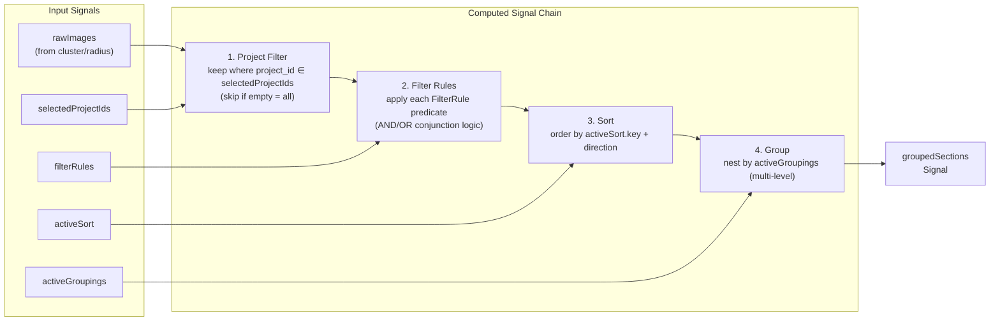
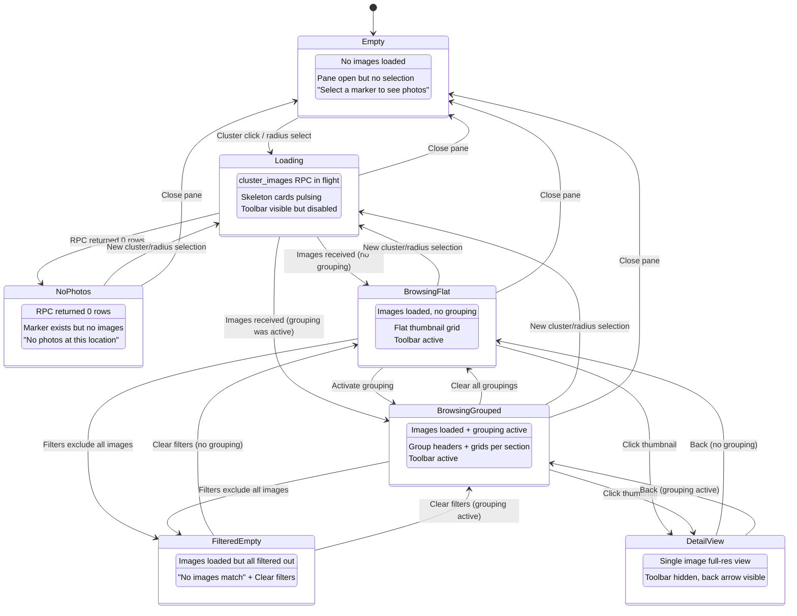
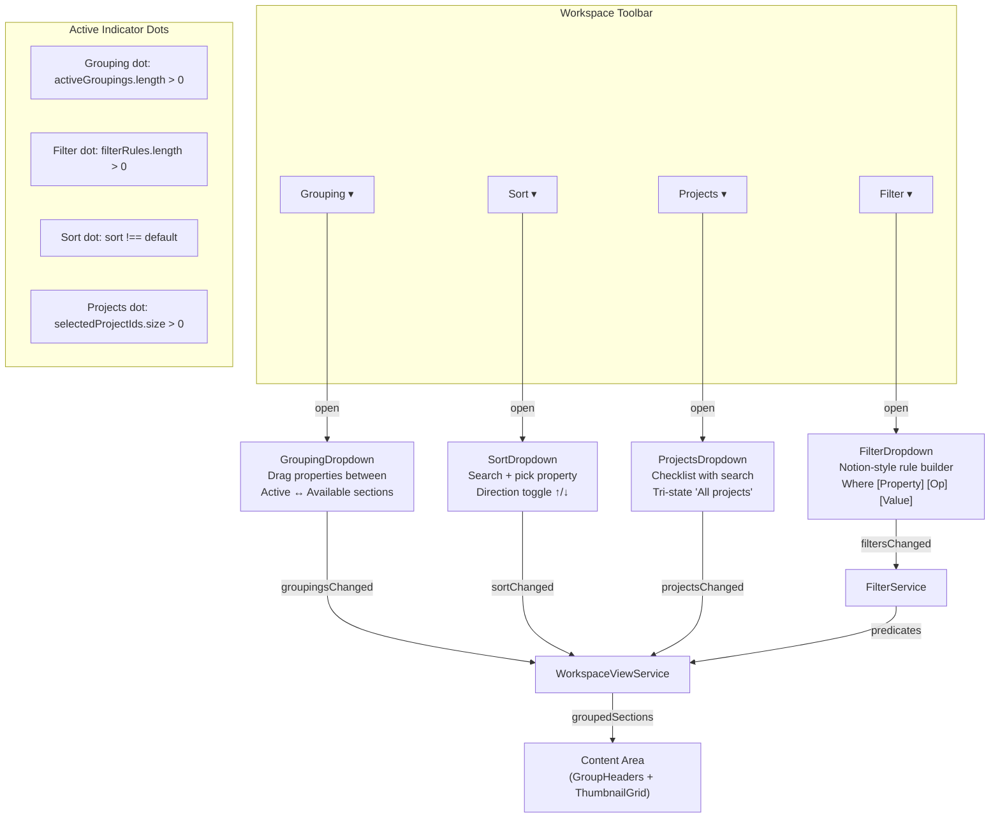
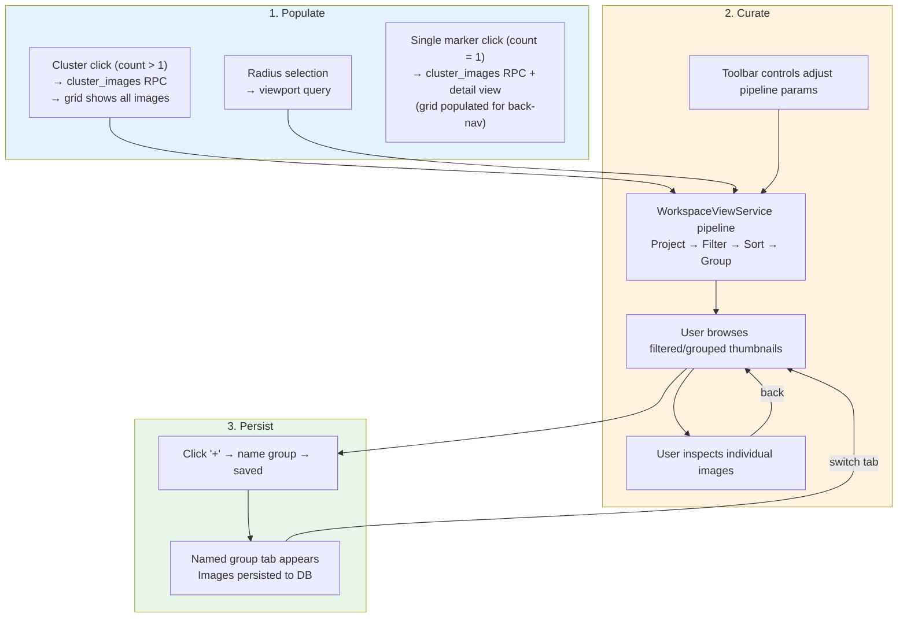
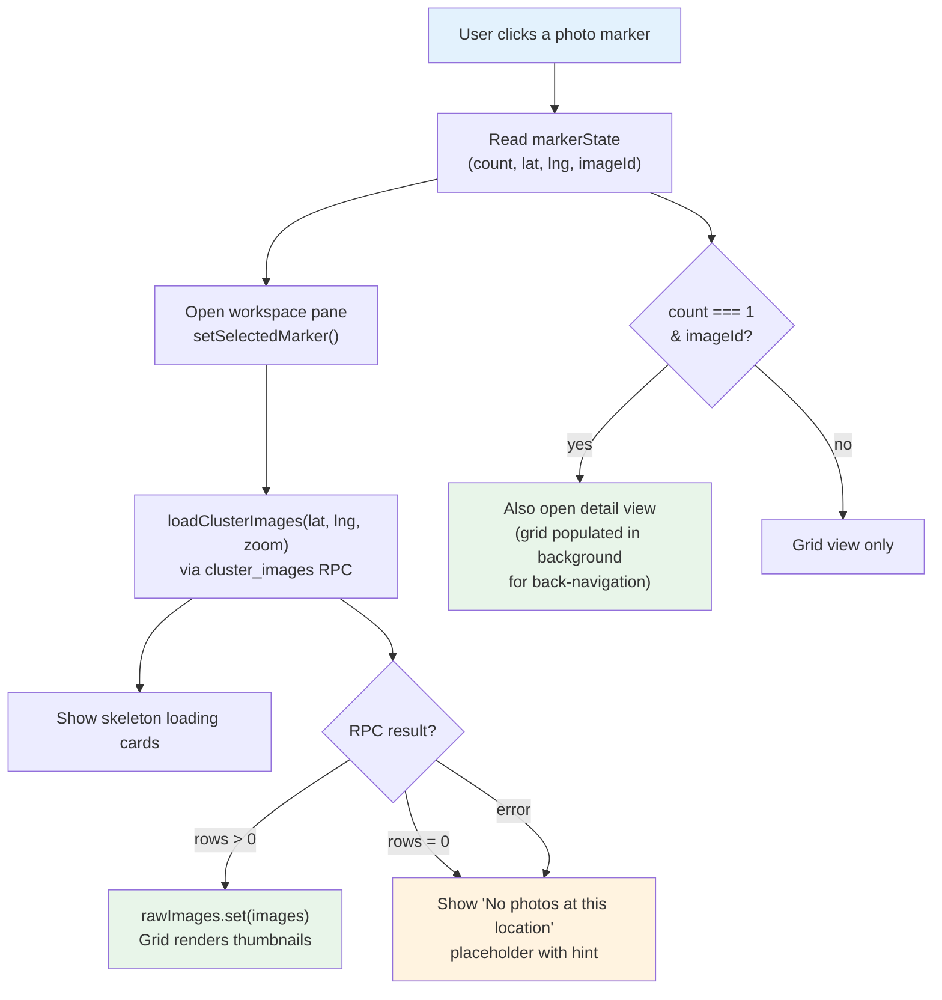

# Active Selection View

> **Blueprint:** (pending — implement after foundation services are built)
> **Use cases:** [use-cases/workspace-view.md](../use-cases/workspace-view.md)
> **Architecture:** [workspace-view-system.md](workspace-view-system.md) (data pipeline, service contracts, RPC)

## What It Is

The composed content experience inside the Workspace Pane when the Active Selection tab is active. It is the hub where map exploration meets curation: photos from a cluster click or radius selection are loaded, then filtered, sorted, grouped, and browsed. The user can inspect individual images, apply Notion-style filter rules, group by any property, scope to projects, sort by any column, and ultimately save curated selections as persistent named groups.

Active Selection is **ephemeral** — it exists only for the current session and is replaced whenever the user makes a new spatial selection on the map. Named Groups are the persistent counterpart (see [group-tab-bar spec](group-tab-bar.md)).

## What It Looks Like

Fills the entire content area of the Workspace Pane below the pane header. Three vertical zones stacked top-to-bottom:

1. **Workspace Toolbar** — a row of four ghost buttons (Grouping, Filter, Sort, Projects) with active-indicator dots. `gap: 0.5rem`, `.btn-compact` height (1.75rem). `--color-bg-surface` background, matching pane.
2. **Group Headers** (conditional) — sticky section headings when grouping is active. Collapsible with a chevron toggle. Shows group name + image count. Indented for multi-level nesting (`padding-left: 1.5rem` per level).
3. **Thumbnail Grid** — auto-fill CSS grid of 128×128px cards, virtual-scrolled for performance. Occupies all remaining vertical space. When no grouping is active, the grid is a flat scrollable list.

**Empty state** (no images match filters): centered message "No images match the current filters" with a ghost button "Clear filters".

**No-photos state** (marker clicked but RPC returns 0 rows): centered 📷 icon, "No photos at this location", and a secondary hint "Images may not have been uploaded yet for this area."

**Loading state** (cluster RPC in flight): skeleton placeholder cards pulse with `--color-bg-elevated` shimmer.

## Where It Lives

- **Parent**: `WorkspacePaneComponent` content area
- **Appears when**: Workspace Pane is open AND `activeTabId === 'selection'` AND `detailImageId === null`
- **Replaced by**: `ImageDetailView` when a thumbnail is clicked (detail view replaces grid)

## Actions

| #   | User Action                              | System Response                                                                                          | Triggers                     |
| --- | ---------------------------------------- | -------------------------------------------------------------------------------------------------------- | ---------------------------- |
| 1   | Cluster click on map                     | Images loaded via `cluster_images` RPC → pipeline processes → grid renders thumbnails                    | `rawImages` populated        |
| 2   | Radius selection on map                  | Images loaded via viewport query (bounded) → pipeline processes → grid renders                           | `rawImages` populated        |
| 3   | Clicks "Grouping" toolbar button         | Grouping dropdown opens — drag/click to activate properties, images regroup instantly                    | `activeGroupings` changed    |
| 4   | Clicks "Filter" toolbar button           | Filter dropdown opens — add Notion-style rules (property → operator → value), images re-filter instantly | `filterRules` changed        |
| 5   | Clicks "Sort" toolbar button             | Sort dropdown opens — pick property + direction, images re-sort instantly                                | `activeSort` changed         |
| 6   | Clicks "Projects" toolbar button         | Projects dropdown opens — check/uncheck projects, images filter by project instantly                     | `selectedProjectIds` changed |
| 7   | Scrolls the thumbnail grid               | Virtual scroll loads more rows, batch-signs thumbnail URLs for newly-visible cards                       | Viewport update              |
| 8   | Clicks a thumbnail card                  | Image Detail View replaces grid, full-res image loads                                                    | `detailImageId` set          |
| 9   | Clicks back arrow in detail view         | Returns to grid, scroll position and all toolbar state preserved                                         | `detailImageId` cleared      |
| 10  | Clicks collapse toggle on a group header | Group's thumbnails collapse/expand                                                                       | Group collapsed state        |
| 11  | Clicks "+" in Group Tab Bar              | Saves current Active Selection images as a new named group                                               | New tab created              |
| 12  | New cluster/radius selection on map      | Replaces current Active Selection images, resets to unfiltered state                                     | `rawImages` replaced         |
| 13  | Closes workspace pane                    | Active Selection cleared, all toolbar state reset                                                        | `rawImages` cleared          |
| 14  | Hovers a thumbnail card                  | Reveals quiet actions: checkbox (multi-select), add-to-group, more (⋯)                                   | Quiet Actions pattern        |

## Component Hierarchy

```
ActiveSelectionView                        ← content area within WorkspacePane, flex column, overflow hidden
├── WorkspaceToolbar                       ← sticky top, 4 ghost buttons (see workspace-toolbar spec)
│   ├── ToolbarButton "Grouping ▾"         ← opens GroupingDropdown
│   ├── ToolbarButton "Filter ▾"           ← opens FilterDropdown
│   ├── ToolbarButton "Sort ▾"             ← opens SortDropdown
│   └── ToolbarButton "Projects ▾"         ← opens ProjectsDropdown
│
├── [loading] SkeletonGrid                 ← pulsing placeholder cards during cluster RPC
│
├── [no matches] EmptyFilterState          ← "No images match" + "Clear filters" ghost button
│
├── [no grouping] ThumbnailGrid            ← virtual-scrolled flat grid (see thumbnail-grid spec)
│   └── ThumbnailCard × N                  ← 128×128 each (see thumbnail-card spec)
│
└── [grouping active] GroupedContent       ← virtual scroll with interleaved headers + grids
    └── GroupedSection × N                 ← one per group
        ├── GroupHeader                    ← sticky, collapsible: ▼ GroupName — count
        │   ├── CollapseToggle (▼/▶)       ← rotates 90° on collapse
        │   ├── GroupName                  ← e.g., "Zürich"
        │   ├── ImageCount                 ← e.g., "4 photos"
        │   └── .ui-spacer
        ├── ThumbnailGrid                  ← grid of this section's images
        └── [nested] GroupedSection × N    ← multi-level grouping (indented 1.5rem per level)
```

## Data

| Field            | Source                                                                             | Type               |
| ---------------- | ---------------------------------------------------------------------------------- | ------------------ |
| Cluster images   | `supabase.rpc('cluster_images', {cluster_lat, cluster_lng, zoom})` → images        | `Image[]`          |
| Radius images    | `supabase.rpc('viewport_markers', {...})` filtered by radius                       | `Image[]`          |
| Thumbnail URLs   | Supabase Storage signed URLs (batch-signed, 256×256 transform)                     | `string[]`         |
| Projects list    | `supabase.from('projects').select('id, name').eq('organization_id', org)`          | `Project[]`        |
| Metadata keys    | `supabase.from('metadata_keys').select('id, key_name').eq('organization_id', org)` | `MetadataKey[]`    |
| Grouped sections | `WorkspaceViewService.groupedSections()` — computed signal output                  | `GroupedSection[]` |

## State

All state lives in `WorkspaceViewService` (shared) and is consumed reactively.

| Name                 | Type                            | Default                                   | Controls                                     |
| -------------------- | ------------------------------- | ----------------------------------------- | -------------------------------------------- |
| `rawImages`          | `WritableSignal<Image[]>`       | `[]`                                      | Source images from cluster/radius query      |
| `selectedProjectIds` | `WritableSignal<Set<string>>`   | empty (= all)                             | Project filter — empty means no filter       |
| `filterRules`        | `WritableSignal<FilterRule[]>`  | `[]`                                      | Notion-style filter rules (AND/OR)           |
| `activeSort`         | `WritableSignal<SortConfig>`    | `{key: 'captured_at', direction: 'desc'}` | Current sort key + direction                 |
| `activeGroupings`    | `WritableSignal<PropertyRef[]>` | `[]`                                      | Ordered list of grouping properties          |
| `groupedSections`    | `Signal<GroupedSection[]>`      | `[]`                                      | Computed output: filtered → sorted → grouped |
| `totalImageCount`    | `Signal<number>`                | `0`                                       | Count after all filters applied              |
| `collapsedGroups`    | `WritableSignal<Set<string>>`   | empty                                     | Which group headings are collapsed           |
| `isLoading`          | `WritableSignal<boolean>`       | `false`                                   | True while cluster_images RPC is in flight   |

## Data Pipeline

The complete transformation pipeline, implemented as Angular computed signals in `WorkspaceViewService`:



## View State Machine



## Toolbar Control Interaction Map



## Lifecycle: Populate → Curate → Persist



## Marker Click → Grid Flow



## File Map

| File                                                                          | Purpose                               | Spec Reference                                    |
| ----------------------------------------------------------------------------- | ------------------------------------- | ------------------------------------------------- |
| `core/workspace-view.service.ts`                                              | Data pipeline: filter → sort → group  | [workspace-view-system](workspace-view-system.md) |
| `core/filter.service.ts`                                                      | Filter rule state + predicate builder | [filter-dropdown](filter-dropdown.md)             |
| `core/metadata.service.ts`                                                    | Property CRUD + custom metadata       | [custom-properties](custom-properties.md)         |
| `features/map/workspace-pane/workspace-toolbar.component.ts/html/scss`        | Toolbar with 4 buttons                | [workspace-toolbar](workspace-toolbar.md)         |
| `features/map/workspace-pane/workspace-toolbar/grouping-dropdown.component.*` | Grouping dropdown with drag-reorder   | [grouping-dropdown](grouping-dropdown.md)         |
| `features/map/workspace-pane/workspace-toolbar/sort-dropdown.component.*`     | Sort dropdown with search             | [sort-dropdown](sort-dropdown.md)                 |
| `features/map/workspace-pane/workspace-toolbar/filter-dropdown.component.*`   | Notion-style filter builder           | [filter-dropdown](filter-dropdown.md)             |
| `features/map/workspace-pane/workspace-toolbar/projects-dropdown.component.*` | Projects checklist dropdown           | [projects-dropdown](projects-dropdown.md)         |
| `features/map/workspace-pane/group-header.component.ts`                       | Collapsible group heading             | (this spec)                                       |
| `features/map/workspace-pane/thumbnail-grid.component.*`                      | Virtual-scrolled image grid           | [thumbnail-grid](thumbnail-grid.md)               |
| `supabase/migrations/XXXXX_cluster_images_rpc.sql`                            | RPC for cluster image loading         | [workspace-view-system](workspace-view-system.md) |

## Wiring

- `ActiveSelectionView` is the default content area inside `WorkspacePaneComponent` when `activeTabId === 'selection'` and `detailImageId === null`
- Inject `WorkspaceViewService` — the single source of truth for pipeline state
- Inject `FilterService` — manages filter rules, exposes predicates to `WorkspaceViewService`
- Toolbar dropdowns are standalone components rendered conditionally within `WorkspaceToolbar`
- `MapShellComponent` calls `WorkspaceViewService.loadClusterImages(lat, lng, zoom)` on marker click (async, calls RPC internally)
- Closing the pane calls `WorkspaceViewService.clearActiveSelection()`

## Acceptance Criteria

- [x] Cluster click loads images via `cluster_images` RPC and populates the grid
- [x] Single marker click loads images via `cluster_images` RPC and opens detail view
- [ ] Radius selection loads images and populates the grid
- [x] Skeleton loading state shown during RPC call
- [x] No-photos placeholder shown when RPC returns 0 rows ("No photos at this location")
- [x] Grid renders 128×128 thumbnail cards with virtual scrolling
- [x] Thumbnail URLs batch-signed on scroll (no per-card waterfall)
- [x] **Grouping**: activating a property creates section headers; deactivating returns to flat grid
- [x] **Multi-level grouping**: nested headers with indentation (1.5rem per level)
- [x] **Group collapse**: clicking a section header toggles its thumbnails
- [x] **Filter**: adding rules immediately removes non-matching images from the grid
- [x] **Filter AND/OR**: conjunction logic applied correctly across multiple rules
- [x] **Sort**: changing sort key or direction re-orders the grid instantly
- [x] **Projects**: checking/unchecking projects filters images by project membership
- [x] Toolbar buttons show active-indicator dots when features are engaged
- [x] Only one dropdown open at a time; click-outside and Escape close it
- [ ] Clicking a thumbnail opens Image Detail View (replaces grid)
- [ ] Returning from detail view preserves scroll position and all toolbar state
- [x] Empty filter state: "No images match the current filters" + "Clear filters" button
- [x] New cluster/radius selection replaces current images and resets filters
- [x] Closing workspace pane clears Active Selection and resets all toolbar state
- [ ] Save as named group via "+" in Group Tab Bar persists images to DB
- [x] Pipeline is 100% client-side (no server round-trips for filter/sort/group changes)
- [ ] Performance: re-render completes in < 100ms for 500 images
