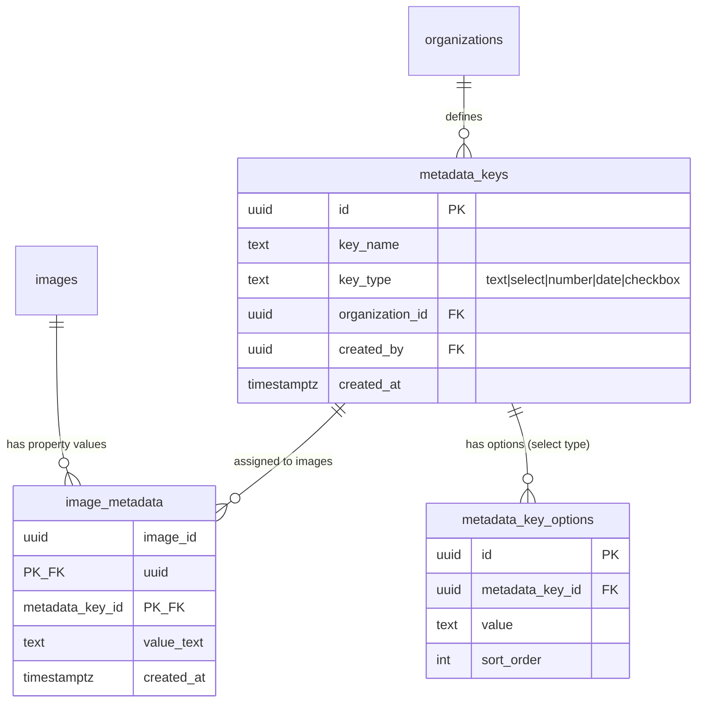
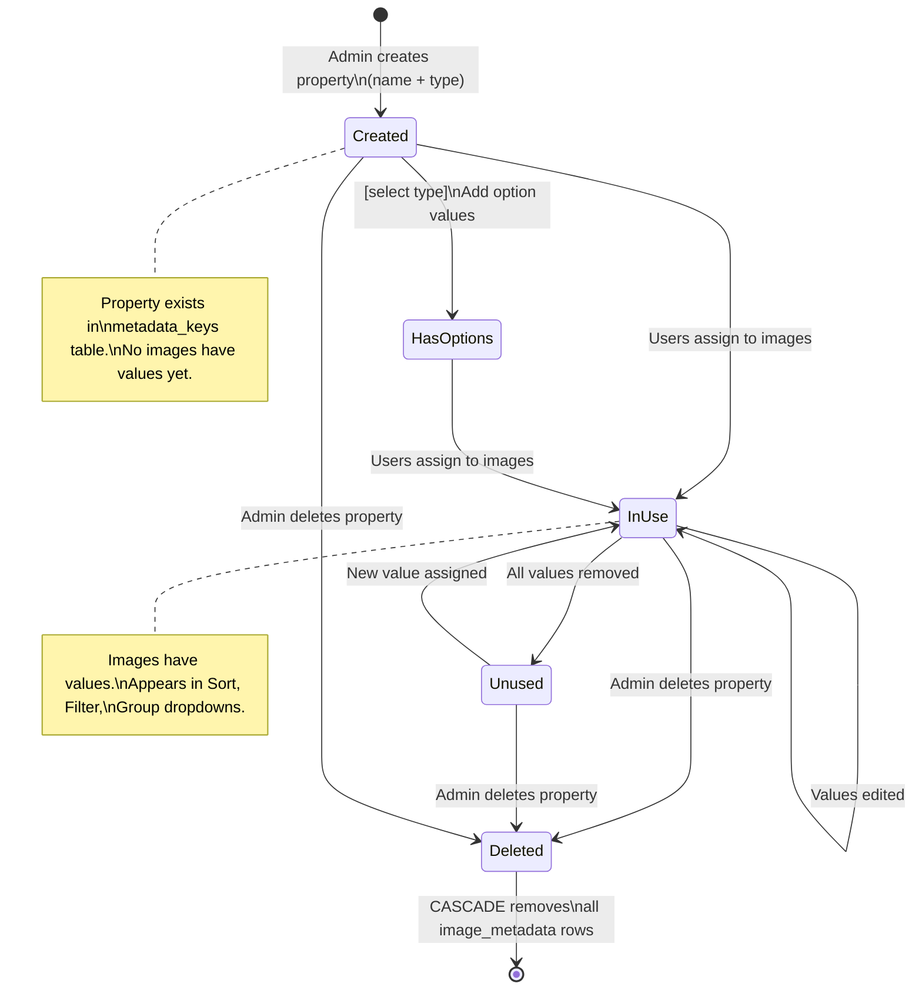
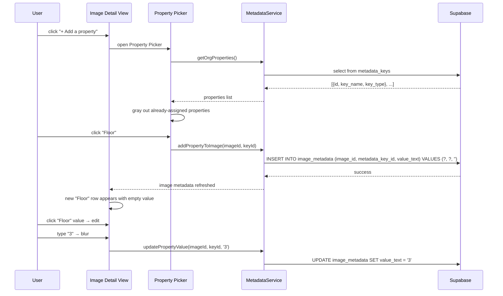
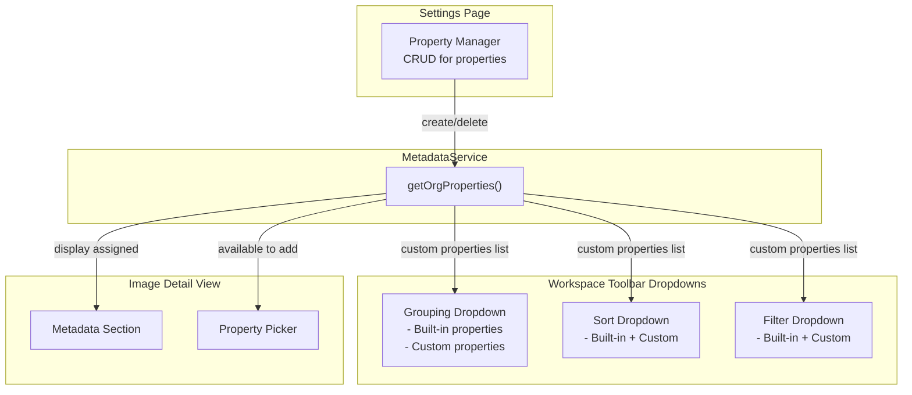

# Custom Properties

## What It Is

A system for defining and managing user-created metadata keys that can be attached to any image. Follows the Notion "property" pattern: an organization defines property names (e.g., "Material", "Floor", "Building Type"), then individual images can have values for any subset of those properties. Not every image needs every property — properties are sparse. Custom properties are the foundation for grouping, sorting, and filtering.

## Design Pattern: Notion-Style Sparse Properties

The core insight from Notion's property system:

1. **Properties are defined at the organization level** — like database columns in Notion. Any user in the org can create a new property.
2. **Values are assigned per image** — like cell values in Notion. An image may have values for 3 of 20 available properties.
3. **Properties have types** — text (free-form), select (choose from predefined options), multi-select, number, date, checkbox. Type determines input UI and valid filter operators.
4. **Property values are searchable, filterable, groupable, and sortable** across the entire image library.

### Schema Alignment

The existing database already supports this pattern:

- `metadata_keys` table = property definitions (org-scoped, unique key_name per org)
- `image_metadata` table = property values (image_id + metadata_key_id + value_text)

**Enhancement needed**: The current schema stores all values as `value_text`. For typed properties (select, number, date), we need either:

- **(A) Type column on `metadata_keys`**: add `key_type` enum (`text`, `select`, `number`, `date`, `checkbox`) — preferred, simpler
- **(B) Multiple value columns**: `value_text`, `value_number`, `value_date` — more normalized but complex

**Recommendation**: Option (A) — add `key_type` to `metadata_keys`. Keep `value_text` as the universal storage format and parse on read. This matches Notion's approach where the property type defines the UI, not the storage format.

## Where Properties Are Managed

Properties can be managed from three places:

### 1. Property Manager (Settings page)

Full CRUD for organization properties. Accessible from Settings → Properties.

### 2. Image Detail View — Metadata Section

Add/edit property values for a specific image. The existing `MetadataPropertyRowComponent` already supports click-to-edit. Enhancement: add a "+ Add a property" row that opens a property picker.

### 3. Inline in Dropdowns

When a grouping, sort, or filter dropdown shows "Available" properties, each also shows a "+ Create property" option at the bottom.

## What It Looks Like

### Property Manager (Settings → Properties)

A full-width list inside the Settings page. Each row is a `.ui-item`:

- **Leading icon**: type indicator (Aa for text, ▾ for select, # for number, 📅 for date, ☑ for checkbox)
- **Label**: property name (e.g., "Material")
- **Trailing**: type badge + delete button (×, hover-only)

At the bottom: "+ New property" row. Clicking opens an inline creation form:

- Name input (text)
- Type selector (dropdown: Text, Select, Number, Date, Checkbox)
- For Select type: option chips input (add/remove predefined values)

### Property Picker (Image Detail View → "+ Add a property")

A compact floating dropdown (12rem / 192px wide) showing available properties. Search input at top. Click a property to add it to the image (creates an `image_metadata` row with empty value). Properties already on the image are grayed out.

## Actions

| #   | User Action                                  | System Response                                                             | Triggers                      |
| --- | -------------------------------------------- | --------------------------------------------------------------------------- | ----------------------------- |
| 1   | Clicks "+ New property" in Property Manager  | Inline creation form appears                                                | Form visible                  |
| 2   | Fills name + selects type + confirms         | Property created in `metadata_keys`                                         | DB insert, list updates       |
| 3   | Clicks × on a property in Property Manager   | Confirmation dialog ("Delete 'Material'? This removes it from all images.") | Property deleted if confirmed |
| 4   | Clicks "+ Add a property" in Image Detail    | Property Picker dropdown opens                                              | Picker opens                  |
| 5   | Clicks a property in the picker              | `image_metadata` row created with empty value; row appears in detail view   | DB insert, detail updates     |
| 6   | Edits a property value in Image Detail       | `image_metadata.value_text` updated                                         | DB update                     |
| 7   | Clicks × on a property value in Image Detail | `image_metadata` row deleted                                                | DB delete, row removed        |
| 8   | Searches in Property Picker                  | Filters visible properties by name                                          | `searchTerm` changes          |

## Component Hierarchy

### Property Manager (Settings)

```
PropertyManager                            ← .ui-container, full-width section
├── SectionHeader "Properties"             ← --text-h2
├── PropertyList                           ← vertical stack
│   └── PropertyRow × N                    ← .ui-item
│       ├── TypeIcon                       ← .ui-item-media, type-specific icon
│       ├── PropertyName                   ← .ui-item-label
│       ├── TypeBadge                      ← chip, --text-caption
│       └── [hover] DeleteButton (×)       ← ghost, trailing
├── [creating] NewPropertyForm             ← inline row
│   ├── NameInput                          ← text input
│   ├── TypeSelect                         ← compact dropdown
│   ├── [select type] OptionChipsInput     ← tag input for predefined values
│   └── ConfirmButton                      ← ghost "Create"
└── NewPropertyButton                      ← ghost "+ New property"
```

### Property Picker (Image Detail View)

```
PropertyPicker                             ← floating dropdown, 12rem, --color-bg-elevated, shadow-xl
├── SearchInput                            ← compact, "Search properties…"
├── PropertyOptionList                     ← scrollable
│   └── PropertyOption × N                 ← .ui-item, click to add
│       ├── TypeIcon                       ← type-specific
│       ├── PropertyName                   ← label
│       └── [already on image] DisabledState ← grayed out
└── InlineCreateButton                     ← "+ Create new property"
```

## Data Requirements

| Field                 | Source                                                                                         | Type              |
| --------------------- | ---------------------------------------------------------------------------------------------- | ----------------- |
| Org properties        | `supabase.from('metadata_keys').select('id, key_name, key_type').eq('org_id', org)`            | `MetadataKey[]`   |
| Image property values | `supabase.from('image_metadata').select('metadata_key_id, value_text').eq('image_id', id)`     | `ImageMetadata[]` |
| Select options        | `supabase.from('metadata_key_options').select('id, value').eq('key_id', keyId)` (future table) | `KeyOption[]`     |

### Database Enhancement: Property Types

```sql
-- Migration: Add key_type to metadata_keys
ALTER TABLE metadata_keys
  ADD COLUMN key_type text NOT NULL DEFAULT 'text'
  CHECK (key_type IN ('text', 'select', 'number', 'date', 'checkbox'));

-- Optional: predefined select options (for Select-type properties)
CREATE TABLE metadata_key_options (
  id uuid PRIMARY KEY DEFAULT gen_random_uuid(),
  metadata_key_id uuid NOT NULL REFERENCES metadata_keys(id) ON DELETE CASCADE,
  value text NOT NULL,
  sort_order int NOT NULL DEFAULT 0,
  UNIQUE (metadata_key_id, value)
);
```

## State

| Name              | Type                    | Default  | Controls                             |
| ----------------- | ----------------------- | -------- | ------------------------------------ |
| `orgProperties`   | `MetadataKeyWithType[]` | `[]`     | Available properties for the org     |
| `imageProperties` | `ImageMetadataEntry[]`  | `[]`     | Properties assigned to current image |
| `isCreating`      | `boolean`               | `false`  | Property creation form visible       |
| `newPropertyName` | `string`                | `''`     | New property name                    |
| `newPropertyType` | `PropertyType`          | `'text'` | New property type                    |

Where `PropertyType` = `'text' | 'select' | 'number' | 'date' | 'checkbox'`.

## File Map

| File                                                                 | Purpose                          |
| -------------------------------------------------------------------- | -------------------------------- |
| `features/settings/property-manager/property-manager.component.ts`   | Settings page property CRUD      |
| `features/settings/property-manager/property-manager.component.html` | Template                         |
| `features/settings/property-manager/property-manager.component.scss` | Styles                           |
| `features/map/workspace-pane/property-picker.component.ts`           | Floating property picker         |
| `core/metadata.service.ts`                                           | Property CRUD + value management |
| `supabase/migrations/XXXXXXX_metadata_key_types.sql`                 | key_type column + options table  |

## Wiring

- `PropertyManager` is a section inside the Settings page (`/settings`)
- `PropertyPicker` is used inside `ImageDetailViewComponent` at the bottom of the metadata section
- `MetadataService` provides CRUD for properties and values, shared across all consumers
- Grouping, Sort, and Filter dropdowns all query `MetadataService.getOrgProperties()` for the custom properties list

## Acceptance Criteria

- [ ] Properties can be created with a name and type
- [ ] Property types: text, select, number, date, checkbox
- [ ] Properties are org-scoped (all users in org see them)
- [ ] Not every image needs every property (sparse)
- [ ] Image Detail View shows "+ Add a property" at the bottom of metadata section
- [ ] Property Picker shows available properties with search
- [ ] Already-added properties are grayed out in the picker
- [ ] Property values can be edited inline (existing MetadataPropertyRow)
- [ ] Property values can be removed (× button)
- [ ] Property Manager in Settings allows full CRUD
- [ ] Delete property shows confirmation ("removes from all images")
- [ ] Custom properties appear in Grouping, Sort, and Filter dropdowns
- [ ] Select-type properties support predefined option values

---

## Custom Properties Data Model



## Property Lifecycle



## Property Assignment Flow



## Integration with Workspace Toolbar


