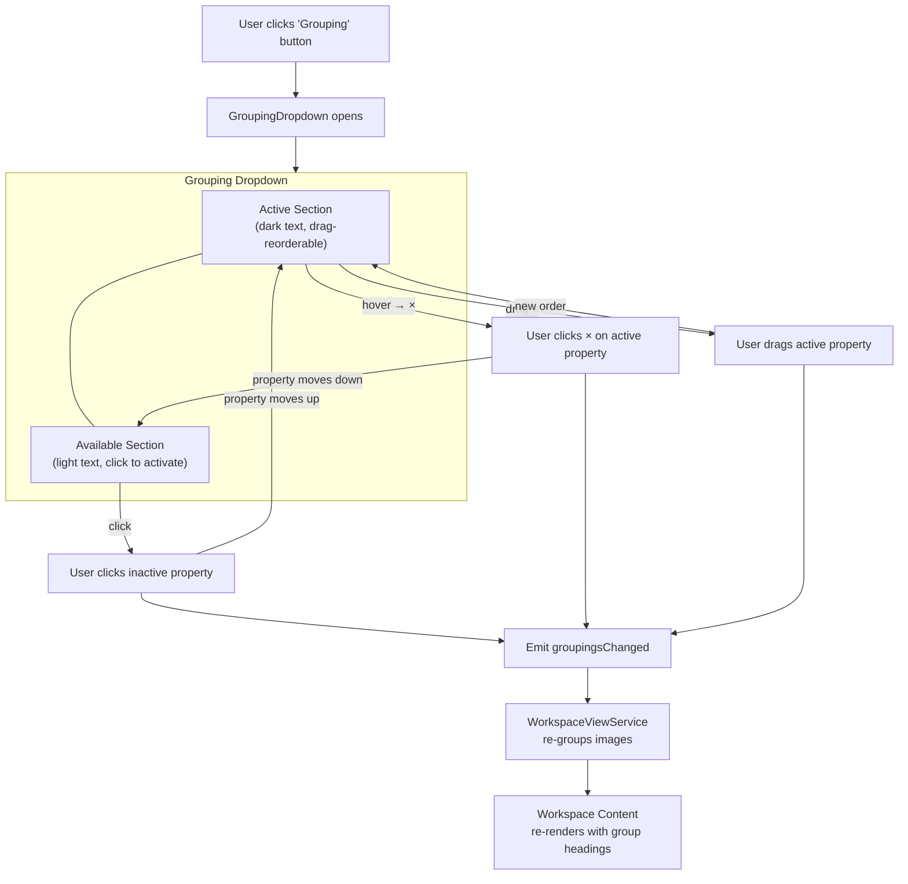
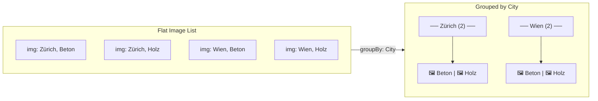
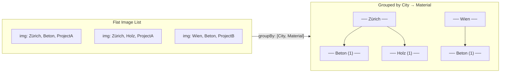
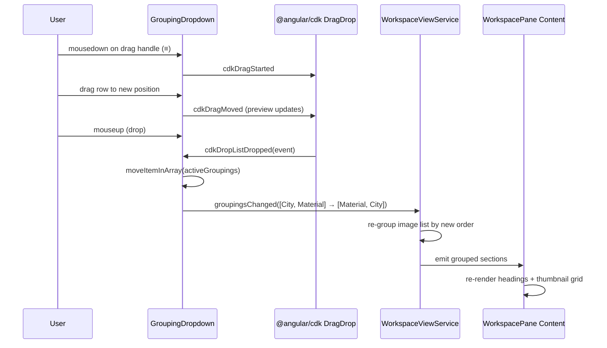

# Grouping Dropdown

## What It Is

A dropdown that lets the user choose which image property to group by. Groups organize the workspace pane content into sections with headings. Properties are drag-reorderable to control multi-level grouping priority. The dropdown has two sections: active (dark text, currently grouping) and available (lighter text, inactive). Inspired by Notion's "Group" database view control.

## What It Looks Like

A floating dropdown anchored below the "Grouping" toolbar button. Width: 15rem (240px). `--color-bg-elevated` background, `shadow-xl`, `rounded-lg` corners. Two sections separated by a `--color-border` line:

- **Upper section (Active)**: properties currently used for grouping. Text in `--color-text-primary`. Each row has a drag handle icon (≡, `drag_indicator` Material Icon) on the left. Rows are drag-reorderable.
- **Lower section (Available)**: properties not currently grouping. Text in `--color-text-secondary`. Click to activate (moves to upper section).

Each row is a `.ui-item` with a leading icon area and label. Active rows show a remove (×) button on the right on hover (Quiet Actions pattern).

## Where It Lives

- **Parent**: `WorkspaceToolbarComponent`
- **Appears when**: User clicks the "Grouping" toolbar button
- **Positioned**: Below the button, left-aligned

## Actions

| #   | User Action                             | System Response                                                                             | Triggers                  |
| --- | --------------------------------------- | ------------------------------------------------------------------------------------------- | ------------------------- |
| 1   | Clicks an available (inactive) property | Moves property from lower section to upper section (activates grouping); workspace regroups | `activeGroupings` updated |
| 2   | Clicks × on an active property          | Removes property from grouping; workspace regroups                                          | `activeGroupings` updated |
| 3   | Drags an active property up/down        | Reorders grouping priority; workspace regroups live                                         | `activeGroupings` reorder |
| 4   | Clicks outside or Escape                | Closes dropdown                                                                             | Dropdown closes           |
| 5   | Hovers a row in upper section           | Reveals drag handle (≡) and remove (×) button                                               | Opacity 0→1, 80ms         |

## Component Hierarchy

```
GroupingDropdown                           ← floating dropdown, --color-bg-elevated, shadow-xl, rounded-lg
├── ActiveSection                          ← upper part
│   ├── SectionLabel "Grouped by"          ← --text-caption, --color-text-secondary
│   └── DraggableList                      ← CDK DragDrop or native drag
│       └── GroupingRow × N                ← .ui-item, drag handle + label + (×)
│           ├── DragHandle (≡)             ← leading icon, visible on hover
│           ├── PropertyLabel              ← property name, --color-text-primary
│           └── [hover] RemoveButton (×)   ← trailing action, ghost
├── Divider                                ← 1px --color-border
└── AvailableSection                       ← lower part
    ├── SectionLabel "Available"           ← --text-caption, --color-text-secondary
    └── GroupingRow × N                    ← .ui-item, click to activate
        └── PropertyLabel                  ← property name, --color-text-secondary
```

## Data

| Field               | Source                                                                               | Type            |
| ------------------- | ------------------------------------------------------------------------------------ | --------------- |
| Built-in properties | Hardcoded list: Address, City, Country, Date, Project, User                          | `PropertyDef[]` |
| Custom properties   | `supabase.from('metadata_keys').select('id, key_name').eq('organization_id', orgId)` | `MetadataKey[]` |

## State

| Name              | Type            | Default | Controls                                     |
| ----------------- | --------------- | ------- | -------------------------------------------- |
| `activeGroupings` | `PropertyRef[]` | `[]`    | Ordered list of properties used for grouping |
| `availableProps`  | `PropertyDef[]` | all     | Properties not in activeGroupings            |

Where `PropertyRef` = `{ type: 'builtin' | 'custom'; key: string; id?: string }`.

## File Map

| File                                                           | Purpose                    |
| -------------------------------------------------------------- | -------------------------- |
| `features/map/workspace-pane/grouping-dropdown.component.ts`   | Dropdown with drag-reorder |
| `features/map/workspace-pane/grouping-dropdown.component.html` | Template                   |
| `features/map/workspace-pane/grouping-dropdown.component.scss` | Styles                     |

## Wiring

- Rendered inside `WorkspaceToolbarComponent` via `@if (activeDropdown() === 'grouping')`
- Emits `groupingsChanged` with ordered `PropertyRef[]` to `WorkspaceViewService`
- `WorkspaceViewService` re-groups the image list and emits grouped sections to the content area

## Acceptance Criteria

- [ ] Two sections: active (dark text) and available (light text)
- [ ] Divider line between sections
- [ ] Click on available property activates it (moves to upper section)
- [ ] Click × on active property deactivates it
- [ ] Drag handle on active rows for reordering
- [ ] Drag reorder updates grouping priority live
- [ ] Workspace pane content regrouped on every change
- [ ] Built-in properties: Address, City, Country, Date, Project, User
- [ ] Custom metadata keys appear in available list
- [ ] Quiet Actions: drag handle and × visible only on hover

---

## Grouping Flow



## Grouping Rendering in Workspace



## Multi-Level Grouping



## Drag Reorder Interaction (CDK DragDrop)


