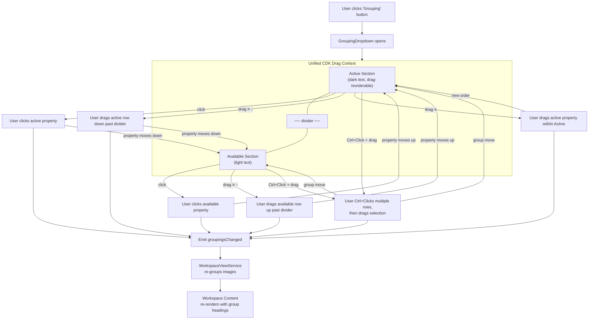
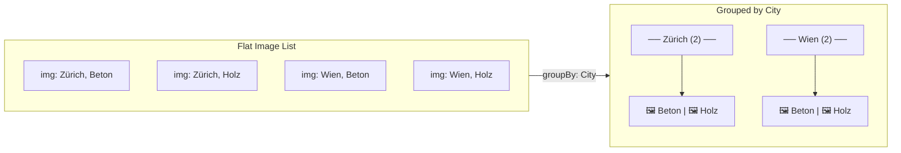
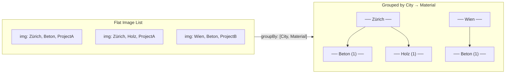
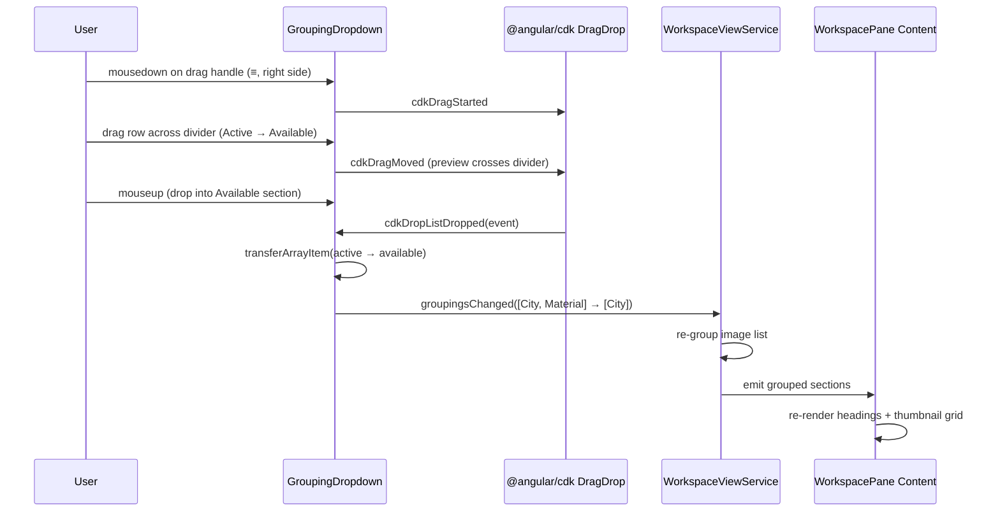
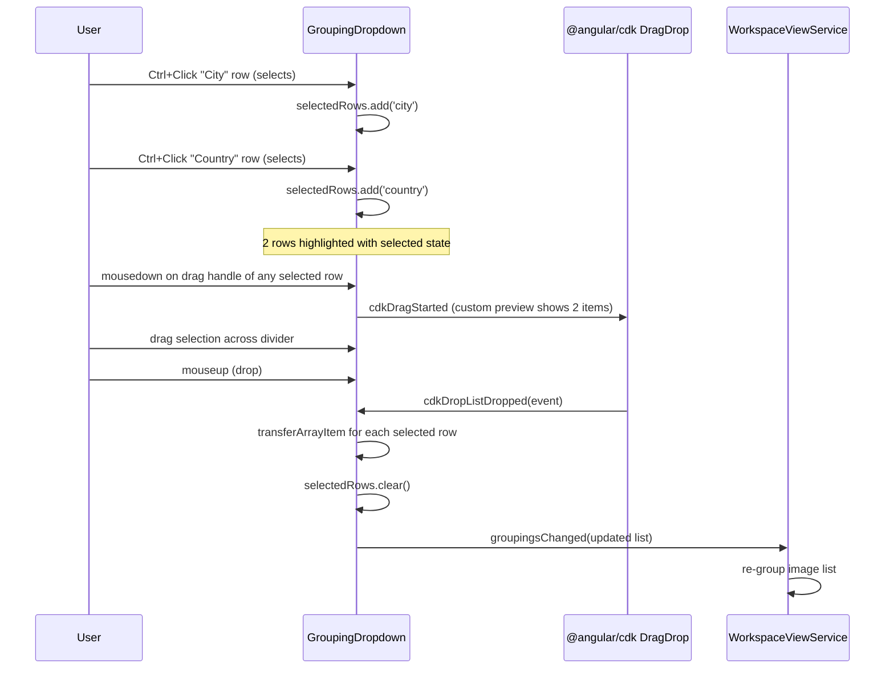
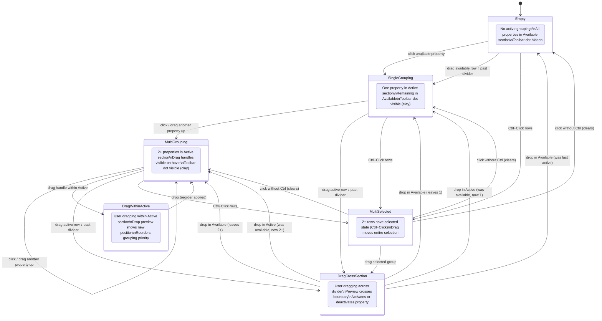
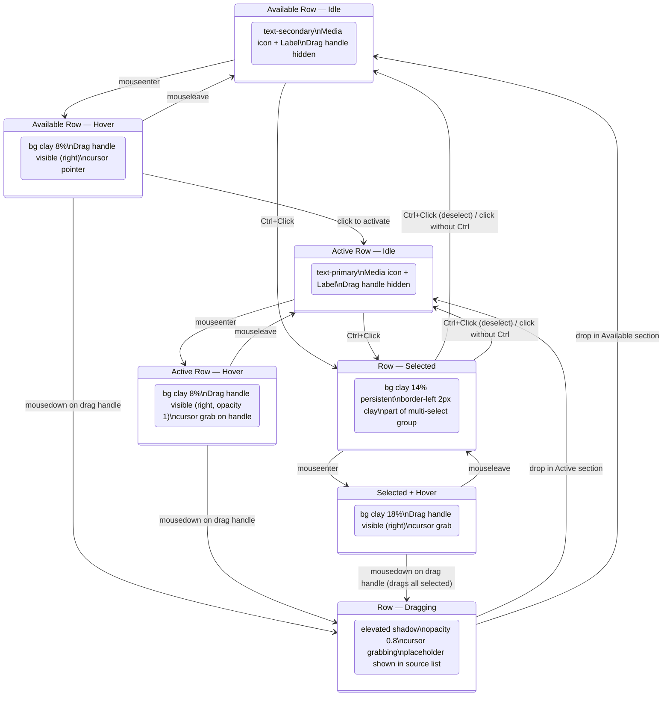

# Grouping Dropdown

## What It Is

A dropdown that lets the user choose which image property to group by. Groups organize the workspace pane content into sections with headings. Properties are drag-reorderable to control multi-level grouping priority. The dropdown has two sections: active (dark text, currently grouping) and available (lighter text, inactive). Inspired by Notion's "Group" database view control.

## What It Looks Like

A floating dropdown anchored below the "Grouping" toolbar button. Width: 15rem (240px). `--color-bg-elevated` background, `shadow-xl`, `rounded-lg` corners. Two sections separated by a `--color-border` line:

- **Upper section (Active)**: properties currently used for grouping. Text in `--color-text-primary`. Header row: **"Grouped by" label (left) + "Empty" button (right)**. The "Empty" button is a small text button (`.dd-clear-btn`) that clears all active groupings, moving every property back to Available. Only visible when there is at least one active grouping. Each property row layout: **Media icon → Label → Drag handle (≡)**. Drag handle visible on hover only (Quiet Actions pattern). Rows are drag-reorderable within the section. **Click** an active row to deactivate it (moves to Available); rows can also be **dragged** downward past the divider into Available to deactivate.
- **Lower section (Available)**: properties not currently grouping. Text in `--color-text-secondary`. Click to activate (moves to upper section). Rows can also be dragged upward past the divider into Active to activate.

Each row is a `.ui-item` with a leading media area, a label, and a trailing drag handle (≡, `drag_indicator` Material Icon) on the right. There is **no × remove button** — deactivation is done by **clicking an active row** (moves it back to Available) or by **dragging it down past the divider** into the Available section.

**Multi-select**: Ctrl+Click selects multiple rows (applied `selected` visual). Dragging any selected row moves the entire selection as a group. Clicking without Ctrl clears the selection.

## Where It Lives

- **Parent**: `WorkspaceToolbarComponent`
- **Appears when**: User clicks the "Grouping" toolbar button
- **Positioned**: Below the button, left-aligned

## Actions

| #   | User Action                                            | System Response                                                                                    | Triggers                      |
| --- | ------------------------------------------------------ | -------------------------------------------------------------------------------------------------- | ----------------------------- |
| 1   | Clicks an available (inactive) property                | Moves property from Available to Active section (activates grouping); workspace regroups           | `activeGroupings` updated     |
| 2   | Clicks an active property                              | Moves property from Active to Available section (deactivates grouping); workspace regroups         | `activeGroupings` updated     |
| 3   | Drags an active row down past the divider              | Moves property from Active to Available (deactivates grouping); workspace regroups                 | `activeGroupings` updated     |
| 4   | Drags an available row up past the divider             | Moves property from Available to Active (activates grouping); workspace regroups                   | `activeGroupings` updated     |
| 5   | Drags an active property up/down within Active section | Reorders grouping priority; workspace regroups live                                                | `activeGroupings` reorder     |
| 6   | Ctrl+Click on a row                                    | Toggles selection on the row (adds/removes from multi-select). Does not activate/deactivate.       | `selectedRows` updated        |
| 7   | Drags any selected row (with multi-select active)      | Moves the entire selection group to the drop target section/position                               | `activeGroupings` bulk update |
| 8   | Clicks a row without Ctrl                              | Clears multi-selection; performs single-click action (activate if available, deactivate if active) | `selectedRows` cleared        |
| 9   | Clicks outside or Escape                               | Closes dropdown, clears selection                                                                  | Dropdown closes               |
| 10  | Hovers a row                                           | Reveals drag handle (≡) on the right side                                                          | Opacity 0→1, 80ms             |
| 11  | Clicks "Empty" button next to "Grouped by" header      | Moves all active groupings back to Available; workspace ungroups                                   | `activeGroupings` cleared     |

## Component Hierarchy

```
GroupingDropdown                           ← floating dropdown, --color-bg-elevated, shadow-xl, rounded-lg
├── UnifiedDragContext (cdkDropListGroup)   ← single CDK drag context spanning both sections
│   ├── ActiveSection (cdkDropList)         ← upper drop zone
│   │   ├── SectionHeader                  ← flex row: label left, button right
│   │   │   ├── SectionLabel "Grouped by"   ← --text-caption, --color-text-secondary
│   │   │   └── EmptyButton "Empty"        ← text button, visible only when activeGroupings.length > 0
│   │   └── GroupingRow × N                ← .ui-item, cdkDrag
│   │       ├── MediaIcon                  ← leading property icon (e.g. calendar, location)
│   │       ├── PropertyLabel              ← property name, --color-text-primary
│   │       └── [hover] DragHandle (≡)     ← trailing icon, visible on hover, cdkDragHandle
│   ├── Divider                            ← 1px --color-border (visual only, not a drag boundary)
│   └── AvailableSection (cdkDropList)     ← lower drop zone
│       ├── SectionLabel "Available"       ← --text-caption, --color-text-secondary
│       └── GroupingRow × N                ← .ui-item, cdkDrag, click to activate
│           ├── MediaIcon                  ← leading property icon
│           ├── PropertyLabel              ← property name, --color-text-secondary
│           └── [hover] DragHandle (≡)     ← trailing icon, visible on hover, cdkDragHandle
```

## Data

| Field               | Source                                                                                     | Type            |
| ------------------- | ------------------------------------------------------------------------------------------ | --------------- |
| Built-in properties | Hardcoded list: Date, Year, Month, Project, City, District, Street, Country, Address, User | `PropertyDef[]` |
| Custom properties   | `supabase.from('metadata_keys').select('id, key_name').eq('organization_id', orgId)`       | `MetadataKey[]` |

### Built-in Grouping Property Data Sources

| Property | Image Field    | Derivation                                 | Fallback             |
| -------- | -------------- | ------------------------------------------ | -------------------- |
| Date     | `capturedAt`   | `toLocaleDateString(full)` on client       | `"Unknown date"`     |
| Year     | `capturedAt`   | `getFullYear()` on client                  | `"Unknown year"`     |
| Month    | `capturedAt`   | `toLocaleDateString(year+month)` on client | `"Unknown month"`    |
| Project  | `projectName`  | JOIN via `cluster_images` RPC              | `"No project"`       |
| City     | `city`         | Structured column from reverse geocoding   | `"Unknown city"`     |
| District | `district`     | Structured column from reverse geocoding   | `"Unknown district"` |
| Street   | `street`       | Structured column from reverse geocoding   | `"Unknown street"`   |
| Country  | `country`      | Structured column from reverse geocoding   | `"Unknown country"`  |
| Address  | `addressLabel` | Full human-readable address                | `"Unknown address"`  |
| User     | `userName`     | JOIN profiles via `cluster_images` RPC     | `"Unknown user"`     |

See also: [photo-grouping-data use case](../use-cases/photo-grouping-data.md) for full derivation flow.

## State

| Name              | Type            | Default | Controls                                                   |
| ----------------- | --------------- | ------- | ---------------------------------------------------------- |
| `activeGroupings` | `PropertyRef[]` | `[]`    | Ordered list of properties used for grouping               |
| `availableProps`  | `PropertyDef[]` | all     | Properties not in activeGroupings                          |
| `selectedRows`    | `Set<string>`   | empty   | Row keys currently multi-selected via Ctrl+Click           |
| `isDragging`      | `boolean`       | `false` | True while any row is being dragged (cdkDragStarted/Ended) |

Where `PropertyRef` = `{ type: 'builtin' | 'custom'; key: string; id?: string }`.

## File Map

| File                                                                             | Purpose                                      |
| -------------------------------------------------------------------------------- | -------------------------------------------- |
| `features/map/workspace-pane/workspace-toolbar/grouping-dropdown.component.ts`   | Dropdown with drag-reorder (inline template) |
| `features/map/workspace-pane/workspace-toolbar/grouping-dropdown.component.scss` | Styles                                       |

## Wiring

- Rendered inside `WorkspaceToolbarComponent` via `@if (activeDropdown() === 'grouping')`
- Emits `groupingsChanged` with ordered `PropertyRef[]` to `WorkspaceViewService`
- `WorkspaceViewService` re-groups the image list and emits grouped sections to the content area

## Acceptance Criteria

- [x] Two sections: active (dark text) and available (light text)
- [x] Divider line between sections (visual only — drag crosses it freely)
- [x] Click on available property activates it (moves to upper section)
- [x] Click on active property deactivates it (moves to lower section)
- [x] No × button — deactivation is done by clicking an active row or dragging it past the divider into Available
- [x] Drag handle on the **right** (trailing) side of each row, visible on hover only (Quiet Actions)
- [x] Row layout: Media icon → Label → Drag handle (≡)
- [x] Single CDK DragDrop context spanning both sections (cross-section dragging)
- [x] Dragging from Active ↓ past divider → deactivates property
- [x] Dragging from Available ↑ past divider → activates property
- [x] Drag reorder within Active updates grouping priority live
- [x] Ctrl+Click multi-selects rows; dragging any selected row moves the entire selection
- [x] Click without Ctrl clears multi-selection
- [x] Workspace pane content regrouped on every change (emits `groupingsChanged`)
- [x] Built-in properties: Address, City, Country, Date, Project, User
- [ ] Custom metadata keys appear in available list
- [x] Dropdown uses `position: fixed` to escape overflow
- [x] Row hover: clay 8% background tint
- [x] Active row: text-primary, inactive row: text-secondary
- [x] Selected row: clay 14% background, 2px left border
- [x] CDK drag preview: elevated shadow, opacity 0.9
- [x] CDK drag placeholder: dashed border, 40% opacity
- [ ] "Empty" button on the right of the "Grouped by" header — clears all active groupings
- [ ] Empty drop target: idle → "No grouping applied" (disabled text, no border)
- [ ] Empty drop target: drag active → "Drop here to group" (dashed border, clay 4% bg)
- [ ] Empty drop target: receiving → stronger highlight (clay 10% bg, clay dashed outline)
- [ ] `isDragging` signal tracks drag lifecycle (cdkDragStarted/cdkDragEnded)

---

## Grouping Flow



## Grouping Rendering in Workspace



## Multi-Level Grouping



## Empty Drop Target Pattern

When the Active section has no groupings, the drop zone must give clear visual feedback across the full drag lifecycle. A local signal `isDragging` tracks whether any row in the dropdown is being dragged.

### Empty Drop Zone States

| State                        | Condition                                          | Visual                                                                                                                       |
| ---------------------------- | -------------------------------------------------- | ---------------------------------------------------------------------------------------------------------------------------- |
| **Idle**                     | `activeGroupings.length === 0` and `!isDragging()` | "No grouping applied" in `--color-text-disabled`, no border                                                                  |
| **Drag active (invitation)** | `activeGroupings.length === 0` and `isDragging()`  | Dashed `--color-border` outline, text changes to "Drop here to group", `--color-text-secondary`, subtle `clay 4%` background |
| **Receiving (hover)**        | CDK adds `.cdk-drop-list-receiving`                | Strong `clay 10%` background, dashed `--color-clay` outline, text in `--color-text-primary`                                  |

### Implementation

- `isDragging = signal(false)` — set `true` on any `cdkDragStarted`, set `false` on any `cdkDragEnded`
- The `.dd-empty` placeholder and the `cdkDropList` drop zone are the **same element** — `.dd-drop-zone--empty` carries both roles
- Class binding: `[class.dd-drop-zone--dragging]="isDragging()"` on the drop zone
- CDK automatically adds `.cdk-drop-list-receiving` when a dragged item enters the zone — styles layer on top
- The `.dd-empty` text content switches via `@if (isDragging())` between "Drop here to group" and "No grouping applied"

### State flow

```
┌─────────────────────────────────┐
│  Idle                           │
│  "No grouping applied"          │
│  text-disabled, no border       │
├─────────────────────────────────┤
│         cdkDragStarted ↓        │
├─────────────────────────────────┤
│  Drag Active (invitation)       │
│  "Drop here to group"           │
│  text-secondary, border dashed  │
│  clay 4% bg                     │
├─────────────────────────────────┤
│     cursor enters zone ↓        │
├─────────────────────────────────┤
│  Receiving (hover)              │
│  "Drop here to group"           │
│  text-primary, clay outline     │
│  clay 10% bg                    │
└─────────────────────────────────┘
      ↓ cdkDragEnded → back to Idle
```

## Cross-Section Drag Interaction (CDK DragDrop)

Both sections share a `cdkDropListGroup`. Each section is a `cdkDropList` connected to the other via `[cdkDropListConnectedTo]`. Dragging an item across the divider transfers it between lists.

### Single-Item Drag



### Multi-Select Drag



## Grouping Dropdown — State Machine



## Grouping Row States



## Row Layout

```
┌─────────────────────────────────────┐
│  [icon]   Property Name        [≡]  │
│  media    label           drag handle│
│  (leading)               (trailing)  │
└─────────────────────────────────────┘

  • Media icon: always visible, property-type icon (calendar, location_on, etc.)
  • Label: always visible, property name
  • Drag handle (≡): trailing, visible on hover only (Quiet Actions)
  • No × button anywhere
```
