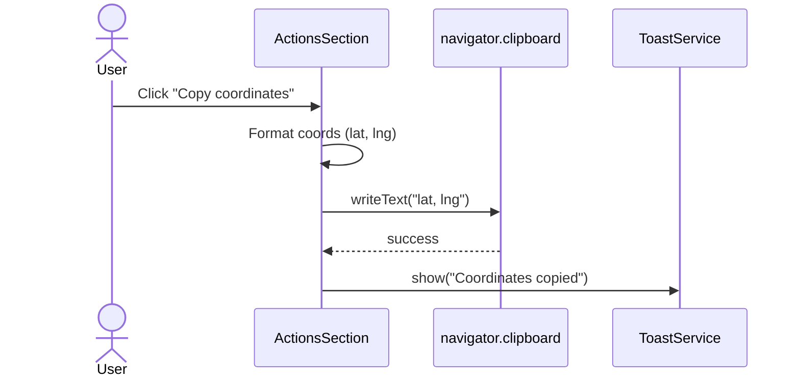
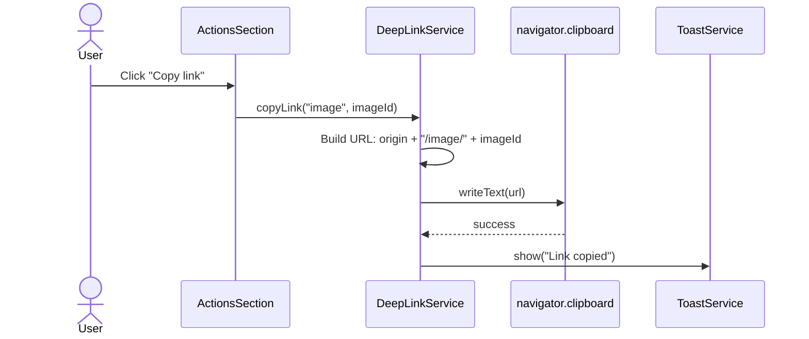
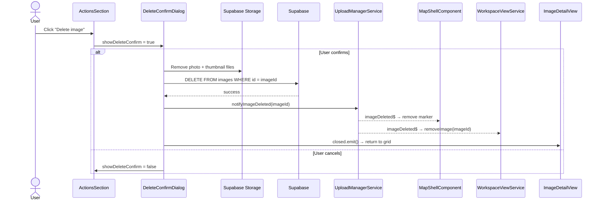
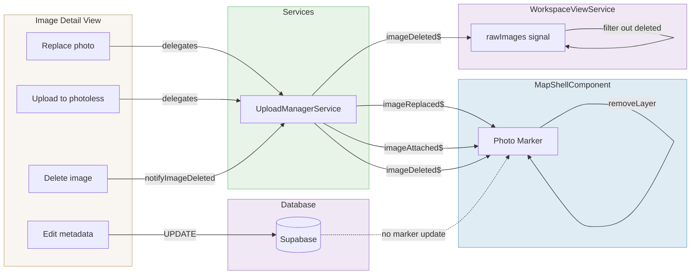

# Image Detail — Actions & Marker Sync

> **Parent spec:** [image-detail-view](image-detail-view.md)
> **Upload manager use cases:** [use-cases/upload-manager.md](../use-cases/upload-manager.md)
> **Map shell use cases:** [use-cases/map-shell.md](../use-cases/map-shell.md)

## What It Is

The actions section at the bottom of the Image Detail View and the marker synchronization system that keeps map markers up to date when image properties change. Actions include coordinate copying, entry link copying, and image deletion.

> **Removed actions:** "Edit location" and "Add to project" were removed from this section. Project assignment is handled by [inline editing](image-detail-inline-editing.md) (project row click-to-edit) and the Quick Info Bar project chip. Location correction is a map-layer operation initiated from the map shell context, not from a detail-view button.

## What It Looks Like

Actions use **`dd-item`** button styling — not bordered outline buttons. Each action is a full-width row with a leading Material icon (`1rem`, `--color-text-secondary`), label text (`0.8125rem`), `dd-item` hover (warm clay tint), and `--radius-sm` border radius. A `dd-divider` separates destructive actions from normal ones. The delete action uses `dd-item--danger` style (red icon + label).

```pseudo
┌─ 📋  Copy coordinates        ─┐   ← dd-item style, clay hover
├─ 🔗  Copy link                ─┤   ← dd-item style, clay hover
├──────────────────────────────-─┤   ← dd-divider
└─ 🗑️  Delete image            ─┘   ← dd-item--danger style
```

## Where It Lives

- **Parent**: `ImageDetailViewComponent` — ActionsSection at bottom of metadata column
- **Appears when**: Image detail view is open and image data is loaded

## Actions

| #   | User Action               | System Response                                           | Triggers                  |
| --- | ------------------------- | --------------------------------------------------------- | ------------------------- |
| 1   | Clicks "Copy coordinates" | Copies coordinates to clipboard, shows toast confirmation | Clipboard + toast         |
| 2   | Clicks "Copy link"        | Copies deep link to this entry to clipboard, shows toast  | `DeepLinkService` + toast |
| 3   | Clicks "Delete image"     | Shows delete confirmation dialog                          | `showDeleteConfirm`       |
| 4   | Confirms delete           | Deletes image from DB and storage, returns to grid        | Supabase delete           |
| 5   | Cancels delete            | Dismisses dialog                                          | Dialog dismissed          |

## Copy Link — Deep Link Service

"Copy link" copies a **deep link** to the clipboard. Any app user with access to the same organization can open the link and land directly on this entry's detail view.

### `DeepLinkService`

A lightweight injectable service (`deep-link.service.ts`) responsible for constructing deep link URLs and copying them to the clipboard. Not image-specific — reusable for any entity that needs a shareable in-app link (images now, potentially projects or groups later).

| Method     | Signature                                                 | Behavior                                                                                                                 |
| ---------- | --------------------------------------------------------- | ------------------------------------------------------------------------------------------------------------------------ |
| `copyLink` | `(entityType: string, entityId: string) => Promise<void>` | Builds URL `{origin}/{entityType}/{entityId}`, copies to clipboard via `navigator.clipboard.writeText()`, triggers toast |

**URL format:** `https://{host}/image/{imageId}` (for images)

- The route `/image/:id` resolves to the map shell with the detail view auto-opened for that entry.
- No authentication token in the URL — the recipient must be logged in and have RLS access to the entry's organization.
- If the entry doesn't exist or the user lacks access, the app shows a "not found" state.

### Future considerations (not in scope now)

- Public share links with expiring signed URLs for the photo
- Share to external apps via Web Share API (`navigator.share()`)

## Marker Sync — Live Updates

When the user makes changes in the detail view, the corresponding **photo marker on the map must update** without a full viewport refresh:

| Change Type                | Channel                               | Marker Effect                                           |
| -------------------------- | ------------------------------------- | ------------------------------------------------------- |
| Photo replaced             | `UploadManagerService.imageReplaced$` | Marker DivIcon rebuilt with new thumbnail               |
| Photo uploaded (photoless) | `UploadManagerService.imageAttached$` | Marker DivIcon updated: placeholder → real thumbnail    |
| Image deleted              | `UploadManagerService.imageDeleted$`  | Marker removed from map layer + image removed from grid |
| Address / metadata edits   | DB update only                        | No marker update needed                                 |

### Key Design Principle

The detail view **does not emit output events for marker sync**. Instead:

- **Photo changes** → delegate to `UploadManagerService` → manager emits `imageReplaced$` / `imageAttached$` → `MapShellComponent` subscribes directly
- **Image deletion** → `notifyImageDeleted()` on `UploadManagerService` → `imageDeleted$` → `MapShellComponent` removes marker, `WorkspaceViewService` removes from `rawImages`
- **Metadata edits** → saved to DB; no immediate marker visual change needed

## Component Hierarchy

```
ActionsSection                         ← dd-section-label "Actions", dd-item styled rows
├── CopyCoordinatesAction              ← dd-item: content_copy icon + "Copy coordinates"
├── CopyLinkAction                     ← dd-item: link icon + "Copy link"
├── dd-divider
└── DeleteAction                       ← dd-item--danger: delete icon + "Delete image"

[confirm] DeleteConfirmDialog          ← modal with cancel/confirm
```

## State

| Name                | Type      | Default | Controls                              |
| ------------------- | --------- | ------- | ------------------------------------- |
| `showDeleteConfirm` | `boolean` | `false` | Delete confirmation dialog visibility |

## Copy Coordinates Flow



## Copy Link Flow



## Delete Flow



## Marker Sync Flow



## Wiring

- `ActionsSection` lives inside `ImageDetailViewComponent` metadata column, rendered after `MetadataSection`
- Inject `DeepLinkService` for "Copy link" — calls `copyLink('image', imageId)`
- Inject `ToastService` for confirmation toasts on copy coordinates and copy link
- Copy coordinates reads `image().latitude` / `image().longitude` from the parent's image signal
- Delete calls `SupabaseService` to remove the storage object and the `images` row, then sets `detailImageId` to `null` to return to grid
- `UploadManagerService.imageReplaced$` / `imageAttached$` are subscribed by `MapShellComponent` directly — detail view does not broker marker sync
- No output events emitted for marker updates — all flows go through service layer

## File Map

| File                                             | Purpose                                                                                 |
| ------------------------------------------------ | --------------------------------------------------------------------------------------- |
| `apps/web/src/app/services/deep-link.service.ts` | `DeepLinkService` — builds deep links and copies to clipboard (reusable for any entity) |

## Acceptance Criteria

- [x] Actions use **dd-item** button styling (not bordered outline buttons)
- [x] Each action: leading icon + label text, `0.8125rem` font
- [x] Hover uses warm clay tint matching all dropdown items
- [x] Delete action uses `dd-item--danger` style (red icon + label)
- [x] `dd-divider` separates destructive actions from normal ones
- [x] Copy coordinates writes to clipboard with toast confirmation
- [x] Copy link copies deep link (`/image/{imageId}`) to clipboard with toast
- [ ] Deep link route opens map shell with detail view for that entry
- [x] Delete confirmation dialog shown before removal
- [ ] Replace Photo triggers marker thumbnail update via `UploadManagerService.imageReplaced$` (not direct output events)
- [ ] Photo upload to photoless row triggers marker update via `UploadManagerService.imageAttached$`
- [x] No output events for marker sync — flows through service layer
- [x] Metadata edits saved to DB only — no immediate marker visual change needed
