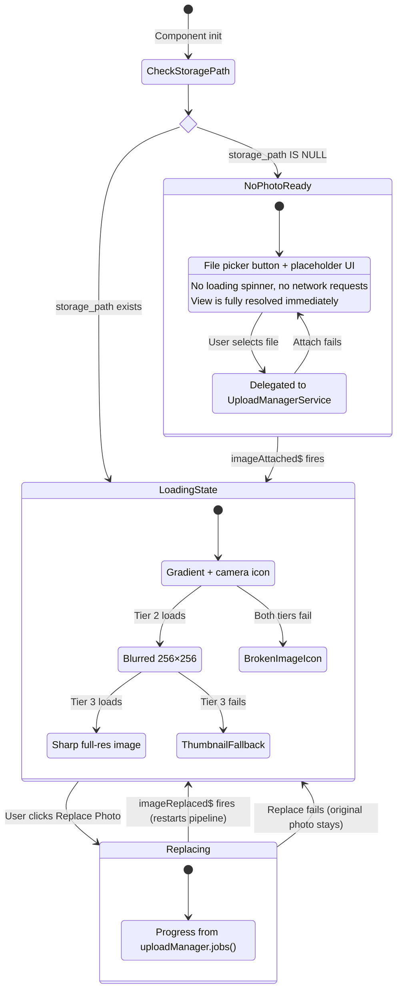
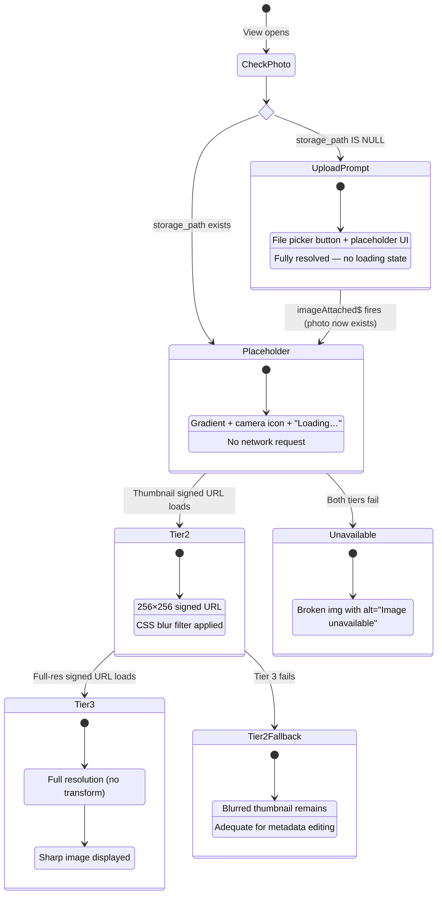
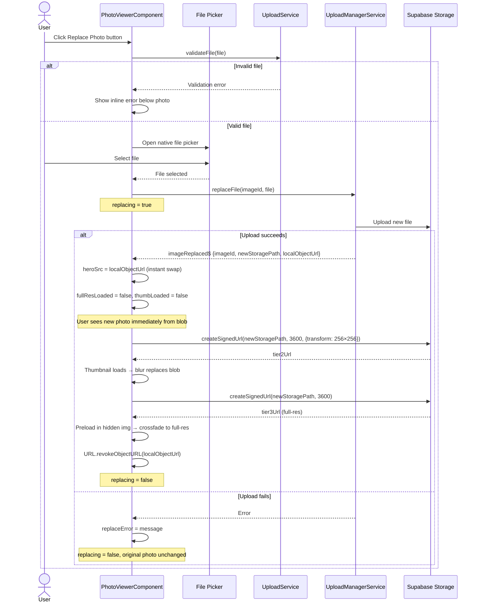
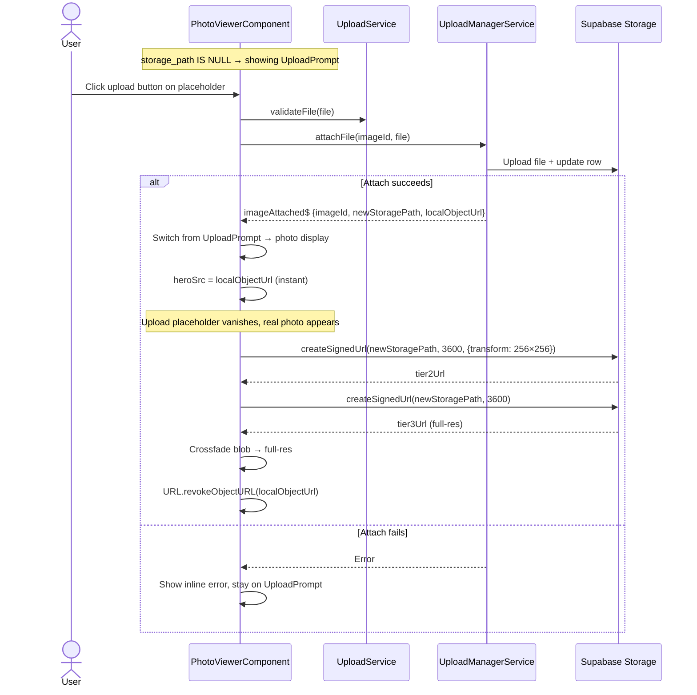
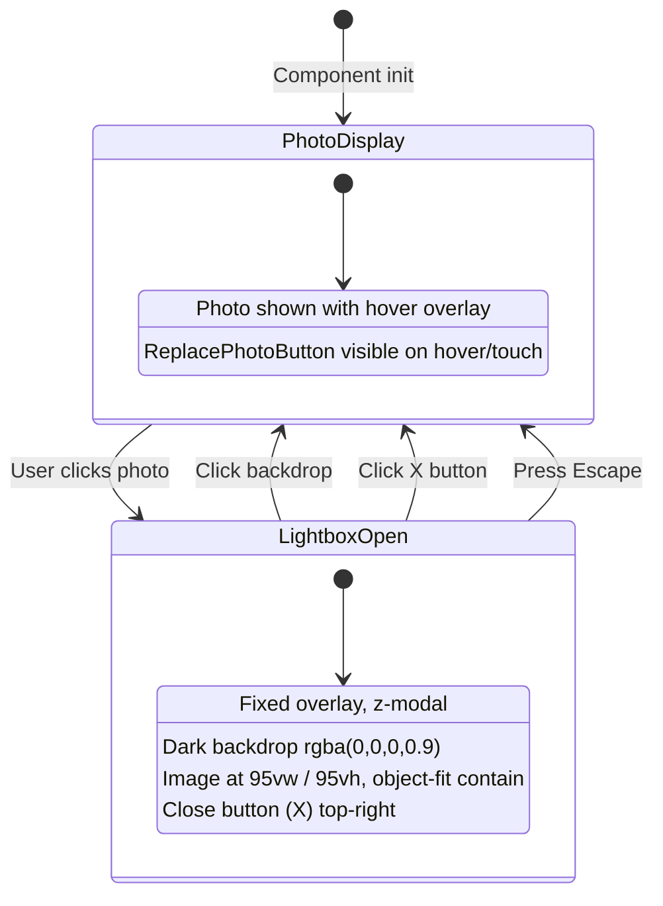

# Image Detail — Photo Viewer

> **Parent spec:** [image-detail-view](image-detail-view.md)
> **Photo loading use cases:** [use-cases/photo-loading.md](../use-cases/photo-loading.md)
> **Editing use cases:** [use-cases/image-editing.md](../use-cases/image-editing.md) (IE-10)

## What It Is

The hero photo area inside the Image Detail View. Handles progressive image loading (placeholder → thumbnail → full-res), lightbox enlargement, and photo replacement/upload for photoless datapoints. Delegates file uploads to the `UploadManagerService`.

## What It Looks Like

A rounded-corner image (`--radius-lg`) centered with side margins (`--spacing-4`). Fixed to approximately **1/3 of viewport height** (`max-height: 33vh`), 4:3 aspect ratio. On hover, a subtle `--color-primary` ring appears. A Replace Photo edit-icon button sits in the **top-right corner**, overlaid with a semi-transparent dark scrim (`rgba(0,0,0,0.5)`), visible on hover (desktop) or always (touch). When `storage_path IS NULL`, an upload prompt/placeholder is shown instead.

## Where It Lives

- **Parent**: `ImageDetailViewComponent` — placed in PhotoColumn (wide layout) or top of SingleColumnLayout (narrow)
- **Appears when**: Image detail view is open

## Actions

| #   | User Action                     | System Response                                                                                                                                   | Triggers               |
| --- | ------------------------------- | ------------------------------------------------------------------------------------------------------------------------------------------------- | ---------------------- |
| 1   | Clicks photo                    | Opens full-screen lightbox overlay (dark backdrop, `rgba(0,0,0,0.9)`). Image at `95vw / 95vh`, `object-fit: contain`. Close button (X) top-right. | Lightbox opens         |
| 2   | Clicks lightbox backdrop / X    | Closes lightbox                                                                                                                                   | Lightbox closes        |
| 3   | Presses Escape in lightbox      | Closes lightbox                                                                                                                                   | Lightbox closes        |
| 4   | Clicks Replace Photo button     | Opens file picker; delegates to `uploadManager.replaceFile(imageId, file)`                                                                        | `replacing` → true     |
| 5   | Replace upload succeeds         | `imageReplaced$` fires → `heroSrc = localObjectUrl` instantly → progressive reload restarts (Tier 2 → Tier 3) with new storage path               | `replacing` → false    |
| 6   | Replace upload fails            | Inline error below photo; no DB/storage changes                                                                                                   | `replaceError` set     |
| 7   | Clicks upload button (no photo) | Opens file picker; delegates to `uploadManager.attachFile(imageId, file)`                                                                         | Attach pipeline starts |
| 8   | Attach upload succeeds          | `imageAttached$` fires → switches from upload placeholder to photo display → progressive reload starts                                            | Photo display shown    |

## Component Hierarchy

```
PhotoViewer                                ← object-fit: contain, background: #111
├── [not loaded] Placeholder               ← CSS gradient + camera icon + "Loading…"
├── [tier 2] ThumbnailPreview             ← 256×256 signed URL (blurred via CSS filter)
├── [tier 3] FullResImage                 ← original res, crossfades over thumbnail
├── [hover / touch] ReplacePhotoButton     ← edit icon, scrim overlay, top-right
├── [no storage_path] UploadPrompt         ← Placeholder with file picker button
└── [lightbox open] LightboxOverlay        ← fixed, dark backdrop, z-modal
    ├── FullResImage                       ← 95vw / 95vh, object-fit: contain
    └── CloseButton (X)                    ← top-right
```

## State Machine



### No-Photo Fast Path

When `storage_path IS NULL`, the PhotoViewer **immediately** enters the `NoPhotoReady` state:

- No CSS loading placeholder is shown
- No signed URL requests are made
- No loading spinner or "Loading…" text appears
- The upload prompt is the **final resolved state** — not a loading intermediate
- The parent `ImageDetailView.loading` signal is `false` as soon as the record fetch completes

This prevents photoless items from appearing stuck in a perpetual loading state.

## Progressive Image Loading

Three-tier strategy to show content as fast as possible. **Only invoked when `storage_path` exists.** When `storage_path IS NULL`, the component skips this entire pipeline and shows the upload prompt immediately (see [No-Photo Fast Path](#no-photo-fast-path) above).

1. **Check** → If `storage_path IS NULL`, skip to upload prompt (no loading state)
2. **View opens with photo** → CSS placeholder shown immediately (no network)
3. **Tier 2** thumbnail signed URL fires (`256×256, cover, quality: 60`)
4. Thumbnail `` loads → replaces placeholder with slight blur filter
5. **Tier 3** full-res signed URL fires (no transform, or max 2500px)
6. Full-res `` loads in hidden element → crossfade swaps it in
7. If Tier 3 fails, Tier 2 remains visible (adequate quality for metadata editing)
8. If both fail, broken `` icon shown with `alt="Image unavailable"`



### Signed URL Strategy

- **Tier 2:** `createSignedUrl(thumbnail_path ?? storage_path, 3600, { transform: { width: 256, height: 256, resize: 'cover', quality: 60 } })`
- **Tier 3:** `createSignedUrl(storage_path, 3600)` (no transform — full resolution)

### Replace Photo — Loading Restart

When `imageReplaced$` fires with `localObjectUrl`:

1. Detail view sets `heroSrc = localObjectUrl` → new photo shows instantly (blob loads in ~0ms)
2. Reset `fullResLoaded = false`
3. Re-sign Tier 2 (`newStoragePath`, 256×256 transform) → on load, blur replaces blob
4. Re-sign Tier 3 (`newStoragePath`, full-res) → on load, crossfade to full resolution
5. Revoke `localObjectUrl` after Tier 3 loads



### Attach Photo — Placeholder to Photo

When `imageAttached$` fires with `localObjectUrl`:

1. Detail view detects `storage_path` is now set → switches from upload prompt to photo display
2. Set `heroSrc = localObjectUrl` → new photo shows immediately
3. Progressive loading restarts from Tier 2 → Tier 3 as above
4. Revoke `localObjectUrl` after Tier 3 loads



> See [PL-7 / PL-8](../use-cases/photo-loading.md#pl-7-replace-photo--loading-state-reset) for detailed sequence diagrams.

## PhotoViewer Sizing

| Layout | Rule                                                                                                    |
| ------ | ------------------------------------------------------------------------------------------------------- |
| Wide   | `height: 100%`, `max-height: calc(100vh - 60px)`, `object-fit: contain`, `background: #111` (letterbox) |
| Narrow | `width: 100%`, `max-height: 55vw`, `object-fit: contain`                                                |

## Lightbox



## State

| Name            | Type             | Default | Controls                                            |
| --------------- | ---------------- | ------- | --------------------------------------------------- |
| `fullResLoaded` | `boolean`        | `false` | Whether full-res image has loaded                   |
| `thumbLoaded`   | `boolean`        | `false` | Whether Tier 2 thumbnail has loaded                 |
| `lightboxOpen`  | `boolean`        | `false` | Whether lightbox overlay is visible                 |
| `replacing`     | `boolean`        | `false` | Whether a replace operation is in progress          |
| `replaceError`  | `string \| null` | `null`  | Error message if replace failed                     |
| `heroSrc`       | `string \| null` | `null`  | Current src for the hero image (blob or signed URL) |

## Wiring

- Injects `UploadManagerService` — calls `replaceFile()` or `attachFile()`. Does **not** manage upload lifecycle directly.
- Injects `UploadService` for file validation (`validateFile()`) and MIME type constants.
- Subscribes to `imageReplaced$` / `imageAttached$` to refresh signed URLs after success.
- Injects `WorkspaceViewService` to update the grid cache after Replace Photo.

## Acceptance Criteria

- [ ] When `storage_path IS NULL`: upload prompt shown **immediately** — no loading spinner, no CSS placeholder, no signed URL requests
- [ ] When `storage_path IS NULL`: parent view `loading` resolves to `false` as soon as record fetch completes
- [ ] When `storage_path` exists: CSS placeholder shown immediately (gradient + camera icon)
- [ ] Tier 2 thumbnail (256×256 transform) loads and replaces placeholder with slight blur
- [ ] Full-res image loads on demand and crossfades over blurred thumbnail
- [ ] If full-res fails, Tier 2 thumbnail stays visible
- [ ] If both tiers fail, broken `` icon shown with `alt="Image unavailable"`
- [ ] Edit icon overlay on hero photo opens file picker
- [ ] File validated before upload (size + MIME type via `UploadService.validateFile()`)
- [ ] Delegates to `UploadManagerService.replaceFile(imageId, file)` — does not manage upload lifecycle directly
- [ ] Spinner/progress shown by reading job state from `uploadManager.jobs()` signal
- [ ] Subscribes to `imageReplaced$` to refresh signed URLs and show new photo immediately
- [ ] On `imageReplaced$`: `heroSrc` set to `localObjectUrl` instantly → progressive reload restarts
- [ ] `localObjectUrl` revoked after full-res signed URL loads to prevent memory leaks
- [ ] Upload survives component destruction (user can navigate away mid-replace)
- [ ] Shows upload prompt/placeholder when `storage_path IS NULL` (instead of hero photo)
- [ ] Subscribes to `imageAttached$` to switch from placeholder to real photo display
- [ ] Lightbox opens on photo click with dark backdrop
- [ ] Lightbox closes on X, backdrop click, or Escape
