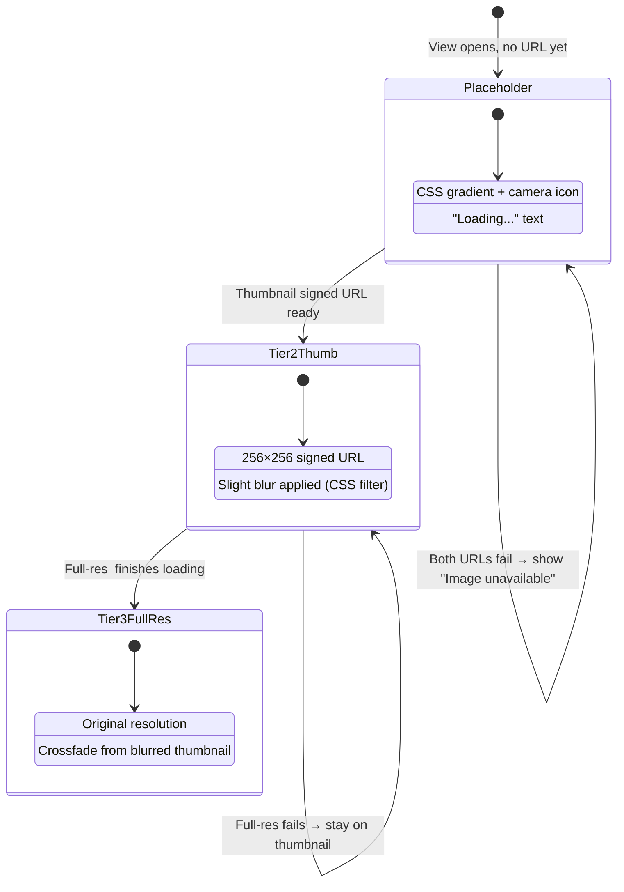
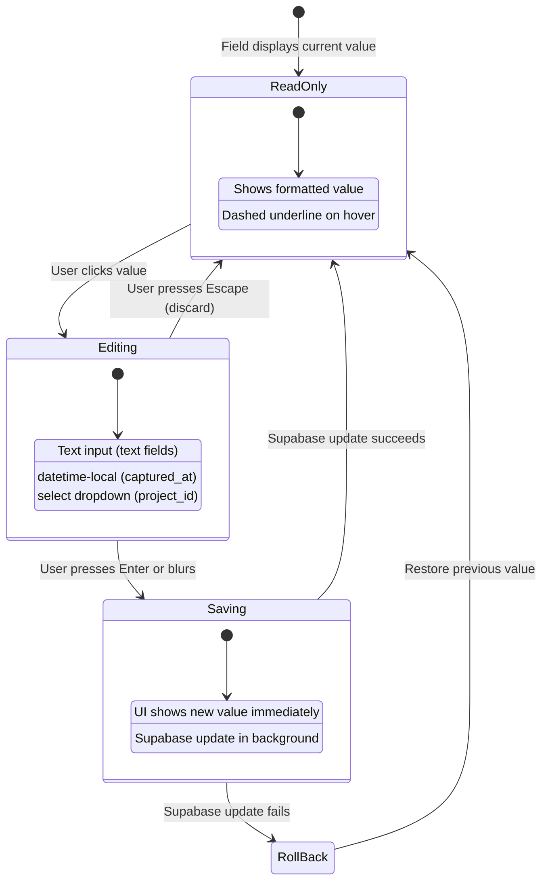
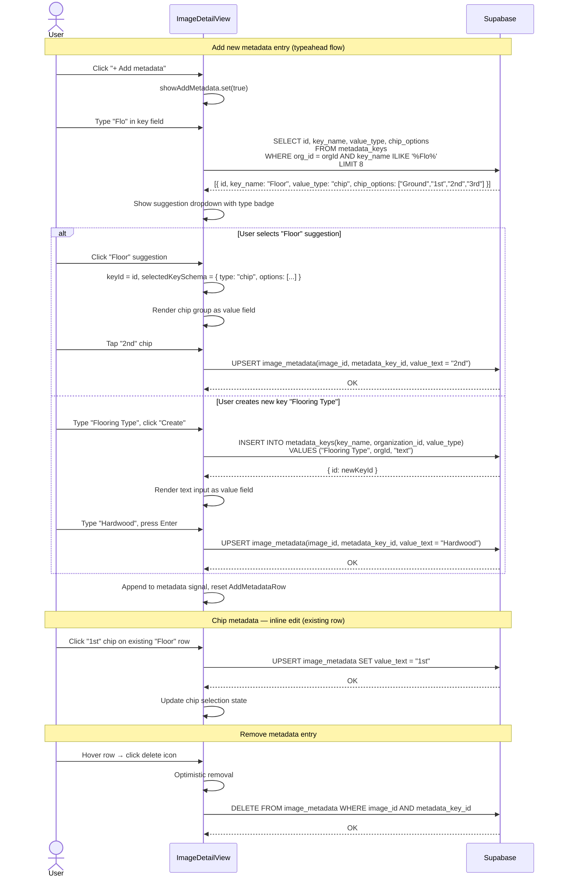

# Image Detail View

> **Blueprint:** [implementation-blueprints/image-detail-view.md](../implementation-blueprints/image-detail-view.md)
> **Photo loading use cases:** [use-cases/photo-loading.md](../use-cases/photo-loading.md)
> **Editing use cases:** [use-cases/image-editing.md](../use-cases/image-editing.md)

## What It Is

The full detail view of a single photo. Shows the full-resolution image with all properties editable inline. Users can modify the address label (title), captured date, project assignment, address components (street, city, district, country), custom metadata key/values, and location. Desktop: replaces the thumbnail grid inside the Workspace Pane (with a back arrow to return). Mobile: full-screen overlay.

## What It Looks Like

### Toolbar Behavior

When the detail view is open, the **Workspace Toolbar** (operators: Grouping, Filter, Sort, Projects) is **hidden**. The detail view fills the full content area below the pane header. Operators are irrelevant when viewing a single photo — removing them reclaims vertical space and reduces visual noise. The toolbar reappears when the user navigates back to the thumbnail grid.

### Layout Modes

**Wide pane (≥ 640px):** Two-column layout — photo on the left (flexible width), metadata panel on the right (fixed ~320px). The photo fills the available height with `object-fit: contain` against a dark letterbox. The metadata panel scrolls independently.

**Narrow pane (< 640px):** Single-column stack — photo on top (full width, `max-height: 55vw`), then Details, Custom Metadata, and Actions below. On mobile this is a full-screen overlay with a close button top-right.

The entire detail container is capped at `900px` max-width and centered (`margin: 0 auto`) so it doesn't stretch uncomfortably in very wide panes.

### Metadata Content Width

The metadata content area (both in single-column and as the right panel in two-column) is **capped at `max-width: 400px`**. This keeps labels and values close together so the eye doesn't have to travel across wide empty space. In single-column mode, the metadata block centers itself horizontally.

### Visual Hierarchy (top to bottom)

The design follows a strict information hierarchy. Each data field is placed according to its importance to the field technician's workflow:

#### 1. Header Bar (CRITICAL — navigation + identity)
Back arrow + editable title (address label) + context menu trigger. Follows current pattern. The title is the most prominent text element — `--text-h2` weight 600. Uses `dd-item` style context menu.

#### 2. Hero Photo (HIGHEST — the content itself)
Full-resolution image with progressive loading (placeholder → thumbnail → full-res). The photo is the reason the user is here. It gets maximum visual real estate.

#### 3. Quick Info Bar (HIGH — at-a-glance context)
Immediately below the photo, a horizontal row of **info chips** provides the most important metadata at a glance without scrolling:

- **Project chip**: folder icon + project name. Filled `--color-primary` if assigned, outlined `--color-border` if none. Click opens project picker.
- **Date chip**: calendar icon + formatted capture date. Click enters edit mode (datetime-local).
- **GPS chip**: location icon + "GPS" or "Corrected". `--color-success` tint if has coords, `--color-warning` if missing. Click copies coordinates.

Chips use `rounded-full` radius, `--text-caption` size (12px), compact padding (`--spacing-1` block, `--spacing-2` inline). They sit in a horizontal flex row that wraps on narrow panes.

#### 4. Details Section (MEDIUM-HIGH — editable properties)
Section heading uses the **`dd-section-label`** style: `0.6875rem`, uppercase, `600` weight, `--color-text-disabled`, `letter-spacing: 0.06em`.

Each property row is redesigned with **leading icons**:

```pseudo
┌─ icon ─┬─ label ──────┬─ value (click to edit) ─┬─ edit-icon ─┐
│  🏠    │  Street      │  123 Main St            │  ✏️ (hover)  │
└────────┴──────────────┴─────────────────────────┴─────────────┘
```

- **Leading icon**: `1rem` Material icon, `--color-text-secondary`. Provides instant visual identification.
- **Label**: `--text-small` (13px), `--color-text-secondary`.
- **Value**: `--text-body` (15px), `--color-text-primary`. Click activates inline edit.
- **Edit icon**: `edit` Material icon, hidden at rest, appears on row hover. Uses the `dd-drag-handle` visibility pattern (hidden → visible on parent hover).
- **Row hover**: warm clay tint (`color-mix(in srgb, var(--color-clay) 8%, transparent)`), matching all dropdown hover states.
- **Row geometry**: follows `dd-item` pattern — `gap: --spacing-2`, `padding: --spacing-1 --spacing-2`, `--radius-sm`.

Property row icon mapping:

| Field        | Icon              | Importance | Notes                          |
| ------------ | ----------------- | ---------- | ------------------------------ |
| Captured     | `schedule`        | High       | When the photo was taken       |
| Project      | `folder`          | High       | Organizational grouping        |
| Street       | `signpost`        | Medium     | Part of address group          |
| City         | `location_city`   | Medium     | Part of address group          |
| District     | `map`             | Low-Medium | Part of address group          |
| Country      | `public`          | Low        | Part of address group          |
| Location     | `my_location`     | Medium     | GPS coords, read-only          |
| Uploaded     | `cloud_upload`    | Low        | Informational, read-only, muted|

Read-only rows (Location, Uploaded) display with `--color-text-secondary` value text and no edit icon on hover.

#### 5. Address Group
Street, City, District, Country are visually grouped under a **"Location"** section heading (dd-section-label). They share the same edit pattern. The GPS coordinates row appears at the bottom of this group with the correction badge if applicable.

#### 6. Custom Metadata Section (VARIABLE)
Section heading: "Metadata" (dd-section-label style). Same icon + label + value row pattern. Chip-type metadata renders inline chip groups. Delete icon appears on hover (right side).

**Chip-type metadata** renders inline as a horizontal chip group. The selected chip gets a filled style (`--color-primary` bg), unselected chips are outlined. Clicking a chip saves immediately — no confirm step needed (it's a single-select categorical value). On narrow layouts, chips wrap.

#### 7. Actions Section (LOW priority but accessible)
Actions use **`dd-item`** button styling — not bordered outline buttons. Each action is a full-width row with:
- Leading Material icon (`1rem`, `--color-text-secondary`)
- Label text (`0.8125rem`)
- `dd-item` hover (warm clay tint)
- `--radius-sm` border radius

```pseudo
┌─ 🗺️  Edit location          ─┐   ← dd-item style, clay hover
├─ 📁  Add to project          ─┤   ← dd-item style, clay hover
├─ 📋  Copy coordinates        ─┤   ← dd-item style, clay hover
├──────────────────────────────-─┤   ← dd-divider
└─ 🗑️  Delete image            ─┘   ← dd-item--danger style
```

### Correction History
When the image has a corrected location, a subtle callout appears below the GPS row using `--color-accent` tinting (already implemented). Shows original EXIF vs corrected coordinates.

### Interaction Pseudo Code

```pseudo
WHEN detail view opens:
  workspace-toolbar.hidden = true
  detail-view fills pane content area (below pane-header)
  load image data, metadata, project options
  show progressive image (placeholder → thumbnail → full-res)

WHEN detail view closes:
  workspace-toolbar.hidden = false
  return to thumbnail grid

ON property row hover:
  show warm clay background tint
  show edit icon (pencil) on right side
  
ON property row click (editable):
  replace value text with inline input (text / datetime-local / select)
  focus input
  ON Enter or blur → save to Supabase (optimistic update)
  ON Escape → cancel, restore previous value

ON quick-info chip click:
  project chip → open project select dropdown
  date chip → enter date edit mode  
  gps chip → copy coordinates to clipboard (toast confirmation)

ON action row click:
  "Edit location" → emit editLocationRequested
  "Add to project" → open project picker
  "Copy coordinates" → clipboard + toast
  "Delete image" → show delete confirmation dialog

ON action row hover:
  warm clay tint (color-mix(in srgb, var(--color-clay) 8%, transparent))
  matches all dropdown item hover states
```

## Responsive Layout

The layout responds to the **workspace pane width** (measured via `ResizeObserver` on the host element), not the browser viewport. The user can independently resize the map/workspace split, so `window.innerWidth` is incorrect.

### Breakpoints (pane-local)

| Name   | Pane Width | Layout                         |
| ------ | ---------- | ------------------------------ |
| Narrow | < 480px    | Single column, compact spacing |
| Medium | 480–720px  | Single column, comfortable     |
| Wide   | > 720px    | Two columns: photo \| metadata |

The two-column split happens at **640px minimum** (photo needs ≥ 340px, metadata panel needs ≥ 300px). Below that: stack vertically.

### Container Constraints

```
max-width:  900px
margin:     0 auto        // centers in wide pane
width:      100%
```

### Two-Column Grid (≥ 640px)

```
display:               grid
grid-template-columns:  minmax(300px, 1fr) 320px
```

Photo column takes the flexible space. Metadata column is a fixed ~320px, scrollable independently.

### PhotoViewer Sizing

| Layout | Rule                                                                                                    |
| ------ | ------------------------------------------------------------------------------------------------------- |
| Wide   | `height: 100%`, `max-height: calc(100vh - 60px)`, `object-fit: contain`, `background: #111` (letterbox) |
| Narrow | `width: 100%`, `max-height: 55vw`, `object-fit: contain`                                                |

> **Note:** `55vw` is a viewport unit — a deliberate pragmatic compromise since CSS cannot reference an observed pane width natively. For pane-accurate sizing, set a `--pane-width` custom property from the ResizeObserver callback and use `calc(0.55 * var(--pane-width))` instead.

### Measurement

```typescript
// Angular: use a host-bound ResizeObserver, NOT window resize
onInit: observer = new ResizeObserver((entries) => {
  paneWidth = entries[0].contentRect.width;
});
observer.observe(hostElement);

onDestroy: observer.disconnect();
```

## Where It Lives

- **Parent**: Workspace Pane (replaces Thumbnail Grid when an image is selected)
- **Appears when**: User clicks a thumbnail card or map marker detail action

## Actions

| #   | User Action                               | System Response                                                        | Triggers                         |
| --- | ----------------------------------------- | ---------------------------------------------------------------------- | -------------------------------- |
| 1   | Clicks back arrow (desktop)               | Returns to Thumbnail Grid                                              | `detailImageId` → null           |
| 2   | Clicks close (mobile)                     | Closes overlay, returns to previous state                              | Overlay dismissed                |
| 3   | Clicks address label (title)              | Title becomes an inline text input                                     | `editingField` → `address_label` |
| 4   | Presses Enter or blurs title input        | Saves updated address_label to `images` table                          | Supabase update                  |
| 5   | Clicks captured date value                | Date becomes a `datetime-local` input                                  | `editingField` → `captured_at`   |
| 6   | Picks new date/time, blurs                | Saves updated captured_at to `images` table                            | Supabase update                  |
| 7   | Clicks project value                      | Value becomes a `<select>` dropdown with org projects                  | `editingField` → `project_id`    |
| 8   | Selects a project                         | Saves project_id to `images` table                                     | Supabase update                  |
| 9   | Clicks street/city/district/country value | Value becomes an inline text input                                     | `editingField` → field name      |
| 10  | Presses Enter or blurs address input      | Saves updated address component to `images` table                      | Supabase update                  |
| 11  | Clicks a custom metadata value            | Value becomes an inline text input                                     | Edit mode                        |
| 12  | Presses Enter or blurs input              | Saves updated metadata value via upsert                                | Supabase upsert                  |
| 13  | Clicks "Add metadata" button              | New row with typeahead key input appears                               | `showAddMetadata` → true         |
| 14  | Types in key field (≥ 1 char)             | Queries `metadata_keys` (ILIKE), shows suggestion dropdown             | Typeahead query                  |
| 15  | Selects a key suggestion                  | Sets `keyId`, loads `value_type` + `chip_options`, focuses value field | Schema loaded                    |
| 16  | Clicks "Create \"{input}\""               | Creates new key with `value_type = "text"`, proceeds to value          | Supabase insert                  |
| 17  | Fills value + Enter/blur                  | Creates `image_metadata` row (upsert), appends to metadata list        | Supabase upsert                  |
| 18  | Clicks a chip (chip-type metadata)        | Saves selected chip value immediately — no confirm needed              | Supabase upsert                  |
| 19  | Hovers metadata row                       | Reveals delete icon on the right                                       | CSS hover                        |
| 20  | Clicks delete icon on metadata row        | Removes the metadata entry (optimistic, then Supabase delete)          | Supabase delete                  |
| 21  | Presses Escape during any edit            | Cancels edit, restores original value, no DB write                     | `editingField` → null            |
| 22  | Clicks "Edit location"                    | Enters correction mode (drag marker on map)                            | Correction flow                  |
| 23  | Clicks "Add to project"                   | Opens project picker                                                   | Project assignment               |
| 24  | Clicks "Delete" in actions menu           | Confirmation dialog, then deletes image                                | Supabase delete                  |
| 25  | Scrolls down                              | Reveals more metadata and coordinate info                              | Scroll                           |

## Component Hierarchy

```
ImageDetailView                            ← fills Workspace Pane content area (desktop) or full-screen (mobile)
│                                             max-width: 900px, margin: 0 auto, width: 100%
│                                             ResizeObserver on host → paneWidth signal
│                                             PARENT HIDES workspace-toolbar when this is shown
│
├── DetailHeader                           ← always full width, sticky top
│   ├── BackButton (←)                     ← desktop: back to grid; mobile: close overlay
│   ├── ImageTitle                         ← address label, click-to-edit inline, --text-h2 weight 600
│   │   └── [editing] InlineInput          ← replaces title text, saves on Enter/blur
│   └── ContextMenuTrigger (⋯)
│       └── [open] ContextMenu             ← uses dd-items / dd-item / dd-item--danger classes
│
├── [paneWidth ≥ 640] TwoColumnLayout      ← grid: minmax(300px, 1fr) 320px
│   ├── PhotoColumn                        ← flexible, fills available height
│   │   └── PhotoViewer                    ← object-fit: contain, background: #111
│   │       ├── [not loaded] Placeholder   ← CSS gradient + camera icon + "Loading…"
│   │       ├── [tier 2] ThumbnailPreview  ← 256×256 signed URL (blurred)
│   │       └── [tier 3] FullResImage      ← original res, crossfades over thumbnail
│   └── MetadataColumn                     ← fixed ~320px, max-width: 400px, scrolls independently
│       ├── QuickInfoBar
│       ├── DetailsSection
│       ├── LocationSection
│       ├── MetadataSection
│       └── ActionsSection
│
├── [paneWidth < 640] SingleColumnLayout
│   ├── PhotoViewer                        ← full width, max-height: 55vw
│   └── MetadataContent                   ← max-width: 400px, margin: 0 auto
│       ├── QuickInfoBar
│       ├── DetailsSection
│       ├── LocationSection
│       ├── MetadataSection
│       └── ActionsSection
│
├── QuickInfoBar                           ← horizontal chip row below photo
│   ├── ProjectChip                        ← folder icon + name, filled if assigned
│   ├── DateChip                           ← calendar icon + date, click to edit
│   └── GpsChip                            ← location icon + status, click copies coords
│
├── DetailsSection                         ← dd-section-label "Details"
│   ├── IconPropertyRow "Captured"         ← schedule icon, datetime-local on edit
│   ├── IconPropertyRow "Project"          ← folder icon, <select> dropdown on edit
│   └── IconPropertyRow "Uploaded"         ← cloud_upload icon, read-only, muted
│
├── LocationSection                        ← dd-section-label "Location"
│   ├── IconPropertyRow "Street"           ← signpost icon, text input on edit
│   ├── IconPropertyRow "City"             ← location_city icon, text input on edit
│   ├── IconPropertyRow "District"         ← map icon, text input on edit
│   ├── IconPropertyRow "Country"          ← public icon, text input on edit
│   ├── IconPropertyRow "Coordinates"      ← my_location icon, read-only mono
│   │   └── [corrected] CorrectionBadge
│   └── [corrected] CorrectionHistory      ← original EXIF vs corrected, accent tint
│
├── MetadataSection                        ← dd-section-label "Metadata"
│   ├── [chip type] ChipRow × N           ← key label + inline chip group
│   │   └── ChipGroup                     ← horizontal wrap, single-select, save-on-click
│   │       └── Chip × M                  ← selected: filled --color-primary, unselected: outlined
│   ├── MetadataPropertyRow × N            ← icon + key + value (click-to-edit) + [hover] delete
│   │   └── [editing] InlineInput
│   ├── AddMetadataRow                     ← typeahead key + schema-aware value
│   └── AddMetadataButton                  ← dd-action-row style "+ Add metadata"
│
├── ActionsSection                         ← dd-section-label "Actions", dd-item styled rows
│   ├── EditLocationAction                 ← dd-item: edit_location icon + "Edit location"
│   ├── AddToProjectAction                 ← dd-item: folder_open icon + "Add to project"
│   ├── CopyCoordinatesAction              ← dd-item: content_copy icon + "Copy coordinates"
│   ├── dd-divider
│   └── DeleteAction                       ← dd-item--danger: delete icon + "Delete image"
│
└── [confirm] DeleteConfirmDialog          ← modal with cancel/confirm
```

### MetadataSection — Chip Rows

For metadata entries where `value_type == "chip"`, values render as an inline horizontal chip group instead of a text field:

- Each chip represents one option from `chip_options`
- **Selected chip:** filled background (`--color-primary`), white text
- **Unselected chip:** outlined border (`--color-border`), `--color-text-primary` text
- **Click a chip → saves immediately** (no confirm needed — it's a single-select categorical value)
- On narrow panes, chips wrap to multiple lines
- Clicking an already-selected chip deselects it (clears the value)

### AddMetadataRow — Typeahead Key Selection

The "Add metadata" row is not a simple dual-input. The key field has typeahead suggestions from `metadata_keys`:

```
AddMetadataRow
├── KeyInput                               ← text input, placeholder "Property"
│   └── [typing, ≥ 1 char] KeySuggestionDropdown
│       ├── SuggestionItem × N             ← key_name + type badge ("chip", "date", etc.)
│       └── [no exact match] CreateItem    ← 'Create "{keyInput}"' → new key with type "text"
├── ValueField                             ← rendered based on selected key's schema
│   ├── [chip] ChipGroup                   ← tap to select from chip_options
│   ├── [date] DateInput                   ← <input type="date">
│   ├── [number] NumberInput               ← <input type="number">
│   └── [text / new key] TextInput         ← <input type="text" placeholder="Value">
└── (submit on Enter / blur from value field)
```

**Key field behavior:**

1. User types → query `metadata_keys` where `key_name ILIKE '%{input}%'` (limit 8)
2. Dropdown shows matching keys with a **type badge** (small grey label: "chip", "date", etc.)
3. Selecting a suggestion sets `keyId` and loads the key's `value_type` + `chip_options`
4. If no exact match: "Create \"{input}\"" option creates a new key with `value_type = "text"`
5. After key selection, focus moves to the value field

**Value field rendering** depends on `selectedKeySchema.type`:

- **chip:** renders chip group from `chip_options` — tap to select, skip to submit
- **date:** renders `<input type="date">`
- **number:** renders `<input type="number">`
- **text** (default, also for brand-new keys): renders `<input type="text">`

**Submit:**

1. If `keyId` is null (new key): INSERT into `metadata_keys` with `value_type = "text"`
2. UPSERT into `image_metadata` with the selected/created key
3. Emit the new entry, reset the row

**Keyboard:** Escape cancels, Enter from key field (if chip type) skips to submit, otherwise focuses value field.

## Data

| Field              | Source                                                                                                                     | Type                             |
| ------------------ | -------------------------------------------------------------------------------------------------------------------------- | -------------------------------- |
| Image record       | `supabase.from('images').select('*')`                                                                                      | `ImageRecord`                    |
| Full-res URL       | Supabase Storage signed URL (original, no transform)                                                                       | `string`                         |
| Thumbnail URL      | Supabase Storage signed URL (256×256 transform)                                                                            | `string`                         |
| Placeholder        | CSS-only, no data source                                                                                                   | —                                |
| Metadata           | `supabase.from('image_metadata').select('metadata_key_id, value_text, metadata_keys(key_name, value_type, chip_options)')` | `MetadataEntry[]`                |
| Correction history | `images.latitude` ≠ `images.exif_latitude` (corrected via `coordinate_corrections`)                                        | Coordinate pairs                 |
| Projects list      | `supabase.from('projects').select('id, name').eq('organization_id', orgId)`                                                | `{ id: string, name: string }[]` |

## State

| Name                | Type                             | Default | Controls                                                                |
| ------------------- | -------------------------------- | ------- | ----------------------------------------------------------------------- |
| `image`             | `ImageRecord \| null`            | `null`  | The displayed image record                                              |
| `metadata`          | `MetadataEntry[]`                | `[]`    | Custom metadata key/value pairs (includes `value_type`, `chip_options`) |
| `editingField`      | `string \| null`                 | `null`  | Which field is currently being edited inline                            |
| `fullResLoaded`     | `boolean`                        | `false` | Whether full-res image has loaded                                       |
| `thumbLoaded`       | `boolean`                        | `false` | Whether Tier 2 thumbnail has loaded                                     |
| `loading`           | `boolean`                        | `false` | Whether data is loading from Supabase                                   |
| `error`             | `string \| null`                 | `null`  | Error message if load failed                                            |
| `saving`            | `boolean`                        | `false` | Whether a save operation is in progress                                 |
| `projectOptions`    | `{ id: string, name: string }[]` | `[]`    | Available projects for the dropdown                                     |
| `showAddMetadata`   | `boolean`                        | `false` | Whether the add-metadata row is visible                                 |
| `showContextMenu`   | `boolean`                        | `false` | Context menu visibility                                                 |
| `showDeleteConfirm` | `boolean`                        | `false` | Delete confirmation dialog visibility                                   |
| `paneWidth`         | `number`                         | `0`     | Measured via ResizeObserver on host element (px)                        |

### AddMetadataRow State

| Name                | Type                                           | Default | Controls                                                  |
| ------------------- | ---------------------------------------------- | ------- | --------------------------------------------------------- |
| `keyInput`          | `string`                                       | `''`    | Current text in the key field                             |
| `valueInput`        | `string`                                       | `''`    | Current value (text, selected chip, date…)                |
| `keyId`             | `string \| null`                               | `null`  | UUID of selected existing key (null = new)                |
| `suggestions`       | `MetadataKeySuggestion[]`                      | `[]`    | Matching keys from typeahead query                        |
| `dropdownOpen`      | `boolean`                                      | `false` | Whether key suggestion dropdown is showing                |
| `selectedKeySchema` | `{ type: string, options?: string[] } \| null` | `null`  | Schema of the selected key (drives value field rendering) |

## Progressive Image Loading

The detail view uses a **three-tier progressive loading** strategy to show content as fast as possible:



### Loading Sequence

1. View opens → CSS placeholder shown immediately (no network)
2. Tier 2 thumbnail signed URL fires (`256×256, cover, quality: 60`)
3. Thumbnail `` loads → replaces placeholder with slight blur filter
4. Tier 3 full-res signed URL fires (no transform, or max 2500px)
5. Full-res `` loads in hidden element → crossfade swaps it in
6. If Tier 3 fails, Tier 2 remains visible (adequate quality for metadata editing)
7. If both fail, CSS placeholder stays with "Image unavailable" text

### Signed URL Strategy

- **Tier 2:** `createSignedUrl(thumbnail_path ?? storage_path, 3600, { transform: { width: 256, height: 256, resize: 'cover', quality: 60 } })`
- **Tier 3:** `createSignedUrl(storage_path, 3600)` (no transform — full resolution)

## Inline Editing Flow

All editable fields follow the same interaction pattern:



### Editable Fields Map

| Field                    | Input Type                 | DB Table         | DB Column       | Validation                    |
| ------------------------ | -------------------------- | ---------------- | --------------- | ----------------------------- |
| Address label            | `text`                     | `images`         | `address_label` | Max 500 chars                 |
| Captured date            | `datetime-local`           | `images`         | `captured_at`   | Valid ISO date                |
| Project                  | `<select>`                 | `images`         | `project_id`    | Must be valid project ID      |
| Street                   | `text`                     | `images`         | `street`        | Max 200 chars                 |
| City                     | `text`                     | `images`         | `city`          | Max 200 chars                 |
| District                 | `text`                     | `images`         | `district`      | Max 200 chars                 |
| Country                  | `text`                     | `images`         | `country`       | Max 200 chars                 |
| Custom metadata          | `text`                     | `image_metadata` | `value_text`    | Max 1000 chars                |
| Custom metadata (chip)   | chip group (single-select) | `image_metadata` | `value_text`    | Must be one of `chip_options` |
| Custom metadata (date)   | `date`                     | `image_metadata` | `value_text`    | Valid date string             |
| Custom metadata (number) | `number`                   | `image_metadata` | `value_text`    | Valid number                  |

### Metadata Management Flow



## File Map

| File                                                              | Purpose                                                 |
| ----------------------------------------------------------------- | ------------------------------------------------------- |
| `features/map/workspace-pane/image-detail-view.component.ts`      | Detail view component                                   |
| `features/map/workspace-pane/image-detail-view.component.html`    | Template                                                |
| `features/map/workspace-pane/image-detail-view.component.scss`    | Styles                                                  |
| `features/map/workspace-pane/image-detail-view.component.spec.ts` | Unit tests                                              |
| `features/map/workspace-pane/metadata-property-row.component.ts`  | Reusable click-to-edit row                              |
| `features/map/workspace-pane/editable-property-row.component.ts`  | Click-to-edit row for image fields (text, date, select) |

## Wiring

- Displayed inside Workspace Pane when `detailImageId` is set
- On desktop: replaces Thumbnail Grid, back arrow returns to grid
- On mobile: opens as full-screen overlay on top of current view
- Metadata edits call `SupabaseService` to update `image_metadata`
- "Edit location" triggers correction mode in `MapShellComponent`

## Acceptance Criteria

### Toolbar & Layout

- [ ] Workspace toolbar (operators) is **hidden** when detail view is open
- [ ] Workspace toolbar reappears when detail view closes (back to grid)
- [ ] Uses `ResizeObserver` on host element to measure pane width (not `window.innerWidth`)
- [ ] Wide pane (≥ 640px): two-column grid — photo left (flexible), metadata right (~320px fixed)
- [ ] Narrow pane (< 640px): single-column stack — photo on top, metadata below
- [ ] Detail container capped at 900px max-width, centered via `margin: 0 auto`
- [ ] Metadata content area capped at **400px max-width** — centers in available space
- [ ] Photo viewer: wide layout uses `object-fit: contain`, `max-height: calc(100vh - 60px)`, `background: #111`
- [ ] Photo viewer: narrow layout uses full width, `max-height: 55vw`, `object-fit: contain`
- [ ] Metadata column scrolls independently from photo column in wide layout

### Quick Info Bar

- [ ] Horizontal chip row below photo with Project, Date, GPS chips
- [ ] Project chip: filled `--color-primary` when assigned, outlined when empty
- [ ] Date chip: calendar icon + formatted date, click enters date edit
- [ ] GPS chip: `--color-success` tint with coordinates, `--color-warning` if missing GPS
- [ ] Chips use `rounded-full`, `--text-caption` size, compact padding
- [ ] Chips wrap on narrow panes

### Visual Design — Property Rows  

- [ ] All property rows have **leading Material icon** (1rem, `--color-text-secondary`)
- [ ] Row hover uses **warm clay tint** (`color-mix(in srgb, var(--color-clay) 8%, transparent)`)
- [ ] Hover reveals **edit pencil icon** on right (hidden at rest, like dd-drag-handle)
- [ ] Row geometry follows dd-item pattern: `gap: --spacing-2`, `padding: --spacing-1 --spacing-2`, `--radius-sm`
- [ ] Section headings use **dd-section-label** style: `0.6875rem`, uppercase, `600`, `--color-text-disabled`
- [ ] Read-only rows (Location, Uploaded) show muted value text, no edit icon on hover

### Visual Design — Actions Section

- [ ] Actions use **dd-item** button styling (not bordered outline buttons)
- [ ] Each action: leading icon + label text, `0.8125rem` font
- [ ] Hover uses warm clay tint matching all dropdown items
- [ ] Delete action uses `dd-item--danger` style (red icon + label)
- [ ] `dd-divider` separates destructive actions from normal ones

### Navigation

- [ ] Desktop: replaces grid in workspace pane, back arrow returns
- [ ] Mobile: full-screen overlay with close button

### Progressive Image Loading

- [ ] CSS placeholder shown immediately when view opens (gradient + camera icon)
- [ ] Tier 2 thumbnail (256×256 transform) loads and replaces placeholder with slight blur
- [ ] Full-res image loads on demand and crossfades over blurred thumbnail
- [ ] If full-res fails, Tier 2 thumbnail stays visible
- [ ] If both tiers fail, CSS placeholder with "Image unavailable" text remains
- [ ] No broken `` icon ever shown

### Inline Editing

- [ ] **Address label**: click title → inline text input → save on Enter/blur → updates `images.address_label`
- [ ] **Captured date**: click value → `datetime-local` input → save → updates `images.captured_at`
- [ ] **Project**: click value → `<select>` dropdown → save → updates `images.project_id`
- [ ] **Street/City/District/Country**: click value → inline text input → save → updates `images.[field]`
- [ ] Escape key cancels any active edit without saving
- [ ] Optimistic updates: UI reflects changes immediately, rolls back on error
- [ ] All editable rows show dashed underline hover affordance

### Custom Metadata — Text/Date/Number Types

- [ ] **Custom metadata**: click value → inline edit → save on Enter/blur via upsert
- [ ] **Remove metadata**: hover row → delete icon → removes `image_metadata` row (optimistic + Supabase)

### Custom Metadata — Chip Type

- [ ] Chip-type metadata renders as inline horizontal chip group (not a text field)
- [ ] Selected chip: filled `--color-primary` background, white text
- [ ] Unselected chips: outlined border, `--color-text-primary` text
- [ ] Clicking a chip saves immediately (no confirm dialog)
- [ ] Clicking the already-selected chip deselects (clears value)
- [ ] Chips wrap on narrow panes

### Add Metadata — Typeahead Flow

- [ ] Key field shows suggestions from `metadata_keys` (ILIKE match, limit 8)
- [ ] Suggestions appear after ≥ 1 character typed
- [ ] Each suggestion shows key name + type badge ("chip", "date", "number", "text")
- [ ] Selecting a suggestion loads the key's `value_type` and `chip_options`
- [ ] Value field renders based on selected key's schema (chip group / date / number / text)
- [ ] If no exact match: "Create \"{input}\"" option appears, creates key with `value_type = "text"`
- [ ] New key auto-created on submit if `keyId` is null
- [ ] Submit upserts `image_metadata` row
- [ ] Escape cancels the add-metadata row
- [ ] Enter from key field: if chip type → skip to submit; else → focus value field

### Other

- [ ] Coordinates displayed with correction indicator if corrected
- [ ] Original EXIF coordinates shown when correction exists (Honesty principle)
- [ ] Edit location button starts marker correction mode
- [ ] Add to project opens project picker
- [ ] Delete confirmation before removal
- [ ] Projects dropdown loads from `projects` table filtered by `organization_id`
