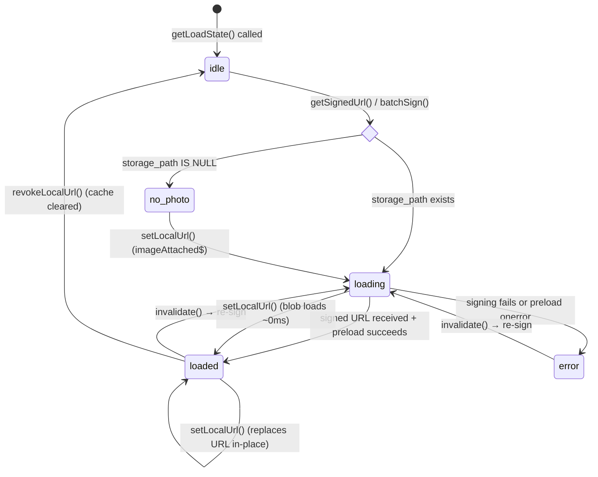
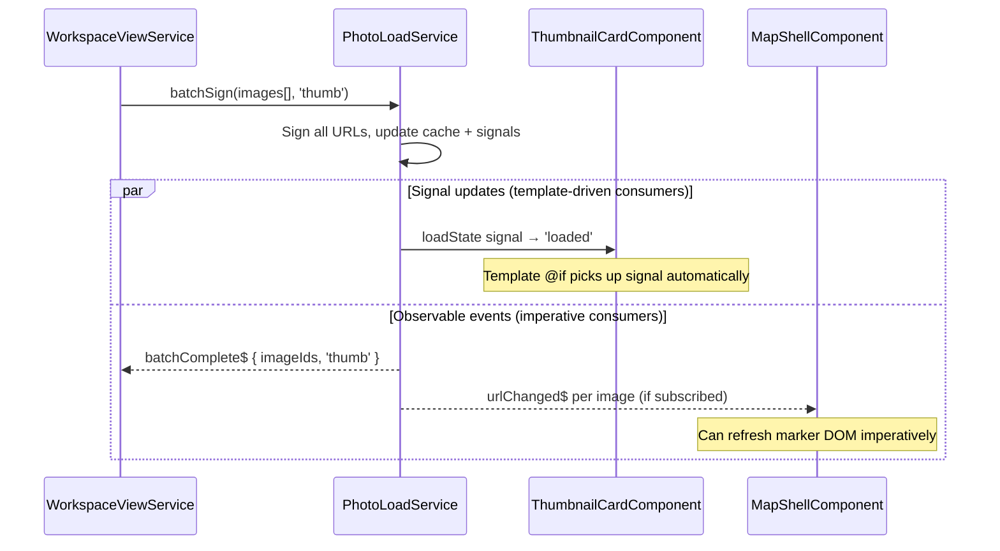
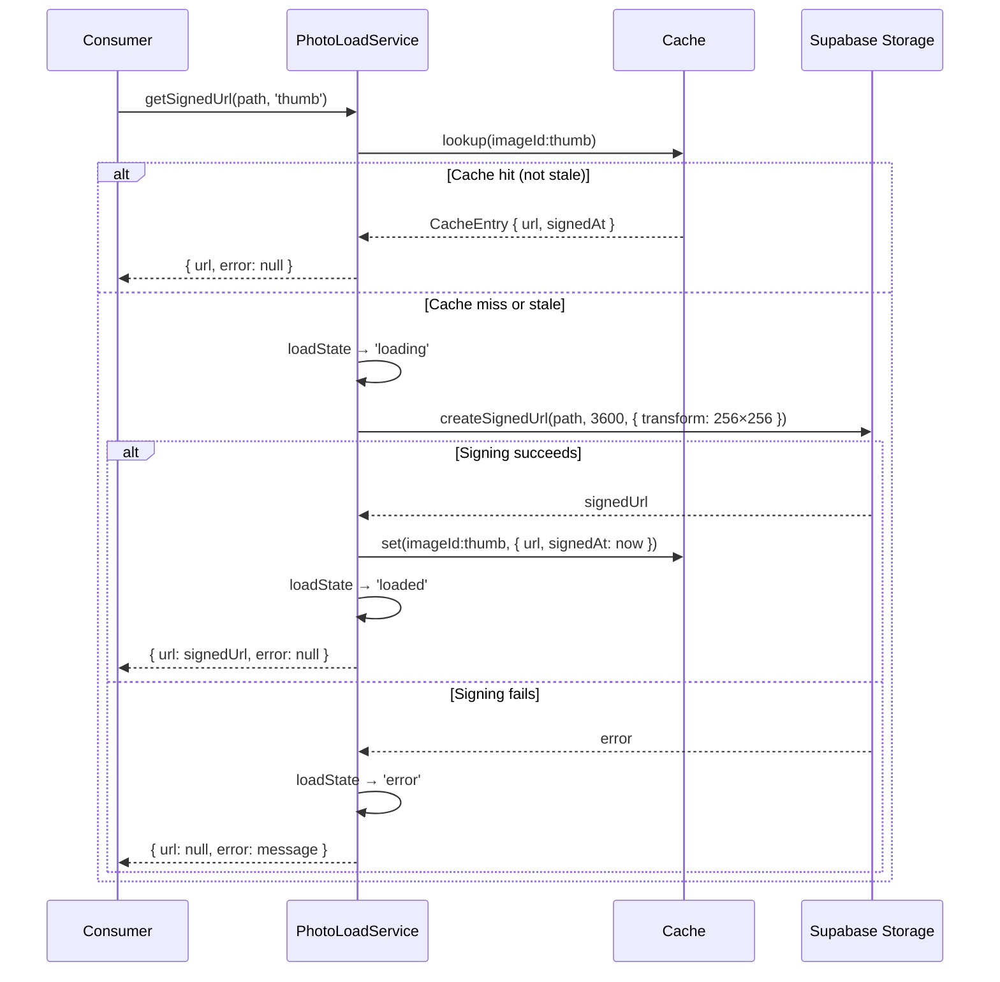
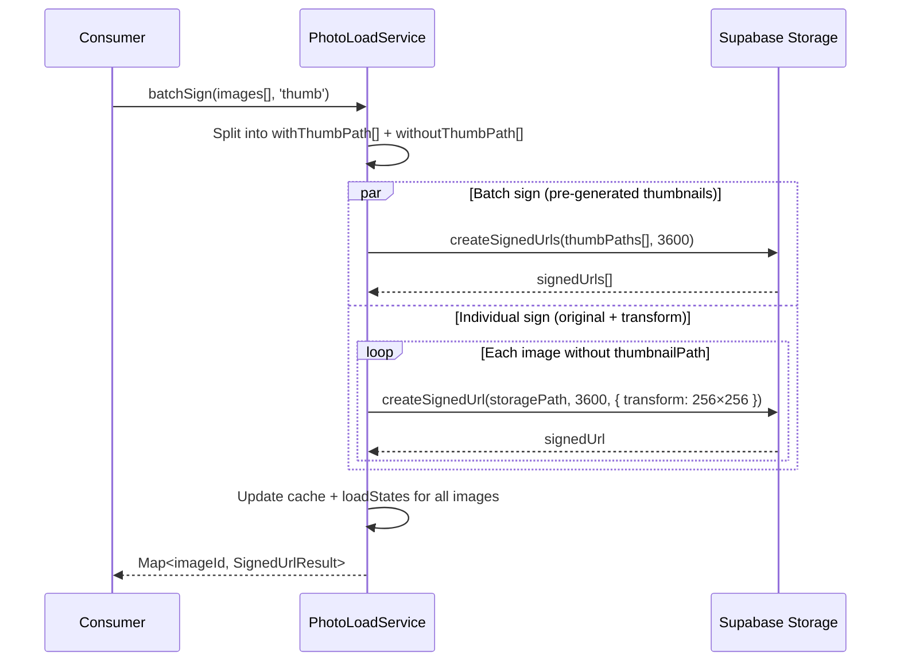
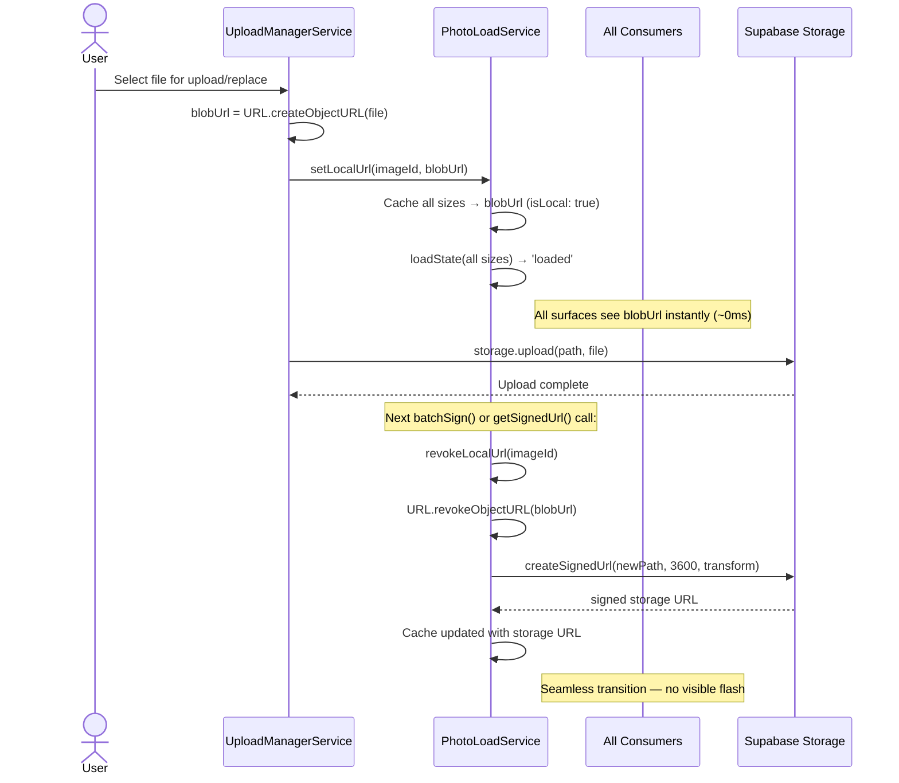
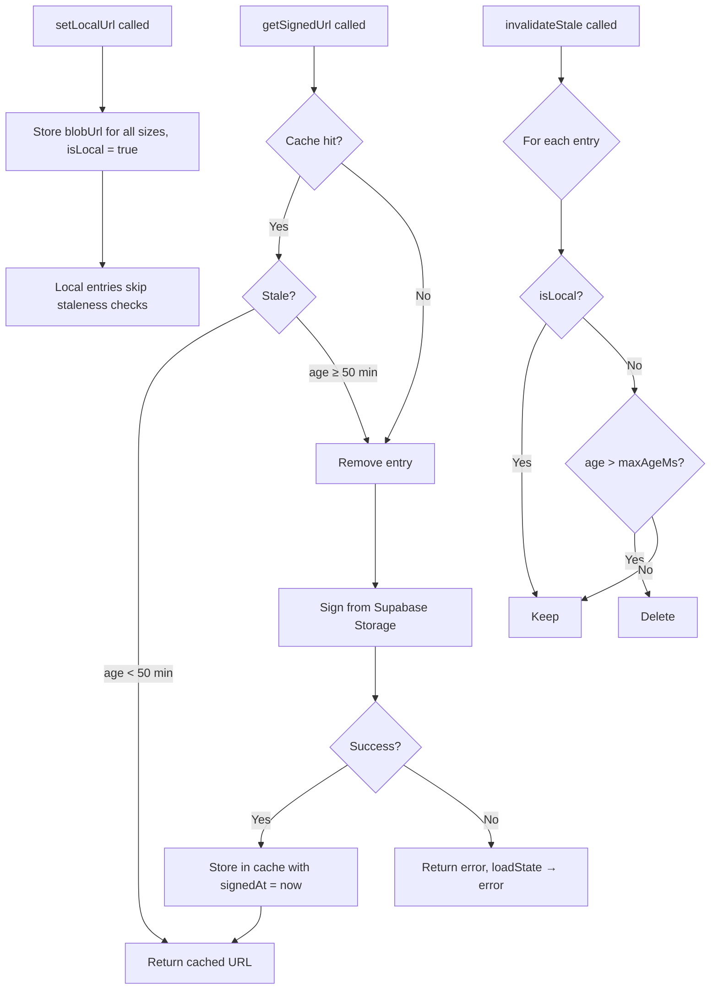
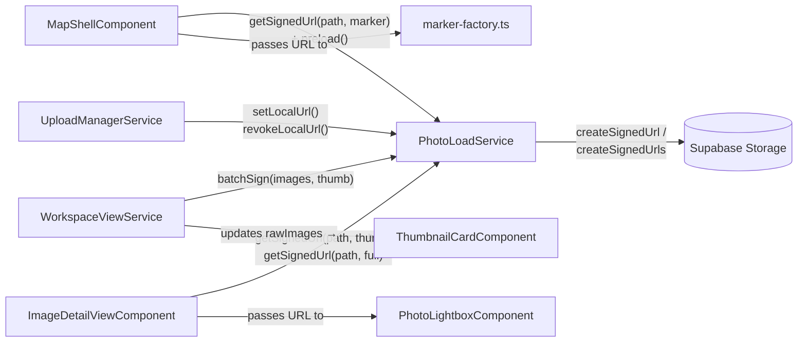
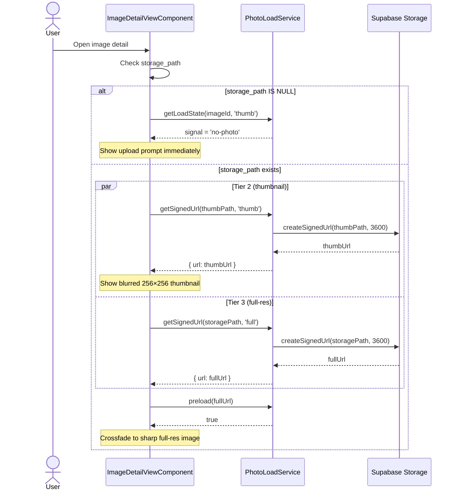
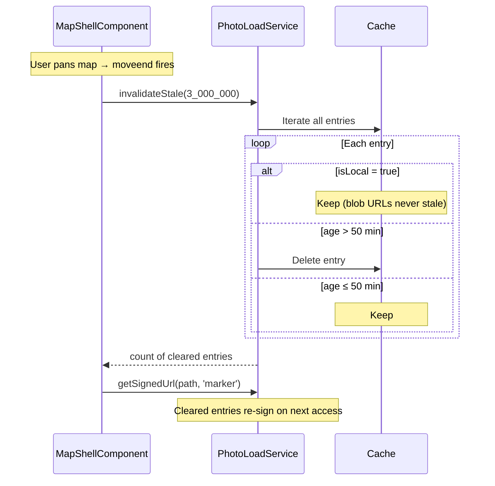
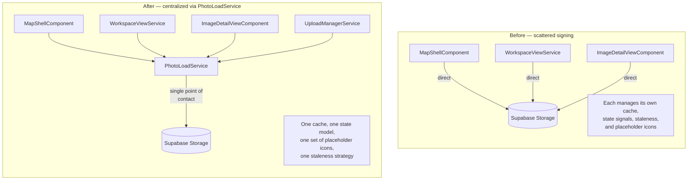

# Photo Load Service

> **Related specs:** [photo-marker](photo-marker.md), [thumbnail-card](thumbnail-card.md), [image-detail-photo-viewer](image-detail-photo-viewer.md), [image-detail-view](image-detail-view.md)
> **Use cases:** [use-cases/photo-loading.md](../use-cases/photo-loading.md)

## What It Is

A centralized Angular service that owns all photo signed-URL generation, caching, preloading, and loading-state management. Every surface that displays a photo (map markers, thumbnail cards, detail view, lightbox) uses this service instead of calling Supabase Storage directly. It replaces the scattered signing logic currently duplicated across `WorkspaceViewService`, `MapShellComponent`, and `ImageDetailViewComponent`.

## What It Looks Like

Not a visual element — this is a headless service. However, it standardizes the visual loading states that consumers render:

- **`idle`** — no URL requested yet; consumer shows nothing or a static placeholder
- **`loading`** — signed URL requested or `` downloading; consumer shows pulsing placeholder (gradient + camera icon, 1400ms ease-in-out)
- **`loaded`** — image ready to display; consumer fades in the `` (200ms)
- **`error`** — signing or download failed; consumer shows static no-photo icon (crossed-out image, 0.55 opacity)
- **`no-photo`** — `storage_path IS NULL`; consumer shows upload prompt or permanent no-photo icon immediately (no loading phase)

The service provides a canonical SVG icon data-URI for both the camera placeholder and the no-photo icon so every consumer renders an identical visual.

### Load-State Machine



## Where It Lives

- **Scope**: `providedIn: 'root'` singleton
- **File**: `core/photo-load.service.ts`
- **Used by**: `MapShellComponent`, `WorkspaceViewService`, `ThumbnailCardComponent`, `ImageDetailViewComponent`, `PhotoLightboxComponent`, `marker-factory.ts`

## Actions

| #   | Consumer calls                    | Service response                                                                                                      | Returns / emits                         |
| --- | --------------------------------- | --------------------------------------------------------------------------------------------------------------------- | --------------------------------------- |
| 1   | `getSignedUrl(storagePath, size)` | Checks cache → if valid, returns cached URL; else signs via Supabase Storage with size-appropriate transform          | `Promise<SignedUrlResult>`              |
| 2   | `batchSign(items[], size)`        | Groups items by thumbnail-path vs storage-path; batch-signs where possible, individual-signs with transform otherwise | `Promise<Map<string, SignedUrlResult>>` |
| 3   | `getLoadState(imageId, size)`     | Returns a readonly signal tracking the current `PhotoLoadState` for this image+size pair                              | `Signal<PhotoLoadState>`                |
| 4   | `preload(url)`                    | Creates a hidden `Image()` element, resolves when loaded or rejects on error                                          | `Promise<boolean>`                      |
| 5   | `invalidate(imageId)`             | Clears all cached URLs for this image (all sizes); next `getSignedUrl` will re-sign                                   | `void`                                  |
| 6   | `invalidateStale(maxAgeMs)`       | Clears entries older than `maxAgeMs`; called on interval or before batch operations                                   | `number` (entries cleared)              |
| 7   | `setLocalUrl(imageId, blobUrl)`   | Injects a local `ObjectURL` (from upload) into the cache at all sizes — loads in ~0ms, no network                     | `void`                                  |
| 8   | `revokeLocalUrl(imageId)`         | Calls `URL.revokeObjectURL` on the cached blob and clears it; next access re-signs from storage                       | `void`                                  |

### Event Streams

| #   | Observable       | Payload                                                       | Fires when                                                                  |
| --- | ---------------- | ------------------------------------------------------------- | --------------------------------------------------------------------------- |
| 9   | `urlChanged$`    | `{ imageId: string, size: PhotoSize, url: string }`           | A new signed URL or local blob URL is set for any image+size pair           |
| 10  | `stateChanged$`  | `{ imageId: string, size: PhotoSize, state: PhotoLoadState }` | Any `PhotoLoadState` transition occurs (idle→loading, loading→loaded, etc.) |
| 11  | `batchComplete$` | `{ imageIds: string[], size: PhotoSize }`                     | A `batchSign()` call finishes (success or partial failure)                  |

Consumers that need imperative (non-template) reactions subscribe to these. Template-bound consumers can rely on `getLoadState()` signals alone — the signals are updated before events fire, so both mechanisms stay in sync.

### Event Stream Flow



### getSignedUrl Flow



### batchSign Flow



### Upload Integration (setLocalUrl → revokeLocalUrl)



### Preload Flow

```mermaid
sequenceDiagram
    participant Consumer
    participant PhotoLoad as PhotoLoadService
    participant Browser as Browser Image()

    Consumer->>PhotoLoad: preload(signedUrl)
    PhotoLoad->>Browser: new Image(); img.src = signedUrl
    alt Image loads successfully
        Browser-->>PhotoLoad: img.onload
        PhotoLoad-->>Consumer: true
    else Image fails (404, network error)
        Browser-->>PhotoLoad: img.onerror
        PhotoLoad-->>Consumer: false
    end
    Note over Consumer: Consumer uses result to decide<br/>loaded vs error state
```

## Component Hierarchy

Not applicable — headless service. No template or DOM.

## Data

| Field              | Source                                                                        | Type                                          |
| ------------------ | ----------------------------------------------------------------------------- | --------------------------------------------- |
| Signed URLs        | `supabase.client.storage.from('images').createSignedUrl` / `createSignedUrls` | `string`                                      |
| Image storage path | `images.storage_path`                                                         | `string \| null`                              |
| Thumbnail path     | `images.thumbnail_path`                                                       | `string \| null`                              |
| Cache              | In-memory `Map<string, CacheEntry>`                                           | `Map`                                         |
| Load states        | Per image+size signal map                                                     | `Map<string, WritableSignal<PhotoLoadState>>` |

### Supabase Storage Calls

| Size preset | Transform                                      | Use case               |
| ----------- | ---------------------------------------------- | ---------------------- |
| `marker`    | `{ width: 80, height: 80, resize: 'cover' }`   | Map marker (zoom ≥ 16) |
| `thumb`     | `{ width: 256, height: 256, resize: 'cover' }` | Thumbnail grid card    |
| `full`      | None (original resolution)                     | Detail view, lightbox  |

All signed URLs use a 1-hour expiry (`3600` seconds).

### Cache Lifecycle



## State

| Name                  | Type                                          | Default     | Controls                                                        |
| --------------------- | --------------------------------------------- | ----------- | --------------------------------------------------------------- |
| `cache`               | `Map<string, CacheEntry>`                     | empty       | Stores signed URLs keyed by `${imageId}:${size}`                |
| `loadStates`          | `Map<string, WritableSignal<PhotoLoadState>>` | empty       | Per image+size loading state; consumers read these signals      |
| `STALE_THRESHOLD_MS`  | `number`                                      | `3_000_000` | 50 minutes — matches current map-shell staleness window         |
| `SIGN_EXPIRY_SECONDS` | `number`                                      | `3600`      | Supabase signed URL TTL                                         |
| `urlChanged$`         | `Subject<UrlChangedEvent>`                    | —           | Emits when any image+size gets a new URL (signed or local blob) |
| `stateChanged$`       | `Subject<StateChangedEvent>`                  | —           | Emits on every `PhotoLoadState` transition                      |
| `batchComplete$`      | `Subject<BatchCompleteEvent>`                 | —           | Emits when `batchSign()` finishes                               |

### `PhotoLoadState` enum

```typescript
type PhotoLoadState = "idle" | "loading" | "loaded" | "error" | "no-photo";
```

### `PhotoSize` type

```typescript
type PhotoSize = "marker" | "thumb" | "full";
```

### `CacheEntry` interface

```typescript
interface CacheEntry {
  url: string;
  signedAt: number; // Date.now() when signed
  isLocal: boolean; // true for ObjectURL blobs (never stale)
}
```

### `SignedUrlResult` interface

```typescript
interface SignedUrlResult {
  url: string | null;
  error: string | null;
}
```

### Event payload interfaces

```typescript
interface UrlChangedEvent {
  imageId: string;
  size: PhotoSize;
  url: string;
}

interface StateChangedEvent {
  imageId: string;
  size: PhotoSize;
  state: PhotoLoadState;
}

interface BatchCompleteEvent {
  imageIds: string[];
  size: PhotoSize;
}
```

## File Map

| File                              | Purpose                                                                                        |
| --------------------------------- | ---------------------------------------------------------------------------------------------- |
| `core/photo-load.service.ts`      | Service: signing, caching, state management, preloading                                        |
| `core/photo-load.service.spec.ts` | Unit tests                                                                                     |
| `core/photo-load.model.ts`        | Shared types: `PhotoLoadState`, `PhotoSize`, `CacheEntry`, `SignedUrlResult`, event interfaces |

## Wiring

### Consumer Integration Overview



### Detail View Progressive Loading via Service



### Invalidation & Staleness



### New consumers (inject service)

All components that currently sign URLs directly will `inject(PhotoLoadService)` and delegate to it:

- **`WorkspaceViewService`** — replace `batchSignThumbnails()` internals with `photoLoad.batchSign(images, 'thumb')`
- **`MapShellComponent`** — replace `lazyLoadThumbnail()` internals with `photoLoad.getSignedUrl(path, 'marker')` + `photoLoad.preload(url)`
- **`ImageDetailViewComponent`** — replace `loadSignedUrls()` with `photoLoad.getSignedUrl(path, 'thumb')` + `photoLoad.getSignedUrl(path, 'full')`
- **`PhotoLightboxComponent`** — receive URL from parent (no change), but parent uses service to sign
- **`marker-factory.ts`** — no direct injection (pure function), but receives pre-signed URLs from `MapShellComponent`

### Upload integration

- **`UploadManagerService`** — on `imageAttached$` / `imageReplaced$`, calls `photoLoad.setLocalUrl(imageId, blobUrl)` so every surface updates instantly
- After storage upload completes and next batch-sign runs, the local URL is replaced; service calls `revokeLocalUrl` to free memory

### Staleness management

- `MapShellComponent.maybeLoadThumbnails()` calls `photoLoad.invalidateStale(STALE_THRESHOLD_MS)` before re-signing visible markers
- Alternatively, the service can run an internal `setInterval` cleanup (implementation choice)

### Placeholder assets

The service exports two constants that consumers use for consistent visuals:

```typescript
/** Camera icon SVG data-URI — used in loading/idle placeholders */
export const PHOTO_PLACEHOLDER_ICON: string;

/** Crossed-out image SVG data-URI — used in error/no-photo placeholders */
export const PHOTO_NO_PHOTO_ICON: string;
```

These replace the inline SVG data-URIs currently duplicated in `thumbnail-card.component.scss`, `map-shell.component.scss`, and `image-detail-view.component.scss`.

### Before / After Architecture



## Acceptance Criteria

- [x] `getSignedUrl('path', 'marker')` returns a signed URL with `{ width: 80, height: 80, resize: 'cover' }` transform
- [x] `getSignedUrl('path', 'thumb')` returns a signed URL with `{ width: 256, height: 256, resize: 'cover' }` transform
- [x] `getSignedUrl('path', 'full')` returns a signed URL with no transform
- [x] Repeated calls for the same path+size within the staleness window return the cached URL without a new Supabase request
- [x] `batchSign()` uses `createSignedUrls` (batch) for items with `thumbnailPath`, individual `createSignedUrl` with transform for others
- [x] `getLoadState(imageId, size)` returns a signal that transitions: `idle` → `loading` → `loaded` or `error`
- [x] When `storage_path` is null, `getLoadState` returns a signal with value `no-photo` immediately — no network request
- [x] `preload(url)` resolves `true` when the image loads, `false` on error
- [x] `invalidate(imageId)` clears all size variants; next call re-signs
- [x] `invalidateStale(ms)` only clears entries older than the threshold
- [x] `setLocalUrl(imageId, blobUrl)` makes all sizes return the blob URL immediately
- [x] `revokeLocalUrl(imageId)` calls `URL.revokeObjectURL` and clears the cache entry
- [x] `PHOTO_PLACEHOLDER_ICON` and `PHOTO_NO_PHOTO_ICON` are valid SVG data-URIs identical to current placeholder icons
- [x] After integration, no component calls `supabase.client.storage.from('images').createSignedUrl` directly — all go through `PhotoLoadService`
- [x] `urlChanged$` emits `{ imageId, size, url }` whenever a signed URL or local blob is cached
- [x] `stateChanged$` emits on every `PhotoLoadState` transition (idle→loading, loading→loaded, etc.)
- [x] `batchComplete$` emits `{ imageIds[], size }` when `batchSign()` finishes
- [x] Signals are updated before events fire — both mechanisms stay in sync
- [x] All 4 surfaces (marker, thumbnail card, detail view, lightbox) render identical placeholder/error visuals
