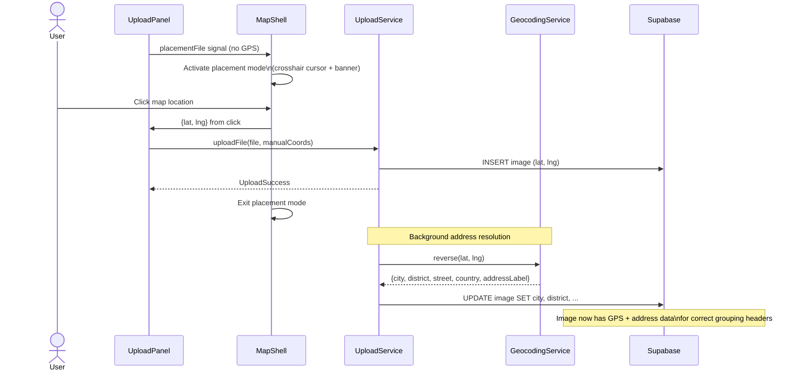

# Placement Mode

## What It Is

A temporary map interaction mode activated when an uploaded photo has no GPS data. The user clicks the map to place the photo at a specific location. A banner at the bottom explains what to do and provides a Cancel option.

## What It Looks Like

**Placement Banner:** Bottom-center floating pill over the map. Pin-drop icon + "Click the map to place this photo" + Cancel button. `--color-bg-surface` background, subtle shadow. `role="status"` for screen readers.

**Crosshair Cursor:** The map container switches to `cursor: crosshair` so the user knows clicking will place the pin.

## Where It Lives

- **Parent**: Map Zone in `MapShellComponent`
- **Appears when**: A file in the upload queue has `status === 'awaiting_placement'`

## Actions

| #   | User Action                      | System Response                                                                 | Triggers                                              |
| --- | -------------------------------- | ------------------------------------------------------------------------------- | ----------------------------------------------------- |
| 1   | Upload panel reports missing GPS | Placement mode activates, banner appears, cursor changes                        | `placementActive` → true                              |
| 2   | Clicks on map                    | Places marker at click coordinates, completes file upload                       | Coordinates sent to upload service                    |
| 3   | After pin placed                 | Reverse-geocode coordinates to populate address fields                          | Async: city, district, street, country, address_label |
| 3b  | After pin placed (conflict)      | If a photoless row exists near placed coords, show conflict popup before upload | `locationConflict$` from UploadManager                |
| 4   | Clicks Cancel                    | Exits placement mode, file stays in `awaiting_placement`                        | `placementActive` → false                             |
| 5   | Presses Escape                   | Same as Cancel                                                                  | `placementActive` → false                             |

## Placement → Address Resolution Flow



## Component Hierarchy

```
[placement mode active]
├── PlacementBanner                        ← absolute bottom-16, center, z-30, pill shape
│   ├── PinDropIcon                        ← Material Icon "place", left side
│   ├── "Click the map to place this photo"← instruction text
│   └── PlacementCancelButton              ← ghost pill button "Cancel"
└── MapContainer.--placing                 ← CSS class adds cursor: crosshair
```

## Data

| Field          | Source                  | Type                           |
| -------------- | ----------------------- | ------------------------------ |
| Placement file | Emitted by Upload Panel | `File \| null`                 |
| Click location | Leaflet map click event | `{ lat: number, lng: number }` |

## State

| Name               | Type             | Default | Controls                                |
| ------------------ | ---------------- | ------- | --------------------------------------- |
| `placementActive`  | `boolean`        | `false` | Banner visibility + cursor change       |
| `placementFileKey` | `string \| null` | `null`  | Which file in the queue is being placed |

## File Map

Part of `MapShellComponent` template and styles — not a separate component. The banner HTML and the `--placing` CSS class live in `map-shell.component.html` and `.scss`.

## Wiring

- Placement mode state managed by `placementFile` signal in `MapShellComponent`
- Banner template is inline in `map-shell.component.html`
- Cursor style applied via `[class.--placing]` binding on map container
- Upload Panel emits placement file via `@Output()` to `MapShellComponent`

## Acceptance Criteria

- [ ] Banner appears when placement mode is active
- [ ] Map cursor changes to crosshair
- [ ] Clicking map places the marker and completes the upload
- [ ] Cancel button exits placement mode
- [ ] Escape key exits placement mode
- [ ] Only one file can be placed at a time
- [ ] Banner has `role="status"` for accessibility
