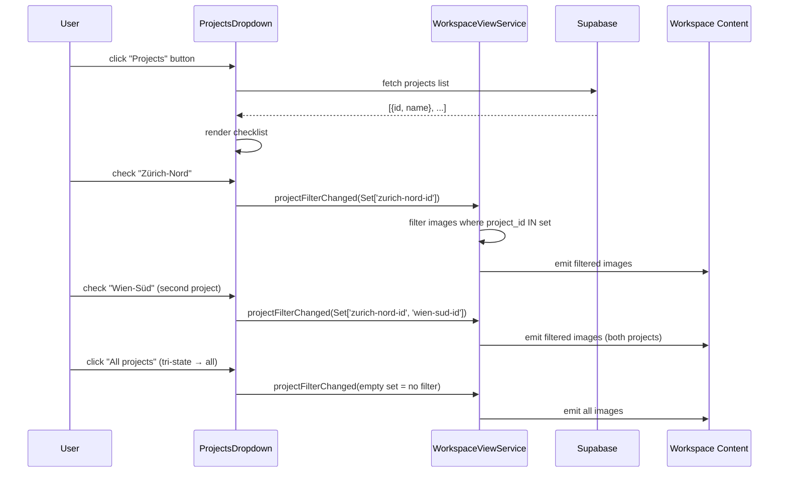
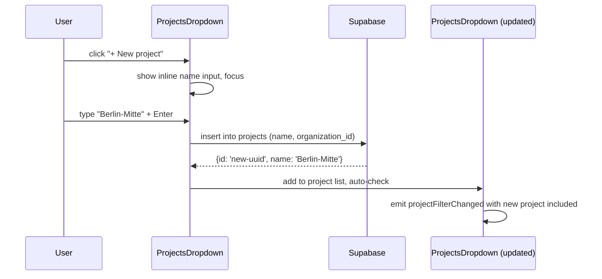
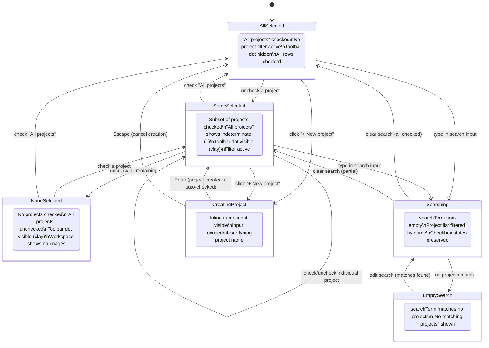
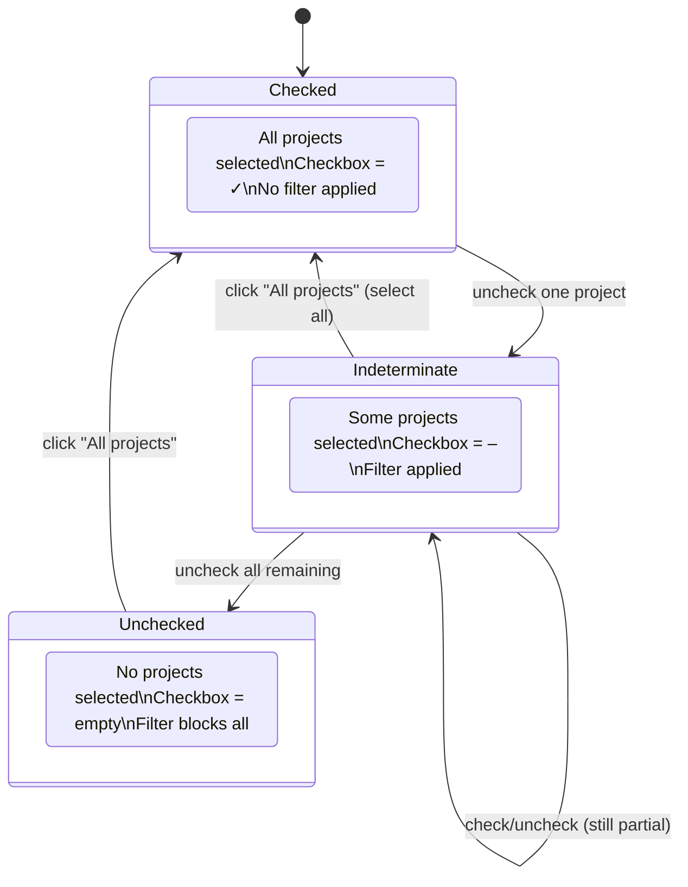
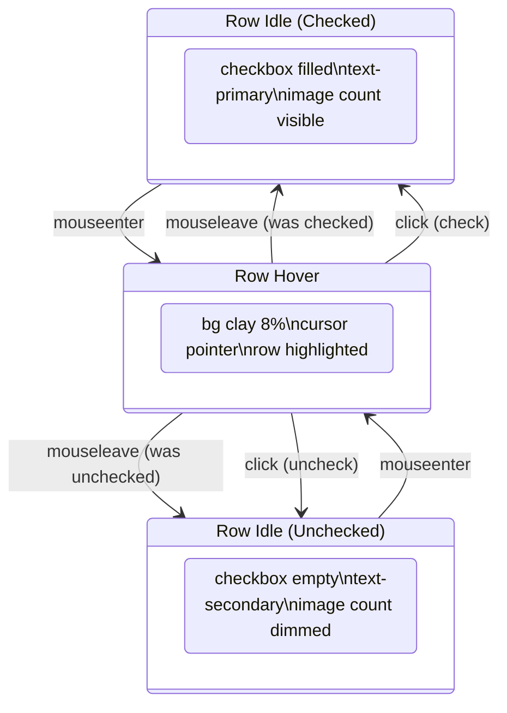
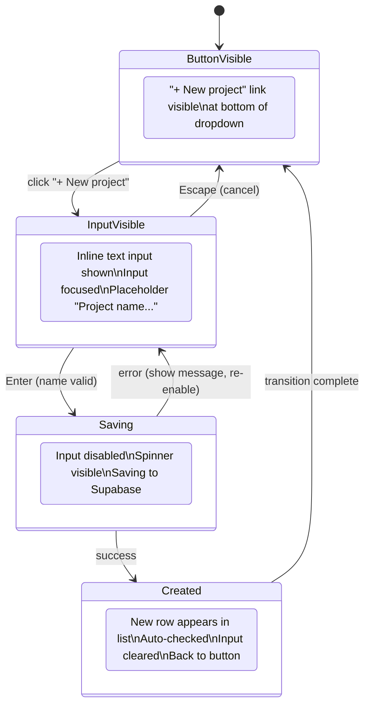

# Projects Dropdown

## What It Is

A dropdown for scoping the workspace view to one or more projects. Contains a search input at the top and a checklist of projects below. Checking projects filters the workspace to show only images belonging to those projects. Unchecking all shows all images (no project filter).

## What It Looks Like

Floating dropdown anchored below the "Projects" toolbar button. Width: 15rem (240px), max-height 20rem (scrollable). `--color-bg-elevated` background, `shadow-xl`, `rounded-lg` corners.

- **Search input** at top: compact, placeholder "Search projects…", `--text-small`.
- **"All projects" row**: first row, toggles all on/off. When all are checked, this shows a filled checkbox. When some are checked, it shows an indeterminate (–) checkbox.
- **Project rows**: each is a `.ui-item` with a checkbox, project name, and image count badge. Checked projects have `--color-primary` checkbox fill.
- **Bottom**: "+ New project" ghost button to create a project inline.

## Where It Lives

- **Parent**: `WorkspaceToolbarComponent`
- **Appears when**: User clicks the "Projects" toolbar button

## Actions

| #   | User Action                    | System Response                                         | Triggers                     |
| --- | ------------------------------ | ------------------------------------------------------- | ---------------------------- |
| 1   | Types in search input          | Filters visible projects by name                        | `searchTerm` changes         |
| 2   | Checks/unchecks a project      | Toggles project filter; workspace re-filters            | `selectedProjectIds` changes |
| 3   | Clicks "All projects" checkbox | Toggles all on (if any unchecked) or all off            | `selectedProjectIds` reset   |
| 4   | Clicks "+ New project"         | Inline name input appears; on Enter, project is created | New project created          |
| 5   | Clicks outside or Escape       | Closes dropdown; project filter remains active          | Dropdown closes              |

## Component Hierarchy

```
ProjectsDropdown                           ← floating dropdown, --color-bg-elevated, shadow-xl, rounded-lg
├── SearchInput                            ← compact, placeholder "Search projects…"
├── AllProjectsRow                         ← .ui-item with tri-state checkbox + "All projects" label
├── ProjectList                            ← scrollable
│   └── ProjectRow × N                     ← .ui-item
│       ├── Checkbox                       ← --color-primary when checked
│       ├── ProjectName                    ← text label
│       └── ImageCount                     ← badge, --text-caption, --color-text-secondary
├── [creating] NewProjectInput             ← inline text input, appears on + click
└── NewProjectButton                       ← ghost "+ New project"
```

## Data

| Field        | Source                                                                                                  | Type                  |
| ------------ | ------------------------------------------------------------------------------------------------------- | --------------------- |
| Projects     | `supabase.from('projects').select('id, name').eq('organization_id', org)`                               | `Project[]`           |
| Image counts | `supabase.from('images').select('project_id, count').group('project_id')` or derived from loaded images | `Map<string, number>` |

## State

| Name                 | Type          | Default | Controls                               |
| -------------------- | ------------- | ------- | -------------------------------------- |
| `searchTerm`         | `string`      | `''`    | Filters visible projects               |
| `selectedProjectIds` | `Set<string>` | empty   | Which projects are checked             |
| `isCreating`         | `boolean`     | `false` | Whether the new-project input is shown |
| `newProjectName`     | `string`      | `''`    | Name for the new project               |

## File Map

| File                                                           | Purpose                     |
| -------------------------------------------------------------- | --------------------------- |
| `features/map/workspace-pane/projects-dropdown.component.ts`   | Projects checklist dropdown |
| `features/map/workspace-pane/projects-dropdown.component.html` | Template                    |
| `features/map/workspace-pane/projects-dropdown.component.scss` | Styles                      |

## Wiring

- Rendered inside `WorkspaceToolbarComponent` via `@if (activeDropdown() === 'projects')`
- `selectedProjectIds` is passed to `WorkspaceViewService` which filters images
- Also informs `FilterService` (project filter is equivalent to a filter rule)
- Image counts are derived from the currently-loaded image set (no extra query)

## Acceptance Criteria

- [x] Search input at top filters projects by name
- [x] Each project row has a checkbox, name, and image count
- [x] "All projects" row with tri-state checkbox (all/some/none)
- [ ] Checking/unchecking updates workspace view immediately
- [ ] "+ New project" creates a project with inline name entry
- [ ] Closing dropdown does NOT clear project selection
- [ ] Empty search state: "No matching projects"
- [ ] Newly created project appears in list immediately
- [x] Dropdown uses `position: fixed` to escape overflow
- [x] Row hover: clay 8% background tint
- [x] Checked rows: text-primary, unchecked: text-secondary

---

## Projects Flow



## Create New Project Flow



## Projects Dropdown — State Machine



## "All Projects" Checkbox — Tri-State



## Project Row — Visual States



## Create New Project Flow — States


