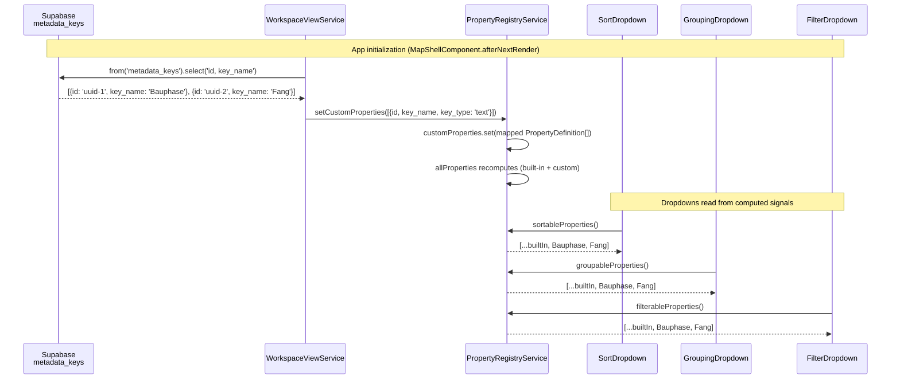
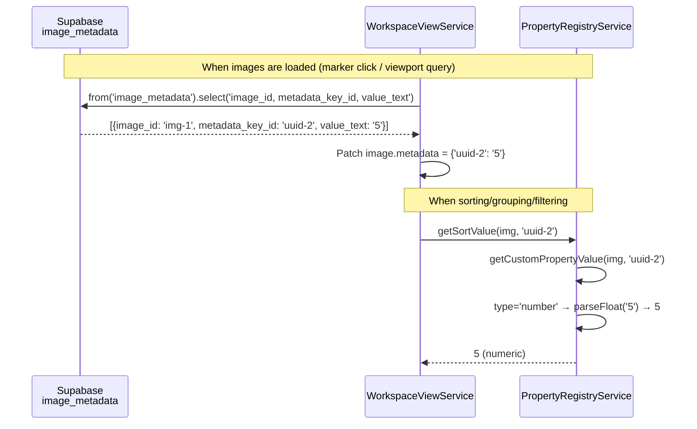

# Property Registry

> **Spec type:** Service spec (cross-cutting). The Property Registry is a shared service consumed by Sort, Grouping, Filter, and Search operators.

## What It Is

A centralized registry of all available image properties — both built-in (Date, City, Project, etc.) and custom (user-defined metadata keys like "Chimney Number", "Material"). Every operator in the workspace toolbar reads from this single source to populate its property lists, ensuring consistency.

## Where It Lives

- Service: `core/property-registry.service.ts`
- Consumed by: `SortDropdownComponent`, `GroupingDropdownComponent`, `FilterDropdownComponent`, `SearchBarComponent`, `WorkspaceToolbarComponent`

## Property Definition

Each property in the registry has:

```typescript
interface PropertyDefinition {
  /** Unique identifier — slug for built-in, UUID for custom. */
  id: string;
  /** Human-readable label. */
  label: string;
  /** Material icon name. */
  icon: string;
  /** Property data type — determines operators and sort behavior. */
  type: "text" | "select" | "number" | "date" | "checkbox";
  /** Which operators can use this property. */
  capabilities: {
    sortable: boolean;
    groupable: boolean;
    filterable: boolean;
    searchable: boolean;
  };
  /** Default sort direction when first activated. */
  defaultSortDirection: "asc" | "desc";
  /** True for built-in properties, false for custom. */
  builtIn: boolean;
}
```

## Built-In Properties

| ID              | Label         | Icon             | Type     | Sort | Group | Filter | Search | Default Dir |
| --------------- | ------------- | ---------------- | -------- | ---- | ----- | ------ | ------ | ----------- |
| `date-captured` | Date captured | `schedule`       | `date`   | ✓    | ✗     | ✓      | ✗      | `desc`      |
| `date-uploaded` | Date uploaded | `cloud_upload`   | `date`   | ✓    | ✗     | ✓      | ✗      | `desc`      |
| `name`          | Name          | `sort_by_alpha`  | `text`   | ✓    | ✗     | ✓      | ✓      | `asc`       |
| `distance`      | Distance      | `straighten`     | `number` | ✓    | ✗     | ✓      | ✗      | `asc`       |
| `address`       | Address       | `location_on`    | `text`   | ✓    | ✓     | ✓      | ✓      | `asc`       |
| `city`          | City          | `location_city`  | `text`   | ✓    | ✓     | ✓      | ✓      | `asc`       |
| `district`      | District      | `map`            | `text`   | ✗    | ✓     | ✓      | ✓      | `asc`       |
| `street`        | Street        | `signpost`       | `text`   | ✗    | ✓     | ✓      | ✓      | `asc`       |
| `country`       | Country       | `flag`           | `text`   | ✓    | ✓     | ✓      | ✓      | `asc`       |
| `project`       | Project       | `folder`         | `text`   | ✓    | ✓     | ✓      | ✓      | `asc`       |
| `date`          | Date          | `schedule`       | `date`   | ✗    | ✓     | ✗      | ✗      | `desc`      |
| `year`          | Year          | `calendar_today` | `date`   | ✗    | ✓     | ✗      | ✗      | `desc`      |
| `month`         | Month         | `date_range`     | `date`   | ✗    | ✓     | ✗      | ✗      | `desc`      |
| `user`          | User          | `person`         | `text`   | ✗    | ✓     | ✓      | ✓      | `asc`       |

## Custom Properties

Custom properties are fetched from `MetadataService.getOrgProperties()`. They map to `PropertyDefinition` with:

- `id` = `metadata_key.id` (UUID)
- `label` = `metadata_key.key_name`
- `icon` = type-based icon (`tag` for text, `arrow_drop_down_circle` for select, `numbers` for number, `event` for date, `check_box` for checkbox)
- `type` = `metadata_key.value_type`
- All capabilities set to `true` (custom properties are usable everywhere)
- `defaultSortDirection` = `'asc'`
- `builtIn` = `false`

### Numeric Sort Behavior

When resolving sort values, the registry considers the property type:

- **number**: `parseFloat(value)` — `NaN` results treated as `null` (sort last)
- **text/select/checkbox**: raw string value (case-insensitive text comparison)
- **date**: ISO date string (natural lexicographic order for ISO dates)

This ensures number-type custom properties sort as 1, 5, 12, 100 — not "1", "100", "12", "5".

### Custom Property Values on WorkspaceImage

Custom property values are stored in `WorkspaceImage.metadata` — a `Record<string, string>` mapping property ID (UUID) to stored value. This map is populated when images are loaded (via a secondary query to `image_metadata`).

## Actions

| #   | Trigger                        | System Response                                          |
| --- | ------------------------------ | -------------------------------------------------------- |
| 1   | App initializes                | Built-in properties loaded into registry                 |
| 2   | User logs in / org changes     | Custom properties fetched from DB, merged into registry  |
| 3   | Admin creates custom property  | Registry signal updates, all operators see new property  |
| 4   | Admin deletes custom property  | Registry signal updates, property removed from operators |
| 5   | Sort dropdown reads properties | Filters `allProperties()` by `capabilities.sortable`     |
| 6   | Grouping reads properties      | Filters `allProperties()` by `capabilities.groupable`    |
| 7   | Filter reads properties        | Filters `allProperties()` by `capabilities.filterable`   |

## Component Hierarchy

```
PropertyRegistryService                    ← Injectable, providedIn: 'root'
├── builtInProperties: PropertyDefinition[]  ← static, defined at class level
├── customProperties: signal<PropertyDefinition[]>  ← from MetadataService
├── allProperties: computed<PropertyDefinition[]>   ← merged built-in + custom
├── sortableProperties: computed              ← filtered by sortable
├── groupableProperties: computed             ← filtered by groupable
├── filterableProperties: computed            ← filtered by filterable
└── getPropertyValue(img, propId): string | number | null  ← unified value resolver
```

## Data

| Field               | Source                                                                | Type                       |
| ------------------- | --------------------------------------------------------------------- | -------------------------- |
| Built-in properties | Static array in `PropertyRegistryService`                             | `PropertyDefinition[]`     |
| Custom properties   | `MetadataService.getOrgProperties()` → mapped to `PropertyDefinition` | `PropertyDefinition[]`     |
| Property values     | `WorkspaceImage` fields for built-in, `image_metadata` for custom     | `string \| number \| null` |

## State

| Name               | Type                   | Default       | Controls                              |
| ------------------ | ---------------------- | ------------- | ------------------------------------- |
| `customProperties` | `PropertyDefinition[]` | `[]`          | Custom properties from DB             |
| `allProperties`    | `PropertyDefinition[]` | built-in only | Merged list consumed by all operators |

## File Map

| File                                     | Purpose                        |
| ---------------------------------------- | ------------------------------ |
| `core/property-registry.service.ts`      | Shared registry service        |
| `core/property-registry.service.spec.ts` | Tests                          |
| `core/property-registry.types.ts`        | `PropertyDefinition` interface |

## Wiring

- `PropertyRegistryService` is `providedIn: 'root'`
- `SortDropdownComponent` injects `PropertyRegistryService` for its options list
- `WorkspaceToolbarComponent` injects `PropertyRegistryService` for grouping available properties
- `FilterDropdownComponent` injects `PropertyRegistryService` for filter property options
- `WorkspaceViewService.getSortValue()` and `getGroupValue()` delegate to `PropertyRegistryService.getPropertyValue()` for custom properties
- `FilterService.getFieldValue()` delegates to `PropertyRegistryService.getPropertyValue()` for custom properties

### Data Flow: Custom Properties from DB to Dropdowns



### Data Flow: Custom Property Values on Images



## Acceptance Criteria

- [ ] `PropertyRegistryService` provides a single `allProperties` signal
- [ ] Built-in properties match the table above (14 properties)
- [ ] Custom properties are loaded from `metadata_keys` via `WorkspaceViewService.loadCustomProperties()` at app init
- [ ] `sortableProperties` returns only properties with `sortable: true`
- [ ] `groupableProperties` returns only properties with `groupable: true`
- [ ] `filterableProperties` returns only properties with `filterable: true`
- [ ] Sort dropdown reads from registry instead of hardcoded array
- [ ] Grouping dropdown reads from registry instead of hardcoded array
- [ ] Filter dropdown reads from registry instead of hardcoded array
- [ ] `getPropertyValue()` resolves built-in properties from `WorkspaceImage` fields
- [ ] `getPropertyValue()` resolves custom properties from `image_metadata`
- [ ] Adding a custom property makes it appear in all operator dropdowns
