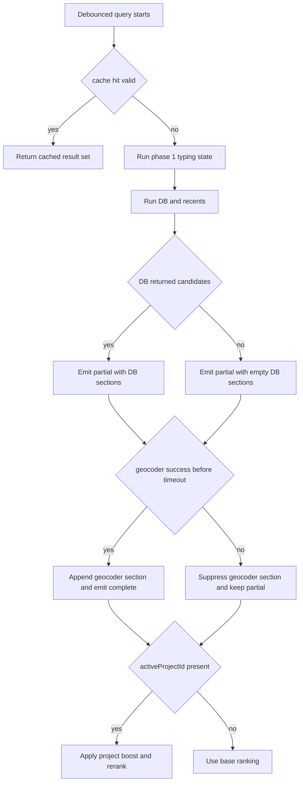

# Search Bar - Data And Service

> **Parent spec:** [search-bar](search-bar.md)
> **Blueprint:** [implementation-blueprints/search-bar.md](../implementation-blueprints/search-bar.md)

## What It Is

The data-flow and service contract for Search Bar orchestration. It defines phased source loading, geocoder proxy constraints, ranking formulas, geo-biasing, and `SearchBarService` responsibilities.

## What It Looks Like

Results appear in progressive phases: instant local signals, fast DB sections, then slower geocoder sections. Geocoder loading is represented as transient skeleton rows and must never block DB sections. Section ordering remains fixed: Addresses, Projects & Groups, Places. Relevance adjusts with project context and geographic bias.

## Where It Lives

- **Parent**: `SearchBarComponent` orchestration contract
- **Appears when**: Search queries are executed or result sections are rendered

## Actions

| #   | User Action              | System Response                                                  | Triggers                |
| --- | ------------------------ | ---------------------------------------------------------------- | ----------------------- |
| 1   | Types query              | Start phased orchestration (`typing` -> `partial` -> `complete`) | Debounced query stream  |
| 2   | Geocoder timeout/failure | Hide geocoder section; keep DB results visible                   | Non-blocking error path |
| 3   | Changes active project   | Re-emit `SearchQueryContext`, re-rank project-sensitive results  | Project context update  |
| 4   | Repeats recent query     | Serve cached results when valid                                  | Cache hit               |
| 5   | Commits result           | Persist recent search and update ranking signals                 | Commit event            |

### Decision Flowchart



## Component Hierarchy

```
Search Data Orchestration
├── SearchOrchestratorService
│   ├── TypingPhaseEmitter
│   ├── PartialPhaseEmitter (DB + recents)
│   └── CompletePhaseEmitter (geocoder append)
├── SearchBarService
│   ├── DbAddressResolver
│   ├── DbContentResolver
│   ├── GeocoderResolver (via GeocodingService)
│   └── RecentSearchStore
└── RankingPipeline
    ├── ProjectBoostScorer
    ├── DataGravityScorer
    ├── GeoBiasScorer
    └── DedupReducer
```

## Data

| Field                 | Source                                           | Type                          |
| --------------------- | ------------------------------------------------ | ----------------------------- |
| DB address candidates | `SearchOrchestratorService -> dbAddressResolver` | `SearchAddressCandidate[]`    |
| DB content candidates | `SearchOrchestratorService -> dbContentResolver` | `SearchContentCandidate[]`    |
| Geocoder candidates   | `SearchOrchestratorService -> geocoderResolver`  | `SearchAddressCandidate[]`    |
| Recent searches       | `SearchBarService -> localStorage`               | `SearchRecentCandidate[]`     |
| Search result set     | `SearchOrchestratorService.searchInput()`        | `Observable<SearchResultSet>` |
| Query context         | Project/map/org context providers                | `SearchQueryContext`          |

## State

| Name           | Type                                   | Default     | Controls                             |
| -------------- | -------------------------------------- | ----------- | ------------------------------------ |
| `phase`        | `'typing' \| 'partial' \| 'complete'`  | `'typing'`  | Progressive rendering stage          |
| `geoStatus`    | `'loading' \| 'loaded' \| 'error'`     | `'loading'` | Geocoder section visibility/skeleton |
| `countryCodes` | `string[]`                             | `[]`        | Country bias for geocoder queries    |
| `dataCentroid` | `{ lat: number; lng: number } \| null` | `null`      | Proximity-decay scoring              |
| `cacheTtlMs`   | `number`                               | `300000`    | Search cache lifetime                |

## File Map

| File                                                | Purpose                                  |
| --------------------------------------------------- | ---------------------------------------- |
| `docs/element-specs/search-bar-data-and-service.md` | Data and service contract for Search Bar |

## Wiring

### Injected Services

- `SearchBarService` — coordinates query lifecycle, recents, fallback, and ranking orchestration.
- `SearchOrchestratorService` — emits phased result sets and handles dedup pipeline behavior.
- `GeocodingService` — proxies external geocoder calls via Supabase Edge Function.

### Inputs / Outputs

None.

### Subscriptions

- Query input stream — debounced phase trigger; torn down with owning lifecycle.
- Project selection/context stream — updates `SearchQueryContext` and ranking; torn down with owning lifecycle.
- Geocoder response stream — merged into complete phase and canceled on query changes.

### Supabase Calls

- `images` table, `select` (address candidate lookup) — triggered on non-empty query in DB address resolver.
- `projects` table, `select` (project content candidates) — triggered on non-empty query in DB content resolver.
- `saved_groups` table, `select` (group content candidates) — triggered on non-empty query in DB content resolver.
- Edge Function `/functions/v1/geocode`, `invoke` (forward geocoder query) — triggered after debounce for geocoder phase.

```mermaid
sequenceDiagram
  participant UI as SearchBarComponent
  participant SB as SearchBarService
  participant ORCH as SearchOrchestratorService
  participant DB as Supabase DB
  participant FX as Supabase Edge Function (geocode)

  UI->>SB: search(query, context)
  SB->>ORCH: searchInput(query, context)
  ORCH-->>UI: phase 1 typing

  par phase 2 DB
    ORCH->>DB: select images.address_label
    ORCH->>DB: select projects.name
    ORCH->>DB: select saved_groups.name
  and phase 3 geocoder
    ORCH->>FX: invoke geocode(query, viewbox, countrycodes, limit)
  end

  DB-->>ORCH: DB results or DB error
  alt DB error
    ORCH-->>UI: partial with available sources + error-safe fallback
  else DB success
    ORCH-->>UI: partial (DB sections)
  end

  FX-->>ORCH: geocoder results or timeout/error
  alt geocoder timeout/error
    ORCH-->>UI: keep partial; suppress geocoder section
  else geocoder success
    ORCH->>ORCH: dedup + geo-bias rerank
    ORCH-->>UI: complete (DB + geocoder)
  end
```

## Acceptance Criteria

- [ ] Search source loading is progressive and non-blocking across phases.
- [ ] DB results render before geocoder results for typical latency conditions.
- [ ] Geocoder calls go through Edge Function proxy only.
- [ ] Fallback geocoder variants execute only when primary query yields no results.
- [ ] Section ordering remains fixed: Addresses -> Projects & Groups -> Places.
- [ ] Active-project context materially boosts ranking in DB sections.
- [ ] Geo-biasing uses country and centroid context when available.
- [ ] Geocoder results within 30m of DB address candidates are deduplicated from Places output.
- [ ] In-flight geocoder requests are canceled on query changes (`switchMap` or equivalent cancellation semantics).
- [ ] `SearchQueryContext` includes and propagates `activeProjectId` from active project selection.
- [ ] DB address ranking uses `textMatch × projectBoost × dataGravity × recencyDecay`.
- [ ] DB content ranking uses `textMatch × projectBoost × sizeSignal`.
- [ ] Geocoder ranking uses `nominatimImportance × proximityDecay × countryBoost`.
- [ ] Session cache includes org `countryCodes` and `dataCentroid` for query-time geo bias.
- [ ] Edge Function accepts and forwards `viewbox`, `bounded`, `countrycodes`, and `limit`.
- [ ] Recent searches persist across sessions in `feldpost-recent-searches`.
- [ ] Recent entries include `projectId` context and are ranked project-first, then recency/usage.
- [ ] Recent search storage is capped at 20 with deterministic eviction behavior.
- [ ] `SearchBarService` retains non-UI responsibilities; component layer does not directly call `fetch()` or `localStorage`.
- [ ] DB address labels are normalized to `Street Number, Postcode City` on write path when source fields permit normalization.
- [ ] "Search this area" can trigger viewport-bound re-query when pan distance crosses threshold.
- [ ] Progressive geo-disclosure can group geocoder output into near-data and other-locations buckets.
- [ ] Offline cache mode can return address/coordinate cache entries with explicit offline labeling.

## Data Pipeline

### Search Source Tiers

| Tier    | Source             | Latency   | Table / API                          | Section           |
| ------- | ------------------ | --------- | ------------------------------------ | ----------------- |
| Instant | Recent searches    | 0ms       | localStorage                         | Recent searches   |
| Instant | Ghost completion   | <1ms      | in-memory trie                       | inline ghost      |
| Fast    | DB addresses       | ~50-200ms | `images.address_label`               | Addresses         |
| Fast    | DB projects/groups | ~50-200ms | `projects.name`, `saved_groups.name` | Projects & Groups |
| Slow    | Geocoder           | ~1-2s     | Edge Function -> Nominatim           | Places            |

Phases:

- Phase 1: typing feedback and ghost completion
- Phase 2: DB and recents
- Phase 3: geocoder append

The three phases must be emitted independently so a failure in geocoder phase does not suppress phase-2 output.

### SearchQueryContext

```typescript
export interface SearchQueryContext {
  organizationId?: string;
  activeProjectId?: string;
  viewportBounds?: { north: number; east: number; south: number; west: number };
  dataCentroid?: { lat: number; lng: number };
  countryCodes?: string[];
  activeFilterCount?: number;
  commandMode?: boolean;
  selectedGroupId?: string;
}
```

### Geocoder Resolution - Proxy Only

All geocoder requests must go through `GeocodingService` via the Supabase Edge Function (`/functions/v1/geocode`). No direct browser calls to Nominatim are allowed.

### Result Ranking Algorithm

DB addresses:

`score = textMatch × projectBoost × dataGravity × recencyDecay`

DB content:

`score = textMatch × projectBoost × sizeSignal`

Geocoder:

`score = nominatimImportance × proximityDecay × countryBoost`

### Geo-Relevance Ranking

Bias layers:

1. Country restriction (`countrycodes`)
2. Viewport bias (`viewbox`)
3. Data-gravity re-ranking
4. Proximity decay

Centroid query:

```sql
SELECT ST_X(ST_Centroid(ST_Collect(geog::geometry))) AS lng,
       ST_Y(ST_Centroid(ST_Collect(geog::geometry))) AS lat
FROM images
WHERE organization_id = :org_id
  AND latitude IS NOT NULL;
```

### Edge Function Parameters

| Parameter      | Type     | Description                             |
| -------------- | -------- | --------------------------------------- |
| `viewbox`      | `string` | `west,north,east,south` map viewport    |
| `bounded`      | `0 \| 1` | Restrict-to-viewbox toggle              |
| `countrycodes` | `string` | ISO 3166-1 comma list                   |
| `limit`        | `number` | Result cap (default `5` for Search Bar) |

## SearchBarService Contract

Responsibilities:

- Recent search persistence and ranking
- Geocoder resolution via proxy
- Fallback query strategy
- DB address/content resolver orchestration

Interface:

```typescript
@Injectable({ providedIn: "root" })
export class SearchBarService {
  resolveGeocoderCandidates(
    query: string,
    context: SearchQueryContext,
  ): Observable<SearchAddressCandidate[]>;
  resolveDbAddressCandidates(
    query: string,
    context: SearchQueryContext,
  ): Observable<SearchAddressCandidate[]>;
  resolveDbContentCandidates(
    query: string,
    context: SearchQueryContext,
  ): Observable<SearchContentCandidate[]>;
  getRecentSearches(activeProjectId?: string): SearchRecentCandidate[];
  addRecentSearch(label: string, activeProjectId?: string): void;
  clearRecentSearches(): void;
}
```

Recent storage key: `feldpost-recent-searches`.

```typescript
interface StoredRecentSearch {
  label: string;
  lastUsedAt: string;
  projectId?: string;
  usageCount: number;
}
```

Storage/ranking rules:

- Cap at 20 entries with LRU-style eviction.
- Upsert duplicate labels by bumping `lastUsedAt` and `usageCount`.
- Rank active-project recents first, then others by recency and usage.

Future enhancement:

- Replace DB `ilike` matching with `pg_trgm` similarity search for typo tolerance.
