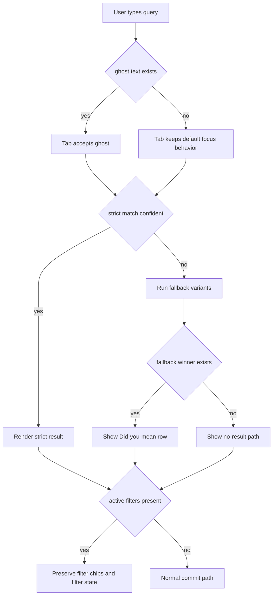
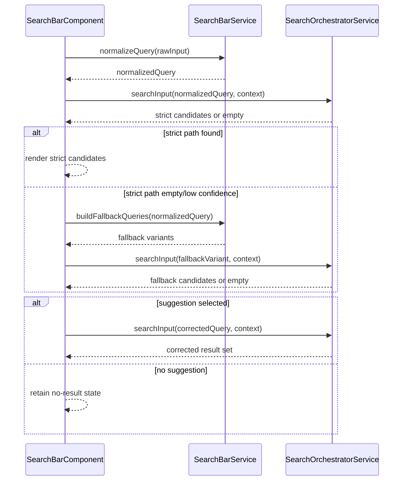

# Search Bar - Query Behavior

> **Parent spec:** [search-bar](search-bar.md)
> **Use cases:** [use-cases/search-bar.md](../use-cases/search-bar.md)

## What It Is

The query behavior contract for Search Bar text handling. It defines address label formatting, ghost completion, forgiving matching, and search/filter coexistence rules.

## What It Looks Like

Address results show concise labels in `Street Number, Postcode City` form. Named places render a two-line row with a bold name and a muted secondary address line. Ghost completion appears inline as faded text after the caret and is accepted with `Tab`. Approximate matches and correction suggestions are visually labeled.

## Where It Lives

- **Parent**: `SearchBarComponent` behavior contract
- **Appears when**: Search Bar is focused or processing typed input

## Actions

| #   | User Action                      | System Response                              | Triggers              |
| --- | -------------------------------- | -------------------------------------------- | --------------------- |
| 1   | Types text prefix                | Compute ghost completion from local sources  | Debounced input event |
| 2   | Presses `Tab` with ghost text    | Accept ghost text and rerun search           | Query update          |
| 3   | Presses `Tab` without ghost text | Preserve default focus behavior              | Browser default       |
| 4   | Selects correction suggestion    | Replace input with corrected query and rerun | Suggestion row click  |
| 5   | Commits geocoder or DB address   | Render normalized display label format       | Commit event          |
| 6   | Runs search while filters active | Keep filter chips and filter state intact    | Query commit          |

### Decision Flowchart



## Component Hierarchy

```
SearchBar Query Layer
├── InputNormalization
│   ├── DiacriticNormalizer
│   ├── SuffixNormalizer
│   └── WhitespaceCollapser
├── GhostCompletion
│   ├── PrefixTrie
│   ├── RankedCandidatePicker
│   └── InlineGhostRenderer
├── AddressFormatter
│   ├── PoiPrimaryLineBuilder
│   └── StructuredAddressFallbackBuilder
└── SuggestionRow
    └── DidYouMeanAction
```

## Data

| Field                          | Source                                            | Type                      |
| ------------------------------ | ------------------------------------------------- | ------------------------- |
| Ghost candidates               | Recents + cached DB labels + cached content names | `string[]`                |
| Nominatim structured address   | `GeocodingService.search()` result                | `Record<string, string>`  |
| Query normalization dictionary | Static normalization rules                        | `Record<string, string>`  |
| Active filters snapshot        | Search/filter integration context                 | `number` + filter payload |

## State

| Name               | Type             | Default | Controls                               |
| ------------------ | ---------------- | ------- | -------------------------------------- |
| `normalizedQuery`  | `string`         | `''`    | Matching and fallback query generation |
| `ghostText`        | `string \| null` | `null`  | Inline completion rendering            |
| `suggestionText`   | `string \| null` | `null`  | "Did you mean" suggestion visibility   |
| `hasActiveFilters` | `boolean`        | `false` | Search/filter integration behavior     |

## File Map

| File                                              | Purpose                                |
| ------------------------------------------------- | -------------------------------------- |
| `docs/element-specs/search-bar-query-behavior.md` | Query behavior contract for Search Bar |

## Wiring

### Injected Services

- `SearchBarService` — owns normalization, formatting, and recent-search behavior contracts.
- `SearchOrchestratorService` — executes query orchestration and candidate composition.

### Inputs / Outputs

None.

### Subscriptions

- Query text stream — used to recompute ghost text and fallback decisions; torn down with owning component/service lifecycle.
- Active filter state stream — used to enforce filter-preservation rules; torn down with owning component/service lifecycle.

### Supabase Calls

None — delegated to `SearchBarService`.



## Acceptance Criteria

- [ ] All committed address labels use `Street Number, Postcode City` where structured fields exist.
- [ ] Named-place rows render a primary name line plus formatted secondary address line.
- [ ] Ghost completion is computed locally and never waits for geocoder responses.
- [ ] `Tab` accepts ghost text only when ghost text exists.
- [ ] Query normalization handles diacritics, spacing, and common street suffix variants.
- [ ] Correction suggestions appear only when strict matching has no sufficiently confident result.
- [ ] Search commits do not clear active filters unless user explicitly clears filters.
- [ ] Pasted decimal coordinates skip text search and commit map-center behavior directly.
- [ ] Pasted Google Maps URLs extract coordinates and follow the same commit path as decimal input.
- [ ] DMS coordinate input is converted to decimal before commit.
- [ ] Reverse geocode after coordinate commit populates committed label; on failure, raw coordinates are shown.
- [ ] Ghost completion trie lookup remains local (no network) and target query lookup is <1ms.
- [ ] Ghost tie-breaking prefers shorter labels when scores are equal.
- [ ] Weighted ghost scoring applies `sourcePriority × relevanceSignal × projectBoost × recencyDecay`.
- [ ] Active-project ghost candidates receive a 2x weight multiplier.
- [ ] Smart suggestions in focused-empty state replace plain recents when context cards are available.
- [ ] Saved search pins appear above recents and are not evicted by recent-search caps.
- [ ] Slash-command mode (`/`) can switch search into command intent without breaking standard search mode.
- [ ] Optional inline map preview can render for highlighted geocoder candidates without changing row geometry.

## Address Display Formatting

Nominatim can return verbose display labels. Search Bar display labels must be compact and scannable.

Primary format: `Street Number, Postcode City`

Fallback cascade:

| Available fields                     | Display format                |
| ------------------------------------ | ----------------------------- |
| street + number + postcode + city    | `Schleiergasse 18, 1100 Wien` |
| street + postcode + city (no number) | `Schleiergasse, 1100 Wien`    |
| street + city (no postcode)          | `Schleiergasse, Wien`         |
| city only                            | `Wien`                        |
| none                                 | Truncated `display_name`      |

For POI/name matches where `name` differs from road name, use two-line display:

- Primary: place name (bold)
- Secondary: formatted address (muted)

`formatAddressLabel(nominatimResult)` belongs in service code, not component code.

## Tab Autocomplete (Inline Ghost Completion)

Ghost completion is ranked by source priority and local relevance. It is computed from local/in-memory datasets:

1. Recent searches in active project
2. Recent searches in other projects
3. DB addresses (weighted by image count)
4. DB content names
5. Previous geocoder commits

Scoring formula:

`weight = sourcePriority × relevanceSignal × projectBoost × recencyDecay`

Rules:

- `Tab` accepts ghost text and triggers a new query.
- Other input invalidates and recomputes ghost text on next keystroke.
- Screen readers ignore ghost text (`aria-hidden="true"`).

## Forgiving Address Matching

For typo tolerance and normalization:

1. Normalize input first (case, spacing, diacritics, suffix variants).
2. Run strict/primary query.
3. Only if primary returns none or low confidence, run fallback variants:
   - street + number
   - street only
   - token-corrected street-only
4. Show a "Did you mean" row only when fallback wins.
5. Mark approximate matches clearly.

## Search + Filter Integration Rules

1. Search commits can set distance reference points for distance filters.
2. Active filter chips remain visible while search is active.
3. Search never resets filters unless user explicitly clears filters.
4. Search context persists through image-detail navigation and tab switches.
5. If user pans far from a committed target, show a "Return to selected" affordance in search area.

## Advanced Query UX (Future)

1. **Smart suggestions on empty focus**: show context cards such as "Photos uploaded today", "Unresolved addresses", and "Nearest project site" when data exists.
2. **Saved searches / bookmarks**: pin favorite searches above recents with no LRU eviction.
3. **Command mode**: starting with `/` enters command intent (`/upload`, `/export`, `/settings`, `/go project-name`).
4. **Inline map preview**: keyboard-highlighted geocoder rows can show a tiny preview thumbnail without affecting row dimensions.
