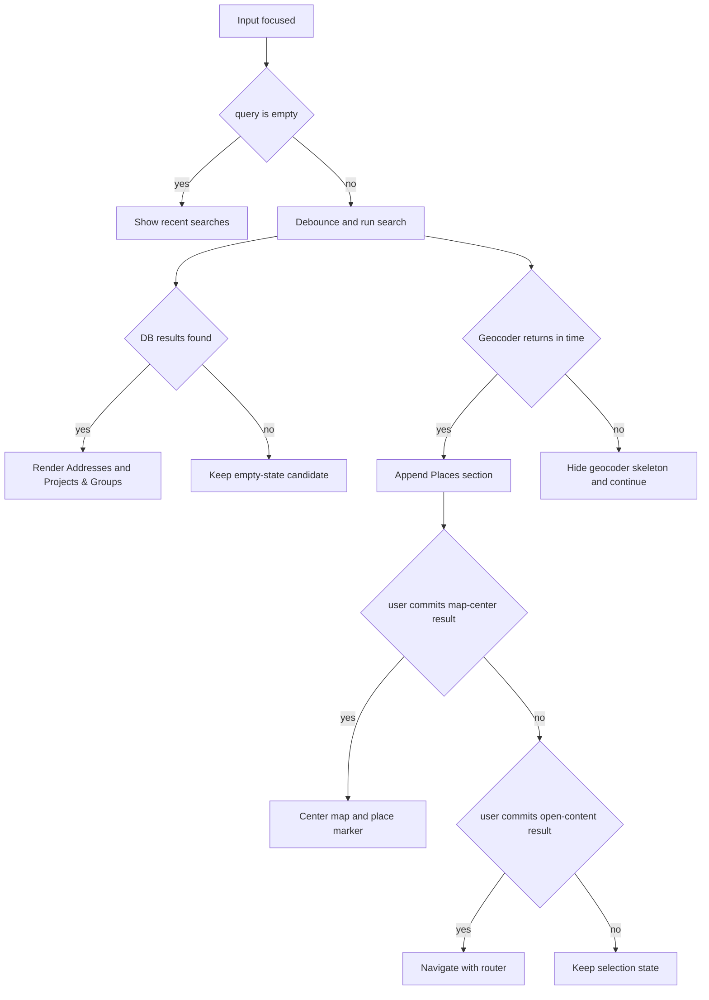
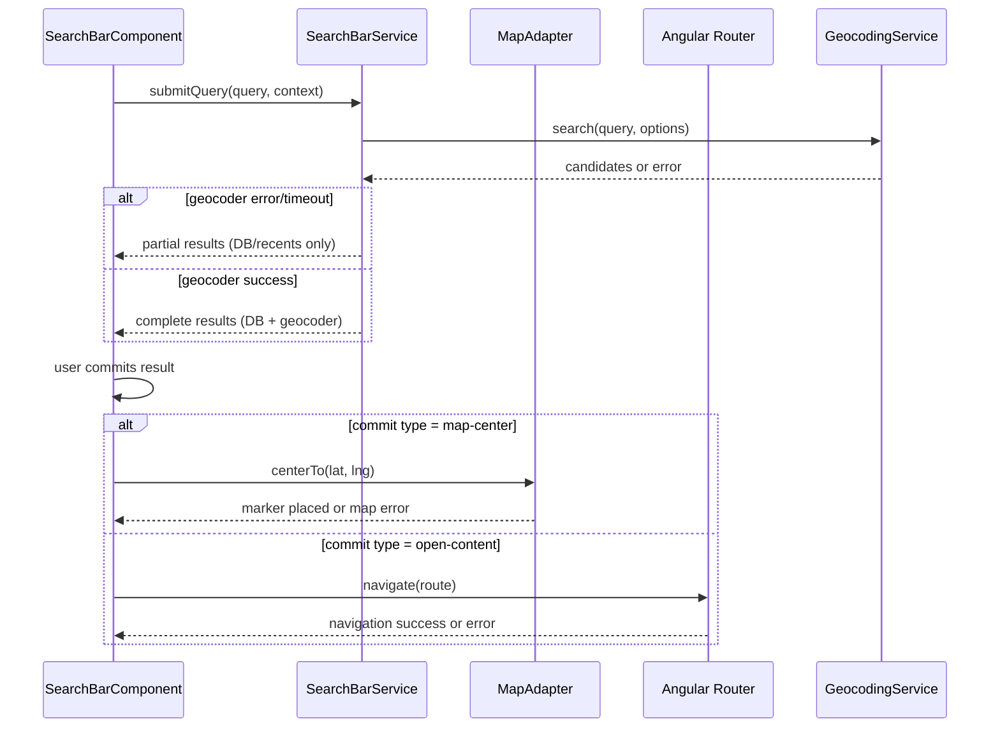

# Search Bar

> **Blueprint:** [implementation-blueprints/search-bar.md](../implementation-blueprints/search-bar.md)

## What It Is

A search surface floating over the map that lets users find places, photos, groups, and projects. It is the main way people navigate the map and find evidence. Supports keyboard shortcut `Cmd/Ctrl+K` for quick access.

## Child Specs

This parent spec defines the implementation contract for the search surface UI and primary interactions. Deep technical behavior is split into child specs:

| Child Spec                                                    | Covers                                                                                            |
| ------------------------------------------------------------- | ------------------------------------------------------------------------------------------------- |
| [search-bar-query-behavior](search-bar-query-behavior.md)     | Address label formatting, ghost completion, forgiving matching, search/filter integration rules   |
| [search-bar-data-and-service](search-bar-data-and-service.md) | Data pipeline phases, geocoder biasing, ranking formulas, service responsibilities and interfaces |

## What It Looks Like

Floating search surface pinned top-center over the map. Use the shared `.ui-container` panel geometry with the same corner radius, panel padding, and panel gap as the Sidebar, subtle shadow, and warm `--color-bg-surface` background. The structure is: panel container → compact search row → results panel revealed inside the same surface. Do not morph the container into a pill in any state. The leading search icon and trailing clear button both sit inside helper wrappers that absorb the extra search-row height while preserving the shared fixed square media-slot rhythm. Results sections use headers, dividers, and clickable rows built from the shared `.ui-item` row pattern. Warm, calm styling: `--color-bg-surface` background, `--color-clay` accents for matched text.

## Where It Lives

- **Route**: Global — rendered inside `MapShellComponent` template
- **Parent**: `MapShellComponent` at `features/map/map-shell/map-shell.component.ts`
- **Appears when**: Always visible when map page is active
- **Dropdown appears when**: Input is focused or has query text

---

## Actions

Derived from the use cases. Each row maps to specific UC scenarios.

| #   | User Action                                | System Response                                                           | Use Cases         | Triggers                                                  |
| --- | ------------------------------------------ | ------------------------------------------------------------------------- | ----------------- | --------------------------------------------------------- |
| 1   | Focuses input (click or tab)               | Opens dropdown with recent searches                                       | UC-1, UC-2        | State → `focused-empty`                                   |
| 2   | Presses `Cmd/Ctrl+K`                       | Focuses input, opens dropdown                                             | UC-13             | State → `focused-empty`                                   |
| 3   | Types characters                           | Debounces 300ms, queries DB + geocoder in parallel                        | UC-1, UC-4        | State → `typing` → `results-partial` → `results-complete` |
| 4   | Presses ArrowDown / ArrowUp                | Moves highlight to next/prev selectable item (skips headers/dividers)     | UC-13             | `activeIndex` changes                                     |
| 5   | Presses Enter                              | Commits highlighted item (or top item if none highlighted)                | UC-1, UC-6, UC-13 | Fires `SearchCommitAction`                                |
| 6   | Presses Tab (with ghost text)              | Accepts inline ghost completion into input text, triggers new search      | UC-8, UC-11       | Query updated                                             |
| 7   | Clicks a DB address result                 | Map centers on that location, adds Search Location Marker                 | UC-1, UC-10       | `commit` type `map-center`                                |
| 8   | Clicks a DB content result (project/group) | Navigates to that content's context                                       | UC-6              | `commit` type `open-content`                              |
| 9   | Clicks a geocoder result                   | Map centers on location                                                   | UC-10, UC-3       | `commit` type `map-center`                                |
| 10  | Clicks a recent search item                | Re-executes that query                                                    | UC-2              | `commit` type `recent-selected`                           |
| 11  | Presses Escape                             | Closes dropdown; second Escape blurs input                                | UC-13             | State → `idle`                                            |
| 12  | Clicks outside search                      | Closes dropdown                                                           | —                 | State → `idle` or `committed`                             |
| 13  | Clicks `×` clear button                    | Clears query + committed state, removes Search Location Marker            | UC-12             | State → `idle`                                            |
| 14  | Backspace on empty committed input         | Clears committed context                                                  | UC-12             | State → `focused-empty`                                   |
| 15  | Query returns no results                   | Shows empty state with "No address found" + suggested actions             | UC-10             | —                                                         |
| 16  | Geocoder slow/fails                        | DB results render immediately, geocoder section shows skeleton then hides | UC-7              | Graceful degradation                                      |
| 17  | Pastes coordinates or Google Maps URL      | Detects coordinate format, centers map, reverse-geocodes label            | UC-5              | `commit` type `map-center`                                |
| 18  | "Did you mean?" suggestion clicked         | Replaces query with corrected text, reruns search                         | UC-16             | Query updated, new search triggered                       |

### Interaction Flowchart



## Component Hierarchy

```
SearchBar                                  ← positioned top-center in Map Zone, z-30, `.ui-container`
├── InputRow                               ← compact search row inside shared panel surface
│   ├── SearchIconSlot                     ← fixed square media slot, non-clickable
│   │   └── SearchIcon                     ← 16px, left side, wrapped to absorb extra row height
│   ├── <input type="search">              ← flex-1, role="combobox", placeholder "Search address, project, group…"
│   └── ClearButton (×)                    ← shown only in committed state, same wrapped media-slot geometry as leading icon
│
└── ResultsPanel                           ← revealed inside the same surface (not an overlay), role="listbox", same width, animates panel height only
    │
    ├── [focused-empty] RecentSection
    │   ├── SectionLabel "Recent searches"
    │   └── DropdownItem × N               ← `.ui-item` row, clock icon + label, role="option"
    │                                         Active-project recents ranked first, then others by recency
    │
    ├── [has results] AddressSection
    │   ├── SectionLabel "Addresses"
    │   └── DropdownItem × N               ← `.ui-item` row, map-pin icon + label + "N photos" meta
    │
    ├── [has results] ContentSection
    │   ├── SectionLabel "Projects & Groups"
    │   └── DropdownItem × N               ← `.ui-item` row, folder icon + label + subtitle
    │
    ├── Divider                            ← 1px line, only if both DB and geocoder have results
    │
    ├── [has results] GeocoderSection
    │   ├── SectionLabel "Places"
    │   └── DropdownItem × N               ← `.ui-item` row, globe icon + label + "External result"
    │
    ├── [loading] GeocoderSkeleton         ← 2 pulse rows while geocoder is fetching
    │
    └── [no results] EmptyState
        ├── "No address found for {query}"
        ├── "Try a different address or pin manually"
        └── GhostButton "Drop pin"         ← starts placement mode
```

### DropdownItem (shared child component)

Each result row uses the shared row contract: `.ui-item` → `.ui-item-media` + `.ui-item-label`. The leading media column stays fixed width across all result families. Labels and optional meta lines truncate inside the flexible label column rather than changing row geometry.  
Highlighted state via `activeIndex`. Icons by family:

- `db-address` → map-pin
- `db-content` → folder / image (by contentType)
- `geocoder` → globe
- `recent` → clock
- `command` → terminal

Address formatting rules and ghost completion algorithm details are defined in [search-bar-query-behavior](search-bar-query-behavior.md).

## Data

| Field                 | Source                                            | Type                          |
| --------------------- | ------------------------------------------------- | ----------------------------- |
| DB address candidates | `SearchOrchestratorService` → `dbAddressResolver` | `SearchAddressCandidate[]`    |
| DB content candidates | `SearchOrchestratorService` → `dbContentResolver` | `SearchContentCandidate[]`    |
| Geocoder candidates   | `SearchOrchestratorService` → `geocoderResolver`  | `SearchAddressCandidate[]`    |
| Recent searches       | `SearchBarService` → `localStorage`               | `SearchRecentCandidate[]`     |
| Search result set     | `SearchOrchestratorService.searchInput()`         | `Observable<SearchResultSet>` |
| Ghost completion      | `SearchBarService` → prefix trie (in-memory)      | `string \| null`              |

The `SearchOrchestratorService` already exists at `core/search/search-orchestrator.service.ts`. It handles debouncing, caching, deduplication, and ranking. The component drives it with a query observable + context observable.

Detailed source-loading, ranking, and geocoder behavior lives in the optional sections after `Acceptance Criteria`.

## State

| Name                 | Type                                                                              | Default        | Controls                                                |
| -------------------- | --------------------------------------------------------------------------------- | -------------- | ------------------------------------------------------- |
| `state`              | `SearchState`                                                                     | `'idle'`       | Current search state machine position                   |
| `query`              | `string`                                                                          | `''`           | Text in the input                                       |
| `dropdownOpen`       | `boolean`                                                                         | `false`        | Whether dropdown is visible                             |
| `activeIndex`        | `number`                                                                          | `-1`           | Currently highlighted item for keyboard nav (-1 = none) |
| `sections`           | `{ dbAddress: SearchSection, dbContent: SearchSection, geocoder: SearchSection }` | empty sections | Parsed from `SearchResultSet`                           |
| `recentSearches`     | `SearchRecentCandidate[]`                                                         | `[]`           | Loaded from `SearchBarService` on init                  |
| `committedCandidate` | `SearchCandidate \| null`                                                         | `null`         | The last committed result                               |
| `allEmpty`           | `boolean`                                                                         | `true`         | Derived: all sections have 0 items                      |

Types are defined in `core/search/search.models.ts` (already exists).

## File Map

| File                                                        | Purpose                                                                |
| ----------------------------------------------------------- | ---------------------------------------------------------------------- |
| `features/map/search-bar/search-bar.component.ts`           | Main search bar component (standalone) — UI + keyboard only            |
| `features/map/search-bar/search-bar.component.html`         | Template matching hierarchy above                                      |
| `features/map/search-bar/search-bar.component.scss`         | Scoped styles (shared panel surface, reveal panel, skeleton)           |
| `features/map/search-bar/search-dropdown-item.component.ts` | Single result row (standalone, inline template)                        |
| `features/map/search-bar/search-bar.component.spec.ts`      | Unit tests covering Actions table                                      |
| `core/search/search-bar.service.ts`                         | Recent searches persistence, geocoder resolution, fallback query logic |
| `core/search/search-bar.service.spec.ts`                    | Unit tests for SearchBarService                                        |

## Wiring

### Injected Services

- `SearchBarService` — orchestrates search logic, recents, and geocoder resolution delegation.
- `MapAdapter` — centers map and manages Search Location Marker placement on map-center commits.
- `Router` — navigates for open-content commits.
- `ProjectsDropdownService` (or equivalent project selection source) — emits active-project context changes.

### Inputs / Outputs

None.

### Subscriptions

- Query input stream (`valueChanges`/signal equivalent) — debounced and torn down in component destroy lifecycle.
- Active project selection stream — updates `SearchQueryContext`; torn down in component destroy lifecycle.
- Keyboard shortcut/click-outside listeners — registered on init and removed on destroy.

### Supabase Calls

None — delegated to `SearchBarService`.



## Acceptance Criteria

### Layout & Visuals

- [x] Search bar is visible top-center over the map on both desktop and mobile
- [x] Search surface uses `.ui-container` with the same panel radius as the Sidebar in all states
- [x] Search surface uses the same shared panel padding and gap tokens as the Sidebar
- [x] Leading search icon uses a fixed square media slot aligned to shared media-size tokens
- [x] Leading search icon and trailing clear button use wrappers that preserve the fixed media slot alignment within the taller search row
- [x] Results panel is revealed inside the same surface and does not behave like a detached floating dropdown
- [x] Dropdown rows use `.ui-item` with a fixed leading media column
- [x] Section divider only shows when both DB and geocoder sections have items
- [x] Results panel expansion animates outer panel height without animating row height, row padding, media width, or panel radius
- [x] Opening and closing the dropdown does not change outer corner radius, item padding, or media-column width

### Interaction

- [x] Clicking input opens dropdown with recent searches
- [x] `Cmd/Ctrl+K` focuses input from anywhere on the map page
- [x] Typing shows debounced results grouped by section (Addresses, Projects & Groups, Places)
- [x] ArrowUp/ArrowDown navigates results, skipping headers and dividers
- [x] Enter commits the highlighted item (or top item if none highlighted)
- [x] Clicking a result commits it
- [x] Address commit centers the map and shows Search Location Marker
- [x] Content commit navigates to the correct route
- [x] Escape closes dropdown; second Escape blurs input
- [x] Click outside closes dropdown
- [x] `×` clear button appears after commit; clicking it resets everything
- [x] `×` clear button uses square control geometry aligned to shared control/media sizing tokens
- [x] Empty state shows "No address found" with "Drop pin" recovery action
- [x] Pasting coordinates or Google Maps URL auto-detects and centers map

### Accessibility

- [x] Dropdown uses `role="listbox"`, items use `role="option"`
- [x] Screen reader announces result count on query completion

### Delegated Behavior Acceptance

- [x] Query behavior, formatting, and filter integration acceptance criteria are owned by [search-bar-query-behavior](search-bar-query-behavior.md).
- [x] Data pipeline, ranking, geo-bias, and service-contract acceptance criteria are owned by [search-bar-data-and-service](search-bar-data-and-service.md).

## Use Cases

> **Full use cases:** [use-cases/search-bar.md](../use-cases/search-bar.md) — 18 scenarios (UC-1 through UC-18) with 50+ edge cases.

The actions table is derived from these use cases. Deep query behavior and ranking details are split into the child specs to keep this parent contract concise.

## State Machine

Search state progression is defined as:

`idle` → `focused-empty` → `typing` → `results-partial` → `results-complete` → `committed`

Coordinate pastes can short-circuit to `committed`. Geocoder failures must never block `results-partial` rendering. Full transition diagrams and timing phases live in [search-bar-data-and-service](search-bar-data-and-service.md).

## Data Pipeline

Not applicable — moved to [search-bar-data-and-service](search-bar-data-and-service.md).

## Search + Filter Integration Rules

Not applicable — moved to [search-bar-query-behavior](search-bar-query-behavior.md).

## Geo-Relevance Ranking

Not applicable — moved to [search-bar-data-and-service](search-bar-data-and-service.md).

## Forgiving Address Matching

Not applicable — moved to [search-bar-query-behavior](search-bar-query-behavior.md).

## SearchBarService

Not applicable — moved to [search-bar-data-and-service](search-bar-data-and-service.md).
