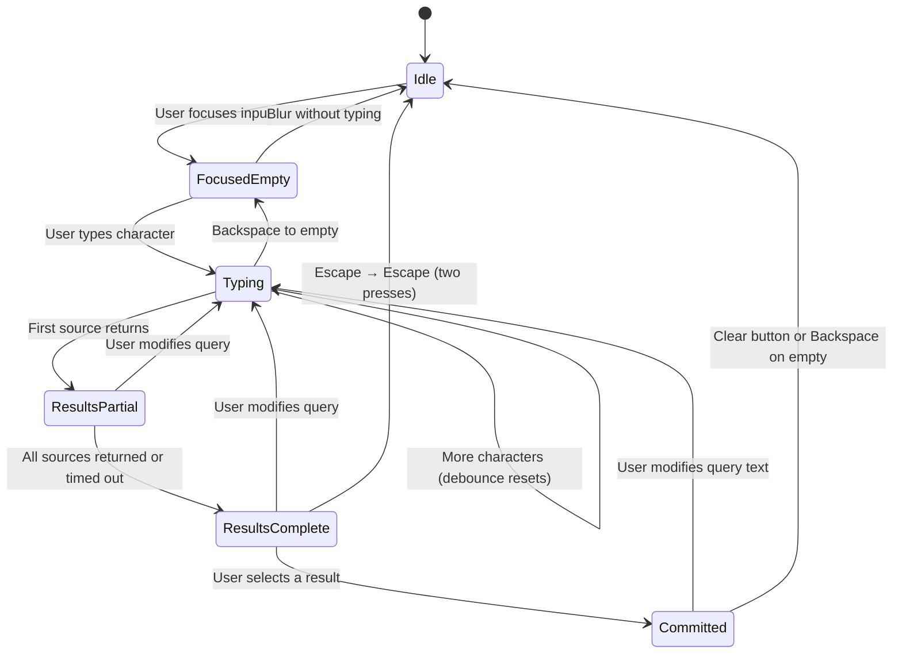

# Search Bar

> **Blueprint:** [implementation-blueprints/search-bar.md](../implementation-blueprints/search-bar.md)

## What It Is

A search surface floating over the map that lets users find places, photos, groups, and projects. It is the main way people navigate the map and find evidence. Supports keyboard shortcut `Cmd/Ctrl+K` for quick access.

## What It Looks Like

Floating search surface pinned top-center over the map. Use the shared `.ui-container` panel geometry with the same corner radius, panel padding, and panel gap as the Sidebar, subtle shadow, and warm `--color-bg-surface` background. The structure is: panel container → compact search row → results panel revealed inside the same surface. Do not morph the container into a pill in any state. The leading search icon and trailing clear button both sit inside helper wrappers that absorb the extra search-row height while preserving the shared fixed square media-slot rhythm. Results sections use headers, dividers, and clickable rows built from the shared `.ui-item` row pattern. Warm, calm styling: `--color-bg-surface` background, `--color-clay` accents for matched text.

## Where It Lives

- **Route**: Global — rendered inside `MapShellComponent` template
- **Parent**: `MapShellComponent` at `features/map/map-shell/map-shell.component.ts`
- **Appears when**: Always visible when map page is active
- **Dropdown appears when**: Input is focused or has query text

## Actions

| #   | User Action                                | System Response                                                           | Triggers                                                  |
| --- | ------------------------------------------ | ------------------------------------------------------------------------- | --------------------------------------------------------- |
| 1   | Focuses input (click or tab)               | Opens dropdown with recent searches                                       | State → `focused-empty`                                   |
| 2   | Presses `Cmd/Ctrl+K`                       | Focuses input, opens dropdown                                             | State → `focused-empty`                                   |
| 3   | Types characters                           | Debounces 300ms, queries DB + geocoder in parallel                        | State → `typing` → `results-partial` → `results-complete` |
| 4   | Presses ArrowDown                          | Moves highlight to next selectable item (skips headers/dividers)          | `activeIndex` increments                                  |
| 5   | Presses ArrowUp                            | Moves highlight to previous selectable item                               | `activeIndex` decrements                                  |
| 6   | Presses Enter                              | Commits highlighted item (or top item if none highlighted)                | Fires `SearchCommitAction`                                |
| 7   | Clicks a DB address result                 | Map centers on that location, adds Search Location Marker                 | `commit` type `map-center`                                |
| 8   | Clicks a DB content result (project/group) | Navigates to that content's context                                       | `commit` type `open-content`                              |
| 9   | Clicks a geocoder result                   | Map centers on location                                                   | `commit` type `map-center`                                |
| 10  | Clicks a recent search item                | Re-executes that query                                                    | `commit` type `recent-selected`                           |
| 11  | Presses Escape                             | Closes dropdown; second Escape blurs input                                | State → `idle`                                            |
| 12  | Clicks outside search                      | Closes dropdown                                                           | State → `idle` or `committed`                             |
| 13  | Clicks `×` clear button                    | Clears query + committed state, removes Search Location Marker            | State → `idle`                                            |
| 14  | Backspace on empty committed input         | Clears committed context                                                  | State → `focused-empty`                                   |
| 15  | Query returns no results                   | Shows empty state with "No address found" + suggested actions             | —                                                         |
| 16  | Geocoder slow/fails                        | DB results render immediately, geocoder section shows skeleton then hides | Graceful degradation                                      |

## Component Hierarchy

```
SearchBar                                  ← positioned top-center in Map Zone, z-30, `.ui-container`
├── InputRow                               ← compact search row inside shared panel surface
│   ├── SearchIconSlot                     ← fixed square media slot, non-clickable
│   │   └── SearchIcon                     ← 16px, left side, wrapped to absorb extra row height
│   ├── <input type="search">              ← flex-1, role="combobox", placeholder "Search address, project, group…"
│   └── ClearButton (×)                    ← shown only in committed state, same wrapped media-slot geometry as leading icon
│
└── ResultsPanel                           ← revealed inside the same surface (not an overlay), role="listbox", same width, animates panel height only
    │
    ├── [focused-empty] RecentSection
    │   ├── SectionLabel "Recent searches"
    │   └── DropdownItem × N               ← `.ui-item` row, clock icon + label, role="option"
    │
    ├── [has results] AddressSection
    │   ├── SectionLabel "Addresses"
    │   └── DropdownItem × N               ← `.ui-item` row, map-pin icon + label + "N photos" meta
    │
    ├── [has results] ContentSection
    │   ├── SectionLabel "Projects & Groups"
    │   └── DropdownItem × N               ← `.ui-item` row, folder/tag icon + label + subtitle
    │
    ├── Divider                            ← 1px line, only if both DB and geocoder have results
    │
    ├── [has results] GeocoderSection
    │   ├── SectionLabel "Places"
    │   └── DropdownItem × N               ← `.ui-item` row, globe icon + label + "External result"
    │
    ├── [loading] GeocoderSkeleton         ← 2 pulse rows while geocoder is fetching
    │
    └── [no results] EmptyState
        ├── "No address found for {query}"
        ├── "Try a different address or pin manually"
        └── GhostButton "Drop pin"         ← starts placement mode
```

### DropdownItem (shared child component)

Each result row uses the shared row contract: `.ui-item` → `.ui-item-media` + `.ui-item-label`. The leading media column stays fixed width across all result families. Labels and optional meta lines truncate inside the flexible label column rather than changing row geometry.  
Highlighted state via `activeIndex`. Icons by family:

- `db-address` → map-pin
- `db-content` → folder / image / tag (by contentType)
- `geocoder` → globe
- `recent` → clock
- `command` → terminal

## Data

| Field                 | Source                                            | Type                          |
| --------------------- | ------------------------------------------------- | ----------------------------- |
| DB address candidates | `SearchOrchestratorService` → `dbAddressResolver` | `SearchAddressCandidate[]`    |
| DB content candidates | `SearchOrchestratorService` → `dbContentResolver` | `SearchContentCandidate[]`    |
| Geocoder candidates   | `SearchOrchestratorService` → `geocoderResolver`  | `SearchAddressCandidate[]`    |
| Recent searches       | `localStorage` key `sitesnap-recent-searches`     | `SearchRecentCandidate[]`     |
| Search result set     | `SearchOrchestratorService.searchInput()`         | `Observable<SearchResultSet>` |

The `SearchOrchestratorService` already exists at `core/search/search-orchestrator.service.ts`. It handles debouncing, caching, deduplication, and ranking. The component drives it with a query observable + context observable.

## State

| Name                 | Type                                                                              | Default        | Controls                                                |
| -------------------- | --------------------------------------------------------------------------------- | -------------- | ------------------------------------------------------- |
| `state`              | `SearchState`                                                                     | `'idle'`       | Current search state machine position                   |
| `query`              | `string`                                                                          | `''`           | Text in the input                                       |
| `dropdownOpen`       | `boolean`                                                                         | `false`        | Whether dropdown is visible                             |
| `activeIndex`        | `number`                                                                          | `-1`           | Currently highlighted item for keyboard nav (-1 = none) |
| `sections`           | `{ dbAddress: SearchSection, dbContent: SearchSection, geocoder: SearchSection }` | empty sections | Parsed from `SearchResultSet`                           |
| `recentSearches`     | `SearchRecentCandidate[]`                                                         | `[]`           | Loaded from localStorage on init                        |
| `committedCandidate` | `SearchCandidate \| null`                                                         | `null`         | The last committed result                               |
| `allEmpty`           | `boolean`                                                                         | `true`         | Derived: all sections have 0 items                      |

Types are defined in `core/search/search.models.ts` (already exists).

## File Map

| File                                                        | Purpose                                                      |
| ----------------------------------------------------------- | ------------------------------------------------------------ |
| `features/map/search-bar/search-bar.component.ts`           | Main search bar component (standalone)                       |
| `features/map/search-bar/search-bar.component.html`         | Template matching hierarchy above                            |
| `features/map/search-bar/search-bar.component.scss`         | Scoped styles (shared panel surface, reveal panel, skeleton) |
| `features/map/search-bar/search-dropdown-item.component.ts` | Single result row (standalone, inline template)              |
| `features/map/search-bar/search-bar.component.spec.ts`      | Unit tests covering Actions table                            |

## Wiring

- Import `SearchBarComponent` in `MapShellComponent`'s template
- Place `<search-bar />` inside the Map Zone area of `map-shell.component.html`
- Global `Cmd/Ctrl+K` listener registered in `SearchBarComponent.ngOnInit()` via `@HostListener`
- Click-outside detection via a `(document:click)` check or CDK overlay backdrop
- On commit type `map-center`: call `MapAdapter` to center map + place Search Location Marker
- On commit type `open-content`: use Angular Router to navigate

## Acceptance Criteria

- [x] Search bar is visible top-center over the map on both desktop and mobile
- [x] Clicking input opens dropdown with recent searches
- [x] `Cmd/Ctrl+K` focuses input from anywhere on the map page
- [x] Typing shows debounced results grouped by section (Addresses, Projects & Groups, Places)
- [x] Search surface uses `.ui-container` with the same panel radius as the Sidebar in all states
- [x] Search surface uses the same shared panel padding and gap tokens as the Sidebar
- [x] Leading search icon uses a fixed square media slot aligned to shared media-size tokens
- [x] Leading search icon and trailing clear button use wrappers that preserve the fixed media slot alignment within the taller search row
- [x] DB results appear before geocoder results
- [ ] Geocoder results that are <30m from a DB result are hidden (dedup)
- [x] Section divider only shows when both DB and geocoder sections have items
- [x] Dropdown rows use `.ui-item` with a fixed leading media column
- [x] ArrowUp/ArrowDown navigates results, skipping headers and dividers
- [x] Enter commits the highlighted item (or top item if none highlighted)
- [x] Clicking a result commits it
- [x] Address commit centers the map and shows Search Location Marker
- [ ] Content commit navigates to the correct route
- [x] Escape closes dropdown; second Escape blurs input
- [x] Click outside closes dropdown
- [x] `×` clear button appears after commit; clicking it resets everything
- [x] `×` clear button uses square control geometry aligned to shared control/media sizing tokens
- [x] Empty state shows "No address found" with "Drop pin" recovery action
- [ ] Geocoder failure is non-blocking — DB results still render
- [x] Dropdown uses `role="listbox"`, items use `role="option"`
- [x] Results panel is revealed inside the same surface and does not behave like a detached floating dropdown
- [ ] Results panel expansion animates outer panel height without animating row height, row padding, media width, or panel radius
- [ ] Opening and closing the dropdown does not change outer corner radius, item padding, or media-column width
- [ ] Screen reader announces result count on query completion

## Search State Machine



## Search + Filter Integration Rules

1. Search commits can set the **distance reference point** used by distance filters.
2. Applied filter chips remain visible while search is active.
3. Search must not reset active filters unless user explicitly runs "Clear filters."
4. Search context persists through image-detail navigation and tab changes.
5. If user pans far from committed target, provide a "Return to selected" affordance in search area.

## Forgiving Address Matching

For MVP, apply **query normalization + two-pass fallback**:

1. **Always normalize input** — lowercase, trim, collapse spaces, transliterate diacritics (`straße` ↔ `strasse`), expand/compress street suffixes (`g.` ↔ `gasse`, `str.` ↔ `straße`), punctuation-insensitive.
2. **Trigger fallback** when strict pass returns zero or below-confidence results:
   - Pass 1: street + house number (`denisgasse 46`)
   - Pass 2: street only (`denisgasse`)
   - Pass 3: nearest token-corrected variant (`denisgass` → `denisgasse`)
3. Show a **suggestion row** when fallback produced the best candidate: _"Did you mean Denisgasse 46?"_ — selecting replaces query and reruns search. Do not show if strict matches exist.
4. Confidence tiers: exact > normalized > corrected > street-only.
5. Fallback/corrected matches must be visually labeled (e.g. `Approximate match`).
