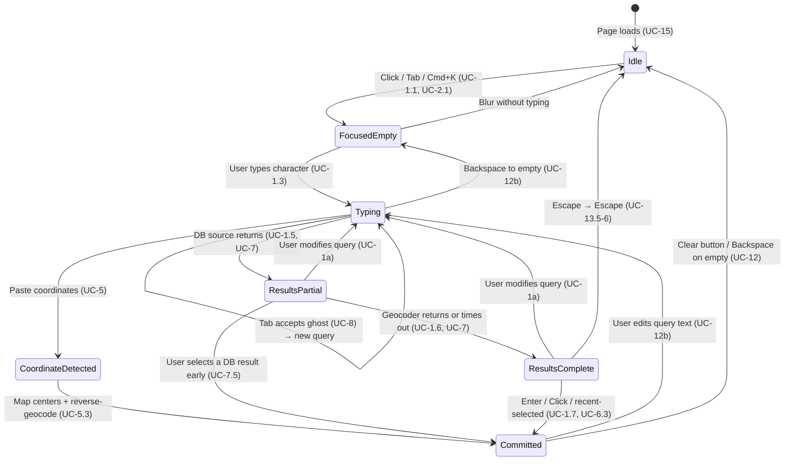
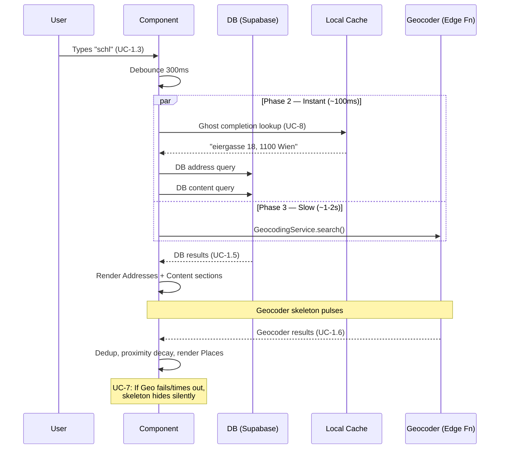

# Search Bar

> **Blueprint:** [implementation-blueprints/search-bar.md](../implementation-blueprints/search-bar.md)

## What It Is

A search surface floating over the map that lets users find places, photos, groups, and projects. It is the main way people navigate the map and find evidence. Supports keyboard shortcut `Cmd/Ctrl+K` for quick access.

## What It Looks Like

Floating search surface pinned top-center over the map. Use the shared `.ui-container` panel geometry with the same corner radius, panel padding, and panel gap as the Sidebar, subtle shadow, and warm `--color-bg-surface` background. The structure is: panel container → compact search row → results panel revealed inside the same surface. Do not morph the container into a pill in any state. The leading search icon and trailing clear button both sit inside helper wrappers that absorb the extra search-row height while preserving the shared fixed square media-slot rhythm. Results sections use headers, dividers, and clickable rows built from the shared `.ui-item` row pattern. Warm, calm styling: `--color-bg-surface` background, `--color-clay` accents for matched text.

## Where It Lives

- **Route**: Global — rendered inside `MapShellComponent` template
- **Parent**: `MapShellComponent` at `features/map/map-shell/map-shell.component.ts`
- **Appears when**: Always visible when map page is active
- **Dropdown appears when**: Input is focused or has query text

---

## Actions

Derived from the use cases. Each row maps to specific UC scenarios.

| #   | User Action                                | System Response                                                           | Use Cases         | Triggers                                                  |
| --- | ------------------------------------------ | ------------------------------------------------------------------------- | ----------------- | --------------------------------------------------------- |
| 1   | Focuses input (click or tab)               | Opens dropdown with recent searches                                       | UC-1, UC-2        | State → `focused-empty`                                   |
| 2   | Presses `Cmd/Ctrl+K`                       | Focuses input, opens dropdown                                             | UC-13             | State → `focused-empty`                                   |
| 3   | Types characters                           | Debounces 300ms, queries DB + geocoder in parallel                        | UC-1, UC-4        | State → `typing` → `results-partial` → `results-complete` |
| 4   | Presses ArrowDown / ArrowUp                | Moves highlight to next/prev selectable item (skips headers/dividers)     | UC-13             | `activeIndex` changes                                     |
| 5   | Presses Enter                              | Commits highlighted item (or top item if none highlighted)                | UC-1, UC-6, UC-13 | Fires `SearchCommitAction`                                |
| 6   | Presses Tab (with ghost text)              | Accepts inline ghost completion into input text, triggers new search      | UC-8, UC-11       | Query updated                                             |
| 7   | Clicks a DB address result                 | Map centers on that location, adds Search Location Marker                 | UC-1, UC-10       | `commit` type `map-center`                                |
| 8   | Clicks a DB content result (project/group) | Navigates to that content's context                                       | UC-6              | `commit` type `open-content`                              |
| 9   | Clicks a geocoder result                   | Map centers on location                                                   | UC-10, UC-3       | `commit` type `map-center`                                |
| 10  | Clicks a recent search item                | Re-executes that query                                                    | UC-2              | `commit` type `recent-selected`                           |
| 11  | Presses Escape                             | Closes dropdown; second Escape blurs input                                | UC-13             | State → `idle`                                            |
| 12  | Clicks outside search                      | Closes dropdown                                                           | —                 | State → `idle` or `committed`                             |
| 13  | Clicks `×` clear button                    | Clears query + committed state, removes Search Location Marker            | UC-12             | State → `idle`                                            |
| 14  | Backspace on empty committed input         | Clears committed context                                                  | UC-12             | State → `focused-empty`                                   |
| 15  | Query returns no results                   | Shows empty state with "No address found" + suggested actions             | UC-10             | —                                                         |
| 16  | Geocoder slow/fails                        | DB results render immediately, geocoder section shows skeleton then hides | UC-7              | Graceful degradation                                      |
| 17  | Pastes coordinates or Google Maps URL      | Detects coordinate format, centers map, reverse-geocodes label            | UC-5              | `commit` type `map-center`                                |
| 18  | "Did you mean?" suggestion clicked         | Replaces query with corrected text, reruns search                         | UC-16             | Query updated, new search triggered                       |

## Component Hierarchy

```
SearchBar                                  ← positioned top-center in Map Zone, z-30, `.ui-container`
├── InputRow                               ← compact search row inside shared panel surface
│   ├── SearchIconSlot                     ← fixed square media slot, non-clickable
│   │   └── SearchIcon                     ← 16px, left side, wrapped to absorb extra row height
│   ├── <input type="search">              ← flex-1, role="combobox", placeholder "Search address, project, group…"
│   └── ClearButton (×)                    ← shown only in committed state, same wrapped media-slot geometry as leading icon
│
└── ResultsPanel                           ← revealed inside the same surface (not an overlay), role="listbox", same width, animates panel height only
    │
    ├── [focused-empty] RecentSection
    │   ├── SectionLabel "Recent searches"
    │   └── DropdownItem × N               ← `.ui-item` row, clock icon + label, role="option"
    │                                         Active-project recents ranked first, then others by recency
    │
    ├── [has results] AddressSection
    │   ├── SectionLabel "Addresses"
    │   └── DropdownItem × N               ← `.ui-item` row, map-pin icon + label + "N photos" meta
    │
    ├── [has results] ContentSection
    │   ├── SectionLabel "Projects & Groups"
    │   └── DropdownItem × N               ← `.ui-item` row, folder icon + label + subtitle
    │
    ├── Divider                            ← 1px line, only if both DB and geocoder have results
    │
    ├── [has results] GeocoderSection
    │   ├── SectionLabel "Places"
    │   └── DropdownItem × N               ← `.ui-item` row, globe icon + label + "External result"
    │
    ├── [loading] GeocoderSkeleton         ← 2 pulse rows while geocoder is fetching
    │
    └── [no results] EmptyState
        ├── "No address found for {query}"
        ├── "Try a different address or pin manually"
        └── GhostButton "Drop pin"         ← starts placement mode
```

### DropdownItem (shared child component)

Each result row uses the shared row contract: `.ui-item` → `.ui-item-media` + `.ui-item-label`. The leading media column stays fixed width across all result families. Labels and optional meta lines truncate inside the flexible label column rather than changing row geometry.  
Highlighted state via `activeIndex`. Icons by family:

- `db-address` → map-pin
- `db-content` → folder / image (by contentType)
- `geocoder` → globe
- `recent` → clock
- `command` → terminal

### Address Display Formatting

Nominatim returns verbose labels like `"Kuratorium für Verkehrssicherheit, 18, Schleiergasse, Schleierbaracken, KG Favoriten, Favoriten, Vienna, 1100, Austria"`. These are unusable as display text. All address labels — from both DB and geocoder — must be formatted as:

**Primary format:** `Street Housenumber, Postcode City`

Examples:

- `Schleiergasse 18, 1100 Wien` ← from Nominatim `address.road`, `address.house_number`, `address.postcode`, `address.city`
- `Burgstraße 7, 8001 Zürich` ← clean, scannable
- `Denisgasse 46, 1200 Wien`

**Fallback cascade** (when fields are missing):

| Available fields                     | Display format                                               |
| ------------------------------------ | ------------------------------------------------------------ |
| street + number + postcode + city    | `Schleiergasse 18, 1100 Wien`                                |
| street + postcode + city (no number) | `Schleiergasse, 1100 Wien`                                   |
| street + city (no postcode)          | `Schleiergasse, Wien`                                        |
| city only                            | `Wien`                                                       |
| none of the above                    | `result.display_name` (raw Nominatim, truncated to 60 chars) |

**POI / named place handling:** When the query matches a named entity (building, business, landmark), show the name above the address:

- Primary line: **Kuratorium für Verkehrssicherheit** (bold)
- Secondary line: `Schleiergasse 18, 1100 Wien` (normal weight, muted color)

This applies when Nominatim returns a result where `address.road` exists AND the `name` field differs from the road name. The query `"Kuratorium Schleiergasse"` would match because `name: "Kuratorium für Verkehrssicherheit"` and `road: "Schleiergasse"` are both present.

**Formatting function:** `formatAddressLabel(nominatimResult)` lives in `SearchBarService`, not in the component. It operates on Nominatim's `address` object fields: `road`, `house_number`, `postcode`, `city` (with fallbacks to `town`, `village`, `municipality`), `country`. The `display_name` is only used as a last resort.

**DB addresses** use the same format. When storing `address_label` on images, the label should already be in `Street Number, Postcode City` format. Legacy labels that don't match this format are displayed as-is but flagged for background re-formatting.

### Tab Autocomplete (Inline Ghost Completion)

When the user types a partial query, the search bar shows a **ghost completion** — faded text appended after the cursor that completes the most probable query. Pressing `Tab` accepts the ghost text into the input and triggers a new search.

**How it works:**

```
┌──────────────────────────────────────────┐
│ 🔍 schl│eiergasse 18, 1100 Wien         │  ← ghost text in --color-text-muted
└──────────────────────────────────────────┘
```

The user typed `schl`. The ghost shows `eiergasse 18, 1100 Wien` in muted color. Pressing `Tab` fills the input to `schleiergasse 18, 1100 Wien` and re-runs the search.

**Ghost completion source ranking** (first match wins from highest-priority source):

| Priority | Source                           | Example                                                                 | Why                                                     |
| -------- | -------------------------------- | ----------------------------------------------------------------------- | ------------------------------------------------------- |
| 1        | Recent searches (active project) | User searched `Schleiergasse 18` yesterday on this project              | Most likely intent — user's own history on this project |
| 2        | Recent searches (any project)    | User searched `Schleiergasse 18` last week on another project           | Still highly relevant — user's own behavior             |
| 3        | DB addresses (by image count)    | `Schleiergasse 18` has 47 photos                                        | Organization's confirmed locations                      |
| 4        | DB content (projects/groups)     | Project named `Schleiergasse Renovation`                                | Less common but still internal data                     |
| 5        | Previous geocoder commits        | User committed `Schleiergasse 18, 1100 Wien` from geocoder last session | Geocoder result the user already validated              |

The ghost completion is computed **locally and instantly** — it never waits for the geocoder. It operates on:

- The in-memory recent searches list (already loaded)
- A prefix trie built from cached DB address labels + content names (loaded on session start)
- Previous geocoder commits stored in recents

**Algorithm: Weighted Prefix Trie with Priority Decay**

The ghost completion uses a prefix trie optimized for fast prefix lookup with weighted candidates. This is the standard approach used by Chrome's omnibox, VS Code's command palette, and Algolia.

1. **Build phase** (on session start, then refreshed every 5 minutes):
   - Insert all recent searches with weight = `sourcePriority × recencyDecay(lastUsedAt)`
   - Insert cached DB address labels with weight = `sourcePriority × log2(imageCount + 1)`
   - Insert DB content names (projects, groups) with weight = `sourcePriority`
   - Active-project items get a 2× multiplier on their weight

2. **Query phase** (on every keystroke, must be <1ms):
   - Normalize input: lowercase, strip diacritics, collapse whitespace
   - Walk the trie to the node matching the input prefix
   - Return the candidate with the highest weight from that subtree
   - If no prefix match → no ghost text

3. **Scoring formula:**

   ```
   weight = sourcePriority × relevanceSignal × projectBoost × recencyDecay
   ```

   Where:
   - `sourcePriority`: 100 (recent-active), 80 (recent-other), 60 (DB address), 40 (DB content), 20 (geocoder commit)
   - `relevanceSignal`: `log2(imageCount + 1)` for addresses, `1.0` for others
   - `projectBoost`: `2.0` if item belongs to active project, `1.0` otherwise
   - `recencyDecay`: `1 / (1 + daysSinceLastUse * 0.1)` — half-life ~10 days

4. **Tie-breaking:** If two candidates have equal weight, prefer the shorter label (more specific = more useful).

**Data gravity principle:** Addresses with more photos are more likely to be searched again. A site with 200 photos is a major worksite — it should autocomplete before a one-off address with 2 photos. The `log2(imageCount)` scaling ensures this without letting a single mega-site dominate all completions.

**Interaction rules:**

- `Tab` → accept ghost text, update query signal, trigger new search
- Any other character → ghost dismissed, recalculated on next keystroke
- `Tab` with no ghost text → default browser behavior (move focus to next element)
- Ghost text is visually distinct: `--color-text-muted` at `0.4` opacity, same font
- Ghost text is not part of the DOM input value until `Tab` is pressed
- Screen readers ignore ghost text (`aria-hidden="true"`)

## Data

| Field                 | Source                                            | Type                          |
| --------------------- | ------------------------------------------------- | ----------------------------- |
| DB address candidates | `SearchOrchestratorService` → `dbAddressResolver` | `SearchAddressCandidate[]`    |
| DB content candidates | `SearchOrchestratorService` → `dbContentResolver` | `SearchContentCandidate[]`    |
| Geocoder candidates   | `SearchOrchestratorService` → `geocoderResolver`  | `SearchAddressCandidate[]`    |
| Recent searches       | `SearchBarService` → `localStorage`               | `SearchRecentCandidate[]`     |
| Search result set     | `SearchOrchestratorService.searchInput()`         | `Observable<SearchResultSet>` |
| Ghost completion      | `SearchBarService` → prefix trie (in-memory)      | `string \| null`              |

The `SearchOrchestratorService` already exists at `core/search/search-orchestrator.service.ts`. It handles debouncing, caching, deduplication, and ranking. The component drives it with a query observable + context observable.

Detailed source-loading, ranking, and geocoder behavior lives in the optional sections after `Acceptance Criteria`.

## State

| Name                 | Type                                                                              | Default        | Controls                                                |
| -------------------- | --------------------------------------------------------------------------------- | -------------- | ------------------------------------------------------- |
| `state`              | `SearchState`                                                                     | `'idle'`       | Current search state machine position                   |
| `query`              | `string`                                                                          | `''`           | Text in the input                                       |
| `dropdownOpen`       | `boolean`                                                                         | `false`        | Whether dropdown is visible                             |
| `activeIndex`        | `number`                                                                          | `-1`           | Currently highlighted item for keyboard nav (-1 = none) |
| `sections`           | `{ dbAddress: SearchSection, dbContent: SearchSection, geocoder: SearchSection }` | empty sections | Parsed from `SearchResultSet`                           |
| `recentSearches`     | `SearchRecentCandidate[]`                                                         | `[]`           | Loaded from `SearchBarService` on init                  |
| `committedCandidate` | `SearchCandidate \| null`                                                         | `null`         | The last committed result                               |
| `allEmpty`           | `boolean`                                                                         | `true`         | Derived: all sections have 0 items                      |

Types are defined in `core/search/search.models.ts` (already exists).

## File Map

| File                                                        | Purpose                                                                |
| ----------------------------------------------------------- | ---------------------------------------------------------------------- |
| `features/map/search-bar/search-bar.component.ts`           | Main search bar component (standalone) — UI + keyboard only            |
| `features/map/search-bar/search-bar.component.html`         | Template matching hierarchy above                                      |
| `features/map/search-bar/search-bar.component.scss`         | Scoped styles (shared panel surface, reveal panel, skeleton)           |
| `features/map/search-bar/search-dropdown-item.component.ts` | Single result row (standalone, inline template)                        |
| `features/map/search-bar/search-bar.component.spec.ts`      | Unit tests covering Actions table                                      |
| `core/search/search-bar.service.ts`                         | Recent searches persistence, geocoder resolution, fallback query logic |
| `core/search/search-bar.service.spec.ts`                    | Unit tests for SearchBarService                                        |

## Wiring

- Import `SearchBarComponent` in `MapShellComponent`'s template
- Place `<search-bar />` inside the Map Zone area of `map-shell.component.html`
- Global `Cmd/Ctrl+K` listener registered in `SearchBarComponent.ngOnInit()` via `@HostListener`
- Click-outside detection via a `(document:click)` check or CDK overlay backdrop
- On commit type `map-center`: call `MapAdapter` to center map + place Search Location Marker
- On commit type `open-content`: use Angular Router to navigate
- `SearchBarService` injected by the component — owns recent searches, geocoder resolution, and fallback logic
- `SearchBarService` injects `GeocodingService` for all external geocoding (never calls Nominatim directly)
- Component emits `SearchQueryContext` changes when active project changes (listens to project selection service)

## Acceptance Criteria

### Layout & Visuals

- [x] Search bar is visible top-center over the map on both desktop and mobile
- [x] Search surface uses `.ui-container` with the same panel radius as the Sidebar in all states
- [x] Search surface uses the same shared panel padding and gap tokens as the Sidebar
- [x] Leading search icon uses a fixed square media slot aligned to shared media-size tokens
- [x] Leading search icon and trailing clear button use wrappers that preserve the fixed media slot alignment within the taller search row
- [x] Results panel is revealed inside the same surface and does not behave like a detached floating dropdown
- [x] Dropdown rows use `.ui-item` with a fixed leading media column
- [x] Section divider only shows when both DB and geocoder sections have items
- [x] Results panel expansion animates outer panel height without animating row height, row padding, media width, or panel radius
- [x] Opening and closing the dropdown does not change outer corner radius, item padding, or media-column width

### Interaction

- [x] Clicking input opens dropdown with recent searches
- [x] `Cmd/Ctrl+K` focuses input from anywhere on the map page
- [x] Typing shows debounced results grouped by section (Addresses, Projects & Groups, Places)
- [x] ArrowUp/ArrowDown navigates results, skipping headers and dividers
- [x] Enter commits the highlighted item (or top item if none highlighted)
- [x] Clicking a result commits it
- [x] Address commit centers the map and shows Search Location Marker
- [x] Content commit navigates to the correct route
- [x] Escape closes dropdown; second Escape blurs input
- [x] Click outside closes dropdown
- [x] `×` clear button appears after commit; clicking it resets everything
- [x] `×` clear button uses square control geometry aligned to shared control/media sizing tokens
- [x] Empty state shows "No address found" with "Drop pin" recovery action
- [x] Tab accepts inline ghost completion into input text
- [x] Pasting coordinates or Google Maps URL auto-detects and centers map

### Data & Resolution

- [x] DB results appear before geocoder results
- [x] Geocoder results that are <30m from a DB result are hidden (dedup via `SearchOrchestratorService`)
- [x] All geocoder requests go through `GeocodingService` → Edge Function proxy (no direct Nominatim calls)
- [x] Fallback queries only fire when primary query returns 0 results (not unconditionally)
- [x] Geocoder failure is non-blocking — DB results still render; geocoder section shows skeleton then hides
- [x] In-flight geocoder requests are cancelled when the user types a new query (`AbortController` or RxJS `switchMap`)
- [x] All result sources load and render independently (3-phase progressive: typing → DB partial → geocoder complete)
- [x] Geocoder results use formatted address labels (`Street Number, Postcode City`), not raw Nominatim `display_name`
- [x] Named places (POIs, buildings) show name on primary line + formatted address on secondary line
- [x] Ghost completion is computed locally from recents + cached DB labels (never waits for geocoder)

### Recent Searches

- [x] Recent searches persist across sessions in `localStorage`
- [x] Recent searches store `projectId` of the active project at time of search
- [x] When a project is active, recent searches for that project are ranked first
- [x] Within each tier (active-project / other), recents are ordered by `lastUsedAt` descending
- [x] Recent searches are capped at 20 entries with LRU eviction

### Project-Scoped Ranking

- [x] `SearchQueryContext` includes `activeProjectId` from the current project selection
- [ ] DB address results matching the active project are boosted in rank
- [ ] DB content results (projects, groups) matching the active project appear first in their section

### Geo-Relevance

- [ ] Geocoder queries include `countrycodes` derived from organization's image data
- [ ] Geocoder queries include `viewbox` from current map bounds (viewport bias)
- [ ] Geocoder results are re-ranked by proximity to organization data centroid (proximity decay)
- [ ] Organization country codes and data centroid are cached per session
- [x] Edge Function accepts `viewbox`, `bounded`, `countrycodes`, and `limit` parameters

### Accessibility

- [x] Dropdown uses `role="listbox"`, items use `role="option"`
- [x] Screen reader announces result count on query completion

### Architecture

- [x] `SearchBarService` owns recent-search persistence, geocoder resolution, fallback logic, and address formatting
- [x] Component contains only UI + keyboard logic; no direct `fetch()` calls or `localStorage` access
- [x] `formatAddressLabel()` in `SearchBarService` produces `Street Number, Postcode City` from Nominatim address fields
- [ ] DB address labels stored in `Street Number, Postcode City` format on write

### Ranking

- [ ] DB address ranking uses `textMatch × projectBoost × dataGravity(log2 imageCount) × recencyDecay`
- [ ] DB content ranking uses `textMatch × projectBoost × sizeSignal(log2 photoCount)`
- [ ] Geocoder ranking uses `nominatimImportance × proximityDecay × countryBoost`
- [x] Sections render in fixed order: Addresses → Projects & Groups → Places

### Ghost Completion Algorithm

- [ ] Ghost completion uses a weighted prefix trie built on session start and refreshed every 5 minutes
- [ ] Trie contains: recents, cached DB address labels, DB content names, previous geocoder commits
- [ ] Scoring: `sourcePriority × relevanceSignal × projectBoost × recencyDecay`
- [ ] Active-project items get 2× weight multiplier
- [x] `dataGravity` for addresses: `log2(imageCount + 1)` — worksites with more photos autocomplete first
- [x] Query-phase lookup is <1ms (trie walk, no network)
- [ ] Tie-breaking: shorter label wins (more specific)

### Coordinate & URL Detection (UC-5)

- [x] Pasted decimal coordinates (`47.3769, 8.5417`) are detected and skip text search
- [x] Pasted Google Maps URLs have coordinates extracted and handled as above
- [x] DMS coordinates (`47°22'36.8"N 8°32'30.1"E`) are converted to decimal and handled
- [x] Reverse-geocode fires after centering to populate the committed label
- [x] Reverse-geocode failure falls back to displaying raw coordinates

### "Search This Area" (UC-14)

- [ ] After significant pan from a committed search location, a "Search this area" chip appears above the search bar
- [ ] Clicking the chip re-queries DB addresses within the new viewport bounds

### Progressive Geo-Disclosure (UC-14)

- [ ] Geocoder results grouped into "Near your data" (≤50km from data centroid, shown by default) and "Other locations" (collapsed)
- [ ] "Show more worldwide results" expands the collapsed group

### Smart Suggestions on Empty Focus (UC-2, UC-15)

- [ ] Focused-but-empty state shows context-aware suggestions: "Photos uploaded today (N)", "N unresolved addresses", "Nearest project site"
- [ ] Suggestions replace the bare recent-searches list when contextual data is available

### Offline Search (UC-11)

- [ ] Top 50 most-visited addresses + coordinates cached in IndexedDB
- [ ] Offline state returns cached results with an "Offline results only" badge
- [ ] Cache refreshes when connectivity returns

### Saved Searches / Bookmarks (UC-2)

- [ ] Star icon on result rows lets users pin a search
- [ ] Pinned searches appear in a dedicated section above recents
- [ ] Pinned searches persist indefinitely, independent of the 20-entry recent cap

### Command Palette (UC-6)

- [ ] Typing `/` switches to command mode: `/upload`, `/export`, `/settings`, `/go project-name`
- [ ] Command mode makes the search bar the single entry point for all app navigation

### Inline Map Preview (UC-14)

- [ ] Highlighted geocoder result (via keyboard nav) shows a tiny map thumbnail to the right of the row
- [ ] Preview helps verify the correct location before committing

## Use Cases

> **Full use cases:** [use-cases/search-bar.md](../use-cases/search-bar.md) — 18 scenarios (UC-1 through UC-18) with 50+ edge cases.

The use cases are the source of truth. The state machine, actions table, and technical sections below all derive from them. Key scenarios:

| UC    | Scenario                              | Key edge cases                                          |
| ----- | ------------------------------------- | ------------------------------------------------------- |
| UC-1  | Quick address lookup (happy path)     | Cancel in-flight, slow connection, no DB match          |
| UC-2  | Repeat searches across sessions       | Project switch re-ranks, LRU eviction                   |
| UC-3  | Named place / POI search              | Building name + address, verbose label formatting       |
| UC-4  | Search with typos                     | pg_trgm fuzzy, suffix normalization (`str.` ↔ `straße`) |
| UC-5  | Paste coordinates or map link         | Google Maps URL, DMS format, reverse-geocode failure    |
| UC-6  | Project or group search               | Dual-section results, active project boost              |
| UC-7  | Geocoder slow or failing              | 429 retry, Edge Function down, Supabase down            |
| UC-8  | Tab autocomplete from history         | No match, priority tiers, cross-project ghost           |
| UC-9  | Active project filter context         | Project boost, country bias from project data           |
| UC-10 | Address not in the system yet         | Geocoder-only results, unknown country                  |
| UC-11 | Mobile on-site search                 | Small viewport, virtual keyboard, offline               |
| UC-12 | Clear and start over                  | Backspace on empty, edit committed text                 |
| UC-13 | Keyboard-only navigation              | Arrow wrap, Tab vs ArrowDown priority                   |
| UC-14 | Similar addresses in different cities | Proximity decay, dedup, multi-country restriction       |
| UC-15 | Cold start after login                | Background geo-context, fresh org                       |
| UC-16 | "Did you mean?" suggestion            | Ambiguous correction, geocoder correction               |
| UC-17 | Concurrent search and filter          | Filter persistence, distance reference point            |
| UC-18 | Long session cache management         | LRU eviction, trie rebuild                              |

## State Machine

Derived from the use cases above. Each state corresponds to a user scenario:



### Source Loading Phases

Each search query triggers 3 independent data sources. They load progressively — no source waits for another:



## Data Pipeline

### Search Source Tiers (Independent Loading)

All search sources fire in parallel and render independently. No source blocks another. Sources are grouped into tiers by latency:

| Tier        | Source               | Latency               | Table / API                          | Section Header        |
| ----------- | -------------------- | --------------------- | ------------------------------------ | --------------------- |
| **Instant** | Recent searches      | 0ms (localStorage)    | —                                    | "Recent searches"     |
| **Instant** | Ghost completion     | <1ms (in-memory trie) | —                                    | _(inline ghost text)_ |
| **Fast**    | DB addresses         | ~50–200ms             | `images.address_label`               | "Addresses"           |
| **Fast**    | DB projects & groups | ~50–200ms             | `projects.name`, `saved_groups.name` | "Projects & Groups"   |
| **Slow**    | Geocoder (Nominatim) | ~1–2s                 | Edge Function → Nominatim            | "Places"              |

The orchestrator emits results progressively via `concat(typing$, partial$, complete$)`:

- **Phase 1 (0ms):** Typing state — skeleton UI, ghost completion rendered
- **Phase 2 (~100ms):** Partial — all DB sources (addresses + content) rendered
- **Phase 3 (~1–2s):** Complete — geocoder results appended, deduped against DB

### SearchQueryContext

The `SearchQueryContext` passed to the orchestrator must include the active project so resolvers and ranking can use it:

```typescript
export interface SearchQueryContext {
  organizationId?: string;
  activeProjectId?: string; // ← from ProjectsDropdown selection
  viewportBounds?: { north: number; east: number; south: number; west: number };
  dataCentroid?: { lat: number; lng: number }; // ← org image centroid, cached per session
  countryCodes?: string[]; // ← derived from org image data (e.g. ['at'])
  activeFilterCount?: number;
  commandMode?: boolean;
  selectedGroupId?: string;
}
```

The component must emit context changes whenever the active project changes (via `ProjectsDropdownService` or equivalent). Resolvers receive this context and use `activeProjectId` to boost ranking of matching results.

On session start, the component (or a shared service) queries the organization's data centroid and country codes, caches them for the session, and includes them in every `SearchQueryContext` emission.

### Geocoder Resolution — Proxy Only

**All geocoder requests must go through `GeocodingService`** which routes them via the Supabase Edge Function proxy (`/functions/v1/geocode`). The component must never call Nominatim directly via `fetch()`. This is required because:

- Direct browser→Nominatim calls fail with CORS errors on HTTP 429.
- The Edge Function adds the required `User-Agent` header.
- Server-side rate limiting is enforced there.

`GeocodingService` needs a `search(query, options)` method that returns multiple results (the existing `forward()` returns only 1 result with `limit=1`). The search bar needs `limit=5`.

### Rate Limiting & Perceived Speed

Nominatim's usage policy requires max 1 request/second. The Edge Function enforces a 1.1s minimum interval. This is acceptable because:

1. **Geocoder results are the slowest source by design.** The 3-phase progressive loading ensures DB results + recents render instantly (~50–200ms) while the geocoder skeleton pulses.
2. **Most queries are answered by DB alone.** If the user's data already covers the address, the geocoder section is supplementary.
3. **Cache eliminates repeated waits.** A 5-minute TTL means re-typing the same prefix is instant.
4. **Fallback queries are conditional.** Only fire if primary returns 0 results, not unconditionally.

The perceived speed comes from parallel, independent sources — not from making Nominatim faster.

### Independent Source Loading (3-Phase Progressive)

All result sources must load and render independently. No source blocks another:

| Phase            | Timing          | What renders                                          | Geocoder state               |
| ---------------- | --------------- | ----------------------------------------------------- | ---------------------------- |
| **1 — Typing**   | Immediate (0ms) | Skeleton UI, ghost completion, input feedback         | `loading`                    |
| **2 — Partial**  | ~50–200ms       | DB addresses + DB content (projects/groups) + recents | `loading` (skeleton rows)    |
| **3 — Complete** | ~1–2s           | Geocoder results appended below                       | `loaded` or `error` (hidden) |

The `SearchOrchestratorService` already implements this via `concat(typing$, partial$, complete$)` using `combineLatest` for phases 2 and 3 separately. Each source observable uses `shareReplay` to prevent duplicate requests across phases.

If the geocoder fails or times out (5s timeout), phase 3 simply hides the geocoder section — it must never block or delay the DB results from phase 2.

### Fallback Query Strategy

The `buildFallbackQueries()` method generates up to 3 query variants (corrected street+house, street-only, corrected street-only). To avoid 2–3× slower sequential geocoder calls:

- Fire the primary query first through `GeocodingService.search()`.
- Only fire fallback variants if the primary returns 0 results.
- Never fire all variants unconditionally.

### Result Ranking Algorithm

Within each section, results are ranked by a composite score. The formula differs by source but follows common principles from information retrieval (BM25-inspired text relevance + domain-specific signals):

**DB Address Ranking:**

```
score = textMatch × projectBoost × dataGravity × recencyDecay
```

- `textMatch`: Position and completeness of the query match (prefix match > substring, exact > partial)
- `projectBoost`: `2.0` if address belongs to active project, `1.0` otherwise
- `dataGravity`: `log2(imageCount + 1)` — addresses with more photos are more important worksites
- `recencyDecay`: `1 / (1 + daysSinceLastPhoto * 0.05)` — recently-active sites rank higher

**DB Content Ranking (Projects & Groups):**

```
score = textMatch × projectBoost × sizeSignal
```

- `projectBoost`: `3.0` if matches active project, `1.0` otherwise (projects are high-intent)
- `sizeSignal`: `log2(photoCount + 1)` — larger projects rank above empty ones

**Geocoder Ranking:**

```
score = nominatimImportance × proximityDecay × countryBoost
```

- `nominatimImportance`: Nominatim's own importance score (0–1)
- `proximityDecay`: `1 / (1 + distanceFromCentroidKm * 0.01)` — closer to org data = more relevant
- `countryBoost`: `1.5` if result is in one of the org's active countries, `1.0` otherwise

**Cross-section ordering:** Sections render in fixed order (Addresses → Projects & Groups → Places). Within each section, items are sorted by their section-specific score descending.

## Search + Filter Integration Rules

Derived from UC-17 (concurrent search and filter):

1. Search commits can set the **distance reference point** used by distance filters.
2. Applied filter chips remain visible while search is active.
3. Search must not reset active filters unless user explicitly runs "Clear filters."
4. Search context persists through image-detail navigation and tab changes.
5. If user pans far from committed target, provide a "Return to selected" affordance in search area.

## Geo-Relevance Ranking

Supports UC-9, UC-14, UC-15. Without bias, Nominatim ranks by global `importance` — a famous "Burgstrasse" in Berlin outranks "Burgstraße" in Vienna even though all user data is in Vienna. The search bar must apply geographic bias so results near the user's data are ranked first.

### Bias Layers (applied in order)

| Layer                       | Mechanism                                                                                          | When applied             | Effect                                                                            |
| --------------------------- | -------------------------------------------------------------------------------------------------- | ------------------------ | --------------------------------------------------------------------------------- |
| **Country restriction**     | Send `countrycodes` param to Nominatim (via Edge Function)                                         | Always                   | Eliminates results from irrelevant countries entirely                             |
| **Viewport bias**           | Send `viewbox` param to Nominatim (via Edge Function) with the current map bounds                  | When map is visible      | Nominatim prefers results inside the viewport but still returns worldwide results |
| **Data gravity re-ranking** | After Nominatim returns results, re-score each by proximity to the organization's data centroid    | Always (post-processing) | Results near existing images rank higher, even if Nominatim scored them lower     |
| **Proximity decay**         | `adjustedScore = nominatimImportance × (1 / (1 + km / 50))` where `km` = distance to data centroid | Post-processing          | Results >50km from data are sharply suppressed; results >200km are near-zero      |

### Country Detection

Derive the organization's primary country(s) from existing image data:

1. Query `SELECT DISTINCT country FROM images WHERE organization_id = :org_id AND country IS NOT NULL` on session start.
2. Cache the result for the session. Most orgs operate in 1–2 countries.
3. Pass as `countrycodes=at` (or `countrycodes=at,de` for multi-country orgs) to Nominatim.
4. If no country data exists yet (fresh org), fall back to browser geolocation or no restriction.

### Data Centroid

Compute the geographic center of the organization's image data:

```sql
SELECT ST_X(ST_Centroid(ST_Collect(geog::geometry))) AS lng,
       ST_Y(ST_Centroid(ST_Collect(geog::geometry))) AS lat
FROM images
WHERE organization_id = :org_id
  AND latitude IS NOT NULL;
```

Cache per session. Used for proximity decay scoring on geocoder results.

### Viewport Bias Wiring

1. `SearchBarComponent` reads current map bounds from `MapAdapter` and passes them as `SearchQueryContext.viewportBounds`.
2. `SearchBarService` forwards bounds to `GeocodingService.search()`.
3. `GeocodingService.search()` sends `viewbox` param to the Edge Function.
4. The Edge Function appends `&viewbox={west},{north},{east},{south}` to the Nominatim URL.

### Progressive Disclosure (future)

When geocoder results span multiple regions, group them:

- **"Near your data"** — results within 50km of the data centroid (shown by default)
- **"Other locations"** — results beyond 50km (collapsed behind "Show more worldwide results")

This prevents information overload while still allowing the user to find locations far from their data when needed.

### Edge Function Changes Required

The `geocode` Edge Function must accept and forward these optional Nominatim parameters:

| Parameter      | Type     | Description                                                               |
| -------------- | -------- | ------------------------------------------------------------------------- |
| `viewbox`      | `string` | `west,north,east,south` — current map viewport                            |
| `bounded`      | `0 \| 1` | If 1, restrict results to viewbox (default: 0, prefer but don't restrict) |
| `countrycodes` | `string` | Comma-separated ISO 3166-1 codes (e.g. `at,de`)                           |
| `limit`        | `number` | Max results (default: 5 for search bar)                                   |

## Forgiving Address Matching

Supports UC-4, UC-16. For MVP, apply **query normalization + two-pass fallback**:

1. **Always normalize input** — lowercase, trim, collapse spaces, transliterate diacritics (`straße` ↔ `strasse`), expand/compress street suffixes (`g.` ↔ `gasse`, `str.` ↔ `straße`), punctuation-insensitive.
2. **Trigger fallback** when strict pass returns zero or below-confidence results:
   - Pass 1: street + house number (`denisgasse 46`)
   - Pass 2: street only (`denisgasse`)
   - Pass 3: nearest token-corrected variant (`denisgass` → `denisgasse`)
3. Show a **suggestion row** when fallback produced the best candidate: _"Did you mean Denisgasse 46?"_ — selecting replaces query and reruns search. Do not show if strict matches exist.
4. Confidence tiers: exact > normalized > corrected > street-only.
5. Fallback/corrected matches must be visually labeled (e.g. `Approximate match`).

## SearchBarService

Supports UC-1 through UC-18. Extract all non-UI search logic from the component into `core/search/search-bar.service.ts`. The component should contain only template binding and keyboard/focus handling.

### Responsibilities

| Concern                   | Owner                                                                          |
| ------------------------- | ------------------------------------------------------------------------------ |
| Recent search persistence | `SearchBarService` → `localStorage`                                            |
| Recent search ranking     | `SearchBarService` (project-aware, recency-ordered)                            |
| Geocoder resolution       | `SearchBarService` → `GeocodingService.search()` (never raw `fetch()`)         |
| Fallback query logic      | `SearchBarService` (normalize, build variants, fire primary-first)             |
| DB address queries        | `SearchBarService` → Supabase (via service abstraction)                        |
| DB content queries        | `SearchBarService` → Supabase (via service abstraction)                        |
| Orchestration & dedup     | `SearchOrchestratorService` (invoked by `SearchBarService`, not the component) |

### Interface Contract

```typescript
@Injectable({ providedIn: "root" })
export class SearchBarService {
  /**
   * Returns geocoder candidates for a query, using GeocodingService proxy.
   * Applies viewport bias, country restriction, and proximity decay.
   * Fires fallback queries only when primary returns 0 results.
   */
  resolveGeocoderCandidates(
    query: string,
    context: SearchQueryContext,
  ): Observable<SearchAddressCandidate[]>;

  /** Returns DB address candidates via Supabase. */
  resolveDbAddressCandidates(
    query: string,
    context: SearchQueryContext,
  ): Observable<SearchAddressCandidate[]>;

  /** Returns DB content candidates (projects, groups) via Supabase. */
  resolveDbContentCandidates(
    query: string,
    context: SearchQueryContext,
  ): Observable<SearchContentCandidate[]>;

  /** Load recent searches, ranked for the given project context. */
  getRecentSearches(activeProjectId?: string): SearchRecentCandidate[];

  /** Record a search. Stores with project context for future ranking. */
  addRecentSearch(label: string, activeProjectId?: string): void;

  /** Clear all recent searches. */
  clearRecentSearches(): void;
}
```

### Recent Search Persistence & Ranking

Recent searches are stored in `localStorage` key `feldpost-recent-searches` as a JSON array:

```typescript
interface StoredRecentSearch {
  label: string;
  lastUsedAt: string; // ISO 8601 timestamp
  projectId?: string; // Active project at time of search (undefined = no project)
  usageCount: number; // Incremented on re-use, used for ranking tiebreaker
}
```

**Storage rules:**

- Maximum 20 entries. When full, evict the entry with the oldest `lastUsedAt` that is not in the active project.
- If the same label is searched again, update `lastUsedAt` and increment `usageCount` (don't create a duplicate).
- Store `projectId` from the current `SearchQueryContext.activeProjectId` at commit time.

**Ranking (when displaying):**

| Priority | Tier                                 | Sort within tier                          |
| -------- | ------------------------------------ | ----------------------------------------- |
| 1        | Matches active project (`projectId`) | `lastUsedAt` DESC, then `usageCount` DESC |
| 2        | No project / different project       | `lastUsedAt` DESC, then `usageCount` DESC |

This means: if a user works on "Burgstraße renovation" for weeks, those searches always appear first when that project is selected. Searches from other projects still appear, just ranked below.

### DB Address Queries — Future: pg_trgm

Current implementation uses `ilike('%query%')` for DB address matching. The `address-resolver.md` spec §4 specifies `pg_trgm` trigram similarity for fuzzy matching with typo tolerance. Migration to `pg_trgm` is tracked as a follow-up:

1. Enable the `pg_trgm` extension in Supabase.
2. Create a GIN index on `images.address_label` using `gin_trgm_ops`.
3. Replace `ilike` with `similarity(address_label, query) > 0.3` ordered by score.

Until then, `ilike` is acceptable for MVP but does not support typo correction.
