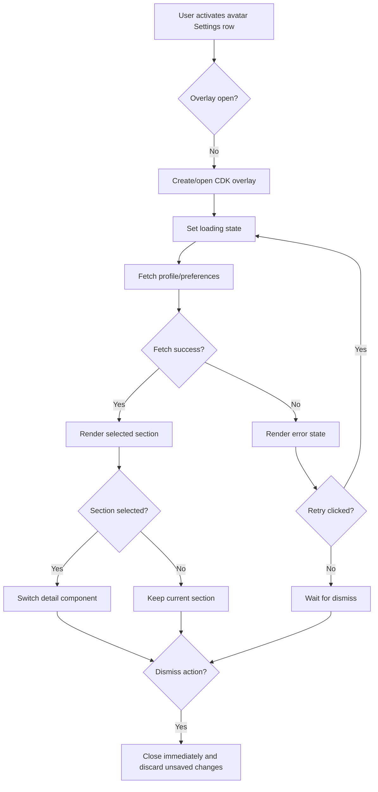
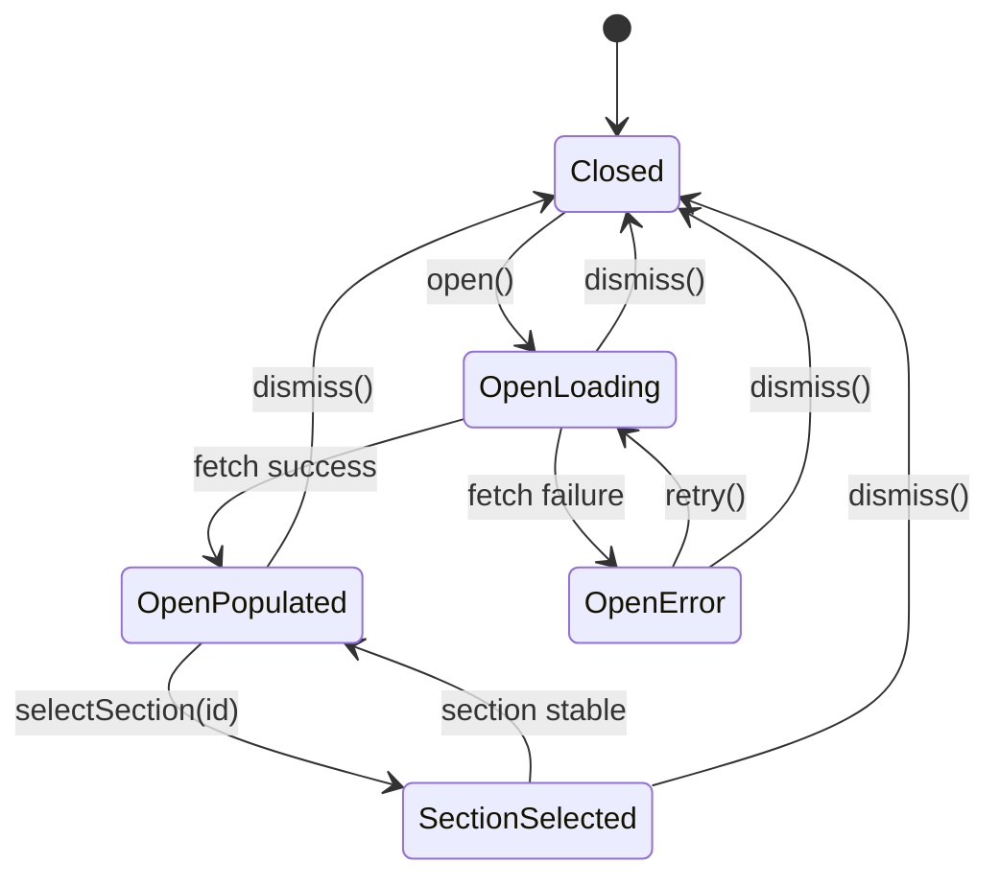
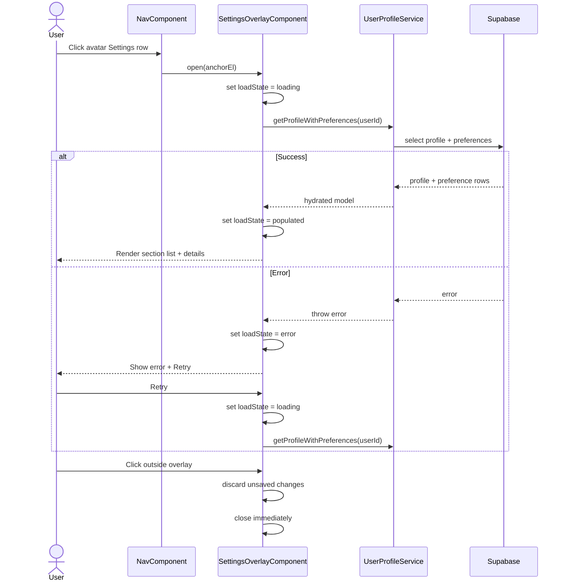

# Settings Overlay

## What It Is

A floating, sidenav-anchored settings panel that opens from the bottom avatar row (Settings) and lets users view and edit profile and preference sections without route navigation.

## What It Looks Like

A two-column, iPad-Settings-style surface appears to the right of the sidebar with a token-based gap. The panel has no entrance animation and opens instantly. A vertical divider separates the sidebar from the panel, and another internal divider separates the section list (left) from the active section detail area (right). The panel stays vertically centered to the sidebar host and repositions fluidly when the sidebar rail expands or collapses.

## Where It Lives

- **Route**: Global overlay on map shell; no route segment and no router state.
- **Parent**: `NavComponent` (`apps/web/src/app/features/nav/nav.component.ts`).
- **Appears when**: User activates the bottom avatar settings row in the sidenav.

## Actions

| #   | User Action                                | System Response                                                             | Triggers                              |
| --- | ------------------------------------------ | --------------------------------------------------------------------------- | ------------------------------------- |
| 1   | Clicks avatar Settings row                 | Opens overlay instantly, anchors to sidenav right edge + spacing token `md` | `NavComponent` overlay open action    |
| 2   | Overlay opens                              | Starts profile/preference load; shows loading state in detail area          | `UserProfileService` read request     |
| 3   | Load succeeds                              | Renders selected section content with populated values                      | profile + preference payload received |
| 4   | Load fails                                 | Shows error state with retry action                                         | Supabase/service error                |
| 5   | Clicks Retry                               | Re-runs profile/preference load and returns to loading state                | Retry button in error state           |
| 6   | Selects section in left list               | Right detail area switches to selected section component                    | `selectedSectionId` signal update     |
| 7   | Clicks outside panel or presses Escape     | Closes overlay immediately and discards unsaved local edits                 | Backdrop click / Escape key           |
| 8   | Sidenav width changes (collapsed/expanded) | Overlay position recalculates with matching transition timing               | sidebar expansion signal              |



## Component Hierarchy

```text
SettingsOverlayHost (CDK OverlayRef; anchored to Nav host)
├── SettingsOverlaySurface (.ui-container)
│   ├── NavToPanelDivider (visual divider between sidenav and panel)
│   ├── SettingsOverlayLayout
│   │   ├── SettingsSectionListColumn (left)
│   │   │   ├── SectionListHeader
│   │   │   └── SettingsSectionList
│   │   │       └── SettingsSectionListItem × N (.ui-item)
│   │   ├── InternalDivider
│   │   └── SettingsSectionDetailColumn (right)
│   │       ├── [loading] SettingsLoadingState
│   │       ├── [error] SettingsErrorState (Retry action)
│   │       └── [populated] SettingsSectionOutlet
│   │           └── RegisteredSectionComponent (selected section)
└── Backdrop (outside click dismiss)
```

## Data

| Field             | Source                                           | Type                                         |
| ----------------- | ------------------------------------------------ | -------------------------------------------- | ----- |
| currentUserId     | `AuthService.user()?.id`                         | `string                                      | null` |
| profile           | `UserProfileService.getProfileWithPreferences()` | `UserProfileDto`                             |
| sectionRegistry   | `SETTINGS_SECTION_REGISTRY` token                | `ReadonlyArray<SettingsSectionRegistration>` |
| selectedSectionId | overlay-local signal                             | `string`                                     |
| loadError         | overlay-local signal                             | `string                                      | null` |

## State

| Name              | Type                      | Default                 | Controls                        |
| ----------------- | ------------------------- | ----------------------- | ------------------------------- | ------------------------------------ | --------------------- |
| isOpen            | `boolean`                 | `false`                 | Overlay lifecycle               |
| loadState         | `'loading'                | 'error'                 | 'populated'`                    | `'loading'` on open                  | Detail area rendering |
| selectedSectionId | `string`                  | first registry entry id | Active section component        |
| profile           | `UserProfileDto           | null`                   | `null`                          | Section detail data                  |
| pendingWriteModel | `Record<string, unknown>` | `{}`                    | Unsaved local edits per section |
| lastError         | `string                   | null`                   | `null`                          | Error UI copy and retry availability |



## File Map

| File                                                                                        | Purpose                                                           |
| ------------------------------------------------------------------------------------------- | ----------------------------------------------------------------- |
| `apps/web/src/app/features/settings-overlay/settings-overlay.component.ts`                  | Overlay shell with CDK overlay open/close and state orchestration |
| `apps/web/src/app/features/settings-overlay/settings-overlay.component.html`                | Overlay template with section list and detail host                |
| `apps/web/src/app/features/settings-overlay/settings-overlay.component.scss`                | Overlay styling, dividers, and two-column layout                  |
| `apps/web/src/app/features/settings-overlay/settings-section-registry.ts`                   | Registry token and section registration contract                  |
| `apps/web/src/app/features/settings-overlay/settings-section-outlet.component.ts`           | Dynamic section host component                                    |
| `apps/web/src/app/features/settings-overlay/sections/profile-settings-section.component.ts` | Account/Profile section implementation                            |
| `apps/web/src/app/features/settings-overlay/sections/theme-settings-section.component.ts`   | Theme section implementation                                      |
| `apps/web/src/app/features/settings-overlay/settings-overlay.component.spec.ts`             | Overlay behavior tests (open/load/error/retry/dismiss/reposition) |

## Wiring

### Injected Services

- `AuthService`: resolves authenticated user context for profile fetches.
- `UserProfileService`: loads and persists profile and preference payloads.
- `Overlay` / `OverlayPositionBuilder` (Angular CDK): creates connected overlay and recalculates position from sidenav host geometry.
- None beyond `AuthService` and `UserProfileService` for feature-domain data services.

### Inputs / Outputs

- **Inputs**: None.
- **Outputs**: None. Overlay lifecycle is controlled by local signals/actions in `NavComponent` + overlay shell.

### Subscriptions

- Subscribe to sidenav collapsed/expanded signal to call `overlayRef.updatePosition()` during width transition.
- Subscribe to backdrop click and Escape key events to trigger immediate dismiss.
- Subscribe to profile load Observable per open cycle; canceled/disposed on dismiss.

### Supabase Calls

- None — delegated to `UserProfileService`.
- `UserProfileService` performs profile/preference reads and writes through Supabase-backed data access.



## Acceptance Criteria

- [ ] Overlay opens from the avatar Settings row without route navigation.
- [ ] Overlay uses Angular CDK `FlexibleConnectedPositionStrategy` anchored to sidenav host right edge.
- [ ] Overlay uses token spacing `md` between sidenav and panel (12px equivalent).
- [ ] Overlay is vertically centered relative to sidenav host element, not viewport.
- [ ] Overlay has no entrance animation and appears instantly.
- [ ] Overlay repositions while sidenav transitions between collapsed and expanded width.
- [ ] Loading, error, populated, and dismissing states are implemented and observable.
- [ ] Error state includes a Retry action that re-attempts profile fetch.
- [ ] Click-outside/Escape dismiss closes immediately and discards unsaved changes.
- [ ] Section list is registry-driven and supports adding new sections without shell edits.
- [ ] Profile/preference reads/writes are delegated through `UserProfileService` (Supabase-backed).

## Settings

- **Theme**: active theme mode and persistence behavior.
- **Notifications**: preference defaults for in-app feedback and alerts.
- **Language / Locale**: UI language and regional formatting defaults.
- **Account & Profile**: profile identity fields and account-level controls.
- **Roles & Permissions**: role-based capability visibility and access constraints.
- **Data & Storage**: data retention/export/cache/storage defaults.
- **Invite Management**: invite creation, acceptance, revocation defaults and controls.
- **Custom Properties**: organization metadata key configuration defaults.
- **Map Preferences**: map tile and map-behavior defaults.
- **Workspace Sort Defaults**: default sorting and ordering preferences.
