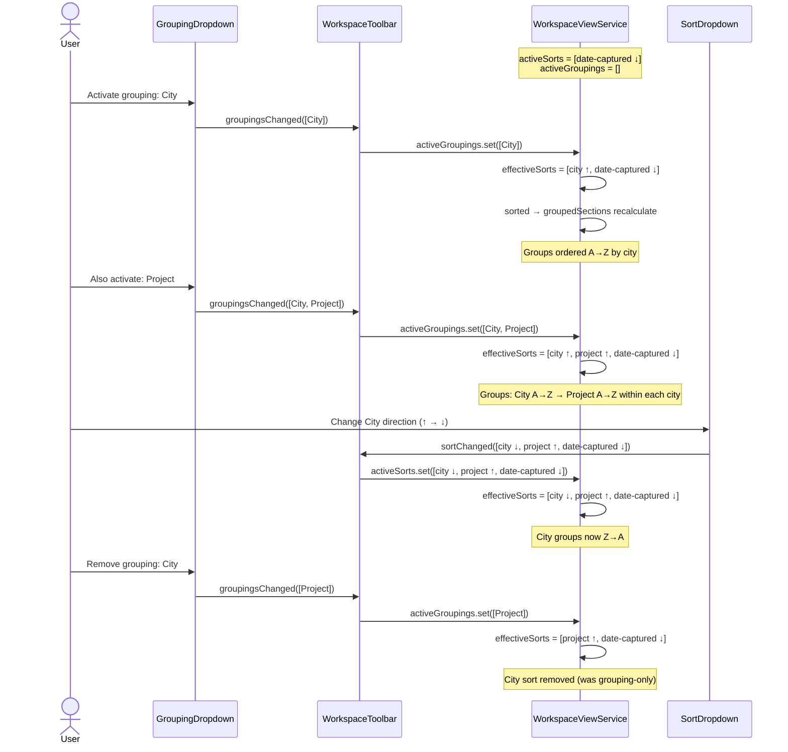
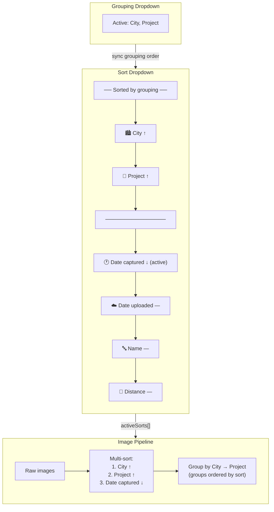
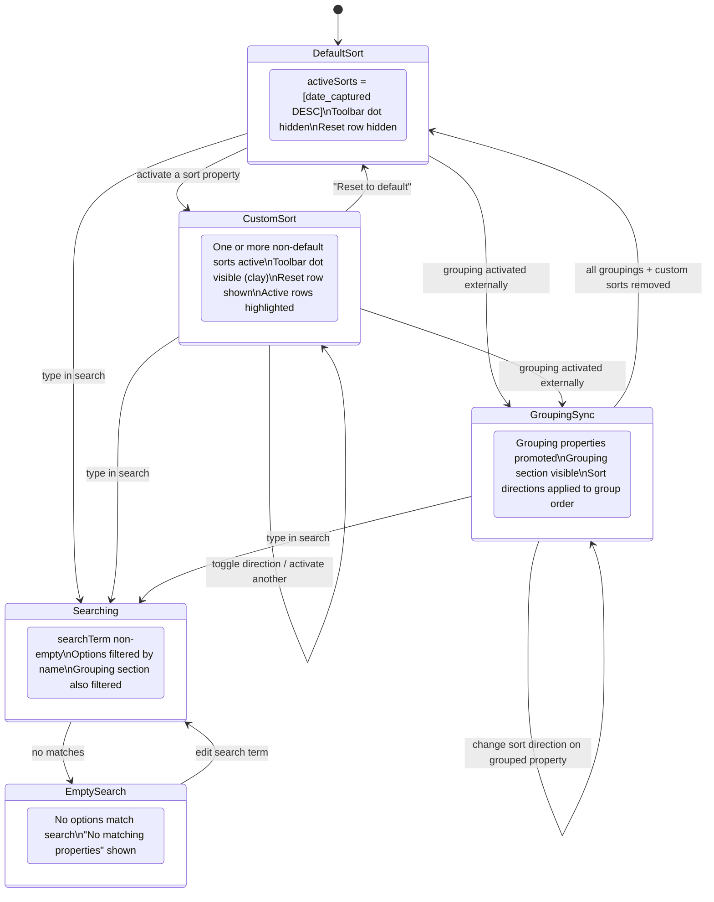
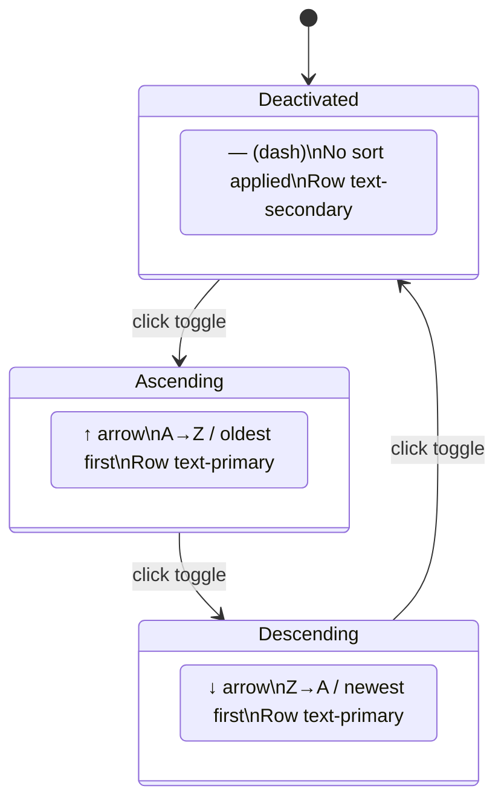
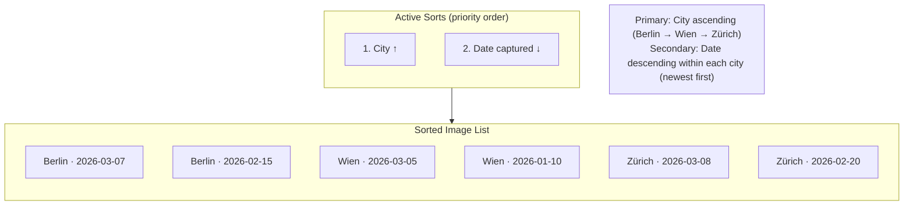

# Sort Dropdown

## What It Is

A dropdown for managing the sort order of images in the workspace pane. Supports **multi-sort** — multiple properties can be active simultaneously with priority ordering. Each sort property has a tri-state toggle cycling through ascending → descending → deactivated. When groupings are active, the sort list auto-promotes grouped properties to the top in grouping order, so that groups are also sorted by the same criteria.

## What It Looks Like

Floating dropdown anchored below the "Sort" toolbar button. Width: 15rem (240px). `--color-bg-elevated` background, `shadow-xl`, `rounded-lg` corners. Top: a compact search input (`--text-small`, `--color-border-strong` bottom border, no box outline — Notion-style inline search) with a contextual trailing icon:

- **Search has text** → × clear button (clears search text only)
- **Search empty + custom sort active** → ⟲ reset button (resets sorts to default)
- **Search empty + default sort** → no trailing icon

Below: a list of sort options as `.ui-item` rows.

**Sort option rows** — each row contains:

- **Left**: Property icon (Material Icon) + property label
- **Right**: Tri-state direction button cycling: `↑` (ascending) → `↓` (descending) → `—` (deactivated)

Active sort options have `--color-primary` text. The direction button is always visible on active rows, and appears on hover for inactive rows. When groupings are active, the grouped properties appear in a "Sorted by grouping" section at the top, separated by a subtle border.

**Reset row**: When any non-default sort is active, a "Reset to default" row appears at the top with a `restart_alt` icon.

## Where It Lives

- **Parent**: `WorkspaceToolbarComponent`
- **Appears when**: User clicks the "Sort" toolbar button

## Actions

| #   | User Action                             | System Response                                               | Triggers               |
| --- | --------------------------------------- | ------------------------------------------------------------- | ---------------------- |
| 1   | Types in search input                   | Filters visible sort options; trailing icon switches to ×     | `searchTerm` changes   |
| 2   | Clicks × (clear search)                 | Clears search text; trailing icon becomes ⟲ if sorts active   | `searchTerm` cleared   |
| 3   | Clicks ⟲ (reset sort)                   | Resets sorts to default [date-captured ↓]; icon disappears    | `activeSorts` reset    |
| 4   | Clicks direction toggle on inactive row | Activates sort with default direction; adds to active sorts   | `activeSorts` updated  |
| 5   | Clicks direction toggle on active row   | Cycles: asc → desc → deactivated                              | `activeSorts` updated  |
| 6   | Clicks outside or Escape                | Closes dropdown                                               | Dropdown closes        |
| 7   | Activates a grouping (in GroupingDD)    | Grouped property auto-appears in "Sorted by grouping" section | Grouping syncs to sort |
| 8   | Removes a grouping                      | Property returns to normal sort list position                 | Grouping syncs to sort |

## Component Hierarchy

```
SortDropdown                               ← floating dropdown, --color-bg-elevated, shadow-xl, rounded-lg
├── SearchInput                            ← compact, placeholder "Search properties…", --text-small
│   ├── [search has text] ClearButton (×)  ← trailing, clears search term only
│   ├── [empty + custom sort] ResetButton (⟲) ← trailing, resets to default sort
│   └── [empty + default sort] (no icon)   ← clean state
├── [has groupings] GroupingSortSection     ← "Sorted by grouping" label
│   └── SortOptionRow × N (grouped)        ← mirror grouping order, direction toggle only
│       ├── PropertyIcon                   ← Material Icon
│       ├── PropertyLabel                  ← property name
│       └── DirectionToggle (↑/↓/—)       ← tri-state, always visible
├── [has groupings] Divider                ← 1px border separating sections
├── OptionsList                            ← scrollable, remaining sort properties
│   └── SortOptionRow × N                  ← .ui-item
│       ├── PropertyIcon                   ← Material Icon
│       ├── PropertyLabel                  ← property name
│       └── DirectionToggle (↑/↓/—)       ← tri-state, visible on hover or when active
└── [no results] EmptyHint                 ← "No matching properties"
```

### Sort Options (built-in + custom)

Built-in sort options:

| Property      | Default Direction | Icon            |
| ------------- | ----------------- | --------------- |
| Date captured | Descending (↓)    | `schedule`      |
| Date uploaded | Descending (↓)    | `cloud_upload`  |
| Name          | Ascending (↑)     | `sort_by_alpha` |
| Distance      | Ascending (↑)     | `straighten`    |
| Address       | Ascending (↑)     | `location_on`   |
| City          | Ascending (↑)     | `location_city` |
| Country       | Ascending (↑)     | `flag`          |
| Project       | Ascending (↑)     | `folder`        |

Custom properties also appear here — filtered by `capabilities.sortable`. Custom property icons are type-based: `tag` (text), `numbers` (number), `event` (date), `check_box` (checkbox), `arrow_drop_down_circle` (select/chip).

### Numeric Sort Behavior

Number-type properties (built-in `distance`, custom number properties) are sorted **numerically**, not lexicographically:

- Values are parsed via `parseFloat()` before comparison
- Valid numbers compare as numbers: 1 < 5 < 12 < 100
- Invalid or empty values treated as `null` → sort last
- This prevents the common "1, 100, 12, 2, 5" lexicographic error

### Dropdown Max-Height

The `.dd-items` container inside the sort dropdown has `max-height: 24rem` with `overflow-y: auto`. This prevents the dropdown from overflowing the viewport when many custom properties are defined (e.g., 14 built-in + 15 custom = 29 options).

### Direction Toggle — Tri-State

| State       | Display | Meaning       | Next Click  |
| ----------- | ------- | ------------- | ----------- |
| Ascending   | ↑       | A→Z / Old→New | Descending  |
| Descending  | ↓       | Z→A / New→Old | Deactivated |
| Deactivated | —       | Not sorting   | Ascending   |

## Data

| Field               | Source                                   | Type            |
| ------------------- | ---------------------------------------- | --------------- |
| Built-in properties | Hardcoded list                           | `SortOption[]`  |
| Active groupings    | `WorkspaceViewService.activeGroupings()` | `PropertyRef[]` |

## State

| Name           | Type                                                 | Default                                         | Controls                      |
| -------------- | ---------------------------------------------------- | ----------------------------------------------- | ----------------------------- |
| `searchTerm`   | `string`                                             | `''`                                            | Filters visible sort options  |
| `activeSorts`  | `Array<{ key: string; direction: 'asc' \| 'desc' }>` | `[{ key: 'date-captured', direction: 'desc' }]` | Ordered list of active sorts  |
| `groupingKeys` | `string[]`                                           | `[]`                                            | Derived from active groupings |

## File Map

| File                                                       | Purpose                   |
| ---------------------------------------------------------- | ------------------------- |
| `features/map/workspace-pane/sort-dropdown.component.ts`   | Sort dropdown with search |
| `features/map/workspace-pane/sort-dropdown.component.scss` | Styles                    |

## Wiring

- Rendered inside `WorkspaceToolbarComponent` via `@if (activeDropdown() === 'sort')`
- Emits `sortChanged` to `WorkspaceViewService` with full `SortConfig[]` array
- `WorkspaceViewService` sorts images using multi-key comparator
- When groupings are active, group ordering uses the same sort directions
- `WorkspaceViewService.activeGroupings()` is read to determine which properties appear in the grouping section

### Grouping ↔ Sort Sync Contract

The `WorkspaceViewService` owns the canonical `activeSorts` signal. The sync logic is:

1. **Grouping activated** — all active grouping IDs are prepended to the sort pipeline (in grouping order) before any user-defined sorts. If a grouping key already exists in user sorts, it is moved to the grouping position (retaining its direction). New grouping keys are inserted with ascending (`asc`) as the default direction.
2. **Grouping removed** — the removed property is deleted from the effective sort list unless the user explicitly activated it before the grouping was added (tracked via a `userSortKeys` set).
3. **Sort direction changed on a grouped property** — the direction is recorded and applied to the sort pipeline. Group headings in `groupedSections` are ordered by this direction.
4. **Sort options list in the dropdown** is derived from `effectiveSorts` (= grouping sorts + user sorts merged), not from `activeSorts` directly.
5. **"Reset to default"** clears user sorts to `[date-captured ↓]` but leaves grouping-derived sorts intact.



## Acceptance Criteria

- [x] Multi-sort: multiple properties can be active simultaneously
- [x] Tri-state direction toggle per row: ascending → descending → deactivated
- [x] Active groupings auto-promoted to "Sorted by grouping" section at top
- [x] Grouping section mirrors grouping order and applies sort direction to group ordering
- [x] "Reset to default" row when any custom sort is active
- [x] Search input with clear (×) button
- [x] Dropdown uses `position: fixed` to escape overflow
- [x] Row hover: clay 8% background tint
- [x] Direction toggle always visible on active rows, on-hover for inactive
- [x] Empty state "No matching properties" when search has no results
- [x] Sort state persists across dropdown open/close (reads from WorkspaceViewService)

---

## Sort Flow — Multi-Sort

```mermaid
sequenceDiagram
    actor User
    participant TB as Toolbar "Sort" Button
    participant SD as SortDropdown
    participant WVS as WorkspaceViewService
    participant WP as Workspace Content

    User->>TB: click
    TB->>SD: open dropdown
    Note over SD: Default state: Date captured ↓ (active)

    User->>SD: click ↑ on "City" row
    SD->>SD: activeSorts = [{key: 'date-captured', dir: 'desc'}, {key: 'city', dir: 'asc'}]
    SD->>WVS: sortChanged([{key: 'date-captured', dir: 'desc'}, {key: 'city', dir: 'asc'}])
    WVS->>WVS: sort by date-captured desc, then city asc
    WVS->>WP: emit re-sorted images

    User->>SD: click toggle on "City" (↑ → ↓)
    SD->>SD: city direction flips to desc
    SD->>WVS: sortChanged([{key: 'date-captured', dir: 'desc'}, {key: 'city', dir: 'desc'}])
    WVS->>WP: emit re-sorted images

    User->>SD: click toggle on "City" (↓ → —)
    SD->>SD: city deactivated; activeSorts = [{key: 'date-captured', dir: 'desc'}]
    SD->>WVS: sortChanged([{key: 'date-captured', dir: 'desc'}])
    WVS->>WP: emit re-sorted images
```

## Sort + Grouping Sync



## Sort Dropdown — State Machine



## Direction Toggle — Tri-State Cycle



## Multi-Sort Priority Example



```

```
