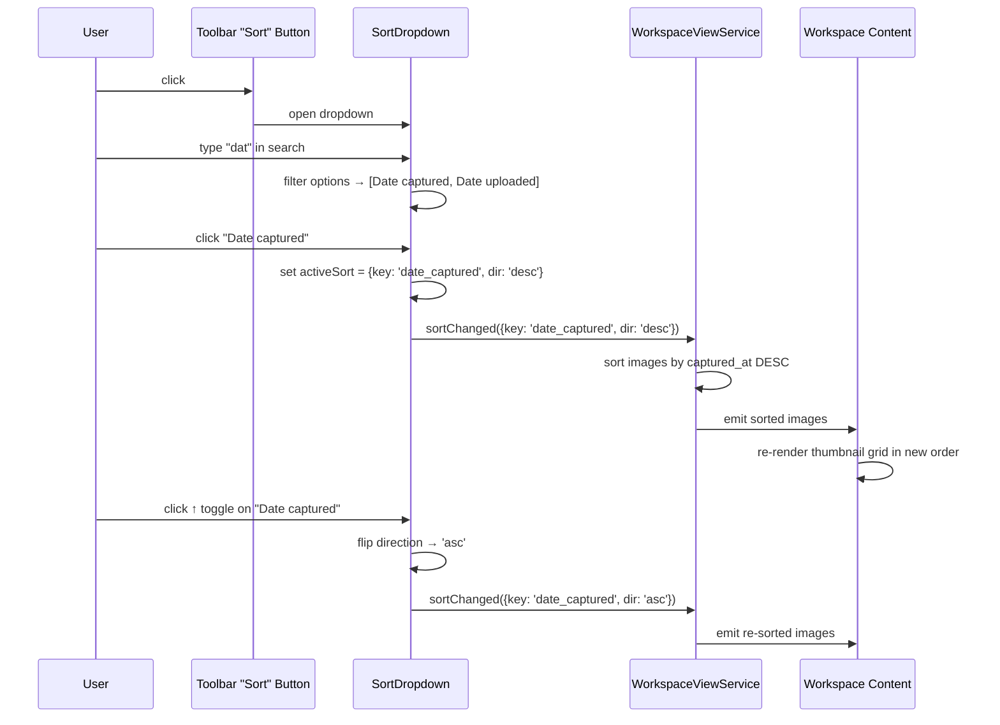
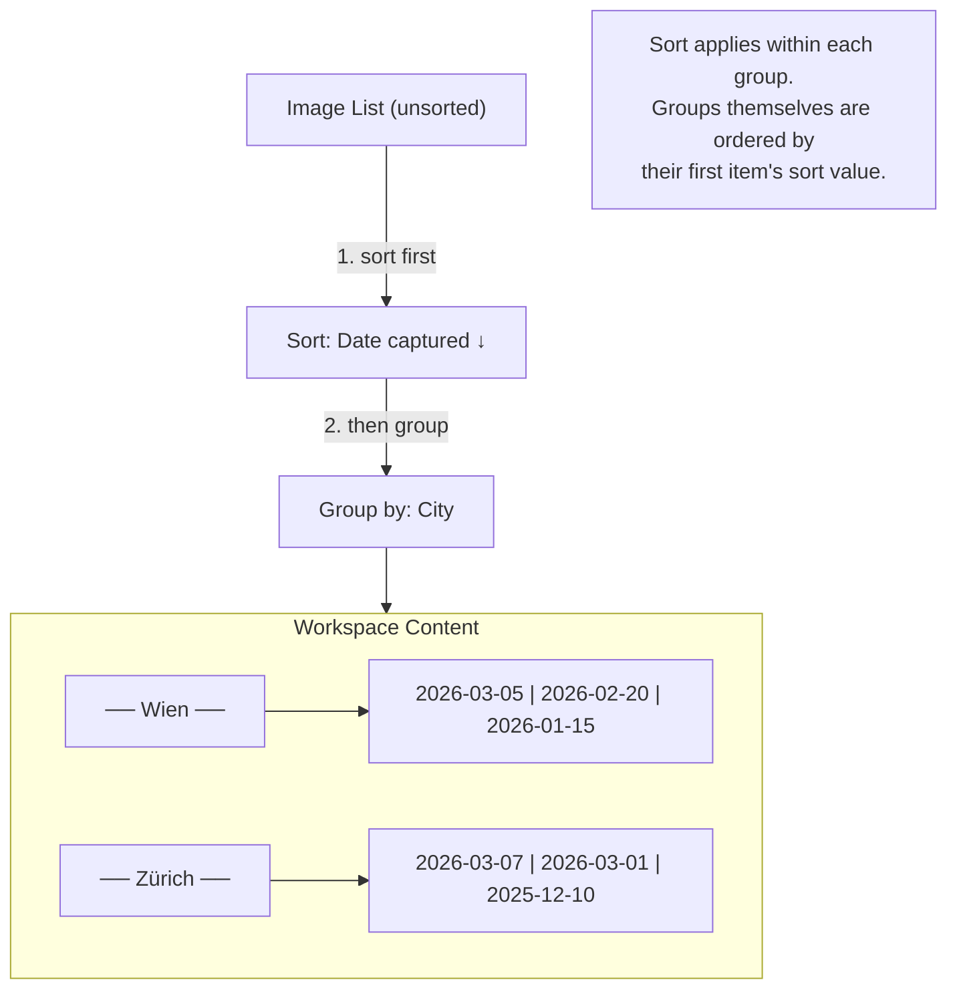

# Sort Dropdown

## What It Is

A dropdown for choosing the sort order of images in the workspace pane. Contains a search input at the top to filter the sort options, and a list of sort criteria below. Each sort option can be ascending or descending. Only one sort is active at a time (not multi-sort).

## What It Looks Like

Floating dropdown anchored below the "Sort" toolbar button. Width: 15rem (240px). `--color-bg-elevated` background, `shadow-xl`, `rounded-lg` corners. Top: a compact search input (`--text-small`, `--color-border-strong` bottom border, no box outline — Notion-style inline search). Below: a list of sort options as `.ui-item` rows. Active sort option has `--color-primary` text and a checkmark icon. Each row shows a direction toggle (↑/↓) on hover.

## Where It Lives

- **Parent**: `WorkspaceToolbarComponent`
- **Appears when**: User clicks the "Sort" toolbar button

## Actions

| #   | User Action                   | System Response                                           | Triggers             |
| --- | ----------------------------- | --------------------------------------------------------- | -------------------- |
| 1   | Types in search input         | Filters visible sort options                              | `searchTerm` changes |
| 2   | Clicks a sort option          | Sets that property as the active sort; workspace re-sorts | `activeSort` set     |
| 3   | Clicks direction toggle (↑/↓) | Flips sort direction for the active sort                  | `sortDirection` flip |
| 4   | Clicks outside or Escape      | Closes dropdown                                           | Dropdown closes      |
| 5   | Clears search                 | Shows all options again                                   | `searchTerm` cleared |

## Component Hierarchy

```
SortDropdown                               ← floating dropdown, --color-bg-elevated, shadow-xl, rounded-lg
├── SearchInput                            ← compact, placeholder "Search properties…", --text-small
├── OptionsList                            ← scrollable if many options
│   └── SortOptionRow × N                  ← .ui-item
│       ├── PropertyIcon                   ← Material Icon matching property type
│       ├── PropertyLabel                  ← property name
│       ├── [active] Checkmark (✓)         ← --color-primary
│       └── [hover] DirectionToggle (↑↓)   ← flip button
└── [no results] EmptyHint                 ← "No matching properties"
```

### Sort Options (built-in + custom)

| Property      | Default Direction | Icon            |
| ------------- | ----------------- | --------------- |
| Date captured | Descending (↓)    | `schedule`      |
| Date uploaded | Descending (↓)    | `cloud_upload`  |
| Name          | Ascending (↑)     | `sort_by_alpha` |
| Distance      | Ascending (↑)     | `straighten`    |
| Address       | Ascending (↑)     | `location_on`   |
| City          | Ascending (↑)     | `location_city` |
| Country       | Ascending (↑)     | `flag`          |
| Project       | Ascending (↑)     | `folder`        |
| _Custom keys_ | Ascending (↑)     | `label`         |

## Data

| Field               | Source                                                               | Type            |
| ------------------- | -------------------------------------------------------------------- | --------------- |
| Built-in properties | Hardcoded list                                                       | `SortOption[]`  |
| Custom properties   | `supabase.from('metadata_keys').select('id, key_name')` (org-scoped) | `MetadataKey[]` |

## State

| Name         | Type                                          | Default                                       | Controls                     |
| ------------ | --------------------------------------------- | --------------------------------------------- | ---------------------------- |
| `searchTerm` | `string`                                      | `''`                                          | Filters visible sort options |
| `activeSort` | `{ key: string; direction: 'asc' \| 'desc' }` | `{ key: 'date_captured', direction: 'desc' }` | Current sort                 |

## File Map

| File                                                       | Purpose                   |
| ---------------------------------------------------------- | ------------------------- |
| `features/map/workspace-pane/sort-dropdown.component.ts`   | Sort dropdown with search |
| `features/map/workspace-pane/sort-dropdown.component.html` | Template                  |
| `features/map/workspace-pane/sort-dropdown.component.scss` | Styles                    |

## Wiring

- Rendered inside `WorkspaceToolbarComponent` via `@if (activeDropdown() === 'sort')`
- Emits `sortChanged` to `WorkspaceViewService`
- `WorkspaceViewService` re-sorts the image list and emits to content area

## Acceptance Criteria

- [ ] Search input at top, filters options by name
- [ ] All built-in sort options listed
- [ ] Custom metadata keys appear as additional sort options
- [ ] Active sort highlighted with checkmark and `--color-primary` text
- [ ] Direction toggle (↑/↓) visible on hover for each option
- [ ] Click applies sort immediately — workspace re-sorts live
- [ ] Single active sort (not multi-sort)
- [ ] Empty state "No matching properties" when search has no results

---

## Sort Flow



## Sort + Grouping Interaction


