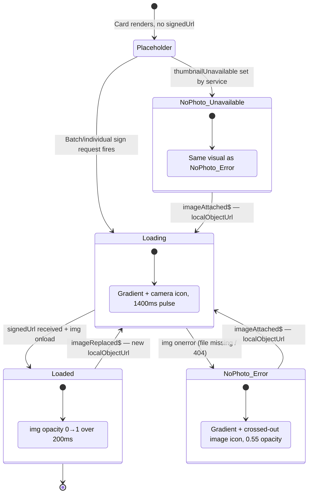

# Thumbnail Card

> **Photo loading use cases:** [use-cases/photo-loading.md](../use-cases/photo-loading.md)

## What It Is

A single 128×128px image thumbnail in the grid. Shows photo preview with overlaid metadata. Actions (checkbox, add to group, context menu) are hidden at rest and appear on hover (Quiet Actions pattern). On mobile, selection checkboxes become visible in bulk-select mode.

## What It Looks Like

128×128px rounded card. Photo thumbnail fills the card (`object-fit: cover`). When no photo file exists in Supabase Storage, a CSS placeholder (gradient + camera icon) fills the card identically — no broken `` icon ever appears. Overlays at rest:

- Bottom-left: capture date (small, semi-transparent bg)
- Top-right: correction dot (if corrected) or metadata preview icon

On hover (desktop): fade-in at 80ms with no layout shift:

- Top-left: selection checkbox
- Top-right: "Add to project" icon button
- Bottom-right: context menu (⋯) button

## Where It Lives

- **Parent**: Thumbnail Grid
- **Component**: Inline within Thumbnail Grid or standalone component

## Actions

| #   | User Action                      | System Response                                    | Triggers            |
| --- | -------------------------------- | -------------------------------------------------- | ------------------- |
| 1   | Clicks card                      | Opens Image Detail View                            | `detailImageId` set |
| 2   | Hovers card (desktop)            | Reveals action buttons (checkbox, add-to-group, ⋯) | Opacity 0→1, 80ms   |
| 3   | Clicks checkbox                  | Toggles selection for this image                   | Selection state     |
| 4   | Clicks "Add to project"          | Opens project picker dropdown                      | Project selection   |
| 5   | Clicks ⋯ (context menu)          | Opens menu: View detail, Edit metadata, Delete     | Context menu        |
| 6   | Enters bulk-select mode (mobile) | Checkboxes become always visible                   | Bulk mode           |

## Component Hierarchy

```
ThumbnailCard                              ← 128×128, rounded, overflow-hidden, relative
├── [loaded] ThumbnailImage                ←  object-fit:cover, signed URL (256×256 transform)
├── [not loaded] Placeholder               ← CSS gradient + camera icon (SVG mask), matches card geometry
├── DateOverlay                            ← bottom-left, text-xs, semi-transparent bg
├── [corrected] CorrectionDot             ← top-right, 6px, --color-accent
├── [uploading] UploadingOverlay           ← semi-transparent overlay with animated upload icon, --color-primary
└── [hover] ActionOverlay                  ← opacity 0→1, 80ms, no layout shift
    ├── SelectionCheckbox                  ← top-left
│   ├── AddToProjectButton                 ← top-right
    └── ContextMenuButton (⋯)             ← bottom-right
```

The `UploadingOverlay` is shown when a file targeting this image's coordinates is currently being uploaded (`jobPhaseChanged$` from `UploadManagerService`, phase === `'uploading'`). It renders a semi-transparent `--color-bg-base` overlay (0.6 opacity) with a small animated upload arrow icon in the center. The overlay does not block hover actions but sits behind them in z-order.

## Data

| Field           | Source                                          | Type      |
| --------------- | ----------------------------------------------- | --------- |
| Image thumbnail | Supabase Storage signed URL (256×256 transform) | `string`  |
| Placeholder     | CSS-only, no data source                        | —         |
| Capture date    | `images.captured_at` or `images.created_at`     | `Date`    |
| Is corrected    | `images.corrected_lat IS NOT NULL`              | `boolean` |

## State

| Name                   | Type      | Default | Controls                                                    |
| ---------------------- | --------- | ------- | ----------------------------------------------------------- |
| `isSelected`           | `boolean` | `false` | Checkbox state                                              |
| `isHovered`            | `boolean` | `false` | Action overlay visibility (desktop)                         |
| `isUploading`          | `boolean` | `false` | Upload overlay visibility (driven by `jobPhaseChanged$`)    |
| `imgLoading`           | `boolean` | `true`  | Whether `` is still loading from network               |
| `imgErrored`           | `boolean` | `false` | Whether `` returned an error (broken URL / 404)        |
| `isLoading`            | computed  | -       | Pulsing placeholder; true while URL is pending or img loads |
| `imageReady`           | computed  | -       | True when `` has loaded successfully                   |
| `thumbnailUnavailable` | `boolean` | `false` | Set by service when signing was attempted but no URL exists |

## Thumbnail Loading

Thumbnail cards use **Tier 2** of the progressive loading pipeline (256×256px). Images with a pre-generated `thumbnailPath` are batch-signed via `createSignedUrls`. Images without a thumbnail use individual `createSignedUrl` with server-side transforms.

### Loading State Machine



> **Replace / Attach optimisation:** Both `imageReplaced$` and `imageAttached$` carry a `localObjectUrl` (blob from `URL.createObjectURL`). Because blob URLs load locally in ~0ms, the `PulsingPlaceholder` phase is imperceptibly brief — the user sees an almost-instant swap to the new photo via the standard 200ms fade-in. See [PL-7 / PL-8](../use-cases/photo-loading.md#pl-7-replace-photo--loading-state-reset) for full interaction diagrams.

### Visual States

| State              | Placeholder visible | Pulse | Icon                     | ``       | Trigger                              |
| ------------------ | ------------------- | ----- | ------------------------ | ------------- | ------------------------------------ |
| Waiting            | Yes                 | Yes   | Camera (gradient + icon) | Hidden        | Card renders, URL not yet signed     |
| Downloading        | Yes                 | Yes   | Camera (gradient + icon) | Hidden        | Signed URL received, `` loading |
| Loaded             | No                  | No    | —                        | Visible       | `` `onload`                     |
| No photo           | Yes                 | No    | Crossed-out image, 0.55  | Hidden        | `thumbnailUnavailable` set           |
| Error (404)        | Yes                 | No    | Crossed-out image, 0.55  | Hidden        | `` `onerror`                    |
| Replacing (brief)  | Yes                 | Yes   | Camera (gradient + icon) | Hidden        | `imageReplaced$` — grid cache reset  |
| Replacing → Loaded | No                  | No    | —                        | Visible (new) | Blob `` `onload` (~0ms)         |
| Attaching (brief)  | Yes                 | Yes   | Camera (gradient + icon) | Hidden        | `imageAttached$` — grid cache reset  |
| Attaching → Loaded | No                  | No    | —                        | Visible (new) | Blob `` `onload` (~0ms)         |

### Placeholder Design

- **Loading state:** gradient background (`--color-bg-subtle` → `--color-bg-muted`) with a centered camera icon (SVG mask). Pulses at 1400ms ease-in-out to match map marker loading animation.
- **No-photo state:** same gradient, but uses a crossed-out image icon (Material "image_not_supported") at 0.55 opacity. No pulse.

## File Map

| File                                                      | Purpose                           |
| --------------------------------------------------------- | --------------------------------- |
| `features/map/workspace-pane/thumbnail-card.component.ts` | Card component with hover actions |

## Wiring

- Import `ThumbnailCardComponent` in `ThumbnailGridComponent`
- Bind image data via `@Input()` from grid's `@for` loop
- Emit selection and detail-view events via `@Output()`

## Acceptance Criteria

- [ ] 128×128px with rounded corners
- [ ] Thumbnail shows via signed URL with `transform: { width: 256, height: 256, resize: 'cover' }`
- [ ] Pulsing CSS placeholder shown while thumbnail is loading (gradient + camera icon, 1400ms pulse)
- [ ] Pulse stops once image loads or fails
- [ ] Static no-photo placeholder (gradient + crossed-out image icon, 0.55 opacity) shown when file is missing
- [ ] `` fades in over 200ms once signed URL loads
- [ ] No broken `` icon ever appears
- [ ] On `imageReplaced$`: grid cache gets `localObjectUrl` → card resets `imgLoading = true` → blob loads (~0ms) → fade-in with new photo
- [ ] On `imageAttached$`: card transitions from no-photo icon to loaded state via same loading cycle with blob URL
- [ ] `localObjectUrl` replaced by signed URL on next `batchSignThumbnails()` call — no visible flash
- [ ] Date overlay bottom-left, always visible (including on placeholder)

- [ ] Correction dot top-right (when corrected)
- [ ] Hover reveals checkbox, add-to-project, context menu (80ms, no layout shift)
- [ ] Upload overlay shown when a file for this image's coords is in `uploading` phase
- [ ] Upload overlay has animated upload icon + semi-transparent background
- [ ] Upload overlay disappears when upload completes or errors
- [ ] Mobile: checkboxes visible in bulk-select mode, hidden otherwise
- [ ] Click opens detail view
