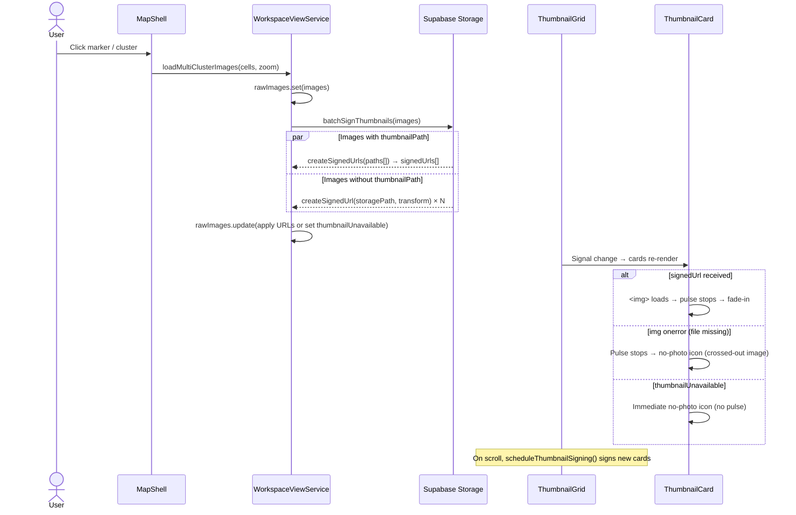

# Thumbnail Grid

> **Blueprint:** [implementation-blueprints/thumbnail-grid.md](../implementation-blueprints/thumbnail-grid.md)
> **Photo loading use cases:** [use-cases/photo-loading.md](../use-cases/photo-loading.md)

## What It Is

A scrollable grid of photo thumbnails inside a Workspace Pane tab. Shows the images belonging to the currently active group. Uses virtual scrolling for performance. Has sorting controls above the grid.

## What It Looks Like

Grid of 128×128px thumbnail cards, auto-filling the available width (typically 2–3 columns in the workspace pane). Sorting controls above: a compact segmented control with Date ↓, Date ↑, Distance, Name. Virtual scrolling — only renders visible rows. Shows empty state when the group has no images.

## Where It Lives

- **Parent**: Workspace Pane content area
- **Appears when**: Workspace Pane is open and no detail image is selected

## Actions

| #   | User Action        | System Response                                            | Triggers            |
| --- | ------------------ | ---------------------------------------------------------- | ------------------- |
| 1   | Scrolls the grid   | More thumbnails load via virtual scrolling                 | Viewport update     |
| 2   | Clicks a thumbnail | Opens Image Detail View (replaces grid)                    | `detailImageId` set |
| 3   | Changes sort order | Grid reorders (Date↓, Date↑, Distance, Name)               | `sortOrder` changes |
| 4   | Hovers a thumbnail | Reveals Thumbnail Card actions (checkbox, add to group, ⋯) | Quiet Actions       |

## Component Hierarchy

```
ThumbnailGrid                              ← scrollable container, virtual scroll
├── SortingControls                        ← segmented control: Date↓ | Date↑ | Distance | Name
├── GridContainer                          ← CSS grid, auto-fill 128px columns, gap-2
│   └── ThumbnailCard × N                  ← 128×128 each (see thumbnail-card spec)
└── [empty] EmptyState
    ├── "This group is empty"
    ├── "Add images from the map"
    └── GhostButton "Go to map"
```

## Data

| Field                   | Source                                                                              | Type      |
| ----------------------- | ----------------------------------------------------------------------------------- | --------- |
| Images for active group | `supabase.from('saved_group_images').select(...)` or in-memory for Active Selection | `Image[]` |
| Thumbnails              | Supabase Storage signed URLs (256×256 transform, batch-signed)                      | `string`  |

## Thumbnail Batch-Signing

The grid signs thumbnail URLs in batches to minimize round-trips. On cluster click or scroll, the service collects all images that don't yet have a `signedUrl` or `thumbnailUnavailable` flag:

1. **With `thumbnailPath`:** batch-signed via `createSignedUrls(paths[], 3600)` — fast, small files.
2. **Without `thumbnailPath`:** individual `createSignedUrl(storagePath, 3600, { transform: 256×256 })` in parallel — uses server-side image transforms.

After signing, images that received no valid URL are flagged `thumbnailUnavailable: true` so they are not re-attempted.



## State

| Name        | Type                                                | Default       | Controls                   |
| ----------- | --------------------------------------------------- | ------------- | -------------------------- |
| `sortOrder` | `'date-desc' \| 'date-asc' \| 'distance' \| 'name'` | `'date-desc'` | Sort order of thumbnails   |
| `images`    | `Image[]`                                           | `[]`          | The current group's images |

## File Map

| File                                                        | Purpose                     |
| ----------------------------------------------------------- | --------------------------- |
| `features/map/workspace-pane/thumbnail-grid.component.ts`   | Grid with virtual scrolling |
| `features/map/workspace-pane/sorting-controls.component.ts` | Segmented sort control      |

## Wiring

- Import `ThumbnailGridComponent` in `WorkspacePaneComponent`
- Inject `GroupService` and `SelectionService` for image data
- Place as default content area within Workspace Pane

## Acceptance Criteria

- [ ] 128×128 grid auto-fills available width
- [ ] Virtual scrolling — smooth with 100+ images
- [ ] Thumbnail URLs batch-signed via service on cluster click (no per-card waterfall)
- [ ] Additional signing on scroll for newly-visible cards
- [ ] Cards with `thumbnailPath` use batch `createSignedUrls`; others use individual `createSignedUrl` with transform
- [ ] Cards pulse while loading, stop pulsing once loaded or failed
- [ ] Cards show crossed-out image icon (no-photo) when file is missing
- [ ] `thumbnailUnavailable` flag prevents re-signing attempts
- [ ] Sorting controls change order immediately
- [ ] Click on card opens Image Detail View
- [ ] Hover reveals card actions (Quiet Actions pattern)
- [ ] Empty state with guidance text and "Go to map" button
