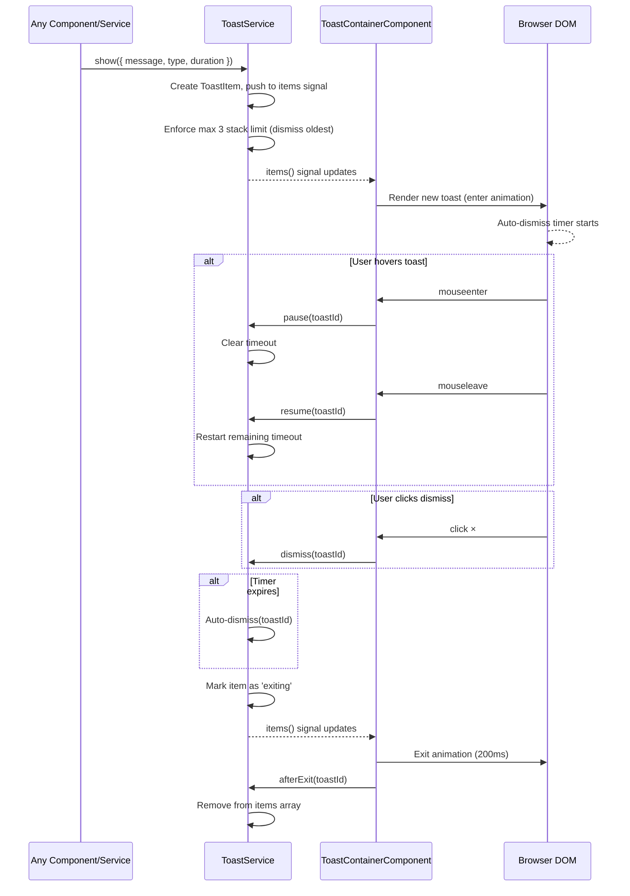
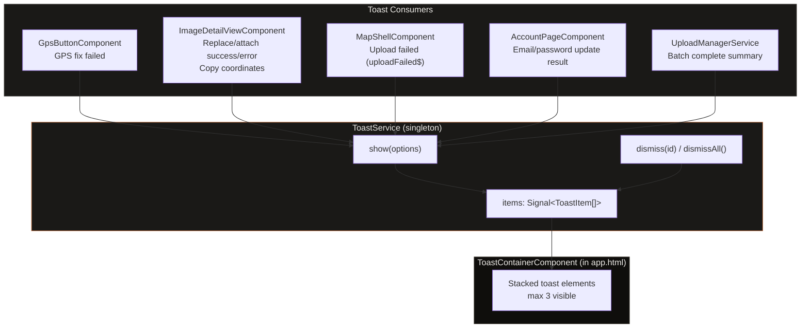

# Toast System

## What It Is

A global notification system that displays short, non-blocking feedback messages (success, error, warning, info) in response to user actions and system events. Toasts appear in the bottom-left corner of the viewport, stack vertically, and auto-dismiss after a configurable duration. Any service or component in the app can trigger a toast through the singleton `ToastService`.

## What It Looks Like

Toasts are compact horizontal bars with rounded corners (`rounded-lg`, 8px), a leading status icon, message text in `--text-body` (15px), and an optional dismiss button. Background uses `--color-bg-elevated` with `--elevation-overlay` shadow. A thin 2px left border indicates severity: `--color-success` for success, `--color-danger` for error, `--color-warning` for warning, `--color-text-secondary` for info. Text uses `--c   olor-text-primary`. The dismiss icon uses `--color-text-secondary` and turns `--color-text-primary` on hover.

Toasts are fixed-position, anchored to the bottom-left of the viewport. They sit to the right of the sidebar: `left` is offset by the collapsed sidebar width (`3rem` / 48px) plus a gap (`0.75rem` / 12px), so they never overlap the sidebar even when it is collapsed. When the sidebar expands on hover (to `15rem` / 240px), toasts do not reposition — they remain relative to the collapsed sidebar width. The toast container has a `max-width` of `24rem` (384px) so messages stay readable without stretching too wide.

Each toast fades in from below (`translateY(1rem)` → `translateY(0)`, opacity `0→1`, 200ms ease-out) and fades out upward (`translateY(0)` → `translateY(-0.5rem)`, opacity `1→0`, 200ms ease-in) before removal. The enter animation moves the toast from `entering` → `visible` state; the 200ms `ease-out` transition must complete (listen for `animationend` on the host element) before the state changes. The exit animation (`exiting` state) likewise completes via `animationend` — only then does `afterExit(toastId)` fire to remove the item from the array. Never use a raw `setTimeout(200)` fallback; bind to the DOM event so animation-duration changes don't cause desyncs.

Message text wraps naturally (`word-break: break-word`). A maximum of 3 lines is enforced via `-webkit-line-clamp: 3` with `overflow: hidden` and `text-overflow: ellipsis`. This keeps individual toasts compact even with long messages.

When multiple toasts stack, newer toasts push older ones up. The container uses `transition: gap 200ms ease` so that when a middle toast exits, the remaining toasts collapse smoothly instead of jumping. A maximum of 3 toasts are visible simultaneously; if a 4th arrives, the oldest is immediately dismissed.

On mobile (`< 48rem`), toasts are centered horizontally above the bottom sheet (bottom offset: `5rem` / 80px) with `left: 1rem; right: 1rem; max-width: none` so they span the available width minus padding.

`prefers-reduced-motion: reduce` disables translate transforms — toasts appear/disappear with opacity-only instant transitions.

## Where It Lives

- **Route**: Global — available on every page
- **Parent**: `App` root component (`app.html`)
- **Appears when**: Any service calls `ToastService.show()`

## Actions

| #   | User Action              | System Response                                                                                                                 | Triggers                                            |
| --- | ------------------------ | ------------------------------------------------------------------------------------------------------------------------------- | --------------------------------------------------- |
| 1   | Toast appears            | Starts auto-dismiss timer (default 4s)                                                                                          | Timer countdown                                     |
| 2   | User hovers a toast      | Pauses auto-dismiss timer                                                                                                       | Timer paused                                        |
| 3   | User stops hovering      | Resumes auto-dismiss timer                                                                                                      | Timer resumes                                       |
| 4   | Clicks dismiss (×)       | Toast fades out immediately                                                                                                     | Toast removed from stack                            |
| 5   | Auto-dismiss timer fires | Toast fades out                                                                                                                 | Toast removed from stack                            |
| 6   | 4th toast arrives        | Oldest toast is immediately dismissed                                                                                           | Stack limit enforced                                |
| 7   | Error toast appears      | Duration is longer (6s) on desktop; on mobile (`< 48rem`) error toasts set `duration: 0` (no auto-dismiss, manual dismiss only) | Stays until dismissed (mobile) or timeout (desktop) |

## Event Flow



### Timing details

- **`entering` → `visible`**: Transition happens on `animationend` of the enter animation (200ms ease-out). Do not use `setTimeout`.
- **`exiting` → removed**: Transition happens on `animationend` of the exit animation (200ms ease-in). `afterExit(toastId)` is called from the `animationend` handler, which then removes the item from the `items` signal.
- **Pause / Resume**: On `mouseenter`, record `remainingMs = duration - (Date.now() - startedAt)` and clear the timeout. On `mouseleave`, start a new timeout with the saved `remainingMs`. The `startedAt` timestamp is reset to `Date.now()` on resume so subsequent pauses calculate correctly.

## Consumer Wiring — Who Shows Toasts



## Component Hierarchy

```
ToastContainerComponent                    ← fixed position, bottom-left, z-index: var(--z-toast)
│                                             left: calc(3rem + 0.75rem), bottom: 1.5rem
│                                             mobile: centered, bottom: 5rem
│                                             display: flex, flex-direction: column-reverse, gap: 0.5rem
│                                             transition: gap 200ms ease (smooth collapse on exit)
│                                             role="region", aria-label="Notifications"
│                                             aria-live="polite" (container-level default)
│
└── ToastItemComponent × N (max 3)         ← individual toast bar
    │                                         Error toasts: aria-live="assertive" (overrides container)
    │                                         All other types: inherit container's aria-live="polite"
    │                                         Not tab-focusable (no tabindex) — dismissed via mouse/touch only
    │                                         Dismiss button IS focusable (natural button element)
    ├── StatusIcon                          ← Material Icon, matches type color
    │                                         success: "check_circle", error: "error",
    │                                         warning: "warning", info: "info"
    ├── MessageText                         ← --text-body, --color-text-primary, flex: 1
    │                                         word-break: break-word, -webkit-line-clamp: 3
    └── DismissButton (×)                   ← "close" icon, ghost button, 1.75rem tap target
                                              Focusable via Tab, aria-label="Dismiss notification"
```

## Data

| Field         | Source                 | Type                  |
| ------------- | ---------------------- | --------------------- |
| Active toasts | `ToastService.items()` | `Signal<ToastItem[]>` |

## State

| Name    | Type          | Default | Controls              |
| ------- | ------------- | ------- | --------------------- |
| `items` | `ToastItem[]` | `[]`    | List of active toasts |

### ToastItem interface

```typescript
interface ToastItem {
  id: string; // crypto.randomUUID()
  message: string; // Display text
  type: "success" | "error" | "warning" | "info"; // Severity
  duration: number; // Auto-dismiss ms (0 = no auto-dismiss, manual only)
  state: "entering" | "visible" | "exiting"; // Animation state
  createdAt: number; // Date.now() for ordering
  startedAt: number; // Date.now() when timer last (re)started — used for pause math
  remainingMs?: number; // Set on pause: duration - (Date.now() - startedAt)
}
```

### ToastOptions (show() input)

```typescript
interface ToastOptions {
  message: string;
  type?: "success" | "error" | "warning" | "info"; // default: 'info'
  duration?: number; // default: 4000 (error: 6000). 0 = no auto-dismiss.
  dedupe?: boolean; // default: false. If true, skip if an identical message+type toast is already visible.
}
```

## File Map

| File                                  | Purpose                                                                        |
| ------------------------------------- | ------------------------------------------------------------------------------ |
| `core/toast.service.ts`               | Singleton service — manages toast queue, timers, signals (rewrite existing)    |
| `core/toast-container.component.ts`   | Container that renders stacked toasts (replaces existing `toast.component.ts`) |
| `core/toast-container.component.html` | Template with `@for` loop over items                                           |
| `core/toast-container.component.scss` | Positioning, animation, responsive styles                                      |
| `core/toast-item.component.ts`        | Individual toast bar (icon + message + dismiss)                                |
| `core/toast-item.component.html`      | Template for single toast                                                      |
| `core/toast-item.component.scss`      | Toast bar visual styles                                                        |
| `core/toast.model.ts`                 | `ToastItem`, `ToastOptions`, `ToastType` types                                 |
| `core/toast.service.spec.ts`          | Unit tests for ToastService — timer logic, stack limits, dedupe, pause/resume  |

## Edge Cases

| #   | Scenario                                   | Behavior                                                                                                                                                                                                                                                |
| --- | ------------------------------------------ | ------------------------------------------------------------------------------------------------------------------------------------------------------------------------------------------------------------------------------------------------------- |
| 1   | **Rapid `show()` calls** (3+ in same tick) | Pushes are synchronous within the signal update. After all pushes, if `items.length > 3`, dismiss the oldest items until length ≤ 3. This is naturally atomic because signal updates batch within the same microtask.                                   |
| 2   | **Duplicate messages**                     | By default, duplicates are allowed (5 identical errors = 5 toasts). Set `dedupe: true` in `ToastOptions` to skip if an active toast with the same `message` + `type` already exists. `UploadManagerService` should use `dedupe: true` for batch errors. |
| 3   | **`duration: 0`**                          | No auto-dismiss timer is started. Toast stays visible until manually dismissed via × button. Valid for any type. On mobile, error toasts always behave as `duration: 0` regardless of the passed value.                                                 |
| 4   | **Route change**                           | Toasts persist across route changes. No `dismissAll()` on navigation. Rationale: toasts are transient feedback about past actions (e.g., "Photo uploaded") and remain relevant after navigation.                                                        |
| 5   | **`crypto.randomUUID()` unavailable**      | Fallback to `Math.random().toString(36).slice(2)` for ID generation. Wrap in a private `generateId()` method. No silent failure — the toast must still appear.                                                                                          |
| 6   | **`dismissAll()` usage**                   | Called only from unit tests (`_testReset()`) and from `AccountPageComponent` on sign-out (clears stale toasts). No other consumer. If no sign-out toast clearing is needed, `dismissAll()` may be kept for tests only.                                  |

## Wiring

### Root integration

- Add `<ss-toast-container />` to `app.html` after `<router-outlet />`
- Import `ToastContainerComponent` in `App` component imports
- Remove old `ToastComponent` import if present anywhere

### Z-index

- Add `--z-toast: 450;` to `styles.scss` z-index ladder (between `--z-dropdown: 400` and `--z-modal: 500`)
- Toast container uses `z-index: var(--z-toast)` — above dropdowns, below modals

### Consumer wiring (existing files to update)

Each consumer injects `ToastService` and calls `show()` with appropriate options:

| Consumer file                                                | Event                                        | Toast call                                                    |
| ------------------------------------------------------------ | -------------------------------------------- | ------------------------------------------------------------- |
| `features/map/map-shell/map-shell.component.ts`              | `uploadFailed$` subscription                 | `toast.show({ message: event.error, type: 'error' })`         |
| `features/map/map-shell/map-shell.component.ts`              | `imageUploaded$` (already handled via panel) | `toast.show({ message: 'Photo uploaded', type: 'success' })`  |
| `features/map/workspace-pane/image-detail-view.component.ts` | Replace/attach success                       | `toast.show({ message: 'Photo replaced', type: 'success' })`  |
| `features/map/workspace-pane/image-detail-view.component.ts` | Replace/attach failure via `uploadFailed$`   | `toast.show({ message: event.error, type: 'error' })`         |
| `features/map/workspace-pane/image-detail-view.component.ts` | Copy coordinates                             | `toast.show({ message: 'Coordinates copied', type: 'info' })` |
| `features/map/gps-button/gps-button.component.ts`            | GPS failure                                  | Already uses `ToastService` — update call signature           |

### Backward compatibility

The existing `ToastService.show(msg, duration)` signature must be replaced with `show(options: ToastOptions)`. Update all existing callers (currently only `GpsButtonComponent`).

## Acceptance Criteria

- [ ] `ToastService` is `providedIn: 'root'` singleton with signal-based `items()`
- [ ] `show()` accepts `ToastOptions` with message, optional type and duration
- [ ] Toasts appear in bottom-left, offset right of collapsed sidebar (`left: calc(3rem + 0.75rem)`)
- [ ] Toasts never overlap the sidebar in collapsed or expanded state
- [ ] Toast enter animation: translateY + opacity, 200ms ease-out
- [ ] Toast exit animation: translateY + opacity, 200ms ease-in
- [ ] Auto-dismiss after 4s (info/success/warning) or 6s (error)
- [ ] Hover pauses auto-dismiss timer; mouseleave resumes
- [ ] Dismiss button (×) removes toast immediately
- [ ] Maximum 3 toasts visible; 4th dismisses oldest
- [ ] Stacking: newest at bottom, older toasts pushed up (column-reverse)
- [ ] Mobile: centered horizontally, `bottom: 5rem` above bottom sheet
- [ ] `prefers-reduced-motion` disables transforms (opacity-only)
- [ ] Container has `role="region"`, `aria-label="Notifications"`, and `aria-live="polite"`
- [ ] Error toasts individually set `aria-live="assertive"` to interrupt screen readers
- [ ] Dismiss button is focusable via Tab with `aria-label="Dismiss notification"`
- [ ] Error toasts use `--color-danger` left border
- [ ] Success toasts use `--color-success` left border
- [ ] Warning toasts use `--color-warning` left border
- [ ] Info toasts use `--color-text-secondary` left border
- [ ] `z-index: var(--z-toast)` (450) — above dropdowns, below modals
- [ ] `MapShellComponent` subscribes to `uploadFailed$` and shows error toast
- [ ] `ImageDetailViewComponent` subscribes to `uploadFailed$` and shows error toast
- [ ] `ImageDetailViewComponent` shows success toast on replace/attach complete
- [ ] `ImageDetailViewComponent` shows info toast on coordinate copy
- [ ] `GpsButtonComponent` updated to use new `show(ToastOptions)` API
- [ ] Old `toast.component.ts` / `toast.component.html` / `toast.component.scss` removed
- [ ] Dark mode: warm `--color-bg-elevated` background, proper token usage throughout
- [ ] Works in both light and dark themes using CSS custom properties only
- [ ] `entering` → `visible` transition fires on `animationend`, not `setTimeout`
- [ ] `exiting` → removed transition fires on `animationend` via `afterExit()`
- [ ] Hover pause records `remainingMs` correctly; resume uses saved value
- [ ] `duration: 0` disables auto-dismiss timer (toast stays until manual dismiss)
- [ ] Error toasts on mobile (`< 48rem`) force `duration: 0` (manual dismiss only)
- [ ] `dedupe: true` option prevents duplicate message+type toasts in the stack
- [ ] Rapid `show()` calls (same tick) correctly enforce max 3 limit
- [ ] Toasts persist across route changes (no `dismissAll()` on navigation)
- [ ] Message text wraps with `word-break: break-word`, clamped to 3 lines
- [ ] Gap between toasts collapses smoothly on exit (`transition: gap 200ms ease`)
- [ ] ID generation falls back to `Math.random()` if `crypto.randomUUID()` unavailable
- [ ] `ToastService` exposes `_testReset()` method that calls `dismissAll()` and clears all timers for test teardown
- [ ] Unit tests use `fakeAsync` / `tick` with `_testReset()` for deterministic timer testing
