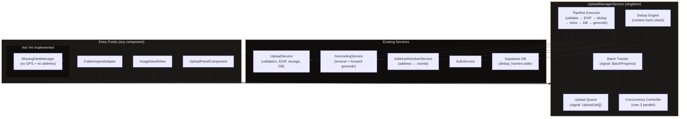
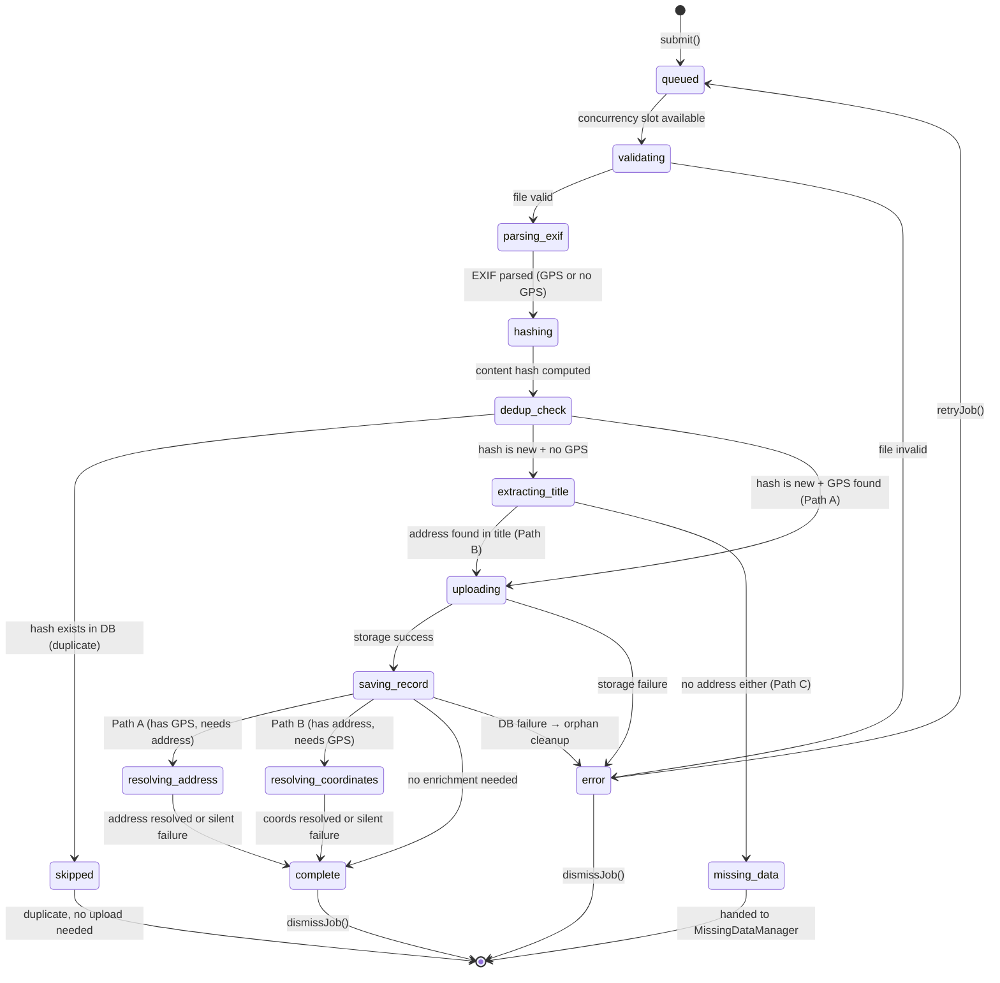
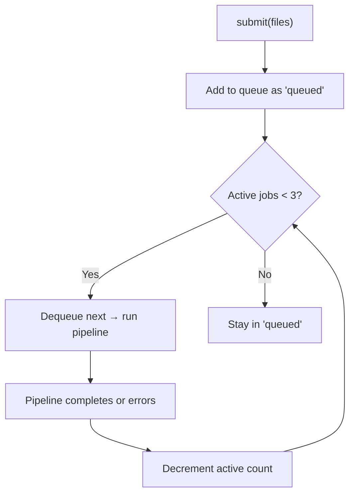
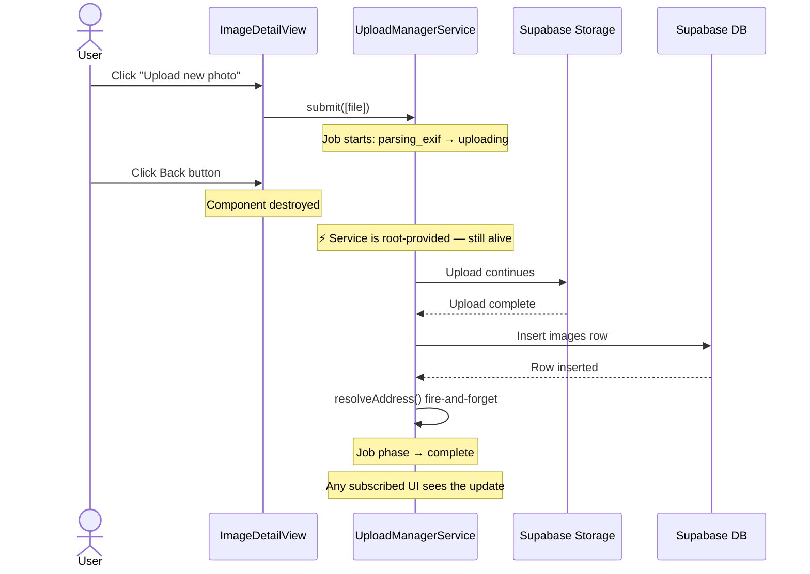
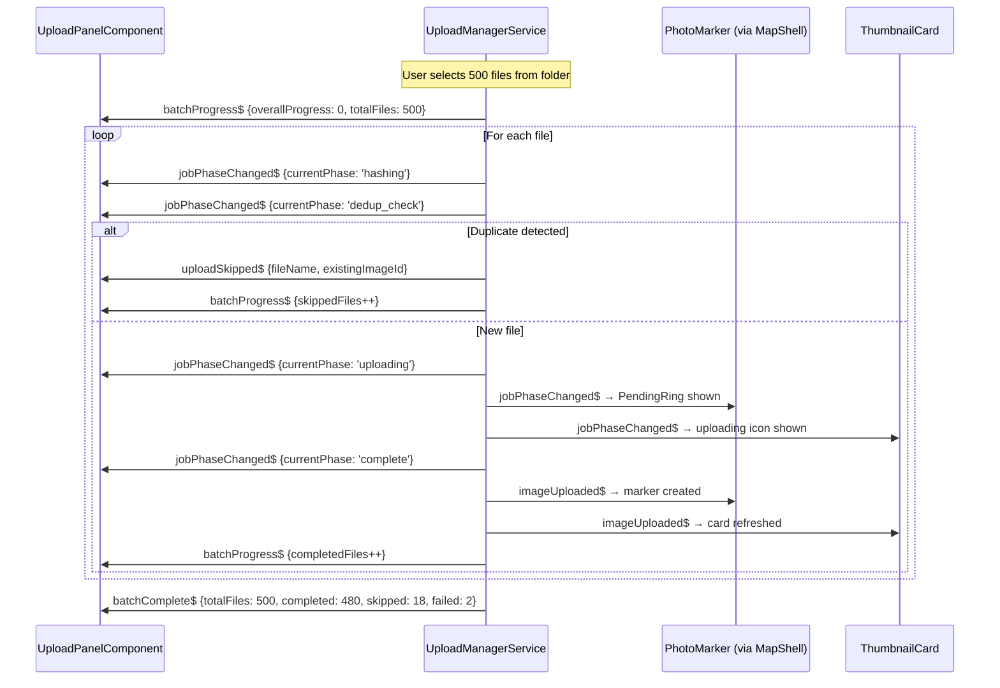
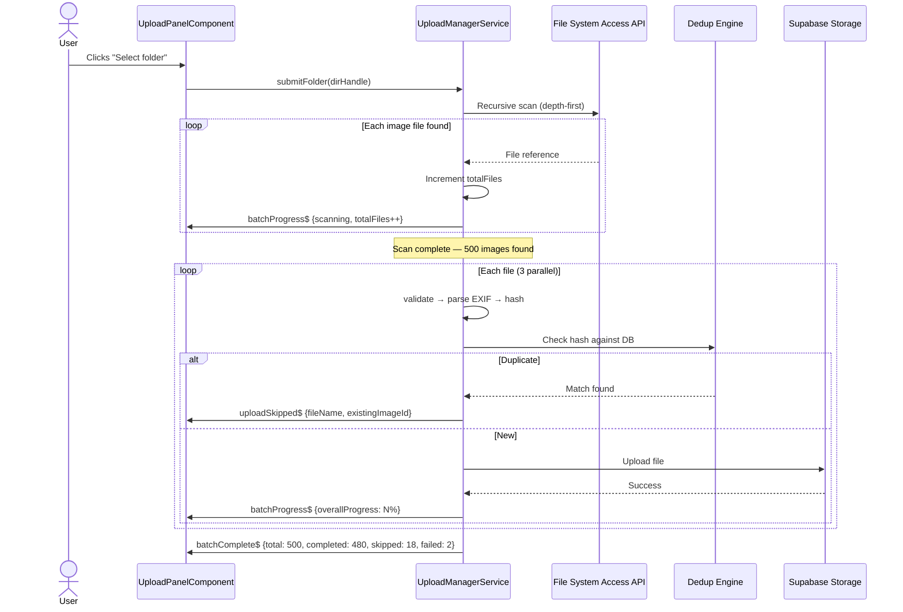
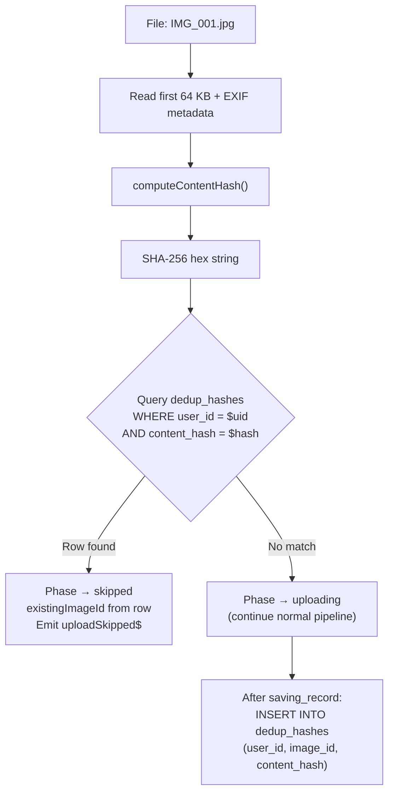
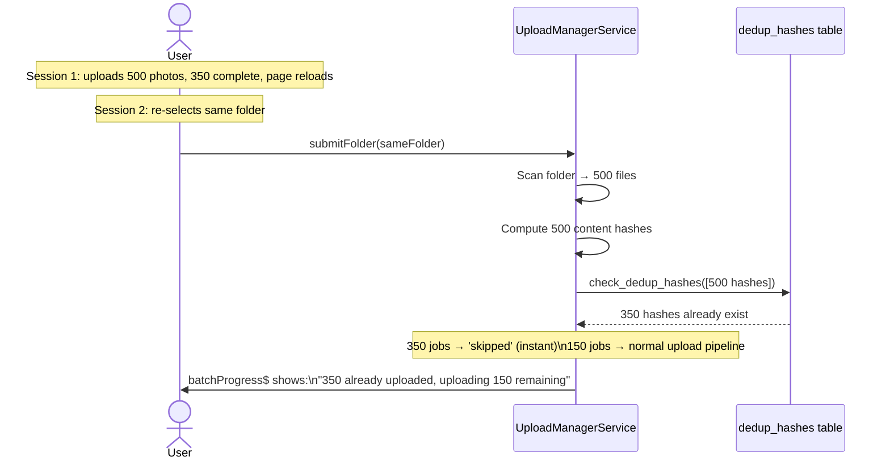
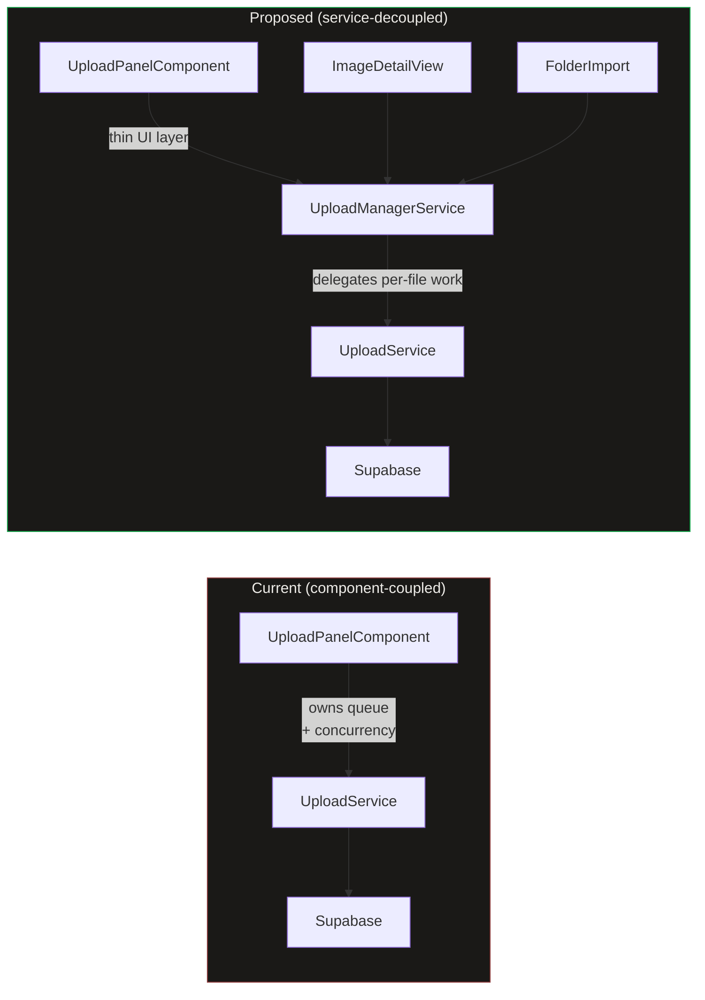

# Upload Manager

## What It Is

A **singleton, application-wide service** that owns the entire upload pipeline: validation, EXIF parsing, storage upload, database insert, and address resolution. Any component in the app can submit files to the Upload Manager and immediately navigate away — uploads continue in the background until the browser tab is closed or the network is lost.

Today, queue management and concurrency live inside `UploadPanelComponent`. When the component is destroyed (e.g., user navigates from image detail view back to map), in-flight uploads are lost. The Upload Manager extracts that responsibility into a long-lived service layer so uploads survive component lifecycle.

## Why It Exists

| Problem                                  | Solution                                                |
| ---------------------------------------- | ------------------------------------------------------- |
| Upload state lives in a component        | Move queue + concurrency to a root-provided service     |
| Navigating away kills active uploads     | Service persists for the app's lifetime                 |
| Multiple entry points (panel, detail, …) | Single `submit()` method callable from anywhere         |
| No global progress visibility            | Service exposes signal-based state; any UI can read it  |
| Address resolution is fire-and-forget    | Manager tracks it as an explicit async phase per upload |

## Architecture Overview



## Where It Lives

- **Service**: `UploadManagerService` at `core/upload-manager.service.ts`
- **Scope**: `providedIn: 'root'` — singleton, survives routing
- **Consumers**: Any component or service that needs to trigger or observe uploads

## Interface Contract

```typescript
@Injectable({ providedIn: "root" })
export class UploadManagerService {
  /** All jobs (active + completed + failed). Read-only signal for UI binding. */
  readonly jobs: Signal<ReadonlyArray<UploadJob>>;

  /** Active + pending jobs only. Convenience computed signal. */
  readonly activeJobs: Signal<ReadonlyArray<UploadJob>>;

  /** True when at least one job is in a non-terminal state. */
  readonly isBusy: Signal<boolean>;

  /** Count of jobs in 'uploading' or 'processing' phase. */
  readonly activeCount: Signal<number>;

  /**
   * Submit one or more files for upload. Returns immediately.
   * Each file becomes an UploadJob tracked in `jobs`.
   *
   * @param files     Files to upload.
   * @param options   Per-submission options (manual coords, project, etc.).
   * @returns         The batch ID for tracking aggregate progress.
   */
  submit(files: File[], options?: SubmitOptions): string;

  /**
   * Submit an entire folder for upload via the File System Access API.
   * Recursively scans the directory for supported image types,
   * creates a batch, and feeds files into the pipeline.
   *
   * @param dirHandle  The FileSystemDirectoryHandle from showDirectoryPicker().
   * @param options    Per-submission options (project, etc.).
   * @returns          The batch ID for tracking aggregate progress.
   */
  submitFolder(
    dirHandle: FileSystemDirectoryHandle,
    options?: SubmitOptions,
  ): Promise<string>;

  /** Retry a failed job from the beginning. */
  retryJob(jobId: string): void;

  /** Remove a terminal job (complete / error) from the list. */
  dismissJob(jobId: string): void;

  /** Remove all terminal jobs from the list. */
  dismissAllCompleted(): void;

  /** Cancel a pending or active job. Cleans up partial storage if needed. */
  cancelJob(jobId: string): void;

  /** Cancel all jobs in a batch. */
  cancelBatch(batchId: string): void;

  // ── Batch progress signals ──

  /** All active and recent batches. */
  readonly batches: Signal<ReadonlyArray<UploadBatch>>;

  /** The currently active batch (if any). Convenience for single-batch UIs. */
  readonly activeBatch: Signal<UploadBatch | null>;
}
```

### Types

```typescript
interface SubmitOptions {
  /** Project to assign the uploaded images to. */
  projectId?: string;
  /** Label for the batch (e.g., folder name). Auto-generated if omitted. */
  batchLabel?: string;
}

type UploadPhase =
  | "queued" // Waiting for a concurrency slot
  | "validating" // Client-side file checks
  | "parsing_exif" // Reading EXIF GPS + timestamp
  | "hashing" // Computing dedup hash
  | "dedup_check" // Checking hash against server
  | "skipped" // Duplicate detected — already uploaded
  | "extracting_title" // Parsing filename for address hint
  | "uploading" // Sending bytes to Supabase Storage
  | "saving_record" // Inserting the images row
  | "resolving_address" // Reverse geocoding: GPS → address (non-blocking)
  | "resolving_coordinates" // Forward geocoding: address → GPS (non-blocking)
  | "missing_data" // No GPS + no address → handed to MissingDataManager
  | "complete" // All phases done
  | "error"; // A critical phase failed

interface UploadJob {
  /** Stable unique ID for tracking. */
  id: string;
  /** Batch this job belongs to. */
  batchId: string;
  /** Original file reference. */
  file: File;
  /** Current pipeline phase. */
  phase: UploadPhase;
  /** Upload progress 0–100 (meaningful during 'uploading' phase). */
  progress: number;
  /** Human-readable status label for the UI. */
  statusLabel: string;
  /** Error message when phase === 'error'. */
  error?: string;
  /** Which phase failed (for retry logic). */
  failedAt?: UploadPhase;
  /** Resolved coordinates (EXIF or forward-geocoded). */
  coords?: ExifCoords;
  /** Address extracted from filename (before geocoding). */
  titleAddress?: string;
  /** Camera direction from EXIF (degrees). */
  direction?: number;
  /** UUID of the inserted images row (set after 'saving_record'). */
  imageId?: string;
  /** Supabase storage path (set after 'uploading'). */
  storagePath?: string;
  /** Object URL for thumbnail preview. */
  thumbnailUrl?: string;
  /** Timestamp of submission. */
  submittedAt: Date;
  /** Dedup content hash (set after 'hashing' phase). */
  contentHash?: string;
  /** If phase === 'skipped', the existing image ID that matched. */
  existingImageId?: string;
}

/** Tracks aggregate progress for a multi-file submission. */
interface UploadBatch {
  /** Unique batch ID returned by submit() / submitFolder(). */
  id: string;
  /** Human-readable label (folder name or "12 files"). */
  label: string;
  /** Total number of files in this batch. */
  totalFiles: number;
  /** Files that reached 'complete'. */
  completedFiles: number;
  /** Files that reached 'skipped' (duplicate). */
  skippedFiles: number;
  /** Files that reached 'error'. */
  failedFiles: number;
  /** Aggregate progress 0–100 across all files in the batch. */
  overallProgress: number;
  /** Batch-level status. */
  status: "scanning" | "uploading" | "complete" | "cancelled";
  /** Timestamp when the batch was created. */
  startedAt: Date;
  /** Timestamp when the last file finished (complete, skipped, or error). */
  finishedAt?: Date;
}
```

## Pipeline Phases

Each upload job progresses through a deterministic pipeline. The path depends on what data the file carries:

- **Path A (GPS found)**: upload → save → reverse-geocode address (enrichment).
- **Path B (no GPS, address in title)**: upload → save with address → forward-geocode coordinates (enrichment).
- **Path C (no GPS, no address)**: hand to MissingDataManager (not yet implemented).

Phases 1–5 are **critical** (failure = hard stop). Phases 6–7 are **enrichment** (failure = silent fallback).



### Phase Detail

| #   | Phase                   | Critical? | Blocks UI? | Failure Behaviour                                                        |
| --- | ----------------------- | --------- | ---------- | ------------------------------------------------------------------------ |
| 1   | `queued`                | —         | No         | Waits for a concurrency slot (max 3 parallel)                            |
| 2   | `validating`            | Yes       | Instant    | Rejects immediately with reason (size, MIME type)                        |
| 3   | `parsing_exif`          | Yes       | Brief      | No GPS → continue to hashing; parse error → treat as no-EXIF             |
| 3a  | `hashing`               | Yes       | Brief      | Computes content hash from file bytes + EXIF GPS + title + direction     |
| 3b  | `dedup_check`           | Yes       | Brief      | Queries server for existing hash; match → `skipped`; no match → continue |
| 3c  | `skipped`               | —         | No         | Duplicate detected — file is not uploaded. Job is terminal.              |
| 4   | `extracting_title`      | Yes       | Brief      | Address found → continue; no address → `missing_data`                    |
| 5   | `uploading`             | Yes       | Yes        | Hard stop, error shown, job can be retried                               |
| 6   | `saving_record`         | Yes       | Yes        | Hard stop, attempt to delete orphaned storage file                       |
| 7a  | `resolving_address`     | No        | No         | Path A: reverse geocode. Silent — address stays null                     |
| 7b  | `resolving_coordinates` | No        | No         | Path B: forward geocode. Silent — coords stay null                       |
| —   | `missing_data`          | No        | No         | Parked. Handed to MissingDataManager (not yet implemented)               |

## Concurrency Model



- **Maximum parallel uploads**: 3 (matches `architecture.md §5`).
- **Queue is FIFO**: first submitted, first processed.
- When a job completes (success or error), the next queued job is started.
- `missing_data` jobs do **not** consume a concurrency slot — they are parked until the MissingDataManager resolves them.

## Lifecycle & Navigation Resilience



**Key invariant**: The Upload Manager is `providedIn: 'root'`. It is instantiated once by the Angular injector and lives for the entire app session. Component destruction has zero effect on active uploads.

### What Stops Uploads

| Event               | Effect                                                                                    |
| ------------------- | ----------------------------------------------------------------------------------------- |
| Page reload / close | All in-flight uploads are lost (browser constraint)                                       |
| Network loss        | Current upload fails → `error` phase; user can retry when reconnected                     |
| User cancels job    | If storage upload started, attempt to delete partial file; job moves to `error`           |
| Logout              | Manager detects auth change, cancels all active jobs (data belongs to authenticated user) |

## Events

The manager emits domain events so other parts of the app can react without polling. All events are Observables so components can subscribe and unsubscribe cleanly.

### Event Streams

```typescript
// ── Per-job events ──

/** Emitted when a job reaches 'complete' with valid coordinates. */
readonly imageUploaded$: Observable<ImageUploadedEvent>;

/** Emitted when a job enters 'error'. */
readonly uploadFailed$: Observable<UploadFailedEvent>;

/** Emitted when a job enters 'missing_data'. */
readonly missingData$: Observable<MissingDataEvent>;

/** Emitted when a job enters 'skipped' (duplicate detected). */
readonly uploadSkipped$: Observable<UploadSkippedEvent>;

/** Emitted whenever a job's phase changes (any transition). */
readonly jobPhaseChanged$: Observable<JobPhaseChangedEvent>;

// ── Batch-level events ──

/** Emitted whenever a batch's aggregate progress changes (0–100). */
readonly batchProgress$: Observable<BatchProgressEvent>;

/** Emitted when an entire batch completes (all jobs terminal). */
readonly batchComplete$: Observable<BatchCompleteEvent>;
```

### Event Types

```typescript
interface ImageUploadedEvent {
  jobId: string;
  batchId: string;
  imageId: string;
  coords?: ExifCoords;
  direction?: number;
  thumbnailUrl?: string;
}

interface UploadFailedEvent {
  jobId: string;
  batchId: string;
  phase: UploadPhase;
  error: string;
}

interface MissingDataEvent {
  jobId: string;
  batchId: string;
  fileName: string;
  /** The image has no GPS EXIF and no address could be extracted from the filename. */
  reason: "no_gps_no_address";
}

interface UploadSkippedEvent {
  jobId: string;
  batchId: string;
  fileName: string;
  /** The content hash that matched. */
  contentHash: string;
  /** The existing image ID in the database. */
  existingImageId: string;
}

interface JobPhaseChangedEvent {
  jobId: string;
  batchId: string;
  previousPhase: UploadPhase;
  currentPhase: UploadPhase;
  /** The file name for display purposes. */
  fileName: string;
}

interface BatchProgressEvent {
  batchId: string;
  label: string;
  /** Aggregate progress 0–100 across all files in the batch. */
  overallProgress: number;
  /** Percentage of total files that completed successfully (0–100). */
  uploadedPercent: number;
  /** Percentage of total files that were skipped as duplicates (0–100). */
  skippedPercent: number;
  /** Breakdown counts. */
  totalFiles: number;
  completedFiles: number;
  skippedFiles: number;
  failedFiles: number;
  /** Number of files still actively uploading right now. */
  activeFiles: number;
}

interface BatchCompleteEvent {
  batchId: string;
  label: string;
  totalFiles: number;
  completedFiles: number;
  skippedFiles: number;
  failedFiles: number;
  /** Total elapsed time in milliseconds. */
  durationMs: number;
}
```

### Event Flow Diagram



### Event Consumers

| Event              | Consumer               | Reaction                                                                        |
| ------------------ | ---------------------- | ------------------------------------------------------------------------------- |
| `imageUploaded$`   | `MapShellComponent`    | Adds optimistic marker to the map                                               |
| `imageUploaded$`   | `ThumbnailGrid`        | Refreshes grid if the uploaded image belongs to the active group                |
| `uploadFailed$`    | `MapShellComponent`    | Shows toast notification                                                        |
| `uploadSkipped$`   | `UploadPanelComponent` | Shows "Already uploaded" label on the file item                                 |
| `jobPhaseChanged$` | `UploadPanelComponent` | Updates per-file status label and icon                                          |
| `jobPhaseChanged$` | `PhotoMarker`          | Shows/hides PendingRing on markers for files currently in `uploading` phase     |
| `jobPhaseChanged$` | `ThumbnailCard`        | Shows/hides uploading overlay on cards for files currently in `uploading` phase |
| `batchProgress$`   | `UploadPanelComponent` | Updates the batch progress bar (0–100%)                                         |
| `batchProgress$`   | `UploadButtonZone`     | Shows progress ring/badge on the upload button                                  |
| `batchComplete$`   | `UploadPanelComponent` | Shows batch summary (completed, skipped, failed)                                |
| `missingData$`     | `MissingDataManager`   | Queues file for manual placement (future)                                       |

## Folder Upload (Multi-File / Directory Selection)

The Upload Manager supports two entry modes for multi-file uploads:

### Standard Multi-File (all browsers)

The HTML file input with `multiple` attribute lets users select many files at once. Each file becomes a job in a single batch.

```typescript
// In UploadPanelComponent template
<input type="file" multiple accept="image/*" (change)="onFilesSelected($event)">
```

### Folder Selection (Chromium only)

Uses the File System Access API (`showDirectoryPicker()`). The manager recursively scans the directory, filters to supported image types, and submits all found files as a single batch.

```typescript
// In UploadPanelComponent
async selectFolder(): Promise<void> {
  const dirHandle = await window.showDirectoryPicker({ mode: 'read' });
  const batchId = await this.uploadManager.submitFolder(dirHandle);
}
```

The `submitFolder()` method:

1. Sets batch status to `'scanning'` and emits `batchProgress$` with `totalFiles: 0`.
2. Recursively walks the directory, incrementing `totalFiles` as images are found.
3. Once the scan completes, sets batch status to `'uploading'` and begins the pipeline for each file.
4. The folder name becomes the batch label (e.g., `"Burgstraße_7 — 142 images"`).

Browser support detection:

```typescript
readonly isFolderImportSupported = typeof window !== 'undefined' && 'showDirectoryPicker' in window;
```

If unsupported, the "Select folder" option shows: _"Folder import requires Chrome or Edge."_

### Folder Upload Flow



## Deduplication (Resume-Safe Uploads)

When uploading hundreds or thousands of photos (especially re-selecting a folder after an interrupted session), the manager must detect and skip files that were already uploaded. This prevents duplicate entries and wasted bandwidth.

### Content Hash

Before uploading, the manager computes a **content hash** for each file. The hash is derived from stable, content-intrinsic properties that uniquely identify a photo regardless of filename changes or re-exports:

```typescript
interface ContentHashInput {
  /** First 64 KB of raw file bytes (fast, avoids reading entire file). */
  fileHeadBytes: ArrayBuffer;
  /** File size in bytes (cheap discriminator). */
  fileSize: number;
  /** EXIF GPS coordinates if available (latitude, longitude). */
  gpsCoords?: { lat: number; lng: number };
  /** EXIF capture timestamp if available. */
  capturedAt?: string;
  /** Camera bearing / direction from EXIF (degrees). */
  direction?: number;
}
```

The hash is computed as:

```typescript
async function computeContentHash(input: ContentHashInput): Promise<string> {
  const encoder = new TextEncoder();
  const parts = [
    new Uint8Array(input.fileHeadBytes),
    encoder.encode(`|size=${input.fileSize}`),
    encoder.encode(
      `|gps=${input.gpsCoords?.lat ?? ""},${input.gpsCoords?.lng ?? ""}`,
    ),
    encoder.encode(`|date=${input.capturedAt ?? ""}`),
    encoder.encode(`|dir=${input.direction ?? ""}`),
  ];
  const combined = concatArrayBuffers(parts);
  const hashBuffer = await crypto.subtle.digest("SHA-256", combined);
  return Array.from(new Uint8Array(hashBuffer))
    .map((b) => b.toString(16).padStart(2, "0"))
    .join("");
}
```

**Why these fields:**

- `fileHeadBytes` (first 64 KB): captures JPEG header, EXIF block, and the start of image data. Two genuinely different photos will almost certainly differ here.
- `fileSize`: cheap first-pass discriminator. Different images rarely share exact file sizes.
- `gpsCoords`: two photos of the same subject from different locations should be distinct.
- `capturedAt`: same location, different time → different photo.
- `direction`: same location, same time, different angle → different photo.

**Why NOT full file hash:** Reading an entire 20 MB file into memory just for hashing is slow and memory-intensive when processing 1000+ files. The 64 KB head + metadata combination provides high collision resistance while staying fast.

### Server-Side Hash Storage

Hashes are stored in a `dedup_hashes` table in Supabase:

```sql
CREATE TABLE dedup_hashes (
  id          uuid PRIMARY KEY DEFAULT gen_random_uuid(),
  user_id     uuid NOT NULL REFERENCES auth.users(id),
  image_id    uuid NOT NULL REFERENCES images(id) ON DELETE CASCADE,
  content_hash text NOT NULL,
  created_at  timestamptz NOT NULL DEFAULT now(),
  UNIQUE(user_id, content_hash)
);

-- RLS: users can only see/insert their own hashes
ALTER TABLE dedup_hashes ENABLE ROW LEVEL SECURITY;
CREATE POLICY "Users manage own hashes"
  ON dedup_hashes FOR ALL
  USING (auth.uid() = user_id)
  WITH CHECK (auth.uid() = user_id);
```

### Dedup Check Flow



### Batch Dedup Optimization

For large folder uploads (100+ files), individual hash lookups would be slow. Instead, the manager batches hash checks:

1. Compute hashes for all files in the batch (parallel, up to 10 concurrent hash computations).
2. Send hashes in a single RPC call: `supabase.rpc('check_dedup_hashes', { hashes: string[] })`.
3. The RPC returns the set of hashes that already exist, along with their `image_id`.
4. Jobs for matching hashes immediately transition to `skipped`.
5. Remaining jobs enter the normal pipeline.

```sql
-- Batch dedup check function
CREATE OR REPLACE FUNCTION check_dedup_hashes(hashes text[])
RETURNS TABLE(content_hash text, image_id uuid)
LANGUAGE sql STABLE SECURITY DEFINER
AS $$
  SELECT dh.content_hash, dh.image_id
  FROM dedup_hashes dh
  WHERE dh.user_id = auth.uid()
    AND dh.content_hash = ANY(hashes);
$$;
```

### Resume Scenario



## Relationship to Existing Code



- **`UploadService`** keeps its current responsibilities (validation, EXIF, storage, DB insert, geocode). No changes needed.
- **`UploadManagerService`** is a new service wrapping `UploadService` with queue management, concurrency, and state signals.
- **`UploadPanelComponent`** becomes a thin UI that calls `uploadManager.submit()` and reads `uploadManager.jobs()` — it no longer manages its own queue.

## Data

| Field          | Source                                  | Type                          |
| -------------- | --------------------------------------- | ----------------------------- |
| Jobs           | `UploadManagerService.jobs()`           | `Signal<UploadJob[]>`         |
| Active count   | `UploadManagerService.activeCount()`    | `Signal<number>`              |
| Is busy        | `UploadManagerService.isBusy()`         | `Signal<boolean>`             |
| Batches        | `UploadManagerService.batches()`        | `Signal<UploadBatch[]>`       |
| Active batch   | `UploadManagerService.activeBatch()`    | `Signal<UploadBatch \| null>` |
| Per-job events | `UploadManagerService.jobPhaseChanged$` | `Observable<...>`             |
| Batch events   | `UploadManagerService.batchProgress$`   | `Observable<...>`             |
| Skip events    | `UploadManagerService.uploadSkipped$`   | `Observable<...>`             |

## State

| Name          | Type                            | Default | Controls                                         |
| ------------- | ------------------------------- | ------- | ------------------------------------------------ |
| `jobs`        | `WritableSignal<UploadJob[]>`   | `[]`    | Full upload queue + history                      |
| `activeJobs`  | `Signal<UploadJob[]>`           | `[]`    | Computed: non-terminal jobs                      |
| `isBusy`      | `Signal<boolean>`               | `false` | Computed: any non-terminal job exists            |
| `activeCount` | `Signal<number>`                | `0`     | Computed: jobs in uploading/saving/resolving     |
| `batches`     | `WritableSignal<UploadBatch[]>` | `[]`    | All batches (active + completed)                 |
| `activeBatch` | `Signal<UploadBatch \| null>`   | `null`  | Computed: first batch with status !== 'complete' |

## File Map

| File                                                     | Purpose                                                   |
| -------------------------------------------------------- | --------------------------------------------------------- |
| `core/upload-manager.service.ts`                         | Queue management, concurrency, pipeline orchestration     |
| `core/upload-manager.service.spec.ts`                    | Unit tests                                                |
| `core/content-hash.util.ts`                              | `computeContentHash()` — SHA-256 from file head + EXIF    |
| `core/content-hash.util.spec.ts`                         | Unit tests for hashing                                    |
| `core/upload.service.ts`                                 | Existing — per-file logic (validation, EXIF, storage, DB) |
| `core/geocoding.service.ts`                              | Existing — reverse geocoding                              |
| `features/upload/upload-panel/upload-panel.component.ts` | Refactor — delegate to UploadManagerService               |

## Wiring

- `UploadManagerService` is `providedIn: 'root'` — no module import needed
- Inject into `UploadPanelComponent` (replace internal queue logic)
- Inject into `ImageDetailView` (or any future upload entry point)
- Subscribe to `imageUploaded$` in `MapShellComponent` to add markers
- Subscribe to `uploadFailed$` for toast notifications
- Subscribe to `batchProgress$` in `UploadButtonZone` to show progress badge on the upload button
- Subscribe to `jobPhaseChanged$` in `PhotoMarker` (via MapShell) to show/hide PendingRing
- Subscribe to `jobPhaseChanged$` in `ThumbnailCard` to show uploading overlay
- Subscribe to `uploadSkipped$` in `UploadPanelComponent` to show "Already uploaded" status
- `dedup_hashes` table must exist in Supabase with RLS enabled (see Deduplication section)

## Acceptance Criteria

- [x] Uploads continue when the originating component is destroyed (navigate away)
- [x] Maximum 3 concurrent uploads enforced globally across all entry points
- [x] FIFO queue: first file submitted is first to upload
- [x] `missing_data` jobs do not consume concurrency slots
- [x] Job state is reactive (Angular signals) — any component can bind to `jobs()`
- [x] `imageUploaded$` fires with coords + imageId when a job completes
- [x] `uploadFailed$` fires when a critical phase fails
- [x] Failed jobs can be retried via `retryJob()`
- [x] Completed/failed jobs can be dismissed individually or in bulk
- [x] **Path A**: GPS in EXIF → upload → save → reverse-geocode address (non-blocking)
- [x] **Path B**: No GPS + address in title → upload → save with address → forward-geocode coords (non-blocking)
- [x] **Path C**: No GPS + no address → job enters `missing_data`, emits `missingData$` for MissingDataManager
- [x] Address resolution and coordinate resolution are enrichment — failure is silent
- [x] Orphaned storage files are cleaned up when DB insert fails
- [x] Auth change (logout) cancels all active jobs
- [ ] Global progress indicator visible from any page when uploads are active
- [x] `beforeunload` warning shown when `isBusy()` is true

### Multi-File & Folder Upload

- [x] `submit()` accepts multiple files and groups them into a single batch
- [x] `submitFolder()` accepts a `FileSystemDirectoryHandle` and recursively scans for images
- [x] Folder scan shows live counter ("Scanning… 142 images found")
- [x] Folder import button hidden on unsupported browsers (Firefox, Safari)
- [x] Each batch has a unique ID, label, and aggregate progress (0–100%)
- [x] `batchProgress$` emits on every job state change with updated counts
- [x] `batchComplete$` emits when all jobs in a batch reach a terminal state
- [x] `cancelBatch()` cancels all non-terminal jobs in a batch

### Deduplication (Resume-Safe)

- [x] Content hash computed from first 64 KB + file size + GPS + captured_at + direction
- [x] Hash uses `crypto.subtle.digest('SHA-256')` (Web Crypto API, no dependencies)
- [x] `dedup_hashes` table exists in Supabase with `UNIQUE(user_id, content_hash)` constraint
- [x] RLS on `dedup_hashes` restricts access to the owning user
- [x] Single-file uploads check hash individually before uploading
- [x] Batch uploads use `check_dedup_hashes()` RPC for a single round-trip
- [x] Duplicate files transition to `skipped` phase, never uploaded
- [x] `uploadSkipped$` emits with the existing `imageId` for each skipped file
- [x] After successful upload, hash is inserted into `dedup_hashes`
- [x] Re-selecting the same folder after interruption skips already-uploaded files

### Event Handlers

- [x] `jobPhaseChanged$` emits on every phase transition for every job
- [x] `uploadSkipped$` emits when a duplicate is detected
- [x] `batchProgress$` emits aggregate progress (0–100%) for the batch
- [x] `batchComplete$` emits when a batch finishes with summary counts
- [ ] UI consumers (`UploadPanel`, `UploadButtonZone`, `PhotoMarker`, `ThumbnailCard`) can subscribe to relevant events
