# Upload Manager

## What It Is

A **singleton, application-wide service** that owns the entire upload pipeline: validation, EXIF parsing, storage upload, database insert, and address resolution. Any component in the app can submit files to the Upload Manager and immediately navigate away — uploads continue in the background until the browser tab is closed or the network is lost.

Today, queue management and concurrency live inside `UploadPanelComponent`. When the component is destroyed (e.g., user navigates from image detail view back to map), in-flight uploads are lost. The Upload Manager extracts that responsibility into a long-lived service layer so uploads survive component lifecycle.

## Why It Exists

| Problem                                  | Solution                                                |
| ---------------------------------------- | ------------------------------------------------------- |
| Upload state lives in a component        | Move queue + concurrency to a root-provided service     |
| Navigating away kills active uploads     | Service persists for the app's lifetime                 |
| Multiple entry points (panel, detail, …) | Single `submit()` method callable from anywhere         |
| No global progress visibility            | Service exposes signal-based state; any UI can read it  |
| Address resolution is fire-and-forget    | Manager tracks it as an explicit async phase per upload |

## Architecture Overview

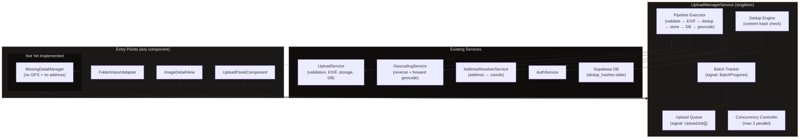

## Where It Lives

- **Service**: `UploadManagerService` at `core/upload-manager.service.ts`
- **Scope**: `providedIn: 'root'` — singleton, survives routing
- **Consumers**: Any component or service that needs to trigger or observe uploads

## Interface Contract

```typescript
@Injectable({ providedIn: "root" })
export class UploadManagerService {
  /** All jobs (active + completed + failed). Read-only signal for UI binding. */
  readonly jobs: Signal<ReadonlyArray<UploadJob>>;

  /** Active + pending jobs only. Convenience computed signal. */
  readonly activeJobs: Signal<ReadonlyArray<UploadJob>>;

  /** True when at least one job is in a non-terminal state. */
  readonly isBusy: Signal<boolean>;

  /** Count of jobs in 'uploading' or 'processing' phase. */
  readonly activeCount: Signal<number>;

  /**
   * Submit one or more files for upload. Returns immediately.
   * Each file becomes an UploadJob tracked in `jobs`.
   *
   * @param files     Files to upload.
   * @param options   Per-submission options (manual coords, project, etc.).
   * @returns         The batch ID for tracking aggregate progress.
   */
  submit(files: File[], options?: SubmitOptions): string;

  /**
   * Submit an entire folder for upload via the File System Access API.
   * Recursively scans the directory for supported image types,
   * creates a batch, and feeds files into the pipeline.
   *
   * @param dirHandle  The FileSystemDirectoryHandle from showDirectoryPicker().
   * @param options    Per-submission options (project, etc.).
   * @returns          The batch ID for tracking aggregate progress.
   */
  submitFolder(
    dirHandle: FileSystemDirectoryHandle,
    options?: SubmitOptions,
  ): Promise<string>;

  /** Retry a failed job from the beginning. */
  retryJob(jobId: string): void;

  /** Remove a terminal job (complete / error) from the list. */
  dismissJob(jobId: string): void;

  /** Remove all terminal jobs from the list. */
  dismissAllCompleted(): void;

  /** Cancel a pending or active job. Cleans up partial storage if needed. */
  cancelJob(jobId: string): void;

  /** Cancel all jobs in a batch. */
  cancelBatch(batchId: string): void;

  /**
   * Resolve a location conflict for a paused job.
   * Called when the user responds to the conflict popup.
   *
   * @param jobId       The job in 'awaiting_conflict_resolution' phase.
   * @param resolution  The user's choice: attach (replace or keep location), or create new.
   */
  resolveConflict(jobId: string, resolution: ConflictResolution): void;

  /**
   * Replace the photo file for an existing image row.
   * Validates, optionally dedup-checks, uploads the new file to storage,
   * updates the existing `images` row (storage_path, clears thumbnail_path),
   * cleans up the old file, and emits `imageReplaced$` on success.
   *
   * The job progresses through a dedicated replace pipeline:
   * validating → hashing → dedup_check → uploading → replacing_record → complete.
   *
   * @param imageId  The existing image UUID whose file is being replaced.
   * @param file     The new photo file.
   * @returns        The job ID for tracking progress.
   */
  replaceFile(imageId: string, file: File): string;

  /**
   * Upload a photo to an existing image row that has no file (photoless datapoint).
   * Same pipeline as `replaceFile()` except: there is no old file to clean up,
   * EXIF metadata is written to the row, and emits `imageAttached$` on success.
   *
   * @param imageId  The existing photoless image UUID.
   * @param file     The photo file to attach.
   * @returns        The job ID for tracking progress.
   */
  attachFile(imageId: string, file: File): string;

  // ── Batch progress signals ──

  /** All active and recent batches. */
  readonly batches: Signal<ReadonlyArray<UploadBatch>>;

  /** The currently active batch (if any). Convenience for single-batch UIs. */
  readonly activeBatch: Signal<UploadBatch | null>;
}
```

### Types

```typescript
interface SubmitOptions {
  /** Project to assign the uploaded images to. */
  projectId?: string;
  /** Label for the batch (e.g., folder name). Auto-generated if omitted. */
  batchLabel?: string;
}

type UploadPhase =
  | "queued" // Waiting for a concurrency slot
  | "validating" // Client-side file checks
  | "parsing_exif" // Reading EXIF GPS + timestamp
  | "hashing" // Computing dedup hash
  | "dedup_check" // Checking hash against server
  | "skipped" // Duplicate detected — already uploaded
  | "extracting_title" // Parsing filename for address hint
  | "conflict_check" // Checking for existing photoless rows at same location
  | "awaiting_conflict_resolution" // Matching row found — waiting for user decision
  | "uploading" // Sending bytes to Supabase Storage
  | "saving_record" // Inserting the images row (new upload)
  | "replacing_record" // Updating the existing images row (replace / attach)
  | "resolving_address" // Reverse geocoding: GPS → address (non-blocking)
  | "resolving_coordinates" // Forward geocoding: address → GPS (non-blocking)
  | "missing_data" // No GPS + no address → handed to MissingDataManager
  | "complete" // All phases done
  | "error"; // A critical phase failed

type UploadJobMode =
  | "new" // Standard upload — creates a new images row
  | "replace" // Replace file on an existing row (initiated by replaceFile())
  | "attach"; // Attach file to a photoless row (initiated by attachFile())

interface UploadJob {
  /** Stable unique ID for tracking. */
  id: string;
  /** Batch this job belongs to. */
  batchId: string;
  /** Original file reference. */
  file: File;
  /** Current pipeline phase. */
  phase: UploadPhase;
  /** Upload progress 0–100 (meaningful during 'uploading' phase). */
  progress: number;
  /** Human-readable status label for the UI. */
  statusLabel: string;
  /** Error message when phase === 'error'. */
  error?: string;
  /** Which phase failed (for retry logic). */
  failedAt?: UploadPhase;
  /** Resolved coordinates (EXIF or forward-geocoded). */
  coords?: ExifCoords;
  /** Address extracted from filename (before geocoding). */
  titleAddress?: string;
  /** Camera direction from EXIF (degrees). */
  direction?: number;
  /** UUID of the inserted/updated images row (set after 'saving_record' or 'replacing_record'). */
  imageId?: string;
  /** Supabase storage path (set after 'uploading'). */
  storagePath?: string;
  /** Object URL for thumbnail preview. */
  thumbnailUrl?: string;
  /** Timestamp of submission. */
  submittedAt: Date;
  /** Dedup content hash (set after 'hashing' phase). */
  contentHash?: string;
  /** If conflict detected, the existing photoless row that matched. */
  conflictCandidate?: ConflictCandidate;
  /** User's resolution when a conflict was detected. */
  conflictResolution?: ConflictResolution;
  /** If phase === 'skipped', the existing image ID that matched. */
  existingImageId?: string;

  // ── Replace / Attach mode fields ──

  /** Pipeline mode. Determines the pipeline path the job follows. */
  mode: UploadJobMode;
  /** For 'replace' and 'attach' modes: the existing image row ID to update. */
  targetImageId?: string;
  /** For 'replace' mode: the old storage_path to delete after DB update succeeds. */
  oldStoragePath?: string;
  /** For 'replace' mode: the old thumbnail_path to delete after DB update succeeds. */
  oldThumbnailPath?: string;
}

/** Tracks aggregate progress for a multi-file submission. */
interface UploadBatch {
  /** Unique batch ID returned by submit() / submitFolder(). */
  id: string;
  /** Human-readable label (folder name or "12 files"). */
  label: string;
  /** Total number of files in this batch. */
  totalFiles: number;
  /** Files that reached 'complete'. */
  completedFiles: number;
  /** Files that reached 'skipped' (duplicate). */
  skippedFiles: number;
  /** Files that reached 'error'. */
  failedFiles: number;
  /** Aggregate progress 0–100 across all files in the batch. */
  overallProgress: number;
  /** Batch-level status. */
  status: "scanning" | "uploading" | "complete" | "cancelled";
  /** Timestamp when the batch was created. */
  startedAt: Date;
  /** Timestamp when the last file finished (complete, skipped, or error). */
  finishedAt?: Date;
}

/** An existing images row (no photo) that conflicts with an incoming upload's location. */
interface ConflictCandidate {
  /** UUID of the existing images row. */
  imageId: string;
  /** The existing row's address label (may be null). */
  addressLabel?: string;
  /** The existing row's latitude (may be null). */
  latitude?: number;
  /** The existing row's longitude (may be null). */
  longitude?: number;
  /** Distance in meters between the existing row and the upload's coordinates (null if matched by address only). */
  distanceMeters?: number;
}

/**
 * How the user wants to resolve a location conflict.
 * - `attach_replace`: attach photo to existing row, overwrite location with EXIF/upload data.
 * - `attach_keep`: attach photo to existing row, keep the row's current location data.
 * - `create_new`: ignore the match, create a brand-new images row (normal flow).
 */
type ConflictResolution = "attach_replace" | "attach_keep" | "create_new";
```

## Entry Points

### UploadPanelComponent (implemented)

Drag-and-drop or file picker → calls `submit(files)` or `submitFolder(dirHandle)`. The panel is a thin UI layer that reads from `jobs()` and bridges manager events to component outputs.

### ImageDetailView — Replace / Attach Photo

The image detail view delegates all photo file operations to the Upload Manager. Two methods cover the two cases:

#### `replaceFile(imageId, file)` — Existing Image with a Photo

Called when the user clicks the edit overlay on the hero photo to swap in a new file.

1. Manager creates an `UploadJob` with `mode: 'replace'` and `targetImageId: imageId`.
2. The job reads the existing row to capture `oldStoragePath` and `oldThumbnailPath`.
3. Pipeline: `validating → hashing → dedup_check → uploading → replacing_record → complete`.
4. `replacing_record` phase:
   - UPDATE the existing row: `storage_path = newPath`, `thumbnail_path = null`, plus EXIF fields (`exif_latitude`, `exif_longitude`, `captured_at`, `direction`) if present in the new file.
   - On success, delete old original + old thumbnail from storage (best-effort).
   - Update `WorkspaceViewService.rawImages` grid cache: set `storagePath`, clear `thumbnailPath`, `signedThumbnailUrl`, and `thumbnailUnavailable`.
5. On `complete`, emits `imageReplaced$` with the new storage path and a local `ObjectURL` for instant marker thumbnail update.

#### `attachFile(imageId, file)` — Existing Image without a Photo (Photoless Datapoint)

Called when the detail view is showing a photoless datapoint and the user uploads a photo for it.

1. Manager creates an `UploadJob` with `mode: 'attach'` and `targetImageId: imageId`.
2. No old file to clean up (the row has `storage_path IS NULL`).
3. Pipeline: `validating → parsing_exif → hashing → dedup_check → uploading → replacing_record → resolving_address/resolving_coordinates → complete`.
4. `replacing_record` phase:
   - UPDATE the existing row: `storage_path`, `exif_latitude`, `exif_longitude`, `captured_at`, `direction`.
   - If the row already has `latitude`/`longitude` (from manual address entry), those are preserved and the EXIF coordinates are stored only in `exif_*` fields. If the row has NO coords, the EXIF coords are written to both `latitude`/`longitude` and `exif_*` fields.
5. Enrichment phase runs if applicable (reverse-geocode for Path A, forward-geocode for Path B).
6. On `complete`, emits `imageAttached$` with the storage path, coords, and local `ObjectURL`.

#### Replace / Attach Pipeline

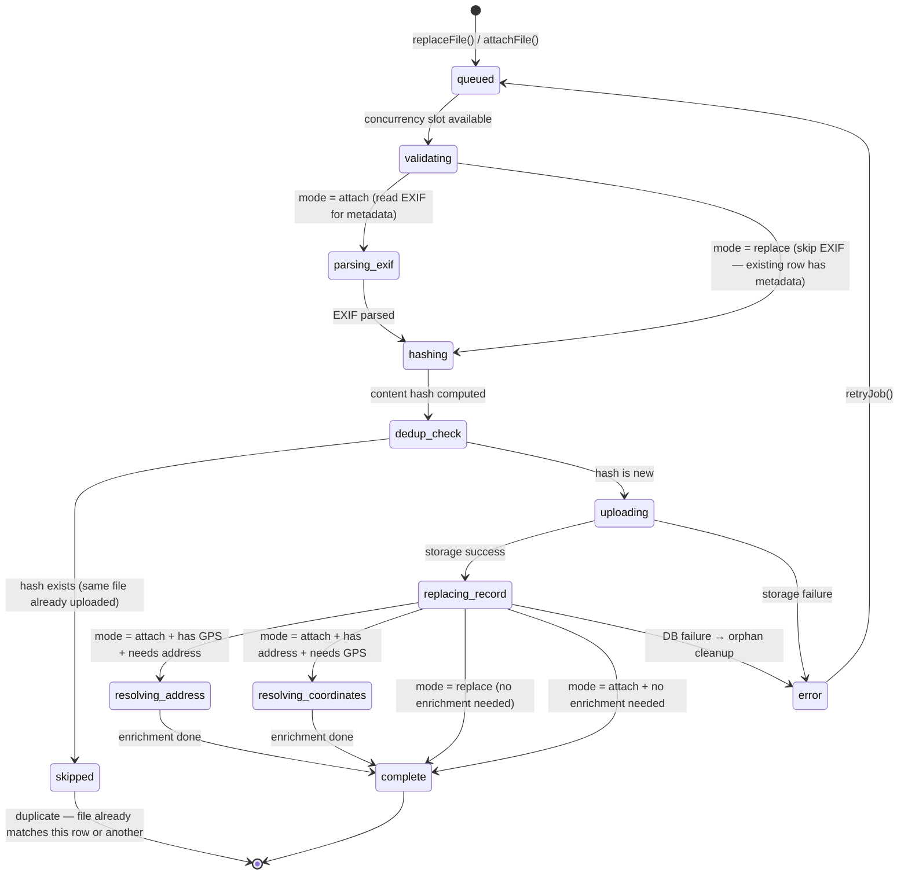

### FolderImportAdapter (not yet implemented)

Will use `submitFolder()` to process a `FileSystemDirectoryHandle` from `showDirectoryPicker()`.

## Pipeline Phases

Each upload job progresses through a deterministic pipeline. The path depends on what data the file carries:

- **Path A (GPS found)**: upload → save → reverse-geocode address (enrichment).
- **Path B (no GPS, address in title)**: upload → save with address → forward-geocode coordinates (enrichment).
- **Path C (no GPS, no address)**: hand to MissingDataManager (not yet implemented).

Phases 1–5 are **critical** (failure = hard stop). Phases 6–7 are **enrichment** (failure = silent fallback).

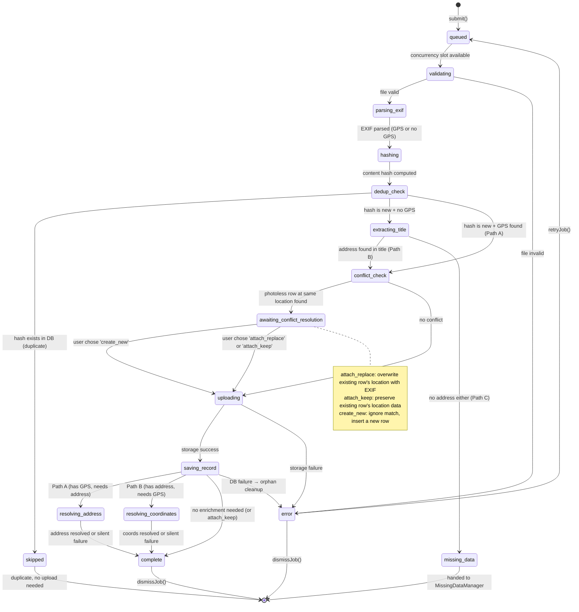

### Phase Detail

| #   | Phase                          | Critical? | Blocks UI? | Failure Behaviour                                                          |
| --- | ------------------------------ | --------- | ---------- | -------------------------------------------------------------------------- |
| 1   | `queued`                       | —         | No         | Waits for a concurrency slot (max 3 parallel)                              |
| 2   | `validating`                   | Yes       | Instant    | Rejects immediately with reason (size, MIME type)                          |
| 3   | `parsing_exif`                 | Yes       | Brief      | No GPS → continue to hashing; parse error → treat as no-EXIF               |
| 3a  | `hashing`                      | Yes       | Brief      | Computes content hash from file bytes + EXIF GPS + title + direction       |
| 3b  | `dedup_check`                  | Yes       | Brief      | Queries server for existing hash; match → `skipped`; no match → continue   |
| 3c  | `skipped`                      | —         | No         | Duplicate detected — file is not uploaded. Job is terminal.                |
| 4   | `extracting_title`             | Yes       | Brief      | Address found → continue; no address → `missing_data`                      |
| 4a  | `conflict_check`               | Yes       | Brief      | Queries photoless rows near the upload's location or matching address      |
| 4b  | `awaiting_conflict_resolution` | —         | **Yes**    | Paused — waiting for user to pick Attach (replace/keep) or Create New      |
| 5   | `uploading`                    | Yes       | Yes        | Hard stop, error shown, job can be retried                                 |
| 6   | `saving_record`                | Yes       | Yes        | Hard stop, attempt to delete orphaned storage file (mode = new)            |
| 6b  | `replacing_record`             | Yes       | Yes        | Hard stop, attempt to delete orphaned storage file (mode = replace/attach) |
| 7a  | `resolving_address`            | No        | No         | Path A: reverse geocode. Silent — address stays null                       |
| 7b  | `resolving_coordinates`        | No        | No         | Path B: forward geocode. Silent — coords stay null                         |
| —   | `missing_data`                 | No        | No         | Parked. Handed to MissingDataManager (not yet implemented)                 |

## Concurrency Model

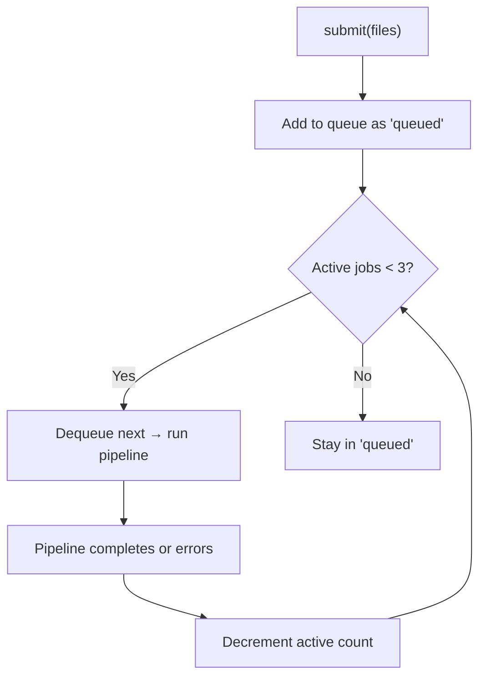

- **Maximum parallel uploads**: 3 (matches `architecture.md §5`).
- **Queue is FIFO**: first submitted, first processed.
- When a job completes (success or error), the next queued job is started.
- `missing_data` jobs do **not** consume a concurrency slot — they are parked until the MissingDataManager resolves them.

## Lifecycle & Navigation Resilience

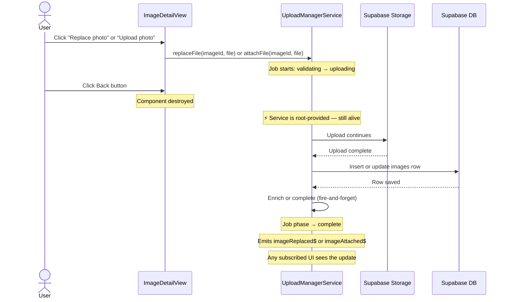

**Key invariant**: The Upload Manager is `providedIn: 'root'`. It is instantiated once by the Angular injector and lives for the entire app session. Component destruction has zero effect on active uploads.

### What Stops Uploads

| Event               | Effect                                                                                    |
| ------------------- | ----------------------------------------------------------------------------------------- |
| Page reload / close | All in-flight uploads are lost (browser constraint)                                       |
| Network loss        | Current upload fails → `error` phase; user can retry when reconnected                     |
| User cancels job    | If storage upload started, attempt to delete partial file; job moves to `error`           |
| Logout              | Manager detects auth change, cancels all active jobs (data belongs to authenticated user) |

## Events

The manager emits domain events so other parts of the app can react without polling. All events are Observables so components can subscribe and unsubscribe cleanly.

### Event Streams

```typescript
// ── Per-job events ──

/** Emitted when a job reaches 'complete' with valid coordinates. */
readonly imageUploaded$: Observable<ImageUploadedEvent>;

/** Emitted when a job enters 'error'. */
readonly uploadFailed$: Observable<UploadFailedEvent>;

/** Emitted when a job enters 'missing_data'. */
readonly missingData$: Observable<MissingDataEvent>;

/** Emitted when a job enters 'skipped' (duplicate detected). */
readonly uploadSkipped$: Observable<UploadSkippedEvent>;

/** Emitted when a job enters 'awaiting_conflict_resolution' (photoless row at same location). */
readonly locationConflict$: Observable<LocationConflictEvent>;

/** Emitted when a replaceFile() job completes — photo replaced on an existing row. */
readonly imageReplaced$: Observable<ImageReplacedEvent>;

/** Emitted when an attachFile() job completes — photo uploaded to a photoless row. */
readonly imageAttached$: Observable<ImageAttachedEvent>;

/** Emitted whenever a job's phase changes (any transition). */
readonly jobPhaseChanged$: Observable<JobPhaseChangedEvent>;

// ── Batch-level events ──

/** Emitted whenever a batch's aggregate progress changes (0–100). */
readonly batchProgress$: Observable<BatchProgressEvent>;

/** Emitted when an entire batch completes (all jobs terminal). */
readonly batchComplete$: Observable<BatchCompleteEvent>;
```

### Event Types

```typescript
interface ImageUploadedEvent {
  jobId: string;
  batchId: string;
  imageId: string;
  coords?: ExifCoords;
  direction?: number;
  thumbnailUrl?: string;
}

interface UploadFailedEvent {
  jobId: string;
  batchId: string;
  phase: UploadPhase;
  error: string;
}

interface MissingDataEvent {
  jobId: string;
  batchId: string;
  fileName: string;
  /** The image has no GPS EXIF and no address could be extracted from the filename. */
  reason: "no_gps_no_address";
}

interface UploadSkippedEvent {
  jobId: string;
  batchId: string;
  fileName: string;
  /** The content hash that matched. */
  contentHash: string;
  /** The existing image ID in the database. */
  existingImageId: string;
}

interface LocationConflictEvent {
  jobId: string;
  batchId: string;
  fileName: string;
  /** The existing photoless row that matched the upload's location. */
  candidate: ConflictCandidate;
  /** The upload's coordinates from EXIF (if any). */
  uploadCoords?: ExifCoords;
  /** The upload's address extracted from filename (if any). */
  uploadAddress?: string;
}

interface ImageReplacedEvent {
  jobId: string;
  /** The existing image row that was updated. */
  imageId: string;
  /** New storage path in Supabase Storage. */
  newStoragePath: string;
  /**
   * Local ObjectURL for instant thumbnail update across all surfaces.
   * Blob URLs load in ~0ms, bypassing the placeholder/pulse cycle.
   * Consumers set this as the image src immediately, then replace with
   * a signed URL on the next batch sign or viewport query.
   * Must be revoked via URL.revokeObjectURL() after the signed URL takes over.
   */
  localObjectUrl?: string;
  /** EXIF coords from the new file (if present). */
  coords?: ExifCoords;
  /** Camera direction from the new file (if present). */
  direction?: number;
}

interface ImageAttachedEvent {
  jobId: string;
  /** The existing photoless image row that now has a photo. */
  imageId: string;
  /** New storage path in Supabase Storage. */
  newStoragePath: string;
  /**
   * Local ObjectURL for instant thumbnail update across all surfaces.
   * Transitions containers from no-photo state to loaded state.
   * Blob URLs load in ~0ms, so the loading/pulse cycle is imperceptibly brief.
   * Must be revoked via URL.revokeObjectURL() after the signed URL takes over.
   */
  localObjectUrl?: string;
  /** Resolved coordinates (EXIF or from existing row). */
  coords?: ExifCoords;
  /** Camera direction from EXIF (if present). */
  direction?: number;
  /** Whether the row already had coordinates (true) or got them from EXIF (false). */
  hadExistingCoords: boolean;
}

interface JobPhaseChangedEvent {
  jobId: string;
  batchId: string;
  previousPhase: UploadPhase;
  currentPhase: UploadPhase;
  /** The file name for display purposes. */
  fileName: string;
}

interface BatchProgressEvent {
  batchId: string;
  label: string;
  /** Aggregate progress 0–100 across all files in the batch. */
  overallProgress: number;
  /** Percentage of total files that completed successfully (0–100). */
  uploadedPercent: number;
  /** Percentage of total files that were skipped as duplicates (0–100). */
  skippedPercent: number;
  /** Breakdown counts. */
  totalFiles: number;
  completedFiles: number;
  skippedFiles: number;
  failedFiles: number;
  /** Number of files still actively uploading right now. */
  activeFiles: number;
}

interface BatchCompleteEvent {
  batchId: string;
  label: string;
  totalFiles: number;
  completedFiles: number;
  skippedFiles: number;
  failedFiles: number;
  /** Total elapsed time in milliseconds. */
  durationMs: number;
}
```

### Event Flow Diagram

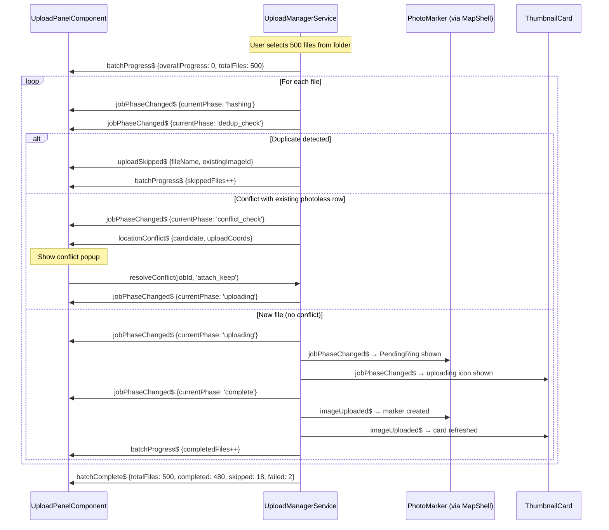

#### Replace / Attach Event Flow

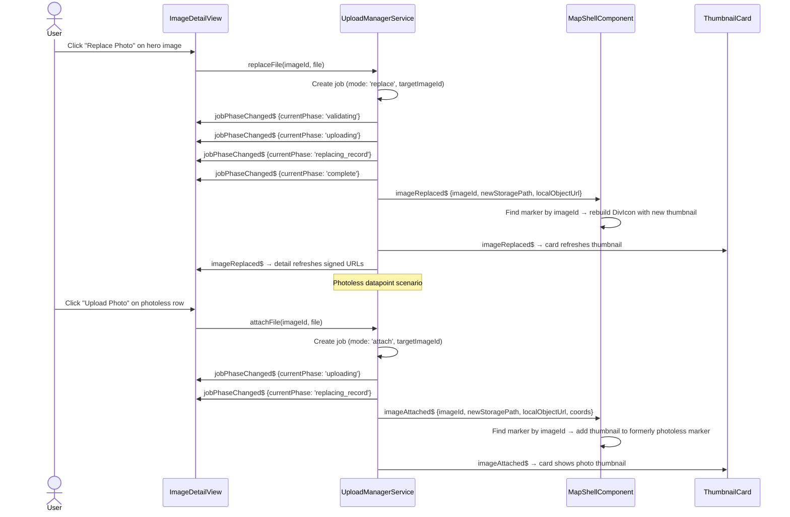

### Event Consumers

| Event               | Consumer               | Reaction                                                                                                       |
| ------------------- | ---------------------- | -------------------------------------------------------------------------------------------------------------- |
| `imageUploaded$`    | `MapShellComponent`    | Adds optimistic marker to the map                                                                              |
| `imageUploaded$`    | `ThumbnailGrid`        | Refreshes grid if the uploaded image belongs to the active group                                               |
| `imageReplaced$`    | `MapShellComponent`    | Rebuilds marker DivIcon with `localObjectUrl` — instant swap, no placeholder (same as PL-4 optimistic)         |
| `imageReplaced$`    | `ThumbnailCard`        | Resets loading cycle: `signedThumbnailUrl = localObjectUrl` → `imgLoading` → blob loads (~0ms) → 200ms fade-in |
| `imageReplaced$`    | `ImageDetailView`      | Sets `heroSrc = localObjectUrl` instant → re-signs Tier 2/3 → crossfade to full-res                            |
| `imageAttached$`    | `MapShellComponent`    | Rebuilds marker DivIcon: CSS placeholder → `` with `localObjectUrl` — instant transition                  |
| `imageAttached$`    | `ThumbnailCard`        | Resets loading cycle: no-photo icon → `localObjectUrl` → blob loads (~0ms) → 200ms fade-in                     |
| `imageAttached$`    | `ImageDetailView`      | Switches from upload prompt to photo display → `heroSrc = localObjectUrl` → progressive Tier 2/3 reload        |
| `uploadFailed$`     | `MapShellComponent`    | Shows toast notification                                                                                       |
| `uploadSkipped$`    | `UploadPanelComponent` | Shows "Already uploaded" label on the file item                                                                |
| `locationConflict$` | `UploadPanelComponent` | Shows conflict resolution popup (attach replace / attach keep / create new)                                    |
| `jobPhaseChanged$`  | `UploadPanelComponent` | Updates per-file status label and icon                                                                         |
| `jobPhaseChanged$`  | `PhotoMarker`          | Shows/hides PendingRing on markers for files currently in `uploading` phase                                    |
| `jobPhaseChanged$`  | `ThumbnailCard`        | Shows/hides uploading overlay on cards for files currently in `uploading` phase                                |
| `batchProgress$`    | `UploadPanelComponent` | Updates the batch progress bar (0–100%)                                                                        |
| `batchProgress$`    | `UploadButtonZone`     | Shows progress ring/badge on the upload button                                                                 |
| `batchComplete$`    | `UploadPanelComponent` | Shows batch summary (completed, skipped, failed)                                                               |
| `missingData$`      | `MissingDataManager`   | Queues file for manual placement (future)                                                                      |

## Folder Upload (Multi-File / Directory Selection)

The Upload Manager supports two entry modes for multi-file uploads:

### Standard Multi-File (all browsers)

The HTML file input with `multiple` attribute lets users select many files at once. Each file becomes a job in a single batch.

```typescript
// In UploadPanelComponent template
<input type="file" multiple accept="image/*" (change)="onFilesSelected($event)">
```

### Folder Selection (Chromium only)

Uses the File System Access API (`showDirectoryPicker()`). The manager recursively scans the directory, filters to supported image types, and submits all found files as a single batch.

```typescript
// In UploadPanelComponent
async selectFolder(): Promise<void> {
  const dirHandle = await window.showDirectoryPicker({ mode: 'read' });
  const batchId = await this.uploadManager.submitFolder(dirHandle);
}
```

The `submitFolder()` method:

1. Sets batch status to `'scanning'` and emits `batchProgress$` with `totalFiles: 0`.
2. Recursively walks the directory, incrementing `totalFiles` as images are found.
3. Once the scan completes, sets batch status to `'uploading'` and begins the pipeline for each file.
4. The folder name becomes the batch label (e.g., `"Burgstraße_7 — 142 images"`).

Browser support detection:

```typescript
readonly isFolderImportSupported = typeof window !== 'undefined' && 'showDirectoryPicker' in window;
```

If unsupported, the "Select folder" option shows: _"Folder import requires Chrome or Edge."_

### Folder Upload Flow

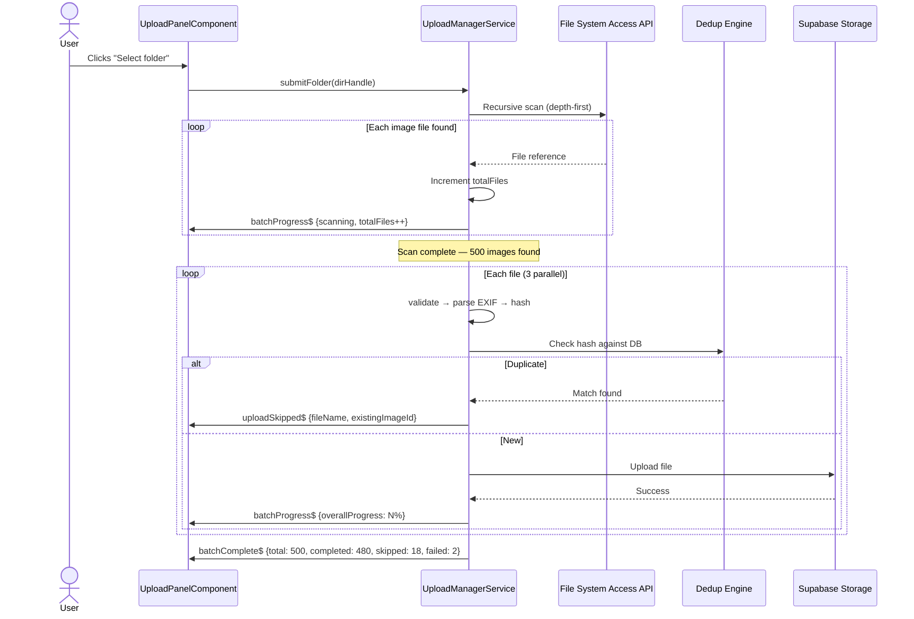

## Deduplication (Resume-Safe Uploads)

When uploading hundreds or thousands of photos (especially re-selecting a folder after an interrupted session), the manager must detect and skip files that were already uploaded. This prevents duplicate entries and wasted bandwidth.

### Content Hash

Before uploading, the manager computes a **content hash** for each file. The hash is derived from stable, content-intrinsic properties that uniquely identify a photo regardless of filename changes or re-exports:

```typescript
interface ContentHashInput {
  /** First 64 KB of raw file bytes (fast, avoids reading entire file). */
  fileHeadBytes: ArrayBuffer;
  /** File size in bytes (cheap discriminator). */
  fileSize: number;
  /** EXIF GPS coordinates if available (latitude, longitude). */
  gpsCoords?: { lat: number; lng: number };
  /** EXIF capture timestamp if available. */
  capturedAt?: string;
  /** Camera bearing / direction from EXIF (degrees). */
  direction?: number;
}
```

The hash is computed as:

```typescript
async function computeContentHash(input: ContentHashInput): Promise<string> {
  const encoder = new TextEncoder();
  const parts = [
    new Uint8Array(input.fileHeadBytes),
    encoder.encode(`|size=${input.fileSize}`),
    encoder.encode(
      `|gps=${input.gpsCoords?.lat ?? ""},${input.gpsCoords?.lng ?? ""}`,
    ),
    encoder.encode(`|date=${input.capturedAt ?? ""}`),
    encoder.encode(`|dir=${input.direction ?? ""}`),
  ];
  const combined = concatArrayBuffers(parts);
  const hashBuffer = await crypto.subtle.digest("SHA-256", combined);
  return Array.from(new Uint8Array(hashBuffer))
    .map((b) => b.toString(16).padStart(2, "0"))
    .join("");
}
```

**Why these fields:**

- `fileHeadBytes` (first 64 KB): captures JPEG header, EXIF block, and the start of image data. Two genuinely different photos will almost certainly differ here.
- `fileSize`: cheap first-pass discriminator. Different images rarely share exact file sizes.
- `gpsCoords`: two photos of the same subject from different locations should be distinct.
- `capturedAt`: same location, different time → different photo.
- `direction`: same location, same time, different angle → different photo.

**Why NOT full file hash:** Reading an entire 20 MB file into memory just for hashing is slow and memory-intensive when processing 1000+ files. The 64 KB head + metadata combination provides high collision resistance while staying fast.

### Server-Side Hash Storage

Hashes are stored in a `dedup_hashes` table in Supabase:

```sql
CREATE TABLE dedup_hashes (
  id          uuid PRIMARY KEY DEFAULT gen_random_uuid(),
  user_id     uuid NOT NULL REFERENCES auth.users(id),
  image_id    uuid NOT NULL REFERENCES images(id) ON DELETE CASCADE,
  content_hash text NOT NULL,
  created_at  timestamptz NOT NULL DEFAULT now(),
  UNIQUE(user_id, content_hash)
);

-- RLS: users can only see/insert their own hashes
ALTER TABLE dedup_hashes ENABLE ROW LEVEL SECURITY;
CREATE POLICY "Users manage own hashes"
  ON dedup_hashes FOR ALL
  USING (auth.uid() = user_id)
  WITH CHECK (auth.uid() = user_id);
```

### Dedup Check Flow

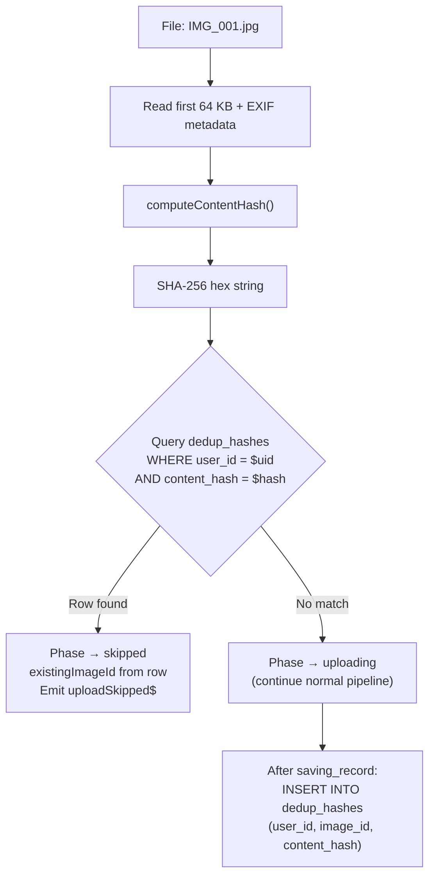

### Batch Dedup Optimization

For large folder uploads (100+ files), individual hash lookups would be slow. Instead, the manager batches hash checks:

1. Compute hashes for all files in the batch (parallel, up to 10 concurrent hash computations).
2. Send hashes in a single RPC call: `supabase.rpc('check_dedup_hashes', { hashes: string[] })`.
3. The RPC returns the set of hashes that already exist, along with their `image_id`.
4. Jobs for matching hashes immediately transition to `skipped`.
5. Remaining jobs enter the normal pipeline.

```sql
-- Batch dedup check function
CREATE OR REPLACE FUNCTION check_dedup_hashes(hashes text[])
RETURNS TABLE(content_hash text, image_id uuid)
LANGUAGE sql STABLE SECURITY DEFINER
AS $$
  SELECT dh.content_hash, dh.image_id
  FROM dedup_hashes dh
  WHERE dh.user_id = auth.uid()
    AND dh.content_hash = ANY(hashes);
$$;
```

### Resume Scenario

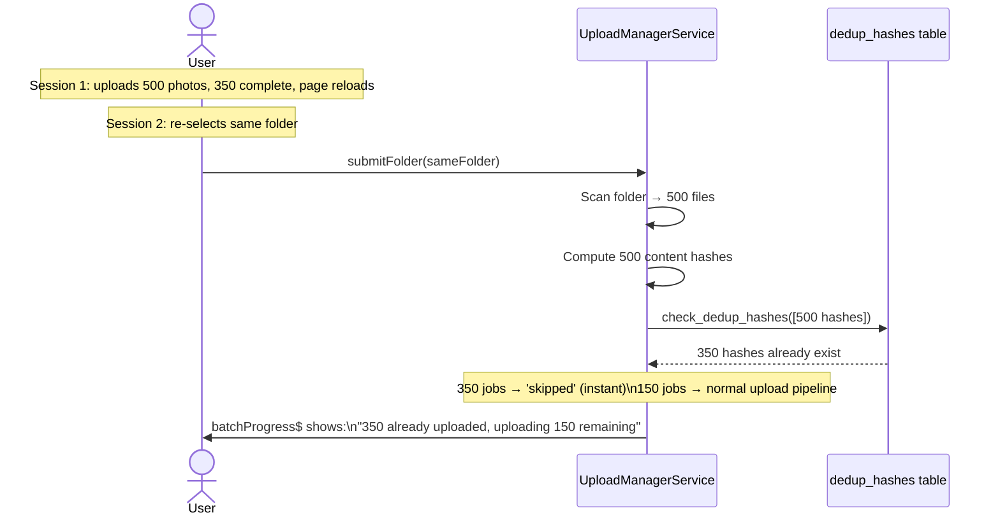

## Location Conflict Detection

When an upload has GPS coordinates (from EXIF) or an address (from filename), the pipeline checks for **existing `images` rows that have location data but no photo file** (`storage_path IS NULL`). These "photoless datapoints" may have been created through bulk import, manual address entry, or other workflows. If the upload's location matches one of these rows, the user is prompted to decide whether to attach the photo to the existing row or create a new one.

### Why This Exists

| Problem                                                                                          | Solution                                                                          |
| ------------------------------------------------------------------------------------------------ | --------------------------------------------------------------------------------- |
| Datapoints created with address/GPS but no photo file                                            | Upload can attach a photo to an existing row instead of always creating a new one |
| EXIF GPS may differ slightly from the manually entered location                                  | User chooses whether to trust the EXIF location or keep the existing one          |
| Duplicate rows accumulate when photos are uploaded to addresses that already exist as datapoints | Conflict popup prevents accidental duplication                                    |

### Matching Criteria

A conflict is detected when **all** of the following are true:

1. The job has GPS coordinates (EXIF or forward-geocoded) OR a resolved address.
2. There exists an `images` row in the same organization where `storage_path IS NULL`.
3. **GPS match**: the existing row's coordinates are within **50 meters** of the upload's coordinates (PostGIS `ST_DWithin`), **OR**
4. **Address match**: the existing row's `address_label` is a case-insensitive match of the upload's title-derived address.

If multiple candidates match, the **closest by distance** (GPS match) or **first by `created_at`** (address match) is selected.

### Conflict Check Query

```sql
-- Find photoless rows near the upload's coordinates or matching address
SELECT id, address_label, latitude, longitude,
       ST_Distance(geog, ST_SetSRID(ST_MakePoint($lng, $lat), 4326)::geography) AS distance_m
FROM images
WHERE organization_id = $org_id
  AND storage_path IS NULL
  AND (
    -- GPS proximity match (50m radius)
    ($lat IS NOT NULL AND $lng IS NOT NULL AND
     ST_DWithin(geog, ST_SetSRID(ST_MakePoint($lng, $lat), 4326)::geography, 50))
    OR
    -- Address label match (case-insensitive)
    ($address IS NOT NULL AND LOWER(address_label) = LOWER($address))
  )
ORDER BY
  CASE WHEN $lat IS NOT NULL THEN
    ST_Distance(geog, ST_SetSRID(ST_MakePoint($lng, $lat), 4326)::geography)
  ELSE 0 END ASC,
  created_at ASC
LIMIT 1;
```

### Conflict Resolution Flow

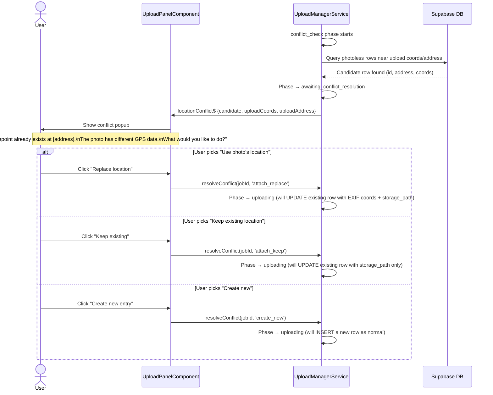

### Saving Record with Conflict Resolution

When `conflictResolution` is set, the `saving_record` phase behaves differently:

- **`attach_replace`**: UPDATE the existing row — set `storage_path`, `exif_latitude`, `exif_longitude`, `latitude`, `longitude`, `direction`, `captured_at`. The existing address fields are overwritten by a subsequent reverse-geocode (Path A enrichment).
- **`attach_keep`**: UPDATE the existing row — set `storage_path`, `exif_latitude`, `exif_longitude`, `direction`, `captured_at` only. The `latitude`, `longitude`, and address fields are **preserved**. No enrichment phase runs (coordinates and address already present).
- **`create_new`**: Normal INSERT flow, as if no conflict was detected.

### Conflict Resolution Popup (UI)

The popup is a **modal dialog** (not inline in the file list) with:

- **Title**: "Existing datapoint found"
- **Body**: "A datapoint at **[existing address or coords]** already exists without a photo. The uploaded photo has **[EXIF coords / filename address]**."
- **Three action buttons** (stacked vertically, dd-item styling):
  - `place` icon + **"Replace location"** — attach photo and overwrite location with EXIF. Subtitle: "Use the photo's GPS coordinates"
  - `keep` icon + **"Keep existing location"** — attach photo, preserve current address/GPS. Subtitle: "Preserve the current address and coordinates"
  - `add` icon + **"Create new entry"** — create a separate row. Subtitle: "Upload as a new datapoint"
- **Dismiss (×)**: Equivalent to "Create new entry" (safe default).

### `awaiting_conflict_resolution` and Concurrency

Jobs in `awaiting_conflict_resolution` **release their concurrency slot**. This prevents one pending popup from blocking the entire upload queue. When the user resolves the conflict, the job re-enters the concurrency queue at the front (priority re-queue).

## Relationship to Existing Code

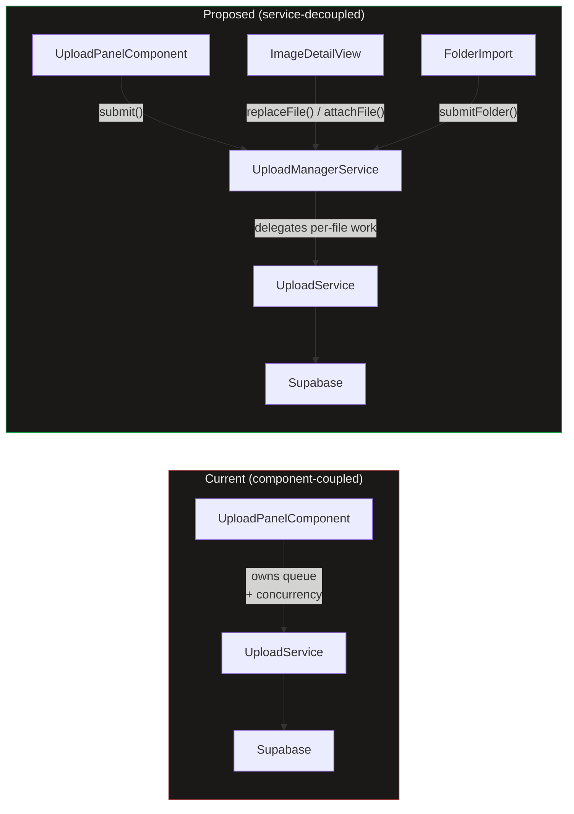

- **`UploadService`** keeps its current responsibilities (validation, EXIF, storage, DB insert/update, geocode). Gains an `updateImageFile()` method for the replace/attach pipeline (UPDATE instead of INSERT).
- **`UploadManagerService`** wraps `UploadService` with queue management, concurrency, state signals, and three entry points: `submit()`, `replaceFile()`, `attachFile()`.
- **`UploadPanelComponent`** becomes a thin UI that calls `uploadManager.submit()` and reads `uploadManager.jobs()` — it no longer manages its own queue.
- **`ImageDetailView`** calls `uploadManager.replaceFile()` or `uploadManager.attachFile()` instead of doing direct storage + DB operations.

## Data

| Field          | Source                                  | Type                          |
| -------------- | --------------------------------------- | ----------------------------- |
| Jobs           | `UploadManagerService.jobs()`           | `Signal<UploadJob[]>`         |
| Active count   | `UploadManagerService.activeCount()`    | `Signal<number>`              |
| Is busy        | `UploadManagerService.isBusy()`         | `Signal<boolean>`             |
| Batches        | `UploadManagerService.batches()`        | `Signal<UploadBatch[]>`       |
| Active batch   | `UploadManagerService.activeBatch()`    | `Signal<UploadBatch \| null>` |
| Per-job events | `UploadManagerService.jobPhaseChanged$` | `Observable<...>`             |
| Batch events   | `UploadManagerService.batchProgress$`   | `Observable<...>`             |
| Skip events    | `UploadManagerService.uploadSkipped$`   | `Observable<...>`             |

## State

| Name          | Type                            | Default | Controls                                         |
| ------------- | ------------------------------- | ------- | ------------------------------------------------ |
| `jobs`        | `WritableSignal<UploadJob[]>`   | `[]`    | Full upload queue + history                      |
| `activeJobs`  | `Signal<UploadJob[]>`           | `[]`    | Computed: non-terminal jobs                      |
| `isBusy`      | `Signal<boolean>`               | `false` | Computed: any non-terminal job exists            |
| `activeCount` | `Signal<number>`                | `0`     | Computed: jobs in uploading/saving/resolving     |
| `batches`     | `WritableSignal<UploadBatch[]>` | `[]`    | All batches (active + completed)                 |
| `activeBatch` | `Signal<UploadBatch \| null>`   | `null`  | Computed: first batch with status !== 'complete' |

## File Map

| File                                                     | Purpose                                                   |
| -------------------------------------------------------- | --------------------------------------------------------- |
| `core/upload-manager.service.ts`                         | Queue management, concurrency, pipeline orchestration     |
| `core/upload-manager.service.spec.ts`                    | Unit tests                                                |
| `core/content-hash.util.ts`                              | `computeContentHash()` — SHA-256 from file head + EXIF    |
| `core/content-hash.util.spec.ts`                         | Unit tests for hashing                                    |
| `core/upload.service.ts`                                 | Existing — per-file logic (validation, EXIF, storage, DB) |
| `core/geocoding.service.ts`                              | Existing — reverse geocoding                              |
| `features/upload/upload-panel/upload-panel.component.ts` | Refactor — delegate to UploadManagerService               |

## Wiring

- `UploadManagerService` is `providedIn: 'root'` — no module import needed
- Inject into `UploadPanelComponent` (replace internal queue logic)
- Inject into `ImageDetailView` for `replaceFile()` and `attachFile()`
- Subscribe to `imageUploaded$` in `MapShellComponent` to add new markers
- Subscribe to `imageReplaced$` in `MapShellComponent` to rebuild marker DivIcon with new thumbnail
- Subscribe to `imageAttached$` in `MapShellComponent` to update marker (add thumbnail to photoless marker)
- Subscribe to `imageReplaced$` and `imageAttached$` in `ImageDetailView` to refresh signed URLs
- Subscribe to `imageReplaced$` and `imageAttached$` in `ThumbnailCard` to refresh card thumbnail
- Subscribe to `uploadFailed$` for toast notifications
- Subscribe to `batchProgress$` in `UploadButtonZone` to show progress badge on the upload button
- Subscribe to `jobPhaseChanged$` in `PhotoMarker` (via MapShell) to show/hide PendingRing
- Subscribe to `jobPhaseChanged$` in `ThumbnailCard` to show uploading overlay
- Subscribe to `uploadSkipped$` in `UploadPanelComponent` to show "Already uploaded" status
- Subscribe to `locationConflict$` in `UploadPanelComponent` to show conflict resolution popup
- `dedup_hashes` table must exist in Supabase with RLS enabled (see Deduplication section)

## Acceptance Criteria

- [x] Uploads continue when the originating component is destroyed (navigate away)
- [x] Maximum 3 concurrent uploads enforced globally across all entry points
- [x] FIFO queue: first file submitted is first to upload
- [x] `missing_data` jobs do not consume concurrency slots
- [x] Job state is reactive (Angular signals) — any component can bind to `jobs()`
- [x] `imageUploaded$` fires with coords + imageId when a job completes
- [x] `uploadFailed$` fires when a critical phase fails
- [x] Failed jobs can be retried via `retryJob()`
- [x] Completed/failed jobs can be dismissed individually or in bulk
- [x] **Path A**: GPS in EXIF → upload → save → reverse-geocode address (non-blocking)
- [x] **Path B**: No GPS + address in title → upload → save with address → forward-geocode coords (non-blocking)
- [x] **Path C**: No GPS + no address → job enters `missing_data`, emits `missingData$` for MissingDataManager
- [x] Address resolution and coordinate resolution are enrichment — failure is silent
- [x] Orphaned storage files are cleaned up when DB insert fails
- [x] Auth change (logout) cancels all active jobs
- [ ] Global progress indicator visible from any page when uploads are active
- [x] `beforeunload` warning shown when `isBusy()` is true

### Multi-File & Folder Upload

- [x] `submit()` accepts multiple files and groups them into a single batch
- [x] `submitFolder()` accepts a `FileSystemDirectoryHandle` and recursively scans for images
- [x] Folder scan shows live counter ("Scanning… 142 images found")
- [x] Folder import button hidden on unsupported browsers (Firefox, Safari)
- [x] Each batch has a unique ID, label, and aggregate progress (0–100%)
- [x] `batchProgress$` emits on every job state change with updated counts
- [x] `batchComplete$` emits when all jobs in a batch reach a terminal state
- [x] `cancelBatch()` cancels all non-terminal jobs in a batch

### Deduplication (Resume-Safe)

- [x] Content hash computed from first 64 KB + file size + GPS + captured_at + direction
- [x] Hash uses `crypto.subtle.digest('SHA-256')` (Web Crypto API, no dependencies)
- [x] `dedup_hashes` table exists in Supabase with `UNIQUE(user_id, content_hash)` constraint
- [x] RLS on `dedup_hashes` restricts access to the owning user
- [x] Single-file uploads check hash individually before uploading
- [x] Batch uploads use `check_dedup_hashes()` RPC for a single round-trip
- [x] Duplicate files transition to `skipped` phase, never uploaded
- [x] `uploadSkipped$` emits with the existing `imageId` for each skipped file
- [x] After successful upload, hash is inserted into `dedup_hashes`
- [x] Re-selecting the same folder after interruption skips already-uploaded files

### Event Handlers

- [x] `jobPhaseChanged$` emits on every phase transition for every job
- [x] `uploadSkipped$` emits when a duplicate is detected
- [x] `batchProgress$` emits aggregate progress (0–100%) for the batch
- [x] `batchComplete$` emits when a batch finishes with summary counts
- [ ] UI consumers (`UploadPanel`, `UploadButtonZone`, `PhotoMarker`, `ThumbnailCard`) can subscribe to relevant events

### Replace Photo (`replaceFile`)

- [ ] `replaceFile(imageId, file)` creates an `UploadJob` with `mode: 'replace'` and `targetImageId`
- [ ] Replace pipeline: `validating → hashing → dedup_check → uploading → replacing_record → complete`
- [ ] `replacing_record` phase UPDATEs the existing row: `storage_path`, `thumbnail_path = null`, plus EXIF fields if present
- [ ] Old original AND old thumbnail deleted from storage after confirmed DB update (best-effort)
- [ ] `WorkspaceViewService.rawImages` grid cache updated: `storagePath` set, `thumbnailPath`/`signedThumbnailUrl`/`thumbnailUnavailable` cleared
- [ ] `imageReplaced$` emits with `imageId`, `newStoragePath`, and `localObjectUrl` on success
- [ ] `MapShellComponent` subscribes to `imageReplaced$` and rebuilds the marker's DivIcon with the new thumbnail
- [ ] Detail view subscribes to `imageReplaced$` and refreshes signed URLs to show the new photo immediately
- [ ] Dedup check prevents re-uploading the same file as a "replacement"
- [ ] Replace job tracks progress as a normal `UploadJob` — UI can show spinner/progress
- [ ] Replace jobs survive component destruction (detail view navigated away mid-upload)

### Attach Photo (`attachFile`)

- [ ] `attachFile(imageId, file)` creates an `UploadJob` with `mode: 'attach'` and `targetImageId`
- [ ] Attach pipeline: `validating → parsing_exif → hashing → dedup_check → uploading → replacing_record → enrichment → complete`
- [ ] `replacing_record` phase UPDATEs the existing row: `storage_path`, `exif_latitude`, `exif_longitude`, `captured_at`, `direction`
- [ ] If row already has `latitude`/`longitude`, those are preserved (EXIF written to `exif_*` fields only)
- [ ] If row has NO coordinates, EXIF coords written to both `latitude`/`longitude` and `exif_*` fields
- [ ] Enrichment runs after attach: reverse-geocode if only GPS, forward-geocode if only address
- [ ] `imageAttached$` emits with `imageId`, `newStoragePath`, `localObjectUrl`, and `coords` on success
- [ ] `MapShellComponent` subscribes to `imageAttached$` and updates the marker's DivIcon (adds thumbnail to formerly photoless marker)
- [ ] No old file cleanup needed (row had `storage_path IS NULL`)
- [ ] Attach jobs survive component destruction

### Location Conflict Detection

- [ ] After dedup passes, pipeline checks for photoless rows matching the upload's GPS (within 50m) or address
- [ ] `conflict_check` query uses PostGIS `ST_DWithin` for GPS proximity and case-insensitive `address_label` match
- [ ] Only rows with `storage_path IS NULL` are considered candidates
- [ ] If a candidate is found, job transitions to `awaiting_conflict_resolution` and emits `locationConflict$`
- [ ] `awaiting_conflict_resolution` releases the concurrency slot (does not block other uploads)
- [ ] Conflict popup shows existing address/coords vs upload's EXIF data
- [ ] Three resolution options: "Replace location" (`attach_replace`), "Keep existing" (`attach_keep`), "Create new" (`create_new`)
- [ ] Dismissing the popup defaults to `create_new` (safe default)
- [ ] `resolveConflict()` re-queues the job at the front of the concurrency queue
- [ ] `attach_replace` UPDATEs existing row: `storage_path` + EXIF coords + `captured_at` + `direction`, then runs reverse-geocode enrichment
- [ ] `attach_keep` UPDATEs existing row: `storage_path` + EXIF-only fields (`exif_latitude`, `exif_longitude`, `captured_at`, `direction`) — preserves existing `latitude`, `longitude`, and address
- [ ] `create_new` INSERTs a new row as normal (same as no-conflict flow)
- [ ] If no photoless rows match, pipeline continues to `uploading` automatically (no popup)
