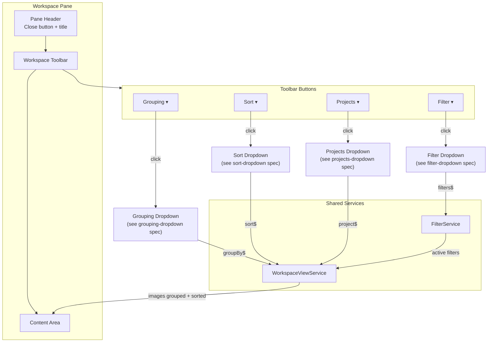

# Workspace Toolbar

## What It Is

A horizontal button bar at the top of the Workspace Pane that provides Grouping, Sorting, Filtering, and Project scoping controls. Each button opens a dropdown. The toolbar replaces the previous hardcoded "Selection" tab bar with a richer control surface inspired by Notion's database views.

## What It Looks Like

A single horizontal row of four ghost buttons: **Grouping**, **Filter**, **Sort**, **Projects**. Each button is `.btn-compact` height (1.75rem / 28px), ghost style (no background at rest, `--color-bg-elevated` fill at 35–45% on hover). When a control is active (has a grouping applied, filters set, sort order non-default, or project selected), the button receives a subtle `--color-primary` tint and shows a dot indicator. Sits directly below the pane header and above the thumbnail content area. `gap: 0.5rem` between buttons. Full width of the workspace pane with `padding-inline: var(--container-padding-inline-panel)`.

## Where It Lives

- **Parent**: `WorkspacePaneComponent` — above the content area
- **Always visible** when Workspace Pane is open and not in Image Detail View

## Actions

| #   | User Action          | System Response                                     | Triggers           |
| --- | -------------------- | --------------------------------------------------- | ------------------ |
| 1   | Clicks "Grouping"    | Opens Grouping Dropdown positioned below the button | Dropdown opens     |
| 2   | Clicks "Filter"      | Opens Filter Dropdown positioned below the button   | Dropdown opens     |
| 3   | Clicks "Sort"        | Opens Sort Dropdown positioned below the button     | Dropdown opens     |
| 4   | Clicks "Projects"    | Opens Projects Dropdown positioned below the button | Dropdown opens     |
| 5   | Clicks outside       | Closes any open dropdown                            | Dropdown closes    |
| 6   | Presses Escape       | Closes any open dropdown                            | Dropdown closes    |
| 7   | Active indicator dot | Visible when the toolbar button's feature is active | Derived from state |

## Component Hierarchy

```
WorkspaceToolbar                           ← horizontal flex row, gap-2, padding-inline
├── ToolbarButton "Grouping"               ← .btn-compact ghost, opens GroupingDropdown
│   └── [active] ActiveDot                 ← 6px --color-primary dot
├── ToolbarButton "Filter"                 ← .btn-compact ghost, opens FilterDropdown
│   └── [active] ActiveDot
├── ToolbarButton "Sort"                   ← .btn-compact ghost, opens SortDropdown
│   └── [active] ActiveDot
└── ToolbarButton "Projects"               ← .btn-compact ghost, opens ProjectsDropdown
    └── [active] ActiveDot
```

## State

| Name             | Type                                                     | Default | Controls               |
| ---------------- | -------------------------------------------------------- | ------- | ---------------------- |
| `activeDropdown` | `'grouping' \| 'filter' \| 'sort' \| 'projects' \| null` | `null`  | Which dropdown is open |
| `hasGrouping`    | `boolean`                                                | `false` | Grouping active dot    |
| `hasFilters`     | `boolean`                                                | `false` | Filter active dot      |
| `hasCustomSort`  | `boolean`                                                | `false` | Sort active dot        |
| `hasProject`     | `boolean`                                                | `false` | Projects active dot    |

## File Map

| File                                                           | Purpose                   |
| -------------------------------------------------------------- | ------------------------- |
| `features/map/workspace-pane/workspace-toolbar.component.ts`   | Toolbar with four buttons |
| `features/map/workspace-pane/workspace-toolbar.component.html` | Template                  |
| `features/map/workspace-pane/workspace-toolbar.component.scss` | Styles                    |

## Wiring

- Child of `WorkspacePaneComponent`, placed above the content area
- Each button opens a separate dropdown component (see individual specs)
- Dropdown components are standalone and receive state via the `WorkspaceViewService`

## Acceptance Criteria

- [ ] Four ghost buttons in a horizontal row: Grouping, Filter, Sort, Projects
- [ ] Each button opens its corresponding dropdown
- [ ] Only one dropdown open at a time
- [ ] Click-outside and Escape close the dropdown
- [ ] Active indicator dot when a feature is engaged
- [ ] `.btn-compact` height (1.75rem)
- [ ] Responsive: buttons wrap on narrow panes

---

## System Overview


