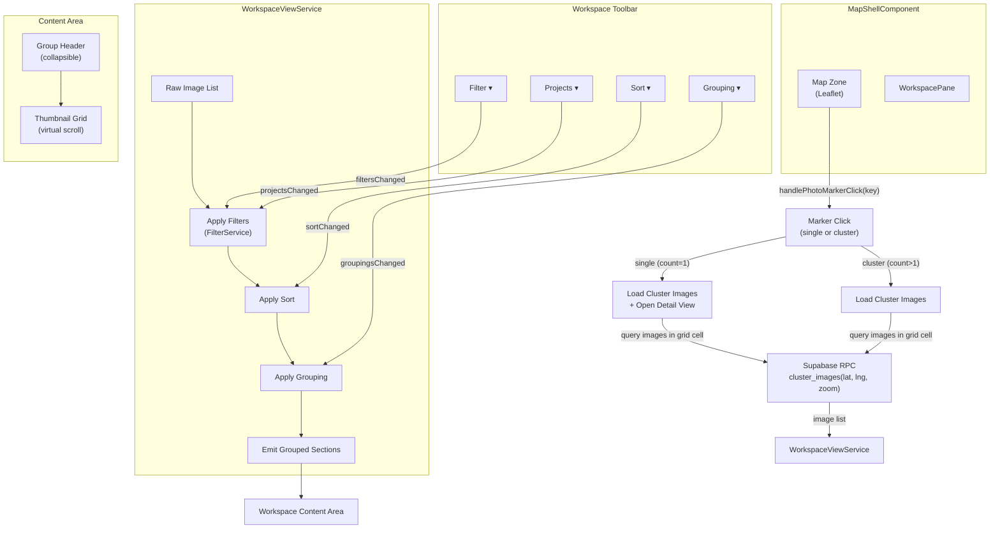
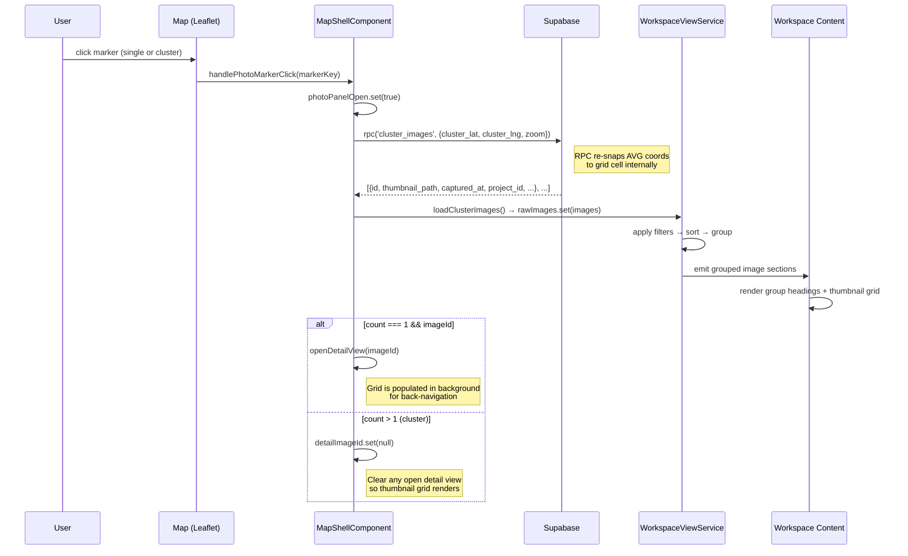
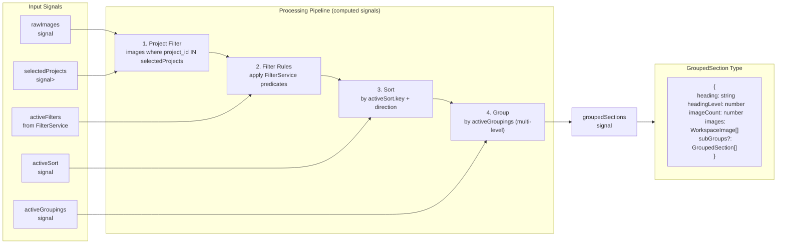
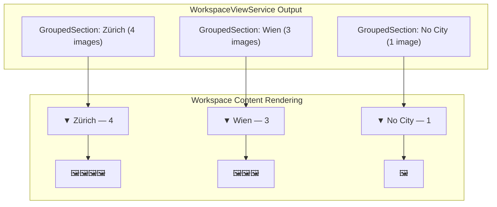
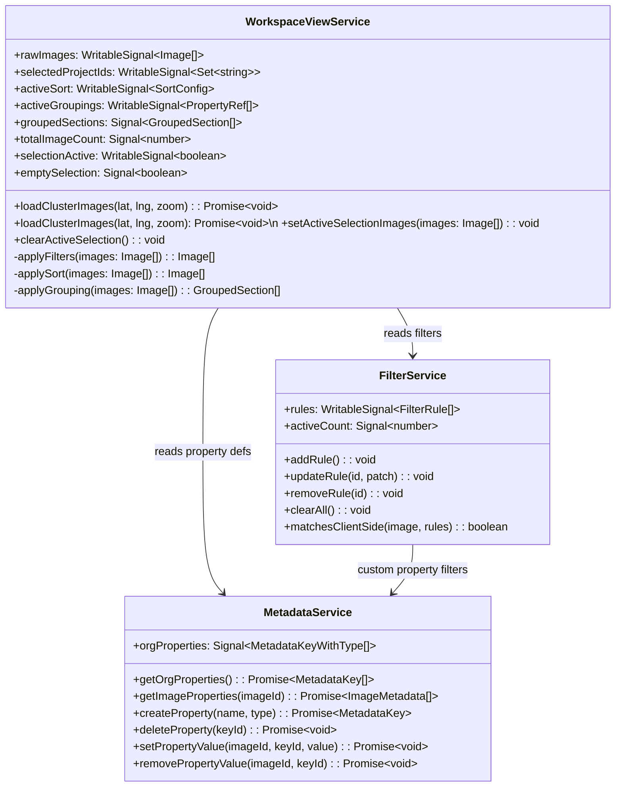
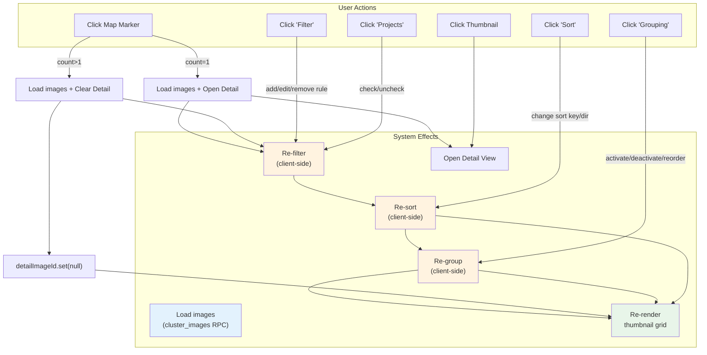

# Workspace View System — Architecture Overview

> **Spec type:** System architecture (cross-cutting). This is NOT a standard element spec — it describes the data-flow and service orchestration across multiple components. For the standard element spec sections, see [workspace-pane.md](workspace-pane.md), [workspace-toolbar.md](workspace-toolbar.md), and [thumbnail-grid.md](thumbnail-grid.md).

This document describes the complete data flow and component interaction for the Workspace Pane's view system: how images are loaded, grouped, sorted, filtered, and displayed. It covers the cluster-click flow, the toolbar controls, and the `WorkspaceViewService` that orchestrates everything.

---

## 1. System Architecture



---

## 2. Cluster Click → Workspace Pane Flow

### Coordinate Mismatch (resolved)

`viewport_markers` returns `AVG(lat/lng)` for cluster positions (visually accurate), but the original `cluster_images` WHERE clause compared against grid-snapped values directly. Because `AVG(lat) ≠ ROUND(lat/cell_size)*cell_size`, the RPC returned 0 rows for every cluster click.

**Fix:** `cluster_images` now re-snaps incoming coordinates via a `snapped_input` CTE before comparing. The average position always falls within its source cell, so `ROUND(avg/cell_size)*cell_size` reliably recovers the correct grid cell.

### Solution: RPC `cluster_images`

A Supabase RPC that fetches all images within a specific grid cell. Takes the cluster's displayed coordinates (AVG) and zoom level, internally re-snaps them to the grid, and returns individual images with metadata.



### New RPC: `cluster_images`

```sql
-- Returns all individual images that belong to a specific cluster grid cell.
-- Re-snaps incoming AVG coordinates to the grid before comparing.
CREATE OR REPLACE FUNCTION public.cluster_images(
  p_cluster_lat numeric,
  p_cluster_lng numeric,
  p_zoom        int
)
RETURNS TABLE (
  image_id       uuid,
  latitude       numeric,
  longitude      numeric,
  thumbnail_path text,
  storage_path   text,
  captured_at    timestamptz,
  created_at     timestamptz,
  project_id     uuid,
  project_name   text,
  direction      numeric,
  exif_latitude  numeric,
  exif_longitude numeric,
  address_label  text,
  city           text,
  district       text,
  street         text,
  country        text,
  user_name      text
)
LANGUAGE sql STABLE SECURITY DEFINER
SET search_path = public
AS $$
  WITH grid AS (
    SELECT
      CASE
        WHEN p_zoom >= 19 THEN 0::numeric
        ELSE (80.0 * 360.0) / (256.0 * power(2, p_zoom))
      END AS cell_size
  ),
  -- Re-snap AVG coords from viewport_markers back to the grid cell.
  snapped_input AS (
    SELECT
      CASE WHEN g.cell_size > 0
        THEN ROUND(p_cluster_lat / g.cell_size) * g.cell_size
        ELSE p_cluster_lat
      END AS snap_lat,
      CASE WHEN g.cell_size > 0
        THEN ROUND(p_cluster_lng / g.cell_size) * g.cell_size
        ELSE p_cluster_lng
      END AS snap_lng
    FROM grid g
  )
  SELECT
    i.id            AS image_id,
    i.latitude,
    i.longitude,
    i.thumbnail_path,
    i.storage_path,
    i.captured_at,
    i.created_at,
    i.project_id,
    p.name          AS project_name,
    i.direction,
    i.exif_latitude,
    i.exif_longitude,
    i.address_label,
    i.city,
    i.district,
    i.street,
    i.country,
    pr.full_name    AS user_name
  FROM public.images i
  CROSS JOIN grid g
  CROSS JOIN snapped_input si
  LEFT JOIN public.projects p ON p.id = i.project_id
  LEFT JOIN public.profiles pr ON pr.id = i.user_id
  WHERE i.organization_id = public.user_org_id()
    AND i.latitude  IS NOT NULL
    AND i.longitude IS NOT NULL
    AND (
      (g.cell_size > 0 AND
       ROUND(i.latitude  / g.cell_size) * g.cell_size = si.snap_lat AND
       ROUND(i.longitude / g.cell_size) * g.cell_size = si.snap_lng)
      OR
      (g.cell_size = 0 AND
       ROUND(i.latitude, 7) = p_cluster_lat AND
       ROUND(i.longitude, 7) = p_cluster_lng)
    )
  ORDER BY COALESCE(i.captured_at, i.created_at) DESC
  LIMIT 500;
$$;
```

---

## 3. WorkspaceViewService — Data Pipeline



### Key Design Decisions

1. **Signals, not RxJS**: The entire pipeline uses Angular computed signals. When any input changes, the pipeline re-evaluates. This is efficient because Angular only recomputes what changed.

2. **Client-side grouping, not server-side**: Images are loaded once (from cluster query or viewport query), then grouped/sorted/filtered in-memory. This avoids redundant server round-trips when the user drags properties up/down in the Grouping dropdown.

3. **Group headings are virtual**: They're data structures, not DOM elements. The thumbnail grid uses virtual scrolling and renders headings as part of the scroll stream.

---

## 4. Grouped Content Rendering



### Group Header Component

```
GroupHeader                                ← sticky within scroll container
├── CollapseToggle (▼/▶)                   ← rotates 90° on collapse
├── GroupName                              ← e.g., "Zürich"
├── ImageCount                             ← e.g., "4 photos", --text-caption
└── .ui-spacer
```

- Group headers are **sticky** (`position: sticky; top: 0`) within the virtual scroll container
- Collapsible: clicking the header toggles visibility of the thumbnail grid below
- Multi-level grouping creates nested indentation (level 2 → `padding-left: 1.5rem`)

---

## 5. Service Architecture



---

## 6. Complete Interaction Map



---

## 7. File Map (all new files across features)

| File                                                                   | Purpose                             | Spec                 |
| ---------------------------------------------------------------------- | ----------------------------------- | -------------------- |
| `features/map/workspace-pane/workspace-toolbar.component.ts/html/scss` | Toolbar with 4 buttons              | workspace-toolbar.md |
| `features/map/workspace-pane/grouping-dropdown.component.ts/html/scss` | Grouping dropdown with drag-reorder | grouping-dropdown.md |
| `features/map/workspace-pane/sort-dropdown.component.ts/html/scss`     | Sort dropdown with search           | sort-dropdown.md     |
| `features/map/workspace-pane/filter-dropdown.component.ts/html/scss`   | Notion-style filter builder         | filter-dropdown.md   |
| `features/map/workspace-pane/filter-rule-row.component.ts`             | Single filter rule row              | filter-dropdown.md   |
| `features/map/workspace-pane/projects-dropdown.component.ts/html/scss` | Projects checklist dropdown         | projects-dropdown.md |
| `features/map/workspace-pane/group-header.component.ts`                | Collapsible group heading           | (this doc)           |
| `features/map/workspace-pane/property-picker.component.ts`             | Floating property picker            | custom-properties.md |
| `features/settings/property-manager/property-manager.component.*`      | Settings page property CRUD         | custom-properties.md |
| `core/workspace-view.service.ts`                                       | Image pipeline: filter→sort→group   | (this doc)           |
| `core/filter.service.ts`                                               | Filter rule state + query building  | filter-dropdown.md   |
| `core/metadata.service.ts`                                             | Property CRUD + value management    | custom-properties.md |
| `supabase/migrations/XXXXX_cluster_images_rpc.sql`                     | New RPC for cluster image loading   | (this doc)           |
| `supabase/migrations/XXXXX_metadata_key_types.sql`                     | key_type column + options table     | custom-properties.md |

---

## 8. Implementation Priority

```mermaid
gantt
    title Implementation Order
    dateFormat  X
    axisFormat %s

    section Foundation
    cluster_images RPC                :crit, a1, 0, 1
    WorkspaceViewService              :crit, a2, 1, 2
    MetadataService                   :a3, 1, 2
    FilterService                     :a4, 1, 2

    section Workspace Pane
    Cluster click → load images       :crit, b1, 2, 3
    WorkspaceToolbar (4 buttons)      :b2, 2, 3
    ThumbnailGrid + ThumbnailCard     :b3, 3, 4
    GroupHeader (collapsible)          :b4, 4, 5

    section Dropdowns
    Sort Dropdown                     :c1, 3, 4
    Projects Dropdown                 :c2, 3, 4
    Grouping Dropdown (drag-reorder) :c3, 4, 5
    Filter Dropdown (Notion-style)    :c4, 5, 6

    section Properties
    DB migration (key_type + options)  :d1, 5, 6
    Property Manager (Settings)        :d2, 6, 7
    Property Picker (Detail View)      :d3, 6, 7
```



### Phase 1 — Foundation (critical path)

1. `cluster_images` RPC migration
2. `WorkspaceViewService`, `FilterService`, `MetadataService`
3. Wire cluster click → load images → display in workspace

### Phase 2 — Workspace Pane

4. `WorkspaceToolbar` with 4 buttons
5. `ThumbnailGrid` + `ThumbnailCard` components
6. `GroupHeader` component

### Phase 3 — Dropdowns

7. `SortDropdown` (simplest)
8. `ProjectsDropdown` (checklist)
9. `GroupingDropdown` (drag-reorder, most complex dropdown)
10. `FilterDropdown` (Notion-style rules, most complex feature)

### Phase 4 — Custom Properties

11. DB migration for `key_type` + `metadata_key_options`
12. `PropertyManager` in Settings page
13. `PropertyPicker` in Image Detail View
