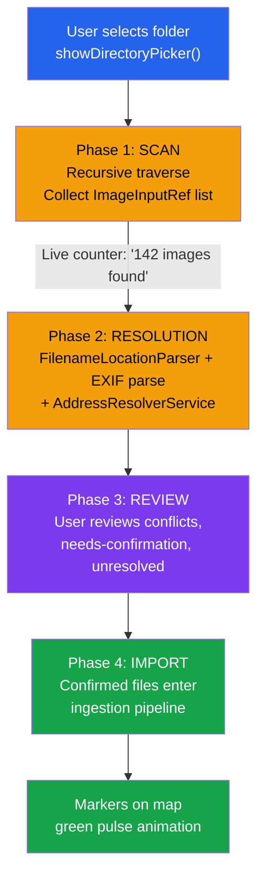
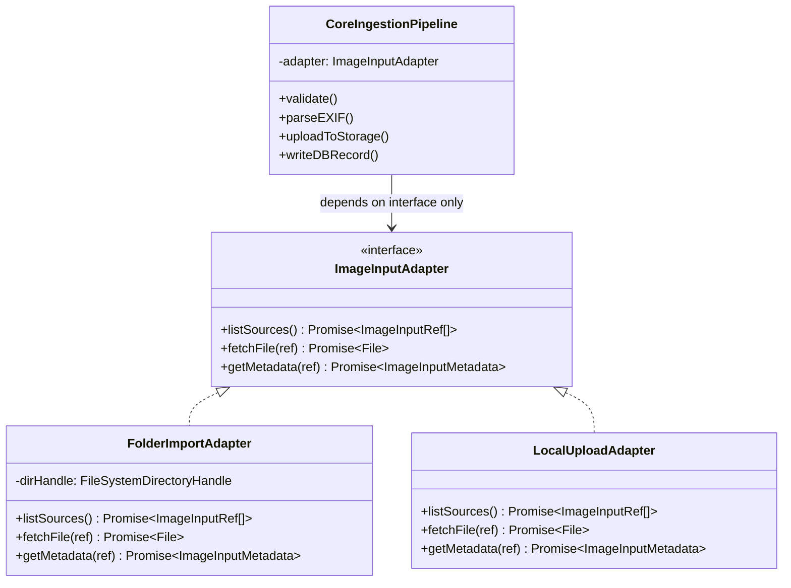

# Folder-Based Bulk Import

**Who this is for:** engineers implementing the bulk import feature and product owners validating the flow.  
**What you'll get:** a complete spec for folder-based batch image import — how the folder is scanned, how locations are resolved per image, how conflicts are surfaced, and what happens to unresolvable images.

See also: `architecture.md` §5, `address-resolver.md`.

---

## 1. Overview

### Folder Import Pipeline



Phases 1–3 happen entirely client-side before any data is sent to Supabase.

Folder-based bulk import lets a user point Sitesnap at a local folder on their computer. Sitesnap recursively scans the folder for images, attempts to resolve a geographic location for each one, and imports the full set in one operation after the user reviews and confirms the results.

Typical use cases:

- A technician who downloaded hundreds of field photos from a camera onto a laptop and wants to import them all at once.
- A clerk who has a folder organized by job site (e.g., `Burgstraße_7/`, `Hauptstraße_12/`) and wants to geo-reference them automatically by reading the folder names.
- An admin performing a one-time bulk migration of an existing photo archive.

---

## 2. Entry Point: File System Access API

Sitesnap uses the browser's **File System Access API** (`showDirectoryPicker()`) to give the user a native, OS-level folder picker. No file server or special backend is needed; reads happen entirely client-side with user consent.

```typescript
const dirHandle = await window.showDirectoryPicker({ mode: "read" });
```

**Browser Support**  
The File System Access API is supported in Chromium-based browsers (Chrome 86+, Edge 86+). Firefox and Safari do not support `showDirectoryPicker()` as of 2026. The UI must detect support before rendering the folder import button:

```typescript
const isFolderImportSupported = (): boolean =>
  typeof window !== "undefined" && "showDirectoryPicker" in window;
```

If unsupported, the button is replaced by a notice:  
_"Folder import requires Chrome or Edge. You can still select multiple files using the standard file picker."_

The `FolderImportAdapter` wraps `showDirectoryPicker()` and implements the `ImageInputAdapter` interface so it plugs into the existing core ingestion pipeline (EXIF parse → Storage upload → DB write) without any changes to pipeline code. See `architecture.md` §5.

---

## 3. FolderImportAdapter

### Adapter Architecture



`FolderImportAdapter` implements the `ImageInputAdapter` interface defined in `architecture.md` §5:

```typescript
interface ImageInputAdapter {
  listSources(): Promise<ImageInputRef[]>;
  fetchFile(ref: ImageInputRef): Promise<File>;
  getMetadata(ref: ImageInputRef): Promise<ImageInputMetadata>;
}
```

### 3.1 Recursive Scan

`listSources()` traverses the directory tree depth-first:

```
root/
  Burgstraße_7/
    IMG_001.jpg           ← included
    IMG_002.jpg           ← included
    sketch.pdf            ← skipped (unsupported type)
  Hauptstraße_12/
    photos/
      site_20260101.jpg   ← included
  misc/
    report.docx           ← skipped
```

**Accepted MIME types:** `image/jpeg`, `image/png`, `image/webp`, `image/heic`, `image/heif`. All other file types are silently skipped. Directories are traversed without depth limit.

`getMetadata()` returns:

- `originalName`: the filename (e.g., `IMG_001.jpg`).
- `relativePath`: the full relative path from the selected root (e.g., `Burgstraße_7/IMG_001.jpg`). This is the primary input to the location resolution algorithm (§4).
- `sourceCreatedAt`: the file's last-modified timestamp if available from the File System Access API.

### 3.2 Progress Reporting

Because a folder scan may return hundreds or thousands of files, the scan runs incrementally. The UI shows a live counter:

> _"Scanning… 142 images found."_

The workflow has four distinct phases:

| Phase             | What happens                                                             | UI                                  |
| ----------------- | ------------------------------------------------------------------------ | ----------------------------------- |
| **1. Scan**       | Traverse directory tree, collect `ImageInputRef` list                    | Counter: "142 images found"         |
| **2. Resolution** | Parse filenames, read EXIF from each file, call `AddressResolverService` | Progress bar: "Resolving 142 / 142" |
| **3. Review**     | User reviews conflicts, needs-confirmation, and unresolved images        | Review panel (§5)                   |
| **4. Import**     | Confirmed files enter the core ingestion pipeline                        | Batch progress bar                  |

Phases 1–3 happen entirely client-side before any data is sent to Supabase.

### 3.3 Adapter Registration

`FolderImportAdapter` is registered in Angular's DI container alongside `LocalUploadAdapter`. A UI entry point (e.g., a "From folder…" option in the upload menu) triggers `showDirectoryPicker()` and creates/injects the adapter.

**Invariant:** The ingestion pipeline depends only on `ImageInputAdapter`. It never imports `FolderImportAdapter` directly.

---

## 4. Location Resolution Algorithm

### Resolution Decision Flowchart

```mermaid
flowchart TD
    IMG["Image file"] --> FP{"Filename/path\nhas address hint?"}
    FP -->|Yes| RESOLVE["AddressResolverService.resolve(hint)"]
    FP -->|No| EXIF_ONLY{"EXIF GPS present?"}

    RESOLVE --> CONF{"Confidence level?"}
    CONF -->|High| EXIF_CHECK{"EXIF GPS present?"}
    CONF -->|Low| NEEDS_CONFIRM["❓ Needs Confirmation\nUser must confirm top candidate"]

    EXIF_CHECK -->|Yes| DIST{"Distance between\nfilename ↔ EXIF?"}
    EXIF_CHECK -->|No| FILENAME_ONLY["✅ Resolved (filename only)\nUse filename coordinates"]

    DIST -->|"≤ 50m"| CONCORDANT["✅ Concordant\nUse EXIF coords (more precise)\nStore filename as address_label"]
    DIST -->"|> 50m"| CONFLICT["⚠️ Conflict\nSurface both to user\nUser must choose"]

    EXIF_ONLY -->|Yes| EXIF_RESOLVED["✅ Resolved (EXIF only)\nNote: 'Location from EXIF only'"]
    EXIF_ONLY -->|No| UNRESOLVED["❌ Unresolved\nManual review queue"]
```

Every image must have geographic coordinates before it can be committed to the database. Folder imports have two information sources per image:

| Source                 | Reliability                 | Priority    |
| ---------------------- | --------------------------- | ----------- |
| Filename / folder path | Human-entered; intentional  | **Primary** |
| EXIF GPS data          | Automatic sensor; may drift | Secondary   |

Filename data is preferred because it represents deliberate human intent — a technician who organized photos into a folder named `Burgstraße_7` knew where those photos were taken. EXIF data is automatic and can drift or be absent. However, EXIF GPS is more spatially precise when available, so the two sources are used together.

### 4.1 Filename and Path Parsing

The `FilenameLocationParser` utility examines the following, in order of specificity:

1. **Full relative path** from root to file: `Burgstraße_7/fotos/IMG_001.jpg`
2. **Each folder name** from innermost to outermost level.
3. **The filename itself** for recognizable patterns.

**Recognized patterns (examples):**

| Pattern                | Example input                 | Extracted hint                                    |
| ---------------------- | ----------------------------- | ------------------------------------------------- |
| Street + number        | `Burgstraße_7`                | "Burgstraße 7"                                    |
| Street + number + city | `Burgstr_7_Zürich`            | "Burgstraße 7, Zürich"                            |
| Decimal coordinates    | `47.3769_8.5417_site.jpg`     | lat 47.3769, lng 8.5417 (no resolver call needed) |
| Pure timestamp         | `20260101_120000.jpg`         | No location hint                                  |
| Generic camera name    | `IMG_001.jpg`, `DSC_4392.jpg` | No location hint                                  |

**Normalization rules:**

- Underscores (`_`) and hyphens (`-`) are treated as word/token separators.
- German street suffixes are normalized: `strasse` → `straße`, `str.` → `Straße`.
- Street types recognized: `Straße`, `Gasse`, `Weg`, `Allee`, `Platz`, `Gässli`, `Ring`, `Damm`, `Ufer`.
- Non-ASCII characters in paths are fully supported (UTF-8 via the File System Access API).

`FilenameLocationParser` is a pure utility function with no Angular DI dependencies, making it independently testable.

When a recognizable address string is extracted, it is passed to `AddressResolverService.resolve(hint)` (see `address-resolver.md`) to retrieve validated coordinates. When coordinate values are extracted directly from the filename, they bypass the resolver and are used as-is.

### 4.2 EXIF GPS Parsing

EXIF parsing runs identically to the single-file upload pipeline (`upload.service.ts`). GPS coordinates, capture timestamp, and direction bearing are extracted. EXIF parsing runs in the **resolution phase** (before the review phase) so all data is available for comparison.

Original EXIF coordinates follow the same immutability invariant as single-file uploads.

### 4.3 Resolution Decision Matrix

After comparing filename-derived and EXIF-derived locations, each image falls into one of four outcomes:

| Filename hint                     | EXIF GPS                                    | Outcome                         | Action                                                                             |
| --------------------------------- | ------------------------------------------- | ------------------------------- | ---------------------------------------------------------------------------------- |
| Address resolved, high confidence | GPS present, ≤50m from resolved address     | ✅ **Concordant**               | Use filename-resolved coordinates (confirmed by EXIF). Import without user review. |
| Address resolved                  | GPS present, **>50m from resolved address** | ⚠️ **Conflict**                 | Surface to user — both candidates shown. User must choose.                         |
| Address resolved, high confidence | GPS absent or invalid                       | ✅ **Resolved — filename only** | Use filename-resolved coordinates. `exif_latitude`/`exif_longitude` remain NULL.   |
| No hint found                     | GPS present                                 | ✅ **Resolved — EXIF only**     | Use EXIF GPS directly. Flagged with "Location from EXIF only" note.                |
| Address resolved, low confidence  | Either                                      | ❓ **Needs confirmation**       | Top candidate shown; user must confirm or correct before import.                   |
| No hint found                     | GPS absent or invalid                       | ❌ **Unresolved**               | Added to manual review queue.                                                      |

**Conflict threshold:** 50 metres. Two sources agreeing within 50m are treated as concordant. For concordant images, the EXIF coordinates (more spatially precise) are used as the effective coordinates; the filename-resolved address is stored as a human-readable reference label.

**Confidence thresholds** (see `address-resolver.md` §3 for the full ranking model):

- `exact` match from the database → high confidence → auto-import or concordant.
- `closest` or `approximate` from external geocoder → low confidence → needs confirmation.
- No candidate → unresolved.

---

## 5. Review Phase UI

After the resolution phase, before any data is sent to Supabase, the user sees an import summary:

```
Import Summary — 147 images found

✅  Ready to import:    108 images
⚠️  Conflicts:           12 images   [Review →]
❓  Needs confirmation:  18 images   [Review →]
❌  Unresolved:           9 images   [Review →]

[ Import 108 images ]   [ Review all before importing ]
```

The user may choose to import the confirmed images immediately and handle the other groups separately.

### 5.1 Conflict Review

Each conflict presents both candidates side-by-side:

```
IMG_045.jpg  (Burgstraße_7/IMG_045.jpg)
┌─────────────────────────────────────────────────────┐
│ Filename suggests:  Burgstraße 7, 8001 Zürich        │
│                     (from folder: Burgstraße_7/)      │
│                                                       │
│ EXIF GPS says:      Rämistraße 12, 8001 Zürich        │
│                     47.3769° N, 8.5481° E             │
│                                                       │
│ Distance between sources: 380 m                       │
└─────────────────────────────────────────────────────┘
[ Use filename location ]  [ Use EXIF GPS ]  [ Enter address ]  [ Skip ]
```

"Skip" moves the image to the unresolved queue; it is not imported in the current batch without coordinates.

### 5.2 Needs Confirmation Review

The top candidate (from `AddressResolverService`) is shown with a map preview. The user can:

- **Confirm** — accept the candidate and mark the image as resolved.
- **Choose a different result** — the full ranked candidate list is shown (DB results first, then external geocoder results; see `address-resolver.md` §4 for the presentation format).
- **Enter address manually** — opens the address input with autocomplete.
- **Place on map** — activates drag-to-map placement mode.

### 5.3 Manual Review Queue (Unresolved Images)

Images that could not be resolved at all. For each, the user can:

1. **Enter an address** — opens the address bar with `AddressResolverService` autocomplete.
2. **Place on map** — activates drag-to-map placement mode (same as single-file upload without GPS).
3. **Assign to batch** — if multiple unresolved images share the same location, assign coordinates to the whole selected group in one action.
4. **Skip** — import without coordinates. The image is stored in the database but does not appear on the map. It is flagged with `location_unresolved = true` (see §6).

---

## 6. Schema: `location_unresolved` Flag

The `images` table gains a nullable boolean column:

```sql
ALTER TABLE images
  ADD COLUMN location_unresolved boolean DEFAULT FALSE;
```

Images skipped during the review phase are inserted with `location_unresolved = TRUE` and `latitude`/`longitude` set to a fallback (organization's default location, or `0, 0` with a sentinel value — implementation decision). They do not appear in viewport queries (`WHERE location_unresolved IS NOT TRUE`) and are excluded from spatial indices used for map rendering.

A dedicated admin/clerk view ("Needs Location" filter) lists all images with `location_unresolved = TRUE` so they can be resolved later via drag-to-map or address entry.

Post-MVP: a bulk "fix locations" workflow for admins.

---

## 7. Batch Assignment

During the review phase the user may select multiple images and apply a shared property in one action:

- **Batch location** — useful when all images in a folder share the same address (e.g., all files from `Burgstraße_7/`). A "Assign same location to all from this folder" shortcut is shown when the parser detects a shared folder name.
- **Batch project** — assign all selected images to one project.
- **Batch metadata** — apply a shared key/value pair to all selected images.

Batch assignment applies only to the current import batch; it does not modify already-saved images.

---

## 8. Import Phase

After the review phase, confirmed images enter the standard ingestion pipeline in batches:

- **Concurrency:** up to 10 parallel uploads (higher than the default single-file limit of 3, because the user has pre-confirmed all files).
- **Per image:** client-side validation → HEIC/HEIF conversion if needed → client-side resize if >4096px → upload original + thumbnail to Supabase Storage → write `images` record.
- **Progress:** overall count ("87 / 108 uploaded"), per-file spinner for in-flight uploads, final summary ("108 uploaded, 0 failed").
- **Partial failure:** A failed upload does not abort the batch. Failed files are listed with individual retry buttons.

At the end of the import phase, a summary is shown on the map with newly imported markers highlighted (green pulse animation, same lifecycle as single-file uploads — see `archive/audit-upload-map-interaction.md` Pattern 3).

---

## 9. Invariants

- `FolderImportAdapter` implements `ImageInputAdapter`. The core ingestion pipeline never imports `FolderImportAdapter` directly.
- Filename-derived location hints are never written to the database verbatim. They always go through `AddressResolverService` to produce validated coordinates.
- EXIF coordinates arriving from folder import follow the same immutability invariant as single-file uploads: they are stored as-is and never overwritten.
- Images imported without coordinates (`location_unresolved = TRUE`) are stored but excluded from all map viewport queries.
- All imports are subject to RLS in the same way as single-file uploads. Organization and user scoping apply unconditionally.

---

## 10. Cross-References

| Topic                                  | Document                                            |
| -------------------------------------- | --------------------------------------------------- |
| `ImageInputAdapter` interface contract | `architecture.md` §5                                |
| `AddressResolverService`               | `address-resolver.md`                               |
| EXIF parsing and ingestion pipeline    | `architecture.md` §5                                |
| Marker lifecycle after upload          | `archive/audit-upload-map-interaction.md` Pattern 3 |
