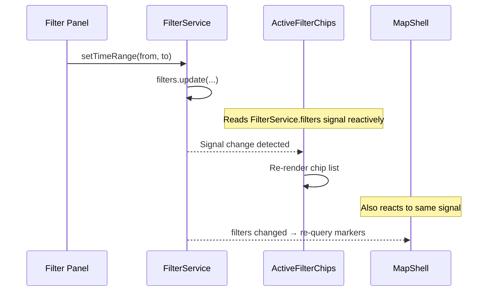
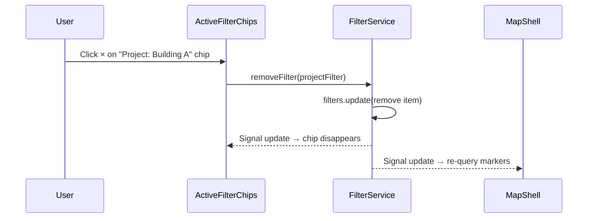

# Active Filter Chips — Implementation Blueprint

> **Spec**: [element-specs/active-filter-chips.md](../element-specs/active-filter-chips.md)
> **Status**: Not implemented. Depends entirely on FilterService (see [filter-panel blueprint](filter-panel.md)).

## Prerequisites

**FilterService must exist first.** See the [Filter Panel blueprint](filter-panel.md) for the complete `FilterService` contract including `ActiveFilter` types and `getChipLabel()`.

## Existing Infrastructure

| File                     | What it provides                               |
| ------------------------ | ---------------------------------------------- |
| `core/filter.service.ts` | **TO BE CREATED** — see filter-panel blueprint |

## Service Contract

### FilterService methods used by this component

```typescript
// From core/filter.service.ts (defined in filter-panel blueprint)
class FilterService {
  readonly filters: WritableSignal<ActiveFilter[]>; // all active filters
  readonly hasActiveFilters: Signal<boolean>; // computed: length > 0

  removeFilter(filter: ActiveFilter): void; // removes specific filter
  getChipLabel(filter: ActiveFilter): string; // human-readable label
}
```

### ActiveFilter union type (reference)

```typescript
export type ActiveFilter =
  | TimeRangeFilter // { type: 'time-range', from, to }
  | ProjectFilter // { type: 'project', projectId, projectName }
  | MetadataFilter // { type: 'metadata', keyId, keyName, value }
  | DistanceFilter // { type: 'distance', center, maxMeters }
  | RadiusFilter; // { type: 'radius', center, radiusMeters }
```

## Data Flow



### Chip Removal



## Component Implementation

```typescript
// File: features/map/filter-chips/active-filter-chips.component.ts
import { Component, inject } from "@angular/core";
import { FilterService, ActiveFilter } from "../../../core/filter.service";

@Component({
  selector: "ss-active-filter-chips",
  standalone: true,
  template: `
    @if (filterService.hasActiveFilters()) {
      <div class="filter-chips" role="list" aria-label="Active filters">
        @for (filter of filterService.filters(); track filter) {
          <button class="filter-chip" role="listitem" (click)="remove(filter)">
            <span class="filter-chip__label">{{
              filterService.getChipLabel(filter)
            }}</span>
            <span class="filter-chip__remove" aria-label="Remove filter"
              >×</span
            >
          </button>
        }
      </div>
    }
  `,
  styleUrl: "./active-filter-chips.component.scss",
})
export class ActiveFilterChipsComponent {
  protected readonly filterService = inject(FilterService);

  remove(filter: ActiveFilter): void {
    this.filterService.removeFilter(filter);
  }
}
```

## Wiring

```typescript
// In map-shell.component.html, add below search bar:
// <ss-active-filter-chips />

// In map-shell.component.ts imports array:
// imports: [..., ActiveFilterChipsComponent]
```

### Template placement in Map Shell

```html
<!-- map-shell.component.html -->
<div class="map-zone">
  <div #mapContainer class="map-container"></div>
  <ss-search-bar ... />
  <ss-active-filter-chips />
  <!-- NEW: positioned below search bar -->
  <ss-gps-button ... />
</div>
```

## Styling Notes

```scss
// active-filter-chips.component.scss
.filter-chips {
  display: flex;
  flex-wrap: wrap;
  gap: var(--spacing-2);
  padding: var(--spacing-2) var(--spacing-3);
}

.filter-chip {
  display: inline-flex;
  align-items: center;
  gap: var(--spacing-1);
  padding: var(--spacing-1) var(--spacing-2);
  background: var(--color-bg-elevated);
  border: 1px solid var(--color-border);
  border-radius: var(--radius-full);
  font-size: 0.75rem;
  cursor: pointer;

  &:hover {
    border-color: var(--color-border-strong);
  }

  &__remove {
    font-size: 0.875rem;
    opacity: 0.6;
    &:hover {
      opacity: 1;
    }
  }
}
```

## Missing Infrastructure

| What                 | Status                | Notes                                                |
| -------------------- | --------------------- | ---------------------------------------------------- |
| `FilterService`      | Must be created       | Defined in [filter-panel blueprint](filter-panel.md) |
| `ActiveFilter` types | Part of FilterService | Defined in [filter-panel blueprint](filter-panel.md) |

This component is intentionally simple — all logic lives in `FilterService`. The component is pure presentation.
