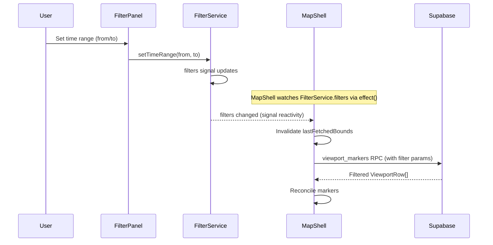
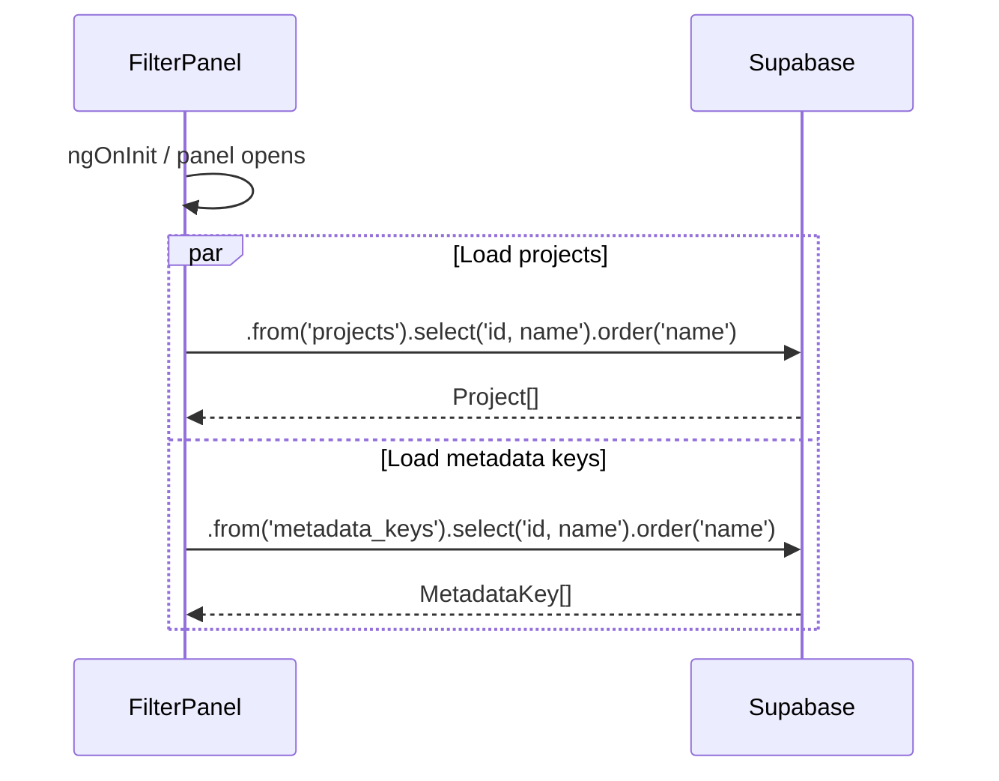
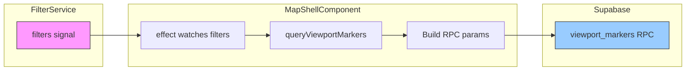

# Filter Panel — Implementation Blueprint

> **Spec**: [element-specs/filter-panel.md](../element-specs/filter-panel.md)
> **Status**: Not implemented. FilterService does not exist. No filter UI exists.

## Existing Infrastructure

| File                                            | What it provides                                      |
| ----------------------------------------------- | ----------------------------------------------------- |
| `core/supabase.service.ts`                      | `SupabaseService.client` for project/metadata queries |
| `features/map/map-shell/map-shell.component.ts` | Will consume FilterService to modify viewport queries |

**Nothing else exists for filtering.** This is a green-field implementation.

## Missing Infrastructure (must be created first)

### FilterService (core service)

```typescript
// File: core/filter.service.ts
import { Injectable, computed, signal } from "@angular/core";

export type FilterType =
  | "time-range"
  | "project"
  | "metadata"
  | "distance"
  | "radius";

export interface TimeRangeFilter {
  type: "time-range";
  from: string | null; // ISO date string
  to: string | null; // ISO date string
}

export interface ProjectFilter {
  type: "project";
  projectId: string;
  projectName: string; // for chip label
}

export interface MetadataFilter {
  type: "metadata";
  keyId: string;
  keyName: string; // for chip label
  value: string;
}

export interface DistanceFilter {
  type: "distance";
  center: { lat: number; lng: number };
  maxMeters: number;
}

export interface RadiusFilter {
  type: "radius";
  center: { lat: number; lng: number };
  radiusMeters: number;
}

export type ActiveFilter =
  | TimeRangeFilter
  | ProjectFilter
  | MetadataFilter
  | DistanceFilter
  | RadiusFilter;

@Injectable({ providedIn: "root" })
export class FilterService {
  // ── State ──
  readonly filters = signal<ActiveFilter[]>([]);
  readonly activeCount = computed(() => this.filters().length);
  readonly hasActiveFilters = computed(() => this.filters().length > 0);

  // ── Mutations ──
  setTimeRange(from: string | null, to: string | null): void {
    this.upsertFilter({ type: "time-range", from, to });
  }

  setProject(projectId: string, projectName: string): void {
    this.upsertFilter({ type: "project", projectId, projectName });
  }

  addMetadataFilter(keyId: string, keyName: string, value: string): void {
    // Metadata can have multiple key-value pairs
    this.filters.update((f) => [
      ...f,
      { type: "metadata", keyId, keyName, value },
    ]);
  }

  setDistance(center: { lat: number; lng: number }, maxMeters: number): void {
    this.upsertFilter({ type: "distance", center, maxMeters });
  }

  setRadiusFilter(
    center: { lat: number; lng: number },
    radiusMeters: number,
  ): void {
    this.upsertFilter({ type: "radius", center, radiusMeters });
  }

  removeFilter(filter: ActiveFilter): void {
    this.filters.update((f) => f.filter((existing) => existing !== filter));
  }

  removeFilterByType(type: FilterType): void {
    this.filters.update((f) => f.filter((existing) => existing.type !== type));
  }

  clearAll(): void {
    this.filters.set([]);
  }

  // ── Query building ──
  /** Returns Supabase query modifiers for the current filter set */
  buildQueryParams(): FilterQueryParams {
    const filters = this.filters();
    const params: FilterQueryParams = {};

    for (const filter of filters) {
      switch (filter.type) {
        case "time-range":
          if (filter.from) params.capturedAfter = filter.from;
          if (filter.to) params.capturedBefore = filter.to;
          break;
        case "project":
          params.projectId = filter.projectId;
          break;
        case "distance":
          params.distanceCenter = filter.center;
          params.distanceMaxMeters = filter.maxMeters;
          break;
        case "radius":
          params.radiusCenter = filter.center;
          params.radiusMeters = filter.radiusMeters;
          break;
      }
    }

    params.metadataFilters = filters
      .filter((f): f is MetadataFilter => f.type === "metadata")
      .map((f) => ({ keyId: f.keyId, value: f.value }));

    return params;
  }

  // ── Chip labels ──
  getChipLabel(filter: ActiveFilter): string {
    switch (filter.type) {
      case "time-range":
        return `Date: ${filter.from ?? "…"} – ${filter.to ?? "…"}`;
      case "project":
        return `Project: ${filter.projectName}`;
      case "metadata":
        return `${filter.keyName}: ${filter.value}`;
      case "distance":
        return `Within ${filter.maxMeters}m`;
      case "radius":
        return `Radius: ${filter.radiusMeters}m`;
    }
  }

  // ── Private ──
  private upsertFilter(filter: ActiveFilter): void {
    this.filters.update((f) => [
      ...f.filter((existing) => existing.type !== filter.type),
      filter,
    ]);
  }
}

/** Maps to SQL param names: capturedAfter → filter_captured_after, capturedBefore → filter_captured_before */
export interface FilterQueryParams {
  capturedAfter?: string;
  capturedBefore?: string;
  projectId?: string;
  distanceCenter?: { lat: number; lng: number };
  distanceMaxMeters?: number;
  radiusCenter?: { lat: number; lng: number };
  radiusMeters?: number;
  metadataFilters?: { keyId: string; value: string }[];
}
```

## Data Flow

### Filter Panel → FilterService → Map Markers



### Filter Panel Data Loading



### Filter Integration with Viewport Query



> **Note:** The current `viewport_markers` RPC does NOT accept filter parameters. It will need to be extended with optional filter params (project_id, captured_after, captured_before, etc.) or a new filtered RPC must be created.

## Database Layer

### Queries for Filter Options

```typescript
// Load projects for dropdown
const { data: projects } = await this.supabase.client
  .from("projects")
  .select("id, name")
  .order("name");

// Load metadata keys for dropdown
const { data: keys } = await this.supabase.client
  .from("metadata_keys")
  .select("id, name")
  .order("name");
```

### Extended viewport_markers RPC (needs migration)

> **Migration required.** Create `supabase/migrations/<timestamp>_extend_viewport_markers_filters.sql` with the SQL below.

```sql
-- The current viewport_markers RPC needs optional filter parameters:
CREATE OR REPLACE FUNCTION viewport_markers(
  min_lat numeric, min_lng numeric, max_lat numeric, max_lng numeric, zoom int,
  -- New optional filter params:
  filter_project_id uuid DEFAULT NULL,
  filter_captured_after timestamptz DEFAULT NULL,
  filter_captured_before timestamptz DEFAULT NULL,
  filter_distance_lat numeric DEFAULT NULL,
  filter_distance_lng numeric DEFAULT NULL,
  filter_distance_meters numeric DEFAULT NULL
)
-- Add WHERE clauses:
-- AND (filter_project_id IS NULL OR i.project_id = filter_project_id)
-- AND (filter_captured_after IS NULL OR i.captured_at >= filter_captured_after)
-- AND (filter_captured_before IS NULL OR i.captured_at <= filter_captured_before)
-- AND (filter_distance_lat IS NULL OR ST_DWithin(i.geog, ST_Point(filter_distance_lng, filter_distance_lat)::geography, filter_distance_meters))
```

### Relevant Tables

| Table            | Used For                                                    |
| ---------------- | ----------------------------------------------------------- |
| `projects`       | Project filter dropdown (`id`, `name`)                      |
| `metadata_keys`  | Metadata filter key dropdown (`id`, `name`)                 |
| `image_metadata` | Metadata filter matching (`key_id`, `value`)                |
| `images`         | All filtering targets (`project_id`, `captured_at`, `geog`) |

## Type Definitions

```typescript
// Already defined above in FilterService section
// Additional component-level types:

interface Project {
  id: string;
  name: string;
}

interface MetadataKey {
  id: string;
  name: string;
}
```

## Component State

```typescript
// FilterPanelComponent signals
isOpen = signal(false);
expandedGroups = signal<Set<string>>(new Set());
projects = signal<Project[]>([]);
metadataKeys = signal<MetadataKey[]>([]);
loadingProjects = signal(false);
loadingKeys = signal(false);

// Injected
filterService = inject(FilterService);
supabase = inject(SupabaseService);

// Methods
toggleGroup(groupId: string): void;
onTimeRangeChange(from: string | null, to: string | null): void;
onProjectSelect(project: Project): void;
onMetadataAdd(keyId: string, keyName: string, value: string): void;
onDistanceChange(maxMeters: number): void;
onClearAll(): void;
close(): void;
```

## Wiring to MapShellComponent

```typescript
// In MapShellComponent, add:
private filterService = inject(FilterService);

// Add effect to re-query when filters change:
constructor() {
  afterNextRender(() => { this.initMap(); });

  effect(() => {
    const filters = this.filterService.filters();
    // Invalidate cached bounds to force re-query
    this.lastFetchedBounds = null;
    this.lastFetchedZoom = null;
    if (this.map) {
      void this.queryViewportMarkers();
    }
  });
}

// Modify queryViewportMarkers to include filter params:
private async queryViewportMarkers(): Promise<void> {
  const filterParams = this.filterService.buildQueryParams();
  const { data } = await this.supabaseService.client
    .rpc('viewport_markers', {
      min_lat: fetchSouth,
      min_lng: fetchWest,
      max_lat: fetchNorth,
      max_lng: fetchEast,
      zoom: roundedZoom,
      filter_project_id: filterParams.projectId ?? null,
      filter_captured_after: filterParams.capturedAfter ?? null,
      filter_captured_before: filterParams.capturedBefore ?? null,
      filter_distance_lat: filterParams.distanceCenter?.lat ?? null,
      filter_distance_lng: filterParams.distanceCenter?.lng ?? null,
      filter_distance_meters: filterParams.distanceMaxMeters ?? null,
    });
}
```
