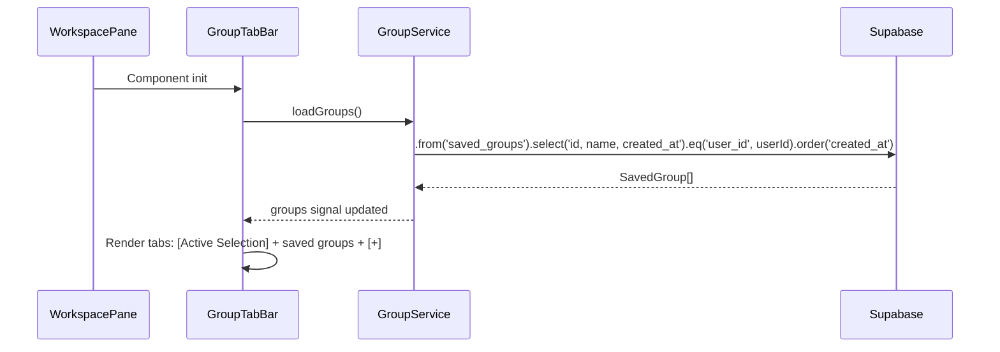
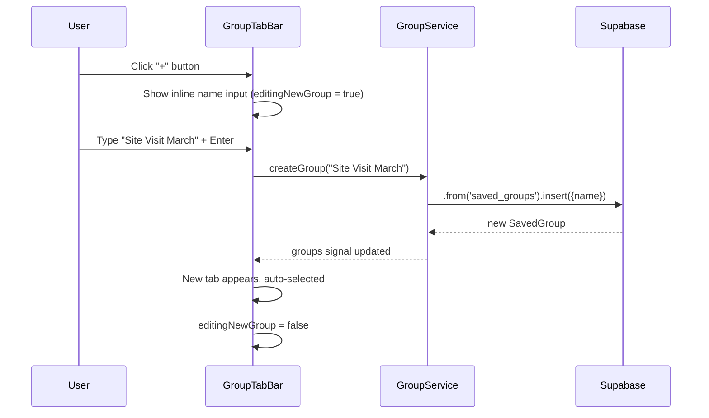
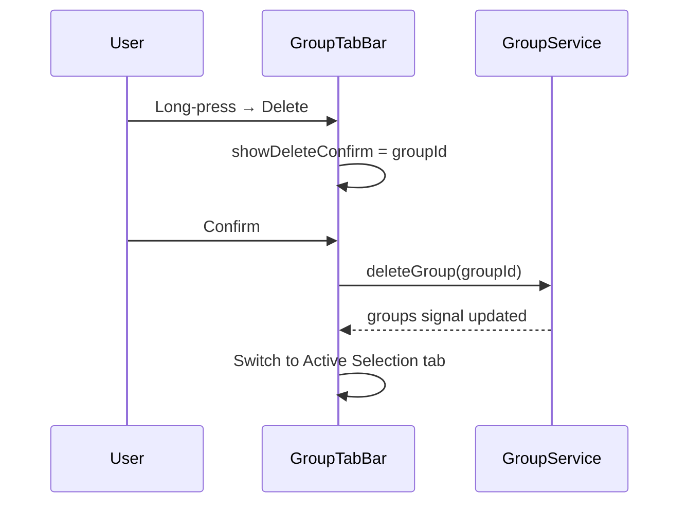

# Group Tab Bar — Implementation Blueprint

> **Spec**: [element-specs/group-tab-bar.md](../element-specs/group-tab-bar.md)
> **Status**: Not implemented. GroupService does not exist. `saved_groups` table exists but has no service layer.

## Existing Infrastructure

| File                                            | What it provides                               |
| ----------------------------------------------- | ---------------------------------------------- |
| `supabase/migrations/20260303000002_tables.sql` | `saved_groups` and `saved_group_images` tables |

**Everything else must be created.**

## Missing Infrastructure (must be created first)

### GroupService

```typescript
// File: core/group.service.ts
import { Injectable, inject, signal, computed } from "@angular/core";
import { SupabaseService } from "./supabase.service";

export interface SavedGroup {
  id: string;
  name: string;
  imageCount: number;
  createdAt: string;
  updatedAt: string;
}

@Injectable({ providedIn: "root" })
export class GroupService {
  private readonly supabase = inject(SupabaseService);

  readonly groups = signal<SavedGroup[]>([]);
  readonly loading = signal(false);

  /** Load all saved groups for the current user */
  async loadGroups(): Promise<void> {
    this.loading.set(true);
    const { data, error } = await this.supabase.client
      .from("saved_groups")
      .select("id, name, created_at, updated_at, saved_group_images(count)")
      .order("updated_at", { ascending: false });

    if (!error && data) {
      this.groups.set(
        data.map((row) => ({
          id: row.id,
          name: row.name,
          imageCount: row.saved_group_images?.[0]?.count ?? 0,
          createdAt: row.created_at,
          updatedAt: row.updated_at,
        })),
      );
    }
    this.loading.set(false);
  }

  /** Create a new empty group */
  async createGroup(name: string): Promise<SavedGroup | null> {
    const { data, error } = await this.supabase.client
      .from("saved_groups")
      .insert({ name })
      .select("id, name, created_at, updated_at")
      .single();

    if (error || !data) return null;

    const group: SavedGroup = {
      id: data.id,
      name: data.name,
      imageCount: 0,
      createdAt: data.created_at,
      updatedAt: data.updated_at,
    };
    this.groups.update((g) => [...g, group]);
    return group;
  }

  /** Rename an existing group */
  async renameGroup(groupId: string, newName: string): Promise<boolean> {
    const { error } = await this.supabase.client
      .from("saved_groups")
      .update({ name: newName })
      .eq("id", groupId);

    if (error) return false;

    this.groups.update((g) =>
      g.map((group) =>
        group.id === groupId ? { ...group, name: newName } : group,
      ),
    );
    return true;
  }

  /** Delete a group and its image associations */
  async deleteGroup(groupId: string): Promise<boolean> {
    // saved_group_images rows cascade-delete via FK
    const { error } = await this.supabase.client
      .from("saved_groups")
      .delete()
      .eq("id", groupId);

    if (error) return false;

    this.groups.update((g) => g.filter((group) => group.id !== groupId));
    return true;
  }

  /** Add images to a group */
  async addImagesToGroup(
    groupId: string,
    imageIds: string[],
  ): Promise<boolean> {
    const rows = imageIds.map((imageId) => ({
      group_id: groupId,
      image_id: imageId,
    }));
    const { error } = await this.supabase.client
      .from("saved_group_images")
      .upsert(rows, { onConflict: "group_id,image_id" });

    if (error) return false;

    // Update local count
    this.groups.update((g) =>
      g.map((group) =>
        group.id === groupId
          ? { ...group, imageCount: group.imageCount + imageIds.length }
          : group,
      ),
    );
    return true;
  }

  /** Remove an image from a group */
  async removeImageFromGroup(
    groupId: string,
    imageId: string,
  ): Promise<boolean> {
    const { error } = await this.supabase.client
      .from("saved_group_images")
      .delete()
      .eq("group_id", groupId)
      .eq("image_id", imageId);

    if (error) return false;

    this.groups.update((g) =>
      g.map((group) =>
        group.id === groupId
          ? { ...group, imageCount: Math.max(0, group.imageCount - 1) }
          : group,
      ),
    );
    return true;
  }

  /** Load image IDs belonging to a group */
  async loadGroupImageIds(groupId: string): Promise<string[]> {
    const { data } = await this.supabase.client
      .from("saved_group_images")
      .select("image_id")
      .eq("group_id", groupId)
      .order("added_at", { ascending: false });

    return data?.map((row) => row.image_id) ?? [];
  }
}
```

## Data Flow

### Tab Bar Lifecycle



### Create New Group



### Rename Group

```mermaid
sequenceDiagram
    participant User
    participant TabBar as GroupTabBar
    participant GroupService
    participant Supabase

    User->>TabBar: Long-press named tab
    TabBar->>TabBar: Show context menu (Rename, Delete)
    User->>TabBar: Select "Rename"
    TabBar->>TabBar: editingTabId.set(groupId)
    Note over TabBar: Tab label becomes <input> with current name
    User->>TabBar: Edit name + press Enter
    TabBar->>GroupService: renameGroup(groupId, newName)
    GroupService->>Supabase: .from('saved_groups').update({name})
    Supabase-->>GroupService: success
    GroupService-->>TabBar: groups signal updated
    TabBar->>TabBar: editingTabId.set(null)
```



### Delete Group



## Database Layer

### saved_groups table

```sql
-- From migration 20260303000002_tables.sql
CREATE TABLE saved_groups (
  id         uuid PRIMARY KEY DEFAULT gen_random_uuid(),
  user_id    uuid REFERENCES auth.users(id),
  name       text NOT NULL,
  created_at timestamptz DEFAULT now(),
  updated_at timestamptz DEFAULT now()
);
-- Index: idx_saved_groups_user_id ON saved_groups(user_id)
-- RLS scopes to user_id = auth.uid()
```

### saved_group_images table

```sql
CREATE TABLE saved_group_images (
  id       uuid PRIMARY KEY DEFAULT gen_random_uuid(),
  group_id uuid REFERENCES saved_groups(id) ON DELETE CASCADE,
  image_id uuid REFERENCES images(id) ON DELETE CASCADE,
  added_at timestamptz DEFAULT now(),
  UNIQUE(group_id, image_id)
);
```

### Queries

```typescript
// Load groups with image count
.from('saved_groups')
.select('id, name, created_at, updated_at, saved_group_images(count)')
.order('updated_at', { ascending: false })

// Create group
.from('saved_groups').insert({ name }).select().single()

// Rename group
.from('saved_groups').update({ name: newName }).eq('id', groupId)

// Delete group (cascade deletes saved_group_images)
.from('saved_groups').delete().eq('id', groupId)

// Add images to group (upsert handles duplicates)
.from('saved_group_images').upsert(rows, { onConflict: 'group_id,image_id' })

// Load group images
.from('saved_group_images').select('image_id').eq('group_id', groupId)
```

## Component Implementation

```typescript
// File: features/map/workspace-pane/group-tab-bar.component.ts
@Component({
  selector: "ss-group-tab-bar",
  standalone: true,
  templateUrl: "./group-tab-bar.component.html",
  styleUrl: "./group-tab-bar.component.scss",
})
export class GroupTabBarComponent {
  activeTabId = input.required<string>();
  tabChanged = output<string>();

  protected readonly groupService = inject(GroupService);
  protected readonly selectionService = inject(SelectionService);

  editingTabId = signal<string | null>(null);
  editingNewGroup = signal(false);
  showContextMenuForId = signal<string | null>(null);
  showDeleteConfirmForId = signal<string | null>(null);

  selectionLabel = computed(() => {
    const count = this.selectionService.selectionCount();
    return count > 0 ? `(${count}) Selection` : "Selection";
  });

  constructor() {
    // Load groups on init
    afterNextRender(() => {
      void this.groupService.loadGroups();
    });
  }

  selectTab(tabId: string): void {
    this.tabChanged.emit(tabId);
  }

  async createGroup(name: string): Promise<void> {
    const group = await this.groupService.createGroup(name);
    if (group) {
      this.tabChanged.emit(group.id);
      this.editingNewGroup.set(false);
    }
  }

  async renameGroup(groupId: string, newName: string): Promise<void> {
    await this.groupService.renameGroup(groupId, newName);
    this.editingTabId.set(null);
  }

  async deleteGroup(groupId: string): Promise<void> {
    await this.groupService.deleteGroup(groupId);
    this.showDeleteConfirmForId.set(null);
    this.tabChanged.emit("selection");
  }

  // Context menu on long-press (500ms pointerdown timer)
  private longPressTimer: ReturnType<typeof setTimeout> | null = null;

  onTabPointerDown(groupId: string): void {
    this.longPressTimer = setTimeout(() => {
      this.showContextMenuForId.set(groupId);
    }, 500); // long-press threshold ms
  }

  onTabPointerUp(): void {
    if (this.longPressTimer) {
      clearTimeout(this.longPressTimer);
      this.longPressTimer = null;
    }
  }
}
```
