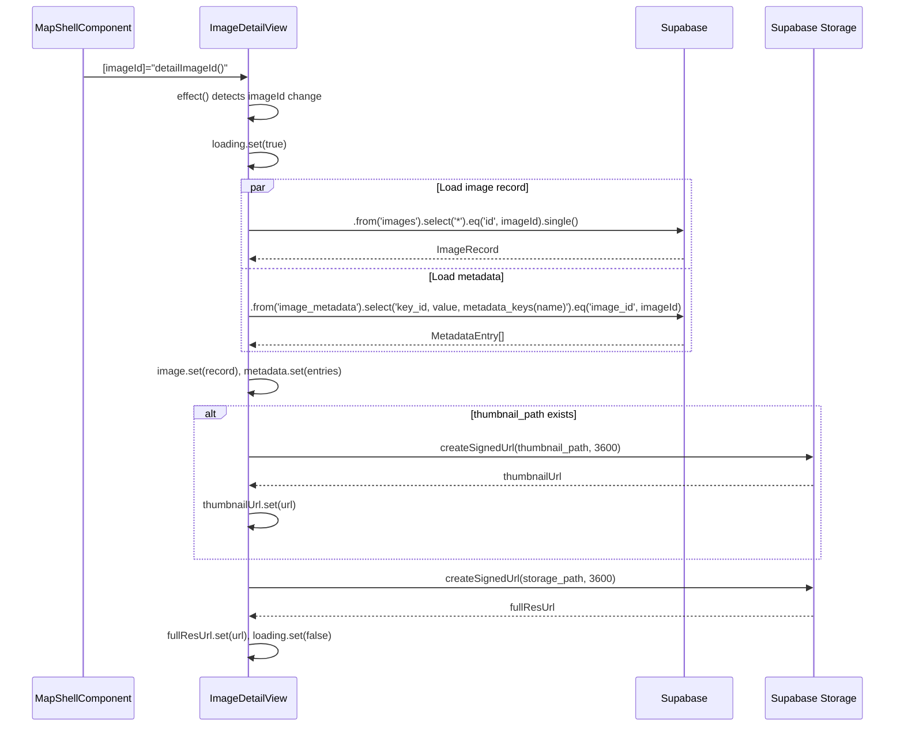
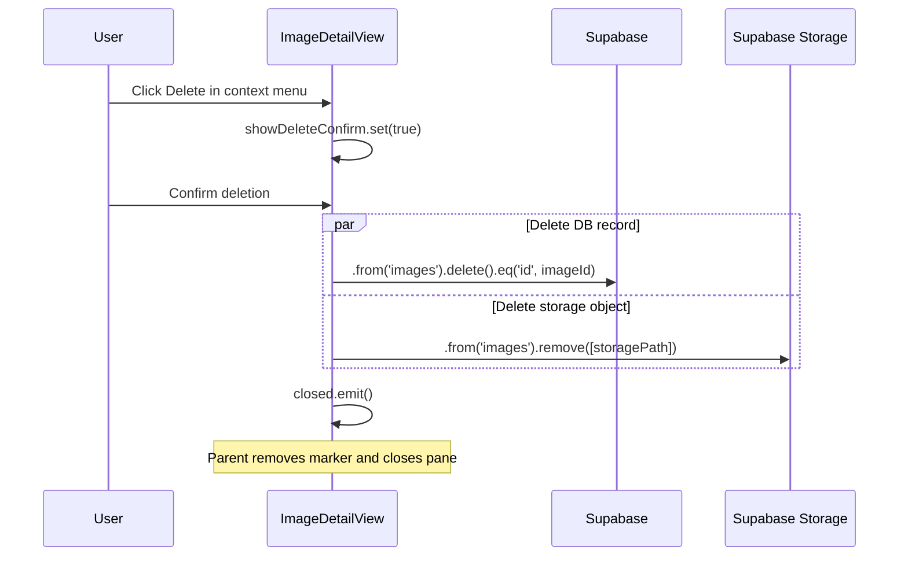

# Image Detail View — Implementation Blueprint

> **Spec**: [element-specs/image-detail-view.md](../element-specs/image-detail-view.md)
> **Status**: Partially implemented — component exists with basic image display, metadata rendering, and signed URL loading. Missing: inline metadata editing, group picker, correction flow, delete confirmation.

## Existing Infrastructure

| File                                                         | What it provides                                           |
| ------------------------------------------------------------ | ---------------------------------------------------------- |
| `features/map/workspace-pane/image-detail-view.component.ts` | Component with signals, image loading, signed URLs         |
| `core/supabase.service.ts`                                   | `SupabaseService.client` for queries                       |
| `core/upload.service.ts`                                     | `UploadService.getSignedUrl(storagePath)` — 1hr signed URL |

## Service Contract

### ImageDetailViewComponent (already exists)

```typescript
// File: features/map/workspace-pane/image-detail-view.component.ts

// ── Inputs ──
imageId: InputSignal<string | null>; // which image to display

// ── Signals ──
image: WritableSignal<ImageRecord | null>; // loaded image record
metadata: WritableSignal<MetadataEntry[]>; // key-value metadata pairs
fullResLoaded: WritableSignal<boolean>; // full-res loaded flag
loading: WritableSignal<boolean>;
error: WritableSignal<string | null>;
fullResUrl: WritableSignal<string | null>; // signed URL for original
thumbnailUrl: WritableSignal<string | null>; // signed URL for thumbnail
showContextMenu: WritableSignal<boolean>;
showDeleteConfirm: WritableSignal<boolean>;

// ── Computed ──
isCorrected: Signal<boolean>; // corrected_latitude != null
displayTitle: Signal<string>; // address_label ?? filename from storage_path
captureDate: Signal<string>; // formatted captured_at or created_at

// ── Outputs ──
closed: OutputEmitterRef<void>;
editLocationRequested: OutputEmitterRef<string>; // emits imageId
```

### ImageRecord type (defined in component file)

```typescript
interface ImageRecord {
  id: string;
  user_id: string;
  organization_id: string | null;
  latitude: number | null;
  longitude: number | null;
  exif_latitude: number | null;
  exif_longitude: number | null;
  corrected_latitude: number | null; // NOTE: does not exist in DB yet
  corrected_longitude: number | null; // NOTE: does not exist in DB yet
  storage_path: string;
  thumbnail_path: string | null;
  captured_at: string | null;
  created_at: string;
  address_label: string | null;
  location_unresolved: boolean | null;
}
```

> **Important:** The `images` table does NOT have `corrected_latitude`/`corrected_longitude` columns. Correction is determined by comparing `latitude`/`longitude` vs `exif_latitude`/`exif_longitude`. The `coordinate_corrections` table logs the history.

## Data Flow

### Image Loading



### Metadata Inline Edit (to be implemented)

```mermaid
sequenceDiagram
    participant User
    participant Detail as ImageDetailView
    participant Supabase

    User->>Detail: Click metadata value text
    Detail->>Detail: editingKey.set(metadataKeyId)
    Note over Detail: Value text becomes <input>

    User->>Detail: Type new value, press Enter (or blur)
    Detail->>Supabase: .from('image_metadata').update({ value: newValue }).eq('image_id', imageId).eq('key_id', keyId)
    Supabase-->>Detail: success
    Detail->>Detail: Update local metadata array
    Detail->>Detail: editingKey.set(null)
```



### Delete Flow (to be implemented)



## Database Layer

### Queries

```typescript
// Load image record
const { data: image } = await this.supabase.client
  .from("images")
  .select("*")
  .eq("id", imageId)
  .single();

// Load metadata with key names (join)
const { data: metadata } = await this.supabase.client
  .from("image_metadata")
  .select("key_id, value, metadata_keys(name)")
  .eq("image_id", imageId);

// Update metadata value
const { error } = await this.supabase.client
  .from("image_metadata")
  .update({ value: newValue })
  .eq("image_id", imageId)
  .eq("key_id", keyId);

// Delete image record
const { error } = await this.supabase.client
  .from("images")
  .delete()
  .eq("id", imageId);

// Delete from storage
const { error } = await this.supabase.client.storage
  .from("images")
  .remove([storagePath]);

// Load correction history
const { data: corrections } = await this.supabase.client
  .from("coordinate_corrections")
  .select("*")
  .eq("image_id", imageId)
  .order("corrected_at", { ascending: false });
```

### Relevant Tables

| Table                    | Columns Used                                                                                                                                                             |
| ------------------------ | ------------------------------------------------------------------------------------------------------------------------------------------------------------------------ |
| `images`                 | `id`, `user_id`, `storage_path`, `thumbnail_path`, `latitude`, `longitude`, `exif_latitude`, `exif_longitude`, `direction`, `captured_at`, `created_at`, `address_label` |
| `image_metadata`         | `image_id`, `key_id`, `value`                                                                                                                                            |
| `metadata_keys`          | `id`, `name` (joined via `image_metadata.key_id`)                                                                                                                        |
| `coordinate_corrections` | `image_id`, `old_latitude`, `old_longitude`, `new_latitude`, `new_longitude`, `corrected_at`, `corrected_by`                                                             |

## Type Definitions

### MetadataEntry

```typescript
// To be standardized — currently inline in component
interface MetadataEntry {
  keyId: string;
  keyName: string; // from metadata_keys.name join
  value: string;
}
```

### CorrectionRecord

```typescript
// For the correction history section
interface CorrectionRecord {
  id: string;
  old_latitude: number;
  old_longitude: number;
  new_latitude: number;
  new_longitude: number;
  corrected_at: string;
  corrected_by: string;
}
```

## Missing Infrastructure

| What                       | Why Needed                                     | Proposed Location                                                                |
| -------------------------- | ---------------------------------------------- | -------------------------------------------------------------------------------- |
| Inline edit component      | Click-to-edit metadata values (Notion pattern) | `features/map/workspace-pane/metadata-property-row.component.ts` (spec File Map) |
| Group picker               | "Add to group" modal/dropdown                  | `shared/group-picker/group-picker.component.ts`                                  |
| GroupService               | CRUD for saved_groups                          | `core/group.service.ts`                                                          |
| Correction mode            | "Edit location" → drag marker on map           | Extension of MapShellComponent                                                   |
| Delete confirmation dialog | Modal confirm before image deletion            | Inline in component (simple conditional template)                                |

### MetadataPropertyRowComponent (to be created)

```typescript
// File: features/map/workspace-pane/metadata-property-row.component.ts
@Component({
  selector: "app-metadata-property-row",
  standalone: true,
  template: `...`, // inline
})
export class MetadataPropertyRowComponent {
  keyName = input.required<string>();
  value = input.required<string>();
  editing = input<boolean>(false);

  valueChanged = output<string>(); // emits new value on Enter/blur
  editRequested = output<void>(); // emits when value text is clicked
}
```
