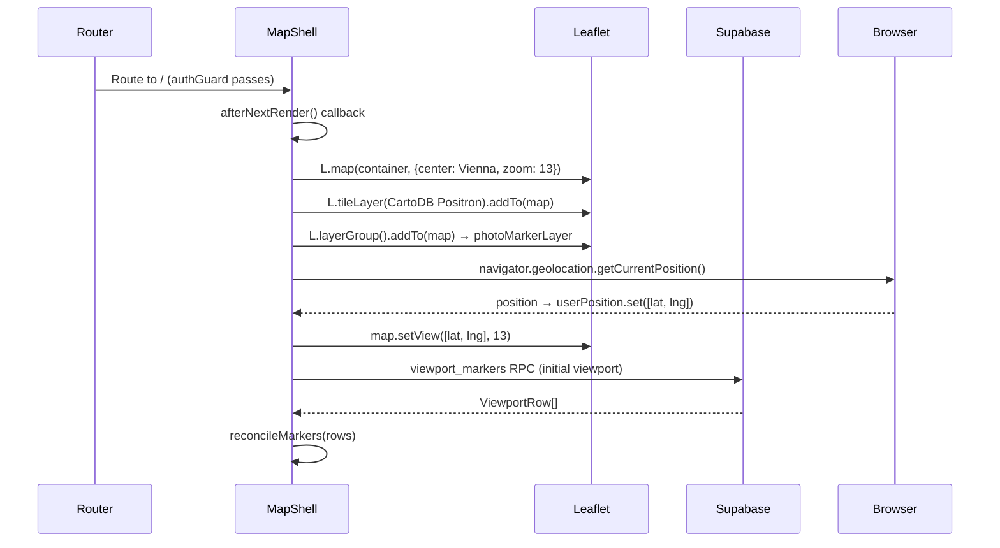
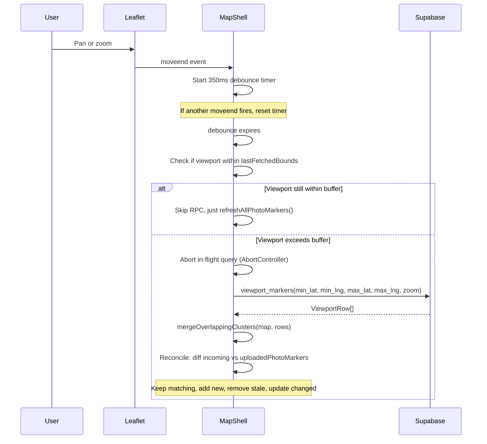

# Map Shell — Implementation Blueprint

> **Spec**: [element-specs/map-shell.md](../element-specs/map-shell.md)
> **Interaction scenarios**: [use-cases/map-shell.md](../use-cases/map-shell.md)
> **Status**: Partially implemented — core map, upload, search, GPS, markers work. Missing sidebar, workspace pane integration, responsive bottom bar.

## Existing Infrastructure

These files already exist and are verified:

| File                                              | What it provides                                                         |
| ------------------------------------------------- | ------------------------------------------------------------------------ |
| `features/map/map-shell/map-shell.component.ts`   | Main component (~950 lines)                                              |
| `features/map/map-shell/map-shell.component.html` | Template                                                                 |
| `features/map/map-shell/map-shell.component.scss` | Styles                                                                   |
| `features/map/map-shell/map-shell-helpers.ts`     | Viewport query helpers, marker types, clustering                         |
| `core/supabase.service.ts`                        | `SupabaseService.client` — raw Supabase client                           |
| `core/map-adapter.ts`                             | Abstract `MapAdapter` class (minimal: `getCurrentPosition()`, `panTo()`) |
| `core/map/marker-factory.ts`                      | `buildPhotoMarkerHtml()`, icon constants                                 |
| `core/upload.service.ts`                          | `UploadService` — file validation, EXIF, upload                          |
| `core/search/search-orchestrator.service.ts`      | Search pipeline                                                          |
| `core/auth.service.ts`                            | `AuthService` — session, user signals                                    |
| `core/toast.service.ts`                           | `ToastService.show()`                                                    |

## Service Contract

### MapShellComponent (already exists)

```typescript
// ── Signals (public, readonly) ──────────────────────────
uploadPanelPinned:       WritableSignal<boolean>           // default: false
uploadPanelOpen:         Signal<boolean>                    // computed: alias of uploadPanelPinned
placementActive:         WritableSignal<boolean>            // default: false
searchPlacementActive:   WritableSignal<boolean>            // default: false
userPosition:            WritableSignal<[number, number] | null>  // default: null
gpsLocating:             WritableSignal<boolean>            // default: false
photoPanelOpen:          WritableSignal<boolean>            // default: false
workspacePaneWidth:      WritableSignal<number>             // default: 360
selectedMarkerKey:       WritableSignal<string | null>      // default: null
detailImageId:           WritableSignal<string | null>      // default: null
selectedMarkerThumbnail: Signal<string | null>              // computed from selectedMarkerKey
selectedMarkerImageId:   Signal<string | null>              // computed from selectedMarkerKey

// ── Public methods ──────────────────────────────────────
toggleUploadPanel(): void
onImageUploaded(event: ImageUploadedEvent): void
enterPlacementMode(key: string): void
cancelPlacement(): void
goToUserPosition(): void
onSearchMapCenterRequested(event: { lat: number; lng: number; label: string }): void
onSearchClearRequested(): void
onSearchDropPinRequested(): void
onWorkspaceWidthChange(newWidth: number): void
closeDetailView(): void
openDetailView(imageId: string): void
onEditLocationRequested(imageId: string): void
```

### MapAdapter (abstract — needs concrete implementation)

```typescript
// File: core/map-adapter.ts (already exists but minimal)
export interface LatLng {
  lat: number;
  lng: number;
}

export abstract class MapAdapter {
  abstract getCurrentPosition(): Promise<LatLng>;
  abstract panTo(coords: LatLng): void;
}
```

> **Note:** The current MapShellComponent calls Leaflet directly via `this.map` rather than going through `MapAdapter`. To converge on the adapter pattern required by AGENTS.md, new map operations should be added to `MapAdapter` first, then called from the component. Existing direct calls should be migrated incrementally — see `docs/architecture.md` for the adapter contract.

## Data Flow

### Map Initialization



### Viewport Query Cycle (on pan/zoom)



### Placement Mode Flow

```mermaid
stateDiagram-v2
    [*] --> Normal
    Normal --> UploadPlacement: enterPlacementMode(key)
    Normal --> SearchPlacement: onSearchDropPinRequested()

    UploadPlacement --> Normal: cancelPlacement()
    UploadPlacement --> Normal: handleMapClick() → placeFile(key, coords)

    SearchPlacement --> Normal: cancelPlacement()
    SearchPlacement --> Normal: handleMapClick() → renderSearchLocationMarker()

    state UploadPlacement {
        note: placementActive=true, crosshair cursor
    }
    state SearchPlacement {
        note: searchPlacementActive=true, crosshair cursor
    }
```

## Database Layer

### viewport_markers RPC

```sql
-- Called by: MapShellComponent.queryViewportMarkers()
-- File: supabase/migrations/20260308000001_viewport_markers_rpc.sql
viewport_markers(
  min_lat  numeric,   -- south bound (with 10% buffer)
  min_lng  numeric,   -- west bound (with 10% buffer)
  max_lat  numeric,   -- north bound (with 10% buffer)
  max_lng  numeric,   -- east bound (with 10% buffer)
  zoom     int        -- current map zoom (rounded)
)
RETURNS TABLE (
  cluster_lat    numeric,       -- centroid of grid cell
  cluster_lng    numeric,
  image_count    bigint,        -- images in this cell
  image_id       uuid,          -- non-null only when count=1
  direction      numeric,       -- EXIF bearing (count=1 only)
  storage_path   text,          -- (count=1 only)
  thumbnail_path text,          -- (count=1 only)
  exif_latitude  numeric,       -- original EXIF (count=1 only)
  exif_longitude numeric,
  created_at     timestamptz
)
-- Security: SECURITY DEFINER, filters by user's org
-- Clustering: Uses ST_SnapToGrid with zoom-dependent cell size
```

### Invocation from TypeScript

```typescript
// In MapShellComponent.queryViewportMarkers():
const { data, error } = await this.supabaseService.client
  .rpc("viewport_markers", {
    min_lat: fetchSouth,
    min_lng: fetchWest,
    max_lat: fetchNorth,
    max_lng: fetchEast,
    zoom: roundedZoom,
  })
  .abortSignal(this.viewportQueryController!.signal);
```

## Type Definitions

### ViewportRow (in map-shell-helpers.ts)

```typescript
export type ViewportRow = {
  cluster_lat: number;
  cluster_lng: number;
  image_count: number;
  image_id: string | null;
  direction: number | null;
  storage_path: string | null;
  thumbnail_path: string | null;
  exif_latitude: number | null;
  exif_longitude: number | null;
  created_at: string | null;
};
```

### PhotoMarkerState (in map-shell-helpers.ts)

```typescript
export type PhotoMarkerState = {
  marker: L.Marker;
  count: number;
  lat: number;
  lng: number;
  thumbnailUrl?: string;
  thumbnailSourcePath?: string;
  direction?: number;
  corrected?: boolean;
  uploading?: boolean;
  optimistic?: boolean;
  lastRendered?: MarkerVisualSnapshot;
};
```

### ImageUploadedEvent (in upload-panel.component.ts)

```typescript
export interface ImageUploadedEvent {
  id: string;
  lat: number;
  lng: number;
  thumbnailUrl?: string;
  direction?: number;
}
```

## Key Implementation Patterns

### Marker Key Generation

```typescript
// Rounds to 4 decimal places (~11m precision) for client-side grouping
private toMarkerKey(lat: number, lng: number): string {
  return `${lat.toFixed(4)},${lng.toFixed(4)}`;
}
```

### Zoom Level Thresholds

```typescript
private getZoomLevel(): PhotoMarkerZoomLevel {
  const zoom = this.map?.getZoom() ?? 13;
  if (zoom <= 12) return 'far';
  if (zoom <= 15) return 'mid';
  return 'near';
}
```

### Buffered Viewport Request

```typescript
// In map-shell-helpers.ts — already exists
export function buildBufferedViewportRequest(
  bounds: L.LatLngBounds,
  zoom: number,
) {
  const latPad = (bounds.getNorth() - bounds.getSouth()) * 0.1;
  const lngPad = (bounds.getEast() - bounds.getWest()) * 0.1;
  return {
    fetchSouth: bounds.getSouth() - latPad,
    fetchWest: bounds.getWest() - lngPad,
    fetchNorth: bounds.getNorth() + latPad,
    fetchEast: bounds.getEast() + lngPad,
    roundedZoom: Math.round(zoom),
    fetchedBounds: L.latLngBounds(
      [bounds.getSouth() - latPad, bounds.getWest() - lngPad],
      [bounds.getNorth() + latPad, bounds.getEast() + lngPad],
    ),
  };
}
```

## Missing Infrastructure

| What                     | File to Create                                            | Why                                                              |
| ------------------------ | --------------------------------------------------------- | ---------------------------------------------------------------- |
| Sidebar component        | `features/sidebar/sidebar.component.ts`                   | Left rail navigation (desktop) / bottom bar (mobile)             |
| Workspace Pane component | `features/map/workspace-pane/workspace-pane.component.ts` | Right panel — currently ImageDetailView is directly in map-shell |
| FilterService            | `core/filter.service.ts`                                  | Holds active filters, emits changes for viewport re-query        |
| SelectionService         | `core/selection.service.ts`                               | Manages Active Selection image IDs across components             |
| Concrete MapAdapter      | Extend `MapAdapter` or refactor map-shell                 | Current code bypasses the adapter pattern                        |

## Wiring Summary

```
app.routes.ts
  └── '/' → MapShellComponent (lazy, authGuard)

MapShellComponent template:
  ├── <div #mapContainer>                    ← Leaflet mounts here
  ├── <app-upload-panel>                     ← upload panel (toggle via uploadPanelPinned)
  ├── <ss-search-bar>                        ← search (outputs: mapCenterRequested, clearRequested, dropPinRequested)
  ├── <ss-gps-button>                        ← GPS (calls goToUserPosition via parent)
  ├── <app-drag-divider>                     ← resize handle (when photoPanelOpen)
  └── <app-image-detail-view>                ← detail view (when detailImageId is set)
```
