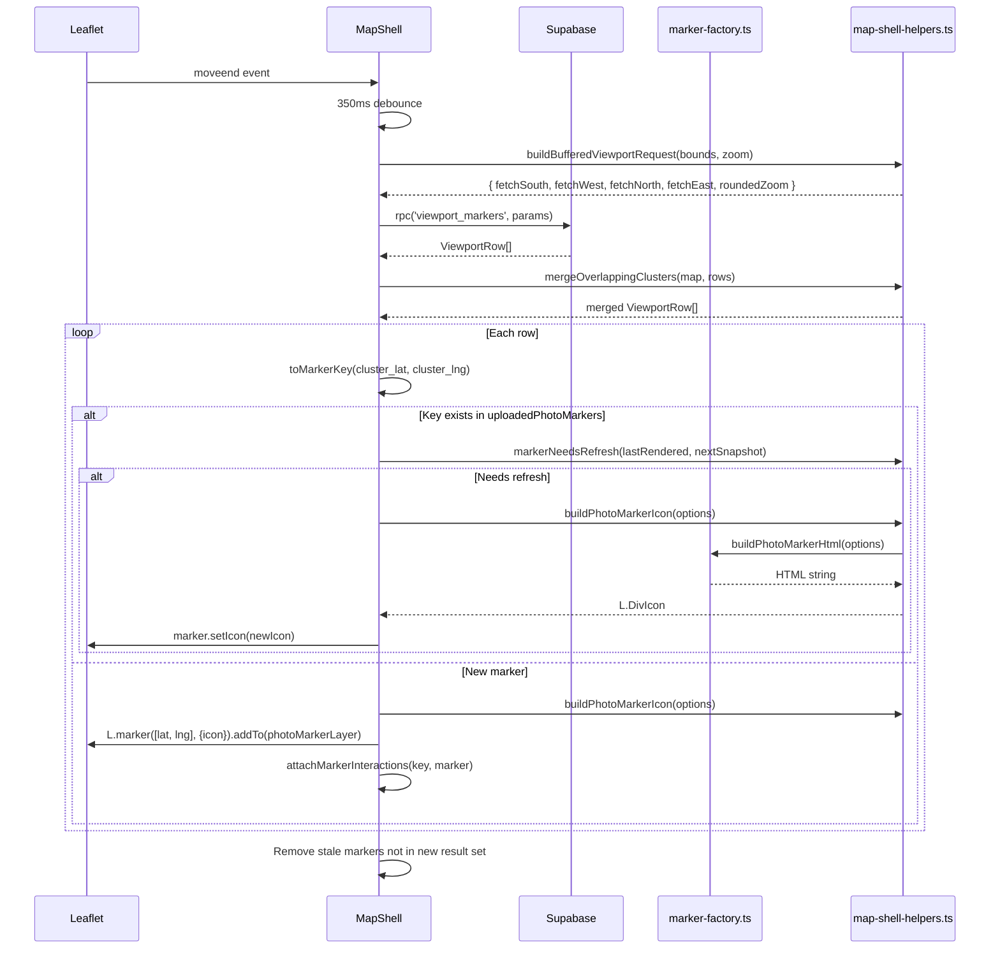
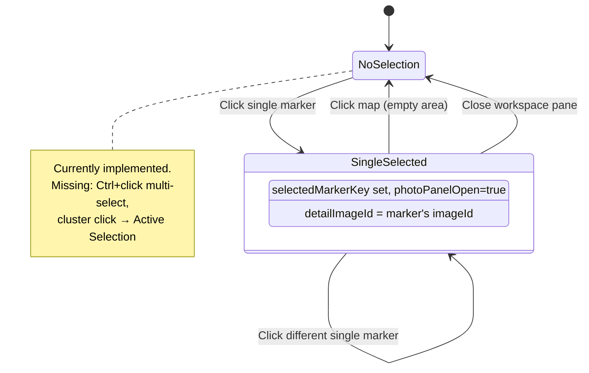

# Photo Marker — Implementation Blueprint

> **Spec**: [element-specs/photo-marker.md](../element-specs/photo-marker.md)
> **Status**: Mostly implemented — marker rendering, viewport loading, clustering, selection all work. Missing: multi-select, context menu, correction drag, cluster→workspace pane flow.

## Existing Infrastructure

| File                                              | What it provides                                                |
| ------------------------------------------------- | --------------------------------------------------------------- |
| `core/map/marker-factory.ts`                      | `buildPhotoMarkerHtml(options)` — generates DivIcon HTML string |
| `features/map/map-shell/map-shell-helpers.ts`     | Types, viewport helpers, icon builder, cluster merging          |
| `features/map/map-shell/map-shell.component.ts`   | Marker lifecycle, click handling, state management              |
| `features/map/map-shell/map-shell.component.scss` | All marker CSS classes and state styles                         |

## Service Contract

### marker-factory.ts (already exists)

```typescript
// File: core/map/marker-factory.ts
export type PhotoMarkerZoomLevel = "far" | "mid" | "near";

export interface PhotoMarkerHtmlOptions {
  count: number;
  thumbnailUrl?: string;
  selected?: boolean;
  corrected?: boolean;
  uploading?: boolean;
  bearing?: number | null;
  zoomLevel?: PhotoMarkerZoomLevel;
}

export const PHOTO_MARKER_ICON_SIZE: [number, number] = [64, 72];
export const PHOTO_MARKER_ICON_ANCHOR: [number, number] = [32, 60];
export const PHOTO_MARKER_POPUP_ANCHOR: [number, number] = [0, -52];

export function buildPhotoMarkerHtml(options: PhotoMarkerHtmlOptions): string;
```

### map-shell-helpers.ts (already exists)

```typescript
// File: features/map/map-shell/map-shell-helpers.ts

// Types
export type ViewportRow = {
  cluster_lat: number;
  cluster_lng: number;
  image_count: number;
  image_id: string | null;
  direction: number | null;
  storage_path: string | null;
  thumbnail_path: string | null;
  exif_latitude: number | null;
  exif_longitude: number | null;
  created_at: string | null;
};

export type PhotoMarkerState = {
  marker: L.Marker;
  count: number;
  lat: number;
  lng: number;
  thumbnailUrl?: string;
  thumbnailSourcePath?: string;
  direction?: number;
  corrected?: boolean;
  uploading?: boolean;
  optimistic?: boolean;
  lastRendered?: MarkerVisualSnapshot;
};

export type MarkerVisualSnapshot = {
  count: number;
  thumbnailUrl?: string;
  direction?: number;
  corrected?: boolean;
  uploading?: boolean;
  selected: boolean;
  zoomLevel: PhotoMarkerZoomLevel;
};

// Functions
export function buildBufferedViewportRequest(
  bounds: L.LatLngBounds,
  zoom: number,
): {
  fetchSouth: number;
  fetchWest: number;
  fetchNorth: number;
  fetchEast: number;
  roundedZoom: number;
  fetchedBounds: L.LatLngBounds;
};
export function resolveThumbnailSourcePath(
  row: ViewportRow,
  count: number,
): string | undefined;
export function buildMarkerVisualSnapshot(
  state: PhotoMarkerState,
  selected: boolean,
  zoom: PhotoMarkerZoomLevel,
): MarkerVisualSnapshot;
export function markerNeedsRefresh(
  previous: MarkerVisualSnapshot | undefined,
  next: MarkerVisualSnapshot,
): boolean;
export function buildPhotoMarkerIcon(options: {
  markerState?: PhotoMarkerState;
  selected: boolean;
  zoomLevel: PhotoMarkerZoomLevel;
  override?: MarkerIconOverride;
}): L.DivIcon;
export function mergeOverlappingClusters(
  map: L.Map | undefined,
  rows: ViewportRow[],
): ViewportRow[];
```

### MapShellComponent marker methods (already exist)

```typescript
// Private methods in map-shell.component.ts related to markers:
private toMarkerKey(lat: number, lng: number): string;       // rounds to 4dp
private getZoomLevel(): PhotoMarkerZoomLevel;                 // far/mid/near from zoom
private buildPhotoMarkerIcon(key: string, override?): L.DivIcon;
private upsertUploadedPhotoMarker(event: ImageUploadedEvent): void;
private attachMarkerInteractions(key: string, marker: L.Marker): void;
private setSelectedMarker(key: string | null): void;
private handlePhotoMarkerClick(key: string): void;
private refreshAllPhotoMarkers(): void;                       // re-renders all icons
private async queryViewportMarkers(): Promise<void>;          // RPC + reconcile
private handleMoveEnd(): void;                                // 350ms debounce → query
```

## Data Flow

### Marker Lifecycle (viewport query → render)



### Marker Click Flow



### CSS Classes Applied by State

```
.map-photo-marker                     ← always present
.map-photo-marker--single             ← count === 1 (shows thumbnail)
.map-photo-marker--count              ← count > 1 (shows count label)
.map-photo-marker--zoom-far           ← zoom ≤ 12
.map-photo-marker--zoom-mid           ← zoom 13-15
.map-photo-marker--zoom-near          ← zoom ≥ 16
.map-photo-marker--selected           ← selectedMarkerKey matches
.map-photo-marker--has-bearing        ← bearing data exists
.map-photo-marker--long-pressed       ← touch long-press active (500ms)

Inner elements:
.map-photo-marker__hit-zone           ← 3rem × 3rem touch target
.map-photo-marker__body               ← square thumbnail/count area
.map-photo-marker__tail               ← CSS triangle pointing down
.map-photo-marker__count-label        ← count text (cluster)
.map-photo-marker__correction-dot     ← 8px accent circle (corrected=true)
.map-photo-marker__pending-ring       ← pulsing ring (uploading=true)
.map-photo-marker__direction-cone     ← 30° wedge (bearing exists + hover/long-press)
```

## Database Layer

### viewport_markers RPC

```sql
-- Returns clustered or individual markers based on zoom level
-- Grid cell size: ~10km (zoom 1-8), ~1km (9-11), ~100m (12-14), individual (15+)
viewport_markers(min_lat, min_lng, max_lat, max_lng, zoom)
RETURNS TABLE (cluster_lat, cluster_lng, image_count, image_id, direction, storage_path, thumbnail_path, exif_latitude, exif_longitude, created_at)
```

### Corrected flag derivation

```typescript
// A marker is "corrected" when the current lat/lng differs from EXIF originals
// This is computed during viewport query reconciliation:
const corrected =
  row.exif_latitude != null &&
  (row.cluster_lat !== Number(row.exif_latitude) ||
    row.cluster_lng !== Number(row.exif_longitude));
```

### Thumbnail URL signing

```typescript
// For single markers at near zoom, signed URLs are fetched:
const { data } = await this.supabaseService.client.storage
  .from("images")
  .createSignedUrl(storagePath, 3600); // 1 hour TTL
```

## Missing Infrastructure

| What                    | Why Needed                                                    | Proposed Location                |
| ----------------------- | ------------------------------------------------------------- | -------------------------------- |
| `SelectionService`      | Multi-select (Ctrl+click), cluster→Active Selection           | `core/selection.service.ts`      |
| Context menu component  | Right-click marker → view detail, edit location, add to group | `shared/context-menu/`           |
| Correction mode handler | Drag marker to update coordinates                             | Extension of `MapShellComponent` |
| Batch thumbnail signing | Sign multiple URLs in one call instead of per-marker          | `UploadService` or new utility   |

### SelectionService (to be created)

```typescript
// File: core/selection.service.ts
@Injectable({ providedIn: "root" })
export class SelectionService {
  readonly selectedImageIds = signal<Set<string>>(new Set());
  readonly selectionCount = computed(() => this.selectedImageIds().size);

  select(imageId: string): void; // replace selection with single image
  toggle(imageId: string): void; // Ctrl+click: add/remove from selection
  selectMultiple(imageIds: string[]): void; // cluster click: replace with all cluster images
  clear(): void; // deselect all
  isSelected(imageId: string): Signal<boolean>;
}
```
