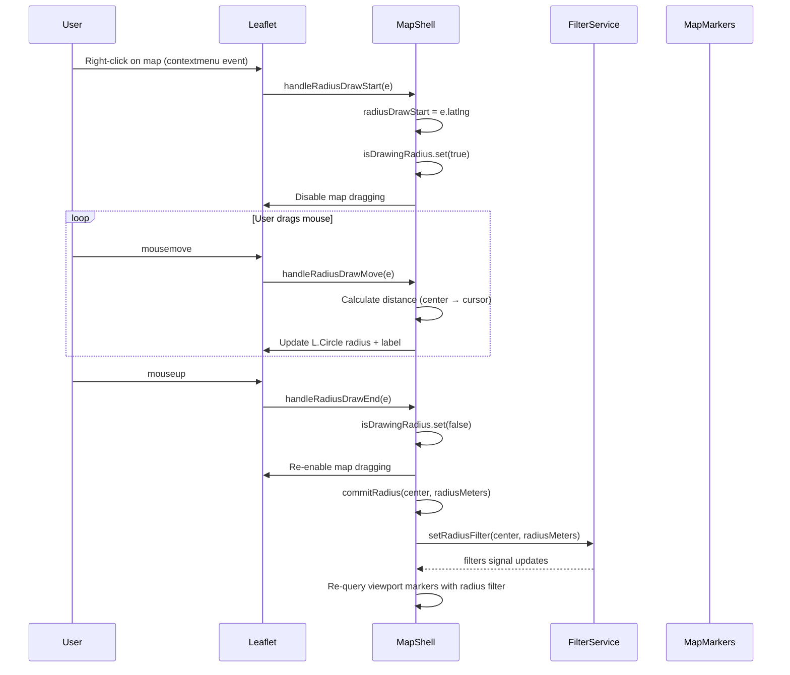
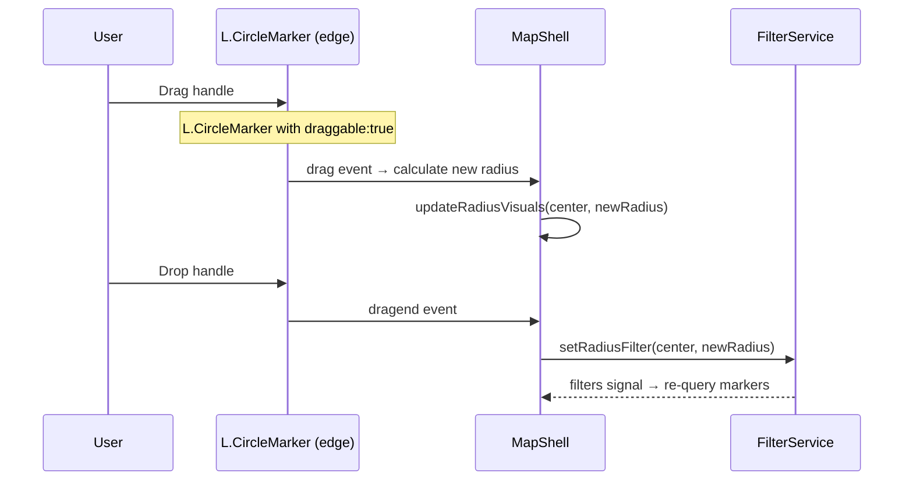
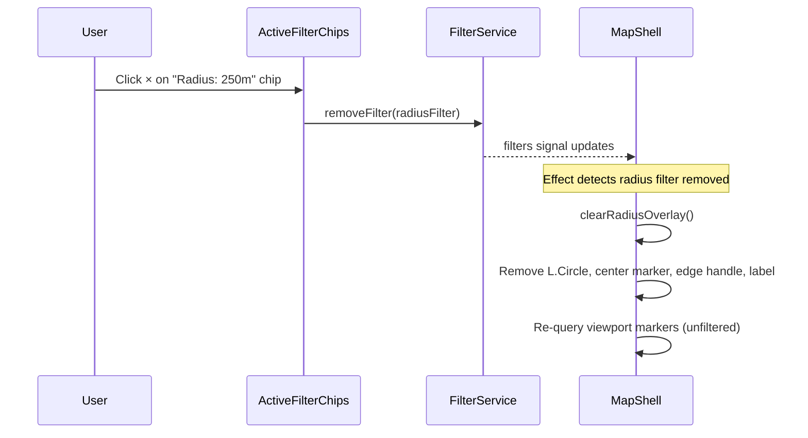

# Radius Selection — Implementation Blueprint

> **Spec**: [element-specs/radius-selection.md](../element-specs/radius-selection.md)
> **Status**: Not implemented. Requires MapAdapter extensions and FilterService.

## Existing Infrastructure

| File                                            | What it provides                                             |
| ----------------------------------------------- | ------------------------------------------------------------ |
| `core/map-adapter.ts`                           | Abstract MapAdapter (minimal: `getCurrentPosition`, `panTo`) |
| `features/map/map-shell/map-shell.component.ts` | Leaflet map instance, event listeners                        |

## Missing Infrastructure

| What                       | File                                    | Why                                                                  |
| -------------------------- | --------------------------------------- | -------------------------------------------------------------------- |
| FilterService              | `core/filter.service.ts`                | Stores radius filter — see [filter-panel blueprint](filter-panel.md) |
| Radius interaction handler | In `map-shell.component.ts` or new file | Detects right-click-drag, creates L.Circle                           |

## Service Contract

### FilterService.setRadiusFilter() (from filter-panel blueprint)

```typescript
// Exact signature:
setRadiusFilter(center: { lat: number; lng: number }, radiusMeters: number): void;

// Removes by type:
removeFilterByType('radius'): void;
```

### MapShellComponent — new radius methods (to be added)

```typescript
// ── Radius state ── (add to map-shell.component.ts)
private radiusCircle: L.Circle | null = null;
private radiusCenterMarker: L.CircleMarker | null = null;
private radiusEdgeHandle: L.CircleMarker | null = null;
private radiusLabel: L.Tooltip | null = null;
private isDrawingRadius = signal(false);
private radiusDrawStart: L.LatLng | null = null;

// ── New methods ──
private initRadiusInteraction(): void;        // attach contextmenu listener
private handleRadiusDrawStart(e: L.LeafletMouseEvent): void;
private handleRadiusDrawMove(e: L.LeafletMouseEvent): void;
private handleRadiusDrawEnd(e: L.LeafletMouseEvent): void;
private commitRadius(center: LatLng, radiusMeters: number): void;
private updateRadiusVisuals(center: L.LatLng, radiusMeters: number): void;
private clearRadiusOverlay(): void;
private initRadiusEdgeDrag(): void;           // edge handle drag behavior
private initRadiusCenterDrag(): void;         // center dot drag behavior
```

## Data Flow

### Drawing a Radius



### Resizing via Edge Handle



### Removing Radius via Filter Chip



## Leaflet Implementation Details

### Creating the Circle Overlay

```typescript
private updateRadiusVisuals(center: L.LatLng, radiusMeters: number): void {
  // Circle fill
  if (!this.radiusCircle) {
    this.radiusCircle = L.circle(center, {
      radius: radiusMeters,
      color: 'var(--color-clay)',  // Use CSS var via getComputedStyle
      weight: 2,
      fillOpacity: 0.1,
      interactive: false,
    }).addTo(this.map!);
  } else {
    this.radiusCircle.setLatLng(center);
    this.radiusCircle.setRadius(radiusMeters);
  }

  // Center dot
  if (!this.radiusCenterMarker) {
    this.radiusCenterMarker = L.circleMarker(center, {
      radius: 5,
      color: 'var(--color-clay)',
      fillColor: 'var(--color-clay)',
      fillOpacity: 1,
      draggable: true,  // Note: L.CircleMarker doesn't support draggable natively
    }).addTo(this.map!);
  } else {
    this.radiusCenterMarker.setLatLng(center);
  }

  // Edge handle — positioned at 0° (east) on the circle perimeter
  const edgeLatLng = this.getPointOnCircle(center, radiusMeters, 90);
  if (!this.radiusEdgeHandle) {
    this.radiusEdgeHandle = L.circleMarker(edgeLatLng, {
      radius: 7,
      className: 'radius-edge-handle',
      color: '#fff',
      fillColor: 'var(--color-clay)',
      fillOpacity: 1,
      weight: 2,
    }).addTo(this.map!);
  } else {
    this.radiusEdgeHandle.setLatLng(edgeLatLng);
  }

  // Distance label
  const label = radiusMeters >= 1000
    ? `${(radiusMeters / 1000).toFixed(1)} km`
    : `${Math.round(radiusMeters)} m`;

  if (!this.radiusLabel) {
    this.radiusLabel = L.tooltip({
      permanent: true,
      direction: 'right',
      className: 'radius-label',
    })
    .setLatLng(edgeLatLng)
    .setContent(label)
    .addTo(this.map!);
  } else {
    this.radiusLabel.setLatLng(edgeLatLng);
    this.radiusLabel.setContent(label);
  }
}

private getPointOnCircle(center: L.LatLng, radiusMeters: number, bearing: number): L.LatLng {
  // Use Leaflet's CRS to project a point at the given bearing and distance
  const R = 6371000; // Earth radius in meters
  const lat1 = center.lat * Math.PI / 180;
  const lng1 = center.lng * Math.PI / 180;
  const brng = bearing * Math.PI / 180;
  const d = radiusMeters / R;

  const lat2 = Math.asin(Math.sin(lat1) * Math.cos(d) + Math.cos(lat1) * Math.sin(d) * Math.cos(brng));
  const lng2 = lng1 + Math.atan2(Math.sin(brng) * Math.sin(d) * Math.cos(lat1), Math.cos(d) - Math.sin(lat1) * Math.sin(lat2));

  return L.latLng(lat2 * 180 / Math.PI, lng2 * 180 / Math.PI);
}

private clearRadiusOverlay(): void {
  this.radiusCircle?.remove();
  this.radiusCenterMarker?.remove();
  this.radiusEdgeHandle?.remove();
  this.radiusLabel?.remove();
  this.radiusCircle = null;
  this.radiusCenterMarker = null;
  this.radiusEdgeHandle = null;
  this.radiusLabel = null;
}
```

### Right-click Detection

```typescript
// In initMap(), add:
this.map.on('contextmenu', (e: L.LeafletMouseEvent) => {
  e.originalEvent.preventDefault();
  this.handleRadiusDrawStart(e);
});

// Desktop: contextmenu → mousemove → mouseup
// Mobile: 500ms pointerdown → pointermove → pointerup
private initRadiusInteraction(): void {
  // Desktop
  this.map!.on('contextmenu', (e) => this.handleRadiusDrawStart(e));

  // Mobile long-press (500ms threshold)
  let longPressTimer: ReturnType<typeof setTimeout> | null = null;
  this.map!.getContainer().addEventListener('pointerdown', (e) => {
    if (e.pointerType !== 'touch') return;
    longPressTimer = setTimeout(() => {
      this.handleRadiusDrawStart({
        latlng: this.map!.containerPointToLatLng([e.clientX, e.clientY]),
        originalEvent: e,
      } as any);
    }, 500);
  });
  this.map!.getContainer().addEventListener('pointerup', () => {
    if (longPressTimer) { clearTimeout(longPressTimer); longPressTimer = null; }
  });
}
```

## Database Layer

The radius filter is applied via PostGIS `ST_DWithin` in the viewport query:

```sql
-- In the extended viewport_markers RPC:
AND (filter_distance_lat IS NULL OR
     ST_DWithin(
       i.geog,
       ST_Point(filter_distance_lng, filter_distance_lat)::geography,
       filter_distance_meters
     ))
```

## State Summary

```typescript
// State managed by MapShellComponent:
isDrawingRadius: WritableSignal<boolean>; // true during right-click-drag
radiusDrawStart: L.LatLng | null; // center point for drawing
radiusCircle: L.Circle | null; // Leaflet circle overlay
radiusCenterMarker: L.CircleMarker | null; // draggable center dot
radiusEdgeHandle: L.CircleMarker | null; // draggable edge handle
radiusLabel: L.Tooltip | null; // distance text

// State managed by FilterService:
filters: WritableSignal<ActiveFilter[]>; // includes RadiusFilter when committed
```
