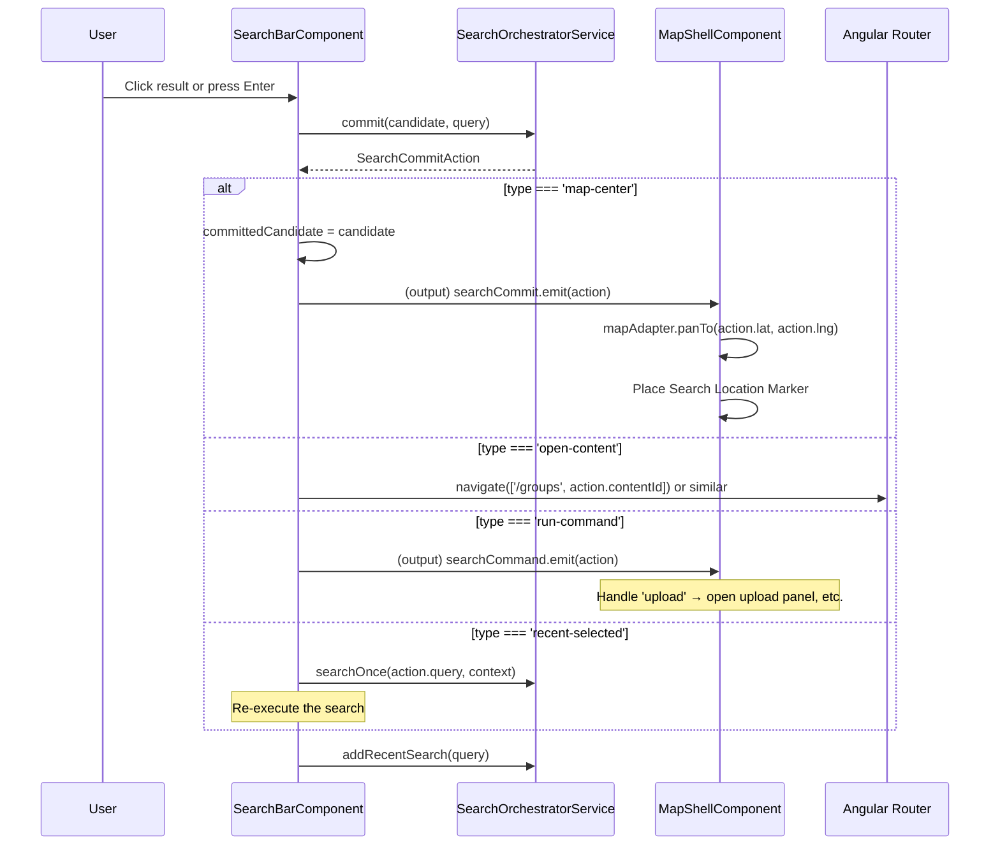
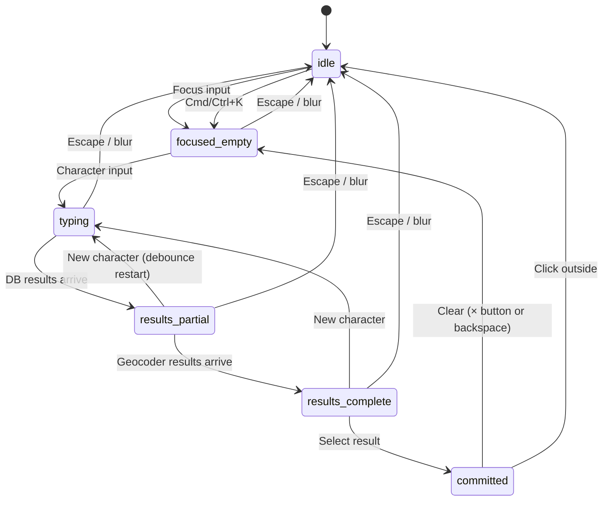

# Search Bar — Implementation Blueprint

> **Spec**: [element-specs/search-bar.md](../element-specs/search-bar.md)
> **Status**: Not implemented. Service layer is complete — component work only.

## Existing Infrastructure

| File                                         | What it provides                                                                                             |
| -------------------------------------------- | ------------------------------------------------------------------------------------------------------------ |
| `core/search/search-orchestrator.service.ts` | Full orchestrator: debounce, cache, parallel resolve, dedup, ranking                                         |
| `core/search/search.models.ts`               | All types: `SearchState`, `SearchCandidate` unions, `SearchResultSet`, `SearchCommitAction`, `SearchSection` |
| `core/map-adapter.ts`                        | `panTo()` for map centering on commit                                                                        |

**The spec for this element is already high-clarity (9/10).** This blueprint covers the remaining gaps: resolver registration, geocoder dedup details, keyboard navigation implementation, animation constraints, and commit routing.

## SearchOrchestratorService — Key Methods (already exist)

```typescript
// core/search/search-orchestrator.service.ts

// Register data sources at app startup or in SearchBarComponent constructor
configureSources(adapters: {
  dbAddressResolver?: (query: string, context: SearchQueryContext) => Observable<SearchAddressCandidate[]>;
  dbContentResolver?: (query: string, context: SearchQueryContext) => Observable<SearchContentCandidate[]>;
  geocoderResolver?:  (query: string, context: SearchQueryContext) => Observable<SearchAddressCandidate[]>;
}): void;

// Bind to input stream → returns staged results (typing → partial → complete)
searchInput(
  query$: Observable<string>,
  context$: Observable<SearchQueryContext>,
): Observable<SearchResultSet>;

// One-shot search (for re-executing recent searches)
searchOnce(query: string, context: SearchQueryContext): Observable<SearchResultSet>;

// Convert candidate → commit action
commit(candidate: SearchCandidate, query: string): SearchCommitAction;

// Recent search management
addRecentSearch(label: string): void;
getRecentSearches(limit?: number): SearchRecentCandidate[];
```

## Missing Infrastructure

| What                | File                                           | Why                                              |
| ------------------- | ---------------------------------------------- | ------------------------------------------------ |
| DB Address Resolver | `core/search/resolvers/db-address.resolver.ts` | Queries `images` table by address text           |
| DB Content Resolver | `core/search/resolvers/db-content.resolver.ts` | Queries `projects`, `saved_groups` by name       |
| Geocoder Resolver   | `core/search/resolvers/geocoder.resolver.ts`   | Calls Nominatim via `GeocodingAdapter`           |
| GeocodingAdapter    | `core/geocoding-adapter.ts`                    | Abstract adapter for Nominatim (adapter pattern) |

### Resolver Signatures

```typescript
// core/search/resolvers/db-address.resolver.ts
@Injectable({ providedIn: "root" })
export class DbAddressResolver {
  constructor(private supabase: SupabaseService) {}

  resolve(
    query: string,
    context: SearchQueryContext,
  ): Observable<SearchAddressCandidate[]> {
    // Query: SELECT DISTINCT address, lat, lng, COUNT(*) as image_count
    //        FROM images WHERE address ILIKE '%' || query || '%'
    //        AND organization_id = context.organizationId
    //        GROUP BY address, lat, lng
    //        ORDER BY image_count DESC LIMIT 10
  }
}

// core/search/resolvers/db-content.resolver.ts
@Injectable({ providedIn: "root" })
export class DbContentResolver {
  constructor(private supabase: SupabaseService) {}

  resolve(
    query: string,
    context: SearchQueryContext,
  ): Observable<SearchContentCandidate[]> {
    // Query projects: .from('projects').select('id, name').ilike('name', `%${query}%`)
    // Query groups:   .from('saved_groups').select('id, name').ilike('name', `%${query}%`)
    // Merge, score by prefix match
  }
}

// core/search/resolvers/geocoder.resolver.ts
@Injectable({ providedIn: "root" })
export class GeocoderResolver {
  constructor(private geocoding: GeocodingAdapter) {}

  resolve(
    query: string,
    context: SearchQueryContext,
  ): Observable<SearchAddressCandidate[]> {
    // Use GeocodingAdapter.search(query, viewportBounds)
    // Map to SearchAddressCandidate[] with family: 'geocoder'
  }
}
```

## Data Flow

### Typing → Results

```mermaid
sequenceDiagram
    participant Input as <input>
    participant SB as SearchBarComponent
    participant Orch as SearchOrchestratorService
    participant DB_Addr as DbAddressResolver
    participant DB_Cont as DbContentResolver
    participant Geo as GeocoderResolver

    Input->>SB: keyup → query$ emits "park st"
    SB->>Orch: searchInput(query$, context$)
    Note over Orch: Debounce 300ms, check cache

    par Parallel resolution
        Orch->>DB_Addr: resolve("park st", context)
        Orch->>DB_Cont: resolve("park st", context)
        Orch->>Geo: resolve("park st", context)
    end

    Note over Orch: Emit "typing" immediately (empty sections, geocoder loading)

    DB_Addr-->>Orch: SearchAddressCandidate[]
    DB_Cont-->>Orch: SearchContentCandidate[]
    Note over Orch: Emit "results-partial" (DB results, geocoder still loading)
    Orch-->>SB: SearchResultSet { state: 'results-partial' }
    SB->>SB: Render Address + Content sections, geocoder skeleton

    Geo-->>Orch: SearchAddressCandidate[]
    Note over Orch: deduplicateGeocoderNearDb() — haversine < 30m → remove
    Note over Orch: Emit "results-complete"
    Orch-->>SB: SearchResultSet { state: 'results-complete' }
    SB->>SB: Render all sections, remove skeleton
```



### Commit Flow



## Keyboard Navigation — Implementation Details

```typescript
// In SearchBarComponent:
private flatItems = computed<SearchCandidate[]>(() => {
  // Flatten all sections' items into a single array for keyboard nav
  return this.resultSet().sections.flatMap(s => s.items);
});

activeIndex = signal(-1);

handleKeydown(event: KeyboardEvent): void {
  const items = this.flatItems();

  switch (event.key) {
    case 'ArrowDown':
      event.preventDefault();
      this.activeIndex.update(i => Math.min(i + 1, items.length - 1));
      break;
    case 'ArrowUp':
      event.preventDefault();
      this.activeIndex.update(i => Math.max(i - 1, -1));
      break;
    case 'Enter':
      event.preventDefault();
      const idx = this.activeIndex();
      const candidate = idx >= 0 ? items[idx] : items[0];
      if (candidate) this.commitCandidate(candidate);
      break;
    case 'Escape':
      if (this.dropdownOpen()) {
        this.dropdownOpen.set(false);
      } else {
        this.inputEl.nativeElement.blur();
      }
      break;
  }
}

// Scroll active item into view
activeIndexEffect = effect(() => {
  const idx = this.activeIndex();
  if (idx >= 0) {
    const el = this.listboxEl?.nativeElement?.querySelector(`[data-index="${idx}"]`);
    el?.scrollIntoView({ block: 'nearest' });
  }
});
```

## Geocoder Dedup Logic (already implemented)

The `SearchOrchestratorService.deduplicateGeocoderNearDb()` method already handles this:

- Uses `haversineMeters()` to compute distance between each geocoder result and each DB address result
- If distance ≤ `geocoderDedupMeters` (default: 30m), the geocoder result is removed
- No component-level work needed — the orchestrator handles it internally

## Animation Constraints

The spec requires panel height animation without animating row height, padding, media width, or corner radius.

```scss
// search-bar.component.scss
:host {
  // Results panel is inside the container, not an overlay
  .search-results-panel {
    display: grid;
    // Animate height with grid-template-rows trick:
    grid-template-rows: 0fr;
    transition: grid-template-rows var(--duration-normal) var(--ease-standard);
    overflow: hidden;

    > .search-results-inner {
      min-height: 0; // Required for grid-template-rows animation
    }
  }

  &.dropdown-open .search-results-panel {
    grid-template-rows: 1fr;
  }
}
```

This approach:

- ✅ Animates outer panel height smoothly
- ✅ Does NOT animate row height, row padding, media width, or panel radius
- ✅ Uses CSS only (no JS measurement needed)

## Component Outputs

```typescript
// SearchBarComponent outputs → consumed by MapShellComponent template
@Output() searchCommit = new EventEmitter<SearchCommitAction>();
@Output() searchCommand = new EventEmitter<SearchCommitAction>();

// In map-shell.component.html:
// <app-search-bar
//   (searchCommit)="onSearchCommit($event)"
//   (searchCommand)="onSearchCommand($event)"
// />
```

## State Machine


