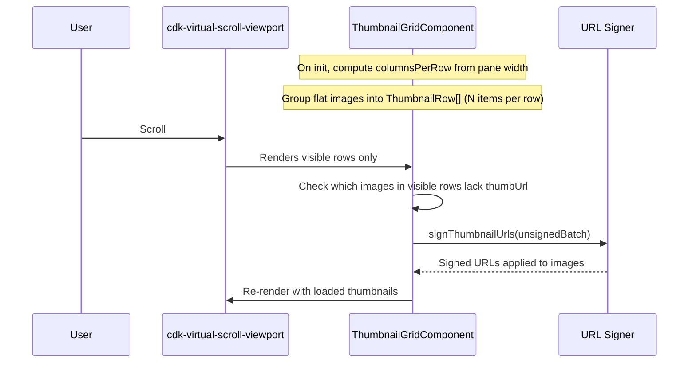
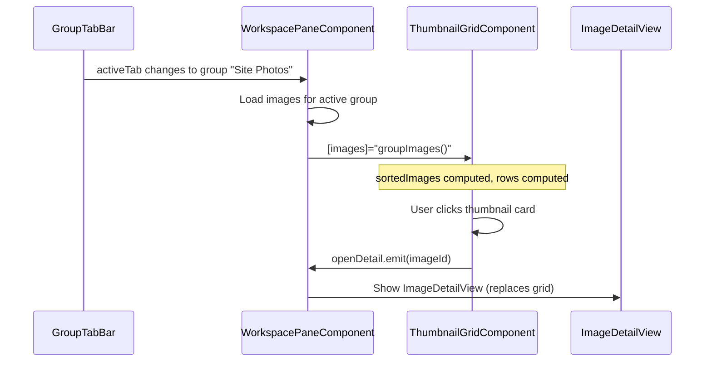

# Thumbnail Grid — Implementation Blueprint

> **Spec**: [element-specs/thumbnail-grid.md](../element-specs/thumbnail-grid.md)
> **Also covers**: [element-specs/thumbnail-card.md](../element-specs/thumbnail-card.md)
> **Status**: Not implemented. Requires SelectionService, GroupService, and virtual scrolling setup.

## Existing Infrastructure

| File                       | What it provides                                     |
| -------------------------- | ---------------------------------------------------- |
| `core/upload.service.ts`   | `getSignedUrl(path)` for thumbnail URLs              |
| `core/supabase.service.ts` | `client` for querying `images`, `saved_group_images` |

## Missing Infrastructure

| What                        | File                        | Reference                                         |
| --------------------------- | --------------------------- | ------------------------------------------------- |
| SelectionService            | `core/selection.service.ts` | See [workspace-pane blueprint](workspace-pane.md) |
| GroupService                | `core/group.service.ts`     | See [group-tab-bar blueprint](group-tab-bar.md)   |
| Angular CDK ScrollingModule | `@angular/cdk/scrolling`    | For `<cdk-virtual-scroll-viewport>`               |

## Type Definitions

```typescript
// features/map/workspace-pane/thumbnail-grid.types.ts

export type SortOrder = "date-desc" | "date-asc" | "distance" | "name";

export interface ThumbnailImage {
  id: string; // images.id
  storagePath: string; // images.storage_path
  thumbUrl: string | null; // Signed URL for _thumb.jpg (loaded lazily)
  capturedAt: string | null; // images.captured_at
  createdAt: string; // images.created_at
  address: string | null; // images.address
  projectName: string | null; // projects.name via join
  isCorrected: boolean; // images.corrected_lat IS NOT NULL
  lat: number | null; // For distance sorting
  lng: number | null; // For distance sorting
}

export interface ThumbnailRow {
  rowIndex: number;
  items: ThumbnailImage[]; // 2-3 items per row depending on pane width
}
```

## Data Loading

### Active Selection (in-memory images from map interactions)

```typescript
// SelectionService already provides:
// selectionService.selectedImages(): Signal<ThumbnailImage[]>
//
// No DB query needed — images come from map marker clicks/cluster clicks
```

### Saved Group (DB query)

```typescript
// When user switches to a saved group tab:
async loadGroupImages(groupId: string): Promise<ThumbnailImage[]> {
  const { data, error } = await this.supabase.client
    .from('saved_group_images')
    .select(`
      image_id,
      images!inner (
        id,
        storage_path,
        captured_at,
        created_at,
        address,
        corrected_lat,
        lat,
        lng,
        projects ( name )
      )
    `)
    .eq('group_id', groupId)
    .order('added_at', { ascending: false });

  if (error) throw error;
  return data.map(row => this.mapToThumbnail(row.images));
}
```

### Thumbnail URL Signing (batch)

```typescript
// Sign URLs in batches of 20 as rows enter the viewport
private async signThumbnailUrls(images: ThumbnailImage[]): Promise<void> {
  const unsigned = images.filter(img => !img.thumbUrl);
  if (unsigned.length === 0) return;

  // Supabase Storage: createSignedUrls for batch efficiency
  const paths = unsigned.map(img => `${img.storagePath}_thumb.jpg`);
  const { data, error } = await this.supabase.client.storage
    .from('images')
    .createSignedUrls(paths, 3600); // 1 hour expiry

  if (!error && data) {
    data.forEach((result, i) => {
      if (result.signedUrl) {
        unsigned[i].thumbUrl = result.signedUrl;
      }
    });
  }
}
```

## Sorting Implementation

```typescript
// Sorting is done client-side on the loaded image array
private sortImages(images: ThumbnailImage[], order: SortOrder, userLat?: number, userLng?: number): ThumbnailImage[] {
  const sorted = [...images];

  switch (order) {
    case 'date-desc':
      return sorted.sort((a, b) =>
        new Date(b.capturedAt ?? b.createdAt).getTime() -
        new Date(a.capturedAt ?? a.createdAt).getTime()
      );
    case 'date-asc':
      return sorted.sort((a, b) =>
        new Date(a.capturedAt ?? a.createdAt).getTime() -
        new Date(b.capturedAt ?? b.createdAt).getTime()
      );
    case 'distance':
      if (userLat == null || userLng == null) return sorted;
      return sorted.sort((a, b) => {
        const distA = (a.lat != null && a.lng != null) ? this.haversine(userLat, userLng, a.lat, a.lng) : Infinity;
        const distB = (b.lat != null && b.lng != null) ? this.haversine(userLat, userLng, b.lat, b.lng) : Infinity;
        return distA - distB;
      });
    case 'name':
      return sorted.sort((a, b) =>
        (a.address ?? '').localeCompare(b.address ?? '')
      );
  }
}
```

## Virtual Scrolling — Architecture



### CDK Virtual Scroll Setup

```typescript
// thumbnail-grid.component.ts
import {
  CdkVirtualScrollViewport,
  CdkVirtualForOf,
} from "@angular/cdk/scrolling";

@Component({
  selector: "app-thumbnail-grid",
  standalone: true,
  imports: [
    CdkVirtualScrollViewport,
    CdkVirtualForOf,
    ThumbnailCardComponent,
    SortingControlsComponent,
  ],
  template: `
    <app-sorting-controls
      [sortOrder]="sortOrder()"
      (sortOrderChange)="sortOrder.set($event)"
    />

    @if (rows().length === 0) {
      <div class="empty-state">
        <p class="text-secondary">This group is empty</p>
        <p class="text-tertiary">Add images from the map</p>
        <button class="ghost-button" (click)="goToMap.emit()">Go to map</button>
      </div>
    } @else {
      <cdk-virtual-scroll-viewport
        [itemSize]="rowHeight"
        class="thumbnail-viewport"
      >
        <div
          *cdkVirtualFor="let row of rows(); trackBy: trackRow"
          class="thumbnail-row"
        >
          @for (image of row.items; track image.id) {
            <app-thumbnail-card
              [image]="image"
              [isSelected]="selectionService.isSelected(image.id)()"
              (click)="onCardClick(image)"
              (toggleSelect)="selectionService.toggle(image.id)"
              (addToGroup)="onAddToGroup(image)"
            />
          }
        </div>
      </cdk-virtual-scroll-viewport>
    }
  `,
})
export class ThumbnailGridComponent {
  // ── Inputs ──
  images = input.required<ThumbnailImage[]>();

  // ── Outputs ──
  openDetail = output<string>(); // image.id
  goToMap = output<void>();

  // ── Services ──
  selectionService = inject(SelectionService);

  // ── State ──
  sortOrder = signal<SortOrder>("date-desc");
  readonly rowHeight = 128 + 8; // THUMBNAIL_SIZE + gap (--spacing-2)

  // ── Derived ──
  columnsPerRow = signal(2); // Recalculate on pane resize

  sortedImages = computed(() =>
    this.sortImages(this.images(), this.sortOrder()),
  );

  rows = computed<ThumbnailRow[]>(() => {
    const cols = this.columnsPerRow();
    const imgs = this.sortedImages();
    const result: ThumbnailRow[] = [];
    for (let i = 0; i < imgs.length; i += cols) {
      result.push({ rowIndex: i / cols, items: imgs.slice(i, i + cols) });
    }
    return result;
  });

  trackRow(_: number, row: ThumbnailRow): number {
    return row.rowIndex;
  }

  onCardClick(image: ThumbnailImage): void {
    this.openDetail.emit(image.id);
  }
}
```

## ThumbnailCard — Implementation

```typescript
// thumbnail-card.component.ts
@Component({
  selector: "app-thumbnail-card",
  standalone: true,
  template: `
    <div
      class="card"
      (mouseenter)="isHovered.set(true)"
      (mouseleave)="isHovered.set(false)"
    >
      

      <!-- Always-visible overlays -->
      <span class="date-overlay">
        {{ image().capturedAt | date: "shortDate" }}
      </span>

      @if (image().projectName) {
        <span class="project-badge">{{ image().projectName }}</span>
      }

      @if (image().isCorrected) {
        <span class="correction-dot"></span>
      }

      <!-- Hover actions (desktop) -->
      @if (isHovered()) {
        <div class="action-overlay" @fadeIn>
          <input
            type="checkbox"
            class="selection-checkbox"
            [checked]="isSelected()"
            (click)="$event.stopPropagation()"
            (change)="toggleSelect.emit()"
          />
          <button
            class="add-to-group-btn"
            (click)="$event.stopPropagation(); addToGroup.emit()"
            aria-label="Add to group"
          >
            +
          </button>
          <button
            class="context-menu-btn"
            (click)="$event.stopPropagation(); contextMenu.emit()"
            aria-label="More options"
          >
            ⋯
          </button>
        </div>
      }
    </div>
  `,
})
export class ThumbnailCardComponent {
  image = input.required<ThumbnailImage>();
  isSelected = input(false);

  toggleSelect = output<void>();
  addToGroup = output<void>();
  contextMenu = output<void>();

  isHovered = signal(false);
}
```

## Styles

```scss
// thumbnail-grid.component.scss
.thumbnail-viewport {
  height: 100%;
  width: 100%;
}

.thumbnail-row {
  display: grid;
  grid-template-columns: repeat(auto-fill, 128px);
  gap: var(--spacing-2);
  padding: 0 var(--spacing-2);
}

// thumbnail-card.component.scss
.card {
  width: 128px;
  height: 128px;
  border-radius: var(--radius-md);
  overflow: hidden;
  position: relative;
  cursor: pointer;
}

.thumb-img {
  width: 100%;
  height: 100%;
  object-fit: cover;
}

.date-overlay {
  position: absolute;
  bottom: var(--spacing-1);
  left: var(--spacing-1);
  font-size: var(--text-xs);
  color: #fff;
  background: rgba(0, 0, 0, 0.5);
  padding: 1px var(--spacing-1);
  border-radius: var(--radius-sm);
}

.project-badge {
  position: absolute;
  bottom: var(--spacing-1);
  right: var(--spacing-1);
  font-size: var(--text-xs);
  color: #fff;
  background: var(--color-clay);
  padding: 1px var(--spacing-1);
  border-radius: var(--radius-pill);
}

.correction-dot {
  position: absolute;
  top: var(--spacing-1);
  right: var(--spacing-1);
  width: 6px;
  height: 6px;
  border-radius: 50%;
  background: var(--color-accent);
}

.action-overlay {
  position: absolute;
  inset: 0;
  background: rgba(0, 0, 0, 0.2);
  // No layout shift — actions are absolutely positioned
}

.selection-checkbox {
  position: absolute;
  top: var(--spacing-1);
  left: var(--spacing-1);
}

.add-to-group-btn {
  position: absolute;
  top: var(--spacing-1);
  right: var(--spacing-1);
}

.context-menu-btn {
  position: absolute;
  bottom: var(--spacing-1);
  right: var(--spacing-1);
}
```

## Sorting Controls — Implementation

```typescript
// sorting-controls.component.ts
@Component({
  selector: "app-sorting-controls",
  standalone: true,
  template: `
    <div class="sort-controls" role="group" aria-label="Sort order">
      @for (option of sortOptions; track option.value) {
        <button
          class="sort-btn"
          [class.active]="sortOrder() === option.value"
          (click)="sortOrderChange.emit(option.value)"
        >
          {{ option.label }}
        </button>
      }
    </div>
  `,
})
export class SortingControlsComponent {
  sortOrder = input.required<SortOrder>();
  sortOrderChange = output<SortOrder>();

  readonly sortOptions: { value: SortOrder; label: string }[] = [
    { value: "date-desc", label: "Date ↓" },
    { value: "date-asc", label: "Date ↑" },
    { value: "distance", label: "Distance" },
    { value: "name", label: "Name" },
  ];
}
```

## Column Count — Responsive Calculation

```typescript
// In ThumbnailGridComponent:
private paneEl = viewChild.required<ElementRef>('gridContainer');

private resizeObserver = new ResizeObserver(entries => {
  const width = entries[0]?.contentRect.width ?? 256;
  const cardSize = 128;  // THUMBNAIL_SIZE — matches glossary "128×128 px"
  const gap = 8;        // var(--spacing-2)
  const cols = Math.max(1, Math.floor((width + gap) / (cardSize + gap)));
  this.columnsPerRow.set(cols);
});

ngAfterViewInit(): void {
  this.resizeObserver.observe(this.paneEl().nativeElement);
}

ngOnDestroy(): void {
  this.resizeObserver.disconnect();
}
```

## Integration with Workspace Pane


